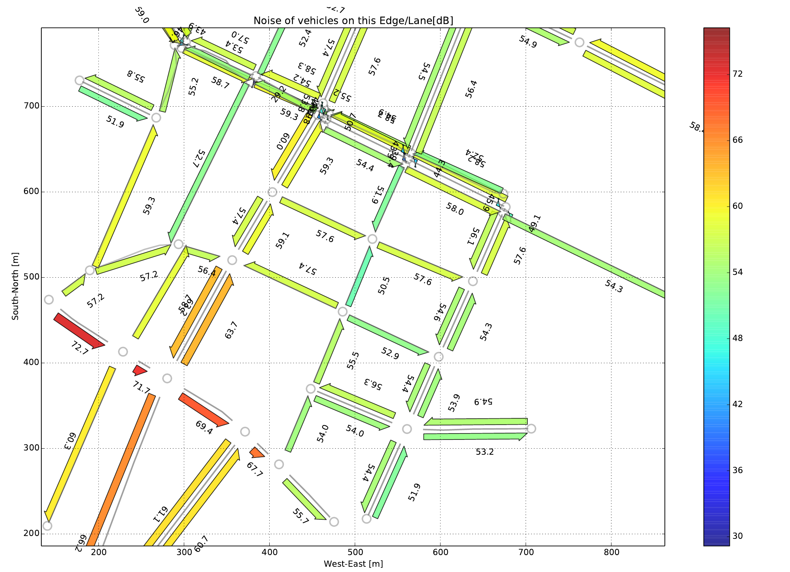

### Running SUMOPy

Start the script `sumopy_gui.py` by double-clicking on it in your
browser. If this fails, use a command-line application, change directory
to

```
SUMOHOME/tools/contributed/sumopy
```

and run sumopy with

```
python sumopy_gui.py
```

If all required packages are installed correctly, you should see the
main window as shown [here](../../../images/Fig_sumopy_gui_main.png),
but initially with an empty network. The object browser shows initially
the main object of SUMOPy: the *scenario*, which contains all other
information.


### Opening/creating a scenario

There is a test scenario in the SUMOPy distribution which is located in

```
SUMOHOME/tools/contributed/sumopy/testscenario
```

The quickest way to obtain results from a simulation is to import
already existing `xml`-files. In case the following SUMO network, poly
and route files

```
demo.net.xml demo.poly.xml demo.rou.xml
```

are located in directory

```
SUMOHOME/tools/contributed/sumopy/testscenario
```

then a new scenario can be created by importing these files into SUMOPy
at ones: from the main menu, choose `Scenario>Create from xml...` and
insert the scenario Shortname, and Workdir in the form as shown
[here](../../../images/Fig_sumopy_gui_newscenario.png).


The options `Name` and `Description` are free text fields. After
pressing the `Run` button, network, buildings and routes will be
imported. In case the trip file `demo.trip.xml` exists, it will also be
imported.

In the same way it is possible to crate an empty scenario under menu
`Scenario>New...`.

### Browsing the scenario

The object browser allows to navigate through all information of a
scenario. To a certain extend, it is possible to modify data. The most
important information are:

- The network with edges, nodes, traffic light systems etc.
- The landuse, containing also the building information from the
  .poly| file as well as background maps (see later how to import
  them).
- The demand holds information on available vehicles types, trips and
  routes.

### Navigating the Network

The network can be examined with the network editor. The initial editing
tool allows to click on the different network elements and retrieve the
respective information in the object browser.

With the zoom-buttons (+,-) located below the network editor, different
zoom levels can be obtained The 1:1 button zooms the network to fit
approximately the boundaries of the window. Next to the zoom button is a
button which pops up a menu when pressed. From this menu, the network
elements to be drawn can be selected or un-selected.

The following mouse-key combination allow to navigate the network:

| Action      | Key-Mouse                                  |
| ----------- | ------------------------------------------ |
| Zoom in/Out | Hold down `<CTRL>` + `<Wheel>`                 |
| Panning     | Hold down `<CTRL>` + `<SHIFT>` + `<Button-Left>` |

### Simulating the scenario

From the main menu select:

`Simulation>Sumo>export routes and simulate...`

With this process, the current trips and routes in `demand.trips` will
be automatically exported to a SUMO `.rou` file. Choose the desired
simulation settings from the SUMO pop-up dialog, as shown in Fig.
[here](../../../images/Fig_sumopy_gui_sumo.png).


The simulation parameters are self-explaining, just hover with the mouse
over the parameter name. The default parameters are typically suitable
to run a first simulation. Select one of the output options in order to
obtain specific simulation results. Regarding outputs, the `Output
Sampling Time` for the different outputs may be of interest. If you
observe in the simulations that vehicles get blocked at junctions for no
obvious reason, then it is possible to resolve conflicts by setting the
`Teleport` to a positive time (i.e. 10s).

After pressing the `run` button, the sumo-gui interface pops up, ready
for simulation, as shown Fig.
[here](../../../images/Fig_sumopy_gui_sumogui.png).


Adjust delay time and press the Start button. At the end of the
simulation, confirm OK and close the sumo-gui window. Simulation results
are now imported into SUMOPy and are ready to be examined, visualized
and exported in various formats.

### Viewing results

The results can be viewed in table format and graphically, see
[here](../../../images/Fig_sumopy_gui_resultviewer.png).


In the object browse, the results per trip and the results per edge can
be viewed. Both, trip and edge oriented result-table can be exported in
CSV format, see the `Simulation>Results` menu.

Results are *not* saved when saving the scenario. Instead the results
must be saved separately using

`Simulation>Results>Save as ...`

At any time, results can be reopened with the scenario with which they
have been produced, using:

`Simulation>Results>Open ...`

In case the `Matplotlib` package is installed you can generate plots in
various formats, choosing menu `Simulation>Results>Plot with
matplotlib`. The pop-up dialog helps to configure the graphical details
of the matplotlib plot. From the matplotlib figure window, the graphical
results can be exported in different file formats (PNG, PDF, JPEG,
etc.), an example PNG file is shown
[below](../../../images/Fig_demo_noise.png).



## Launching SUMOPy

As explained above, networks can be created from SUMO XML files, or a
binary file can be loaded. Both operations can be performed from the
command line.

### Loading a binary scenario at start

A previously saved, binary scenario with filename scenario.obj| can be
loaded into SUMOPy at start using the commandline

```
python sumopy-gui.py workdir/scenario.obj|
```

### Importing SUMO XML files at start

An initial import of existing SUMO XML files with rootname scenario| and
located in directory workdir| can be accomplished with

```
python sumopy-gui.py scenario workdir|
```

## Importing and Editing networks

if needed, the network should be modified *before* moving on to demand modeling (see Sec.\[sec<sub>d</sub>emand\]).

### Importing nets and buildings

Networks can be import from a SUMO net.xml file with

`network>import>from sumo net.xml ...`

Networks can be converted and imported from a previously downloaded OSM
file, calling a wizard with:

`network>import>from osm.xml ...`

Different types of buildings, parks, car parking, leisure areas, etc (in
SUMOPy called called “facilities”) are a property of the landuse object
and can be extracted and imported from an OSM file with menu item

`landuse>facilities>import from osm...`

Sometimes special characters in the XML file are offending the python
XML parser, leading to errors during import. If this occurs, simply
“clean” the respective OSM file with

`landuse>facilities>clean osm file...`

prior to importing it.

### Editing with SUMO’s netedit

The recommended way to edit the network is via netedit|, which is
provided with SUMO from version 0.25. SUMO’s netedit| can be called by
choosing the menu

`Network>Edit with netedit`

netedit| will be fired up with the network ready to be edited. The use
of netedit| is documented here: <http://sumo.dlr.de/docs/netedit.html>. After
editing, the network must be saved within netedit| be pressing <CTRL>-s
or with File\>save|. Then netedit| can be closed and the modified
network will be reimported into SUMOPy.

### Editing with SUMO’s netedit on background maps

There is a possibility to edit the network with netedit| on background
maps. Currently these are Google Satellite maps. Before editing with
background maps, the maps must be downloaded for the given network area.
This is accomplished by a wizard which can be called selecting the menu
item\[1\].

`landuse>maps>download...`

The wizard helps to download the squared tiles which cover the network
area. The resolution can be defined by setting the tile width (and
height) in meters. The tile size in pixel is maximum 1280 (using the
Google Map server). The resolution is then tile size/tile width in pixel
per meter.

it is highly recommended to press the Apply| Button prior to downloading
the maps. This will calculate the number of tiles which are going to be
downloaded. This is important to know, because Google maps prevent IPs
from downloading too many maps of an area. Therefore do not exceed about
300 tiles\! Note further that, dependent on the performance of your
computer, netedit| may run into problems to handle too large map areas.

After the maps are downloaded, netedit| can be called with

`Network>Edit with netedit on map`

in order to edit the SUMO network on a map.

### Editing with SUMOPy Networkeditor

The SUMOPy internal net-editor provides currently some limited
capability to edit the network

- The geometry of edges and buildings can be manipulated: Activate the
  Move| tool to move or the Stretch| to change vertexes.
- With the menu `Network>Clean nodes` all edges entering a node are
  “cut back” to a certain radius. This measure may facilitate the
  verification of connections between lanes at junctions.

<!-- end list -->

1.  In SUMOPy Maps are managed by the landuse object