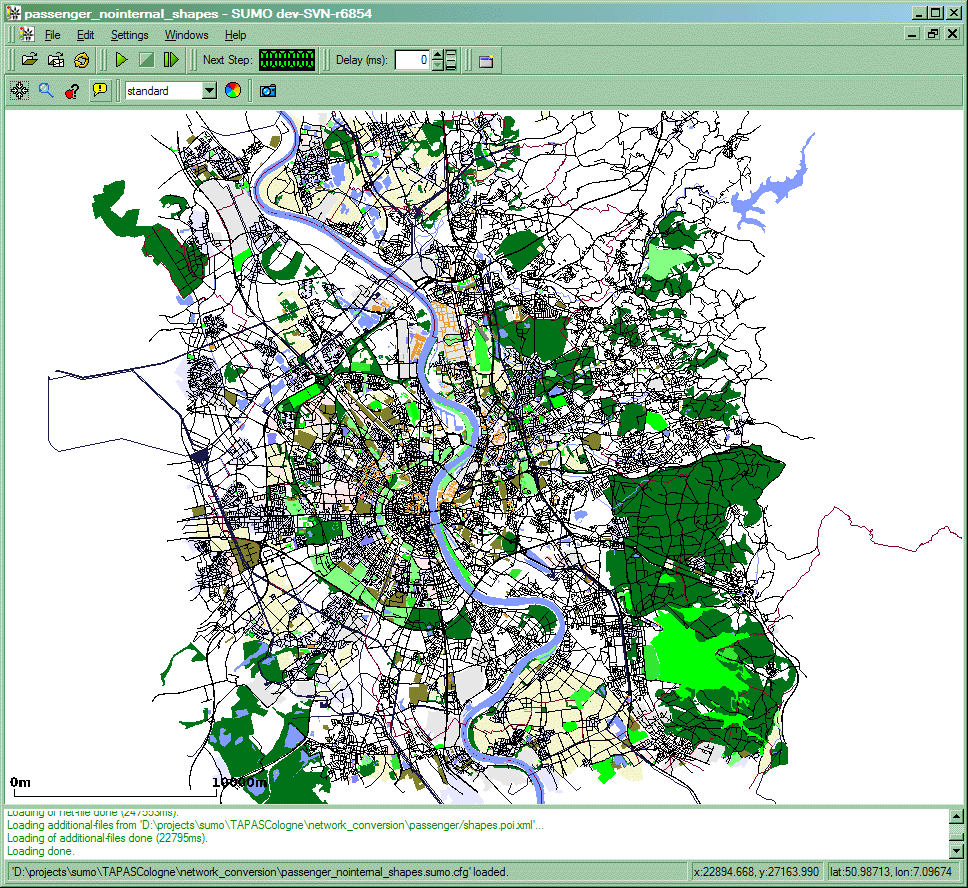
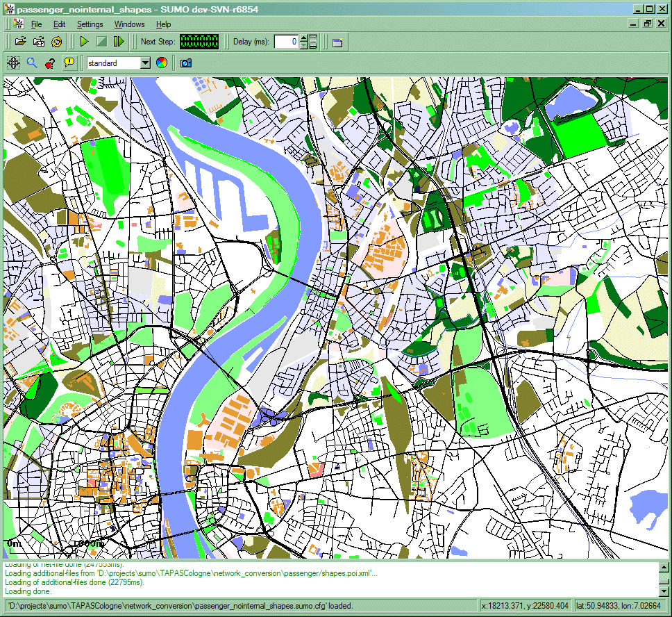
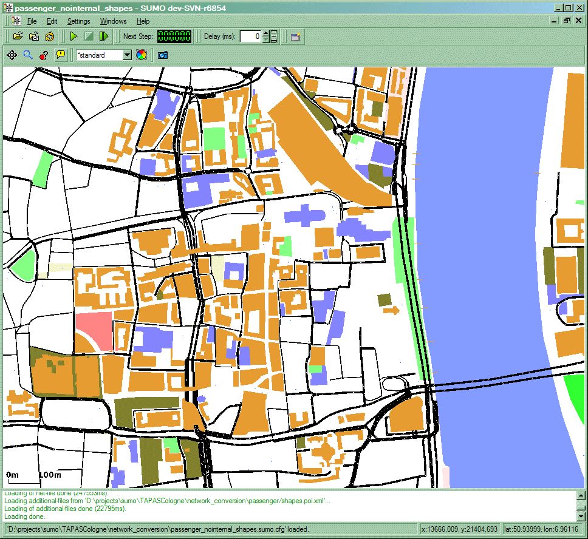
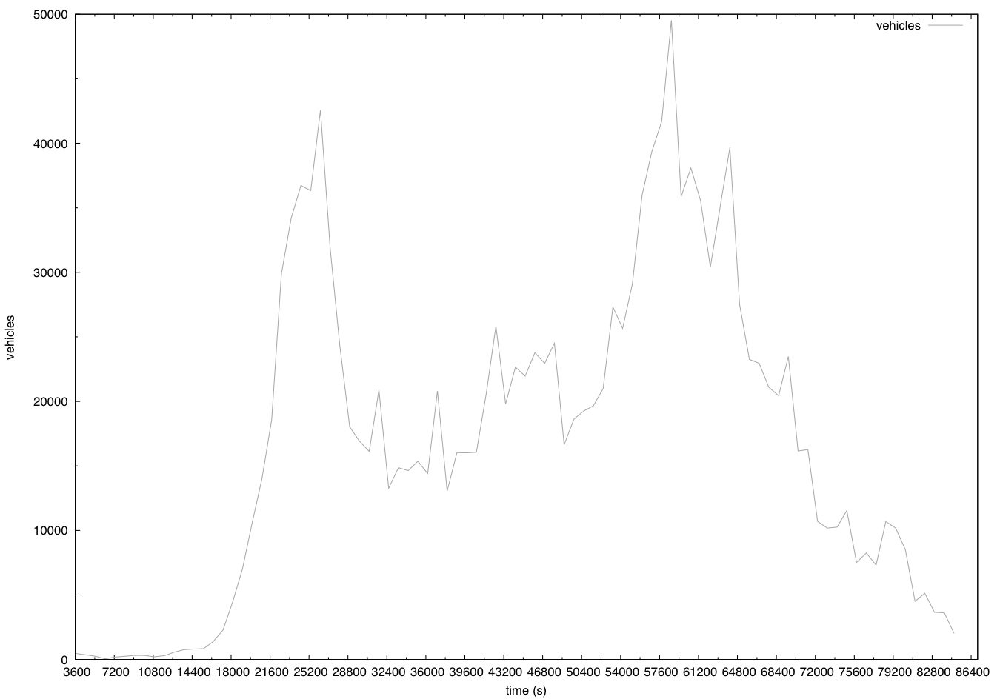

# "TAPAS Cologne" Scenario

## Availability

 The data is available under the
[Creative Commons](http://creativecommons.org/licenses/by-nc-sa/3.0/)
license. You **must tell where the data is from**, it is **not allowed
to use it for commercial** purposes, as soon as you use it **we want to
be informed** about it (use the
[sumo-user](https://dev.eclipse.org/mailman/listinfo/sumo-user).

The data can be [downloaded from our scenario
repository](http://sourceforge.net/projects/sumo/files/traffic_data/scenarios/TAPASCologne).
There also vehicle traces available from the [KolnTrace project at CITI
Lab](http://kolntrace.project.citi-lab.fr/).

## About

### Brief Description

The "TAPAS Cologne" simulation scenario describes the traffic within the
city of Cologne (Germany) for a whole day. The original demand data
stems from TAPAS, a system which computes mobility wishes for an area
population generated based on information about travelling habits of
Germans and on information about the infrastructure of the area they
live in. More information about the system can be found within this
[publication on
TAPAS](http://elib.dlr.de/45058/02/SRL_81_-_Beitrag_Varschen.pdf). The
original data was using a closed-source road network and was mapped onto
one stemming from the [OpenStreetMap
project](http://www.openstreetmap.de/).

As is, TAPASCologne is only hardly usable. Work must be put into
improving the network quality, as well as into verification of the
process how routes were mapped on the OSM network and on the routes
themselves. We hope to gain participants responsible for the works that
must be done. A list of possible [work packages on
TAPASCologne](#next_steps) is available.

### Contents

The TAPASCologne scenario package includes:

- Road networks imported from OSM
- POIs and Polygons imported from OSM
- The mapped trips for time between 6:00 and 8:00 (am)
- The mapped trips for time between 00:00 and 24:00 (in a separate file)
- The SUMO-configuration file

As OSM data contains information about streets, railways, ways for
pedestrians only, etc. Release 0.0.3 only includes the network for road
vehicles (road). Other network selections can be created with the script
build.py in the release.

- "passenger_\*" which contains only roads passenger vehicles are
  allowed to use
- "roadvehicles_\*" which contains roads for road vehicles (those
  used by pedestrians, trains, and bicycles were removed)
- "all_\*" which contains all roads

The idea behind this is to have a fast road network ("passenger_\*")
for DUA computation and for scenarios which only consider passenger
traffic retrieved by TAPAS. Then, in a second step, which is not yet
started, additional traffic such as public transport or delivery
vehicles may be added and used in combination with "roadvehicles_\*"
networks. "all_\*" networks are meant to be used by people who want it
all......

Each of the road networks is again available in two versions - one with
internal lanes (default since version 0.10.1) and one without. Again,
choosing the proper network is a matter of personal interest.

The supplied routes are given for the "passenger_\*"-network. Though
not tested, yet, we assume that they can not be used directly with other
networks from the package. Still, computing correct routes should be
possible by starting [duarouter](../../duarouter.md) with the
appropriate network and **--repair** option.

The following images show the scenario area with polygons and points of
interest. Because we assume that the networks differ in size, for each
network type (passenger, roadvehicles, all), a shape file is included.

 

### ChangeLog

**Version 0.0.1 to version 0.0.2**

- Solved problems on importing OSM road networks, including
  [defect 17: OSM network importer creates large
  junctions](https://github.com/eclipse/sumo/issues/17)
- Includes joined tls (solves few synchronization problems)
- Patched import of shapes (POIs/Polygons) and included them
- Remapped the routes

## Quality

In the current version, we even have not tested the data, completely.
The assumptions made on the quality are shown below. We decided not to
use a numeric ranking, because we do not have real world numbers for
most of the issues. The rank tries to distinguish between "good" (arrow
upwards, green) and "bad" (arrow downwards, red) influences on the
overall simulation quality.

-  Network Topology and Edge Parameter (from OSM)
  -  Completeness
    - Seems to be quite complete (including even minor roads) when
      compared to other (commercial or administral) road networks;
      still, there is no information about "black spots";
    - **todo:** build density plot comparing commercial and this
      network (legal?)
  -  Junction topology
    - Lots of complex junctions which should be simplified
      (automatic joining failed)
  -  Lane Number Information
    - The information about lane numbers is stored via types,
      mainly. For several roads, an explicit lane number is
      given. It can be safely assumed that many turning-lanes are
      missing.
    - **todo:** evaluate how much information is given explicitly
    - **todo:** compare to images, write down lane number per
      street
  -  Maximum Speed Information
    - Again, mostly available via types, as for lane numbers; is
      assumed to be mismatching on some places
    - Where can one get better information from?
-  Traffic Management Artifacts
  -  Traffic Light Positions
    - Given for some junctions (nodes); Still, there seem to be no
      information whether a node not marked as controlled is
      really uncontrolled
    - **todo:** Try to find further controlled junctions or
      improve guessing
  -  Traffic Light Programs
    - Ungiven
    - **todo:** Ask about the default cycle time (if there is one)
      in Cologne; apply at least this one to the generated tls
      logics
  -  Other Traffic Management Artifacts
    - completely ungiven
  -  Closures, Roads At Work
    - completely ungiven
-  Public Transport
  - completely ungiven
-  Demand Data
  -  Activity-Based single Person Trips
    -  No Time Aggregation
    -  No Start/End Position Aggregation
  -  unverified
  -  starts partially at highways
  -  ad-hoc, errorneous mapping to OSM
  -  shortest path routing, no [DUE](../../duarouter.md) as of release 0.0.3

The below images show the structure of demand data over 24 hour period.
This shows normal behavior of mobility. Peak hours like \~8-9am ,
\~4-6pm during which the number of trips are usually high. More
information of the city of cologne can be found in the link
[\[1\]](http://www.stadt-koeln.de/mediaasset/content/pdf15/stadtkoeln_zahlenspiegel_e_bfrei.pdf).
The total number of trips (made by cars) over 24h is very close to the
number of registered cars\*3 (3 trips per registered car). There are
around \~420415\*3 (\~1.2 million) trips which matchs the number in the
plots.

 

!!! caution
    Due to the above problems with the simulation network, the configuration file included with the scenario uses the option **--scale 0.3**. This reduces the demand to 30% of the realistic value to avoid network-wide traffic jams.

**Summary:** The TAPAS Cologne scenario is assumed to be one of the
largest - if not THE largest - freely available traffic simulation data
set. Regarding the scenario size, both the road network and the traffic
demand are given in a good quality. Nonetheless, many important
information is missing or wrong and much further effort is needed to
make the scenario realistic and complete.

## Next Steps

| Task                                       | Description | Priority  | Assigned To |
| ------------------------------------------ | ----------- | --------- | ----------- |
| Synchronize Traffic Lights                 |             | very high | \-          |
| Check Right-of-way Rules                   |             | very high | \-          |
| Check Lane Numbers, esp. within Junctions  |             | high      | \-          |
| Check whether all traffic lights are given |             | high      | \-          |
| Compute Assignment                         |             | high      | \-          |
| Add Public Transport                       |             | low       | \-          |
| Help on Visualisation of POIs/Polygons     |             | low       | \-          |