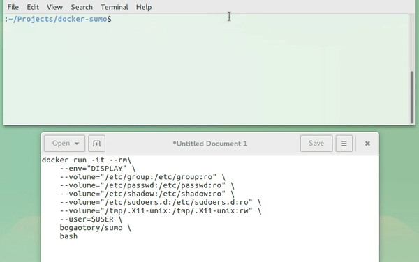

## Dockerised SUMO

Building and installing SUMO from source is not an easy task for
beginner users. Docker is a popular tool to solve this issue. Searching
"SUMO" at [Docker Hub](https://hub.docker.com) will give several results
from attempts to Dockerise SUMO. We list a few of these attempts
beginning with standalone SUMO to SUMO with other packages.

### SUMO, SUMO GUI, and TraCI

The solution given at
[docker-sumo](https://github.com/bogaotory/docker-sumo) contains only
standard SUMO and tools. It demonstrates how to Dockerise SUMO version
0.30.0 on top of Ubuntu 16.04. As well as sumo and TraCI,
[docker-sumo](https://github.com/bogaotory/docker-sumo) also shows the
user how to access the graphical interface of a Dockerised SUMO, i.e.
**sumo-gui**, which is unique compared to other attempts at Dockerising
SUMO.

**sumo-gui** in action from [docker-sumo](https://github.com/bogaotory/docker-sumo)

### SUMO and TraCI4J

The [sumo-docker](https://hub.docker.com/r/similitude/sumo-docker/)
project demonstrates how to Dockerise SUMO version 0.25.0 on top of
Apache Mavern 3 with [TraCI4J](https://github.com/egueli/TraCI4J).

### SUMO and JuPedSim

The
[hybrid_sumo_jps](https://hub.docker.com/r/grgrlmml/hybrid_sumo_jps/)
project aims on providing an easy to use docker image for running a
hybrid simulation that couples SUMO with
[JuPedSim](http://www.jupedsim.org). SUMO is a mighty simulator for all
kinds of transport problems that focuses mainly on motorized traffic.
While SUMO also provides a pedestrian model for simulating pedestrians
on sidewalks, crossings or the like, it lacks of the capability to model
pedestrians in true 2d space (e.g. in buildings, on squares, at train
stations). Instead of reinventing the wheel we decided to team up with
JuPedSim and develop a hybrid coupling approach that combines the power
of both frameworks. The coupling is realized using google's [protocol
buffers](https://github.com/google/protobuf) over
[gRPC](https://github.com/grpc), a library for \*remote procedure
calls\*. Currently this coupling approach is provided as a Docker image.
Moreover, also the Docker image is not intended to replace the common
SUMO installation (e.g. hybrid_sumo_jps does not provided a graphical
interface, i.e. no sumo-gui), you may also use the hybrid_sumo_jps
image to run ordinary SUMO scenarios.

Details on how to run hybrid_sumo_jps can be found at the
corresponding [hybrid_sumo_jps's Docker
Hub](https://hub.docker.com/r/grgrlmml/hybrid_sumo_jps/) page.