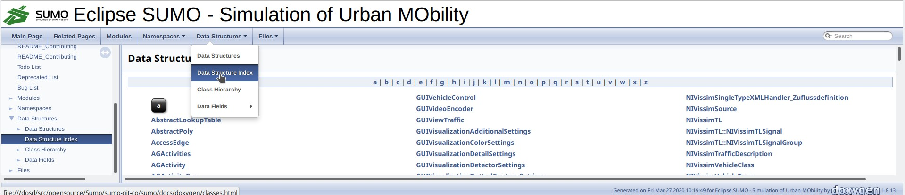
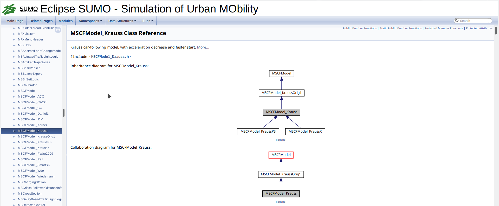
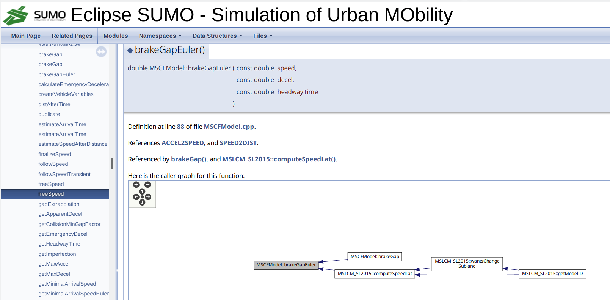

# Introduction

Each night a documentation of the C++ source code is generated with the tool [Doxygen](http://www.doxygen.nl/).
The result is accessible via [inline code documentation
  (doxygen)](http://sumo.dlr.de/daily/doxygen/).

# Looking for a class by name

Select either from the menu "Data Structures" the item Data Structure Index or from the tree view on the left "Data Structures" -> "Data Structure Index". You can navigate with the alphabet to the section of all classes starting with that letter.
Select e.g. first M and then the class MSCFModel.

# Information about a class

For a selected class the following information is shown

## Inheritance and collaboration diagram

For a select class you will see first the inheritance and collaboration diagram.
In these diagrams you can navigate to other classes by clicking on the box with the class name.

## Data Structures

## List of member functions

For each function you see a description, the parameters, return values, the references to other variables and functions, from where it is references and the caller graph.

You can navigate to the references items and explore the structure of one or more classes interactively in the browser

## List of variables