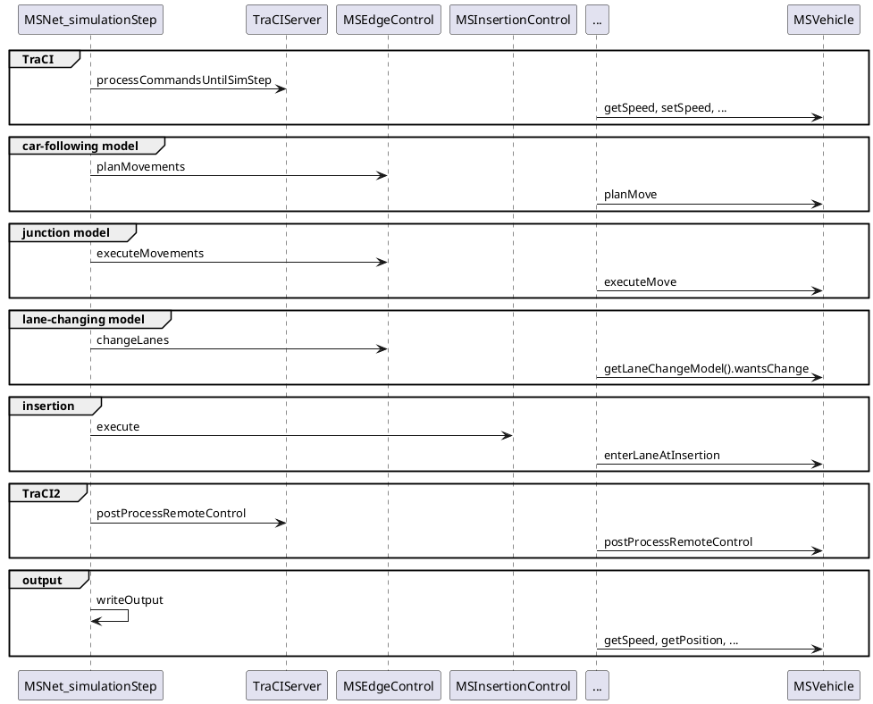

# Basic

sumo and sumo-gui call both the method `MSNet::simulationStep`. 
This sketch describes the further communication of this method 
with the other elements of the simulation.

```plantuml
@startuml
participant MSNet_simulationStep as simstep
participant TraCIServer
participant MSEdgeControl
participant MSInsertionControl
participant MSInsertionControl
participant ...
participant MSVehicle

group TraCI
simstep -> TraCIServer : processCommandsUntilSimStep
... -> MSVehicle : getSpeed, setSpeed, ...
end

group car-following model
simstep -> MSEdgeControl : planMovements
... -> MSVehicle : planMove
end

group junction model
simstep -> MSEdgeControl : executeMovements
... -> MSVehicle : executeMove
end

group lane-changing model
simstep -> MSEdgeControl : changeLanes
... -> MSVehicle : getLaneChangeModel().wantsChange
end

group insertion
simstep -> MSInsertionControl : execute
... -> MSVehicle : enterLaneAtInsertion
end

group TraCI2
simstep -> TraCIServer : postProcessRemoteControl
... -> MSVehicle : postProcessRemoteControl
end

group output
simstep -> simstep : writeOutput
... -> MSVehicle : getSpeed, getPosition, ...
end

@enduml
```
