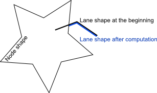
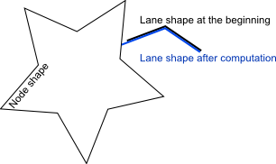
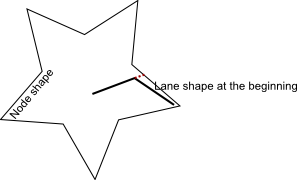

[netconvert](../netconvert.md),
[netgenerate](../netgenerate.md), and [netedit](../netedit.md)
share the same process of building networks which is started as soon as
data are read (in [netconvert](../netconvert.md)) or after an
internal description is generated (in
[netgenerate](../netgenerate.md)).

The process requires that at least nodes and edges are given, optionally
also connections between edges and/or lanes and other optional
information. Hints about how the network shall be built - whether
turnarounds or highway on/off-ramps shall be added, traffic lights or
roundabouts shall be guessed, etc. are retrieved from the options.

Below, you may find a list of all steps performed while building the
network. Optional steps are in *italics*.

1.  Modifying the sets of nodes and edges
  1.  *Joining junction clusters*
  2.  Removing self-loops
  3.  *Removing isolated roads*
  4.  *Removing unwished edges*
  5.  Removing empty nodes *and geometry nodes*
  6.  Joining similar edges
  7.  *Splitting geometry edges*
  8.  *Guessing and setting on-/off-ramps*
2.  *Moving network to origin*
3.  TLS position computation
  1.  *Assigning nodes to traffic lights*
  2.  *Joining traffic light nodes*
4.  Computing connections between lanes
  1.  Computing turning directions
  2.  Sorting nodes' edges
  3.  Computing Approached Edges
  4.  Computing Approaching Lanes
  5.  Dividing of Lanes on Approached Lanes
  6.  *Appending Turnarounds*
  7.  Rechecking of lane endings
5.  Geometry computation
  1.  Computing node shapes
  2.  Computing edge shapes
6.  Computing right-of-way and traffic light programs
  1.  Computing tls logics
  2.  Computing node logics
  3.  Computing traffic light logics
7.  Finishing inner edges

These computation steps are performed within void
NBNetBuilder::compute(OptionsCont &oc). These steps are described more
detailed in the following.

# Steps

- *pre-condition*: All input is read
- *pre-condition*: Nodes have: id, cartesian coordinates, type
(optional, may change)
- *pre-condition*: Edges have: valid from/to-nodes, lane number, max.
speed limits, allowed vehicle classes, geometry (may change),
typeID, lane spread information, name (optional), priority
information (optional)

## \#1: Modifying the sets of nodes and edges

**Purpose**: Remove unwished edges/nodes from the internal
representation; add geometry nodes if wished
*post-condition*: all unwished elements (nodes, edges) are removed,
geometry nodes are inserted/removed if wished, attributes as above

The following sub-steps are done:

- **joinJunctions** ('`Joining junction clusters`'): build node clusters

  **Purpose**: Join network graph nodes which form a single
  intersection.
  *post-condition*: junction joined, attributes as above
  *affects*: removes and adds nodes, removes edges, remaps
  connections (tbd)
  *state*: tbd

- **removeSelfLoops** ('`Removing self-loops`'): remove all edges
  where the from-node is the same as the to-node

  *post-condition*: Each edge is a uni-directional connection between
  two different nodes (ok)
  *state*: green for me, though I am not sure why lists of edges are
  built which are then given to remapping methods; wouldn't it be
  enough to check within the remapping method whether a connection
  exists?

- **joinSimilarEdges** ('`Joining similar edges`'): "join" edges which
  connect the same nodes

  *post-condition*: No two edges with same geometry connecting same
  nodes exist
  *state*: yellow, as there are two comments in the code, one about a
  bug, a second one about a missing check for vclasses; should be
  revisited (why it's here, what would happen if not)
  *comment*: ? Earlier, only one road could connect same
  intersections; not now. Why, explain, how does it work?
  *comment*: This method uses two magic numbers to determine whether
  edges are "similar":
  `distanceThreshold = 7.;` // don't merge edges further apart
  `lengthThreshold = 0.10;` // don't merge edges with higher relative
  length-difference

- **removeIsolatedRoads** ('`Finding isolated roads`'): remove edges
  which are isolated (not part of the network)

  *post-condition*: ? not defined somewhere
  *state*: yellow; the method is pretty large, and there is no removal
  of edges within the tls control; how does it work?
  *comment*: Should be revisited

- **removeUnwishedEdges** ('`Removing unwished edges`'): Removes edges
  not in myEdges2Keep

  *post-condition*: not wanted edges are no longer in the internal
  containers (ok)
  *state*: yellow; the complete keep/remove/keep-postload - stuff
  should be revisited

- **removeUnwishedNodes** ('`Removing empty nodes and geometry nodes`'
  or '`Removing empty nodes`'): Removes useless nodes

  *post-condition*: empty nodes, nodes with no incoming/outgoing
  edges, are removed (ok)
  *post-condition*: nodes which only affect the geometry of an edge
  are removed if wished (ok)
  *state*: yellow; should be done in two steps for a cleaner code;
  additionally, we had the bug that empty acosta nodes where still in
  the network; is this solved?

- **splitGeometry** ('`Splitting geometry edges`'): Splits edges at
  geometry positions

  *post-condition*: If wished, edges have a line-geometry only
  *state*: yellow; the naming of built nodes is not proper

- **Guessing on-/off-ramps** (`Guessing and setting on-/off-ramps`)

  **Purpose**: Add missing on-/off-ramps
  *state*: tbd

As a result, the internal representation of the read/generated network
contains the sets of nodes/edges the user wanted.

## \#2: Moving network to origin

**Purpose**: Let network coordinates start at 0,0
*state*: green

## \#3: TLS position computation

**Purpose**: Let nodes know whether they are controlled by traffic
lights

- **guessTLs** ('`Assigning nodes to traffic lights`')

  *post-condition*: empty nodes, nodes with no incoming/outgoing
  edges, are removed (ok)
  *state*: tbd

- **joinTLS** ('`Joining traffic light nodes`')

  *post-condition*: empty nodes, nodes with no incoming/outgoing
  edges, are removed (ok)
  *state*: tbd

## \#4: Connections Computation

**Purpose**: Determine and/or assign connections over intersections
between lanes

### Computing turning directions

- **code**: NBTurningDirectionsComputer::computeTurnDirections(...);
- **post-condition**: The edge knows its turnaround direction, if
existing.
- **reason**: Turnarounds are treated differently in the following
steps than other directions of driving.
- **how**

For each combination of an incoming and an outgoing edge, which may be
connected, we compute the angle between them. If this angle is \>160°,
we assume that this may be a turnaround. We add 360° to this angle if
both edges connect same both nodes in different direction. We store the
edge pairs with angle into a list sorted decreasing by the angle. After
all combinations are computed, we go through the list and set those as
turnarounds which we see at first, marking both the incoming and the
outgoing edge as already seen what avoids to use them twice. We warn if
an edge occures twice with an angle \>360° - multiple edges connecting
two same nodes.

- **state**: yellow

  the check for being connected should be omitted, here, see
  inline-documentation
  as usual, you may find pathological intersections

### Sorting nodes' edges

- **code**: NBNodesEdgesSorter::sortNodesEdges(...);
- **post-condition**: each node's edges (incoming, outgoing, and all)
are sorted clockwise, starting at 12 o'clock. Incoming edges with
same angle as the according outgoing are before the outgoing one in
the list of all edges.
- **reason**: this order is assumed to be given in following
computation steps
- **how**

We sort a node's edge vectors (incoming, outgoing, all), first. Then, we
go through the vector of all edges and exchange an incoming and an
outgoing edge if both have the same angle, and the incoming is after the
outgoing (determined using "isTurningDirection").

- **state**: yellow

  unvalidated for left-hand networks
  the method uses the method "NBEdge::isTurningDirectionAt(...)"
  which is not a plain usage of the turnaround computation
  performed earlier

### Computing node types

- **code**: NBNodeTypeComputer::computeNodeTypes(...);
- **post-condition**: Each node has one of the following types:
NODETYPE_PRIORITY_JUNCTION, NODETYPE_RIGHT_BEFORE_LEFT,
NODETYPE_TRAFFIC_LIGHT, NODETYPE_NOJUNCTION(?).
- **reason**: We need this to compute the right-of-way rules.
- **how**

We investigate each node by itself. We check some special cases, first:

- if the type is already set (myType \!= NODETYPE_UNKNOWN) -\> skip
- if we have only one incoming edge -\> set to
  NODETYPE_PRIORITY_JUNCTION
- if it is a *simple continuation* -\> set to
  NODETYPE_PRIORITY_JUNCTION

At first, we assume the intersection is a NODETYPE_RIGHT_BEFORE_LEFT
intersection. We then go through all incoming edge combinations which
are not opposite. As soon as we encounter one where the speed limit
between both edges differs by more than 10km/h (approx.), we set the
type to NODETYPE_PRIORITY_JUNCTION. This is also the case if one of
the edges has a speed limit of more than 49km/h (we use this value to
avoid floating point issues).

- **state**: yellow

  investigate whether NODETYPE_NOJUNCTION can be set earlier (by
  the user)
  the used method "getOppositeIncoming" should be revalidated

### Computing priorities

- **code**: NBEdgePriorityComputer::computeEdgePriorities(...);
- **post-condition**: Each edge has a priority at the node it starts
and ends at. The priorities at the start and the end node may
differ. An edge has either the priority 1 (higher prioritized) or 0
(lower prioritized or all equal).
- **reason**: We need this to compute the right-of-way rules.
- **how**

All priorities are initialised to 0.

- **state**: orange

## \#5: Geometry computation

## \#6: Computing right-of-way and traffic light programs

## \#7: Finishing inner edges (optional)

# OLD

## Steps \#9-\#10: Computing certain signalling/right-of-ways

## Steps \#11-\#17: Computing and setting lane-to-lane connections

## Steps \#18-\#19: Computing geometries

I am currently concerned with the edge shapes, because even a eworld or
a TrafficModeler export stops here in debug mode. It is in
NBEdge::computeEdgeShape. (Actually, as far as I understand this method,
it is about the lane shapes of this edge.) In this algorithm, the
following three cases must be distinguished:

|                                                 |                                                      |
| ----------------------------------------------- | ---------------------------------------------------- |
|  | The edge shape intersects with the node shape. Then, the shape is trimmed to the intersection point. This looks quite reasonable.                                                                          |
|                 | The edge shape is outside the node shape. The the present algorithm extrapolates the last line of the edge shape and enlarges the edge to the new intersection point. This looks reasonable to me as well. |
|                    | The edge shape is completely within the node shape. What should happen here? (The red dots show, what netconvert does at present.)                                                                         |

So I am wondering, what the right behavior of netconvert would be in
the third case.

## Steps \#20-\#22: Computing right-of-way rules

## Steps \#23: Applying additional offset

# Table

| Action                                                                  | affects   |           |                 |
| ----------------------------------------------------------------------- | --------- | --------- | --------------- |
|                                                                         | **nodes** | **edges** | **connections** |
| **Adapting the input**                                                  |    x      |   x       |      x          | 
| '`Building node clusters`'                                              |    x      |   x       |      x          | 
| '`Removing self-loops`'                                                 |    x      |           |      x          | 
| '`Joining similar edges`'                                               |           |           |                 | 
| '`Finding isolated roads`'                                              |           |           |                 | 
| '`Removing unwished edges`'                                             |           |           |                 | 
| '`Removing empty nodes and geometry nodes`' or '`Removing empty nodes`' |           |           |                 | 
| '`Splitting geometry edges`'                                            |           |           |                 | 
| '`Guessing and setting on-/off-ramps`'                                  |           |           |                 | 
| **Moving network to origin**                                            |           |           |                 | 
| **TLS position computation**                                            |           |           |                 | 
| Assigning nodes to traffic lights                                       |           |           |                 | 
| Joining traffic light nodes                                             |           |           |                 | 
| **Computing connections between lanes**                                 |           |           |                 | 
| Computing turning directions                                            |           |           |                 | 
| Sorting nodes' edges                                                    |           |           |                 | 
| Computing Approached Edges                                              |           |           |                 | 
| Computing Approaching Lanes                                             |           |           |                 | 
| Dividing of Lanes on Approached Lanes                                   |           |           |                 | 
| Appending Turnarounds (optional)                                        |           |           |                 | 
| Rechecking of lane endings                                              |           |           |                 | 
| **Geometry computation**                                                |           |           |                 | 
| Computing node shapes                                                   |           |           |                 | 
| Computing edge shapes                                                   |           |           |                 | 
| **Computing right-of-way and traffic light programs**                   |           |           |                 | 
| Computing tls logics                                                    |           |           |                 | 
| Computing node logics                                                   |           |           |                 | 
| Computing traffic light logics                                          |           |           |                 | 
| **Finishing inner edges (optional)**                                    |           |           |                 | 