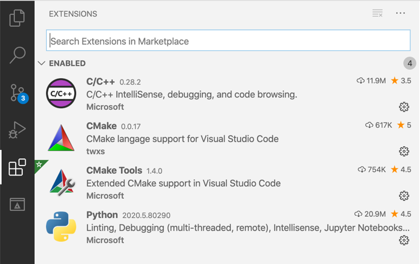
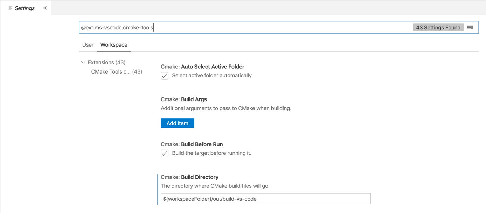
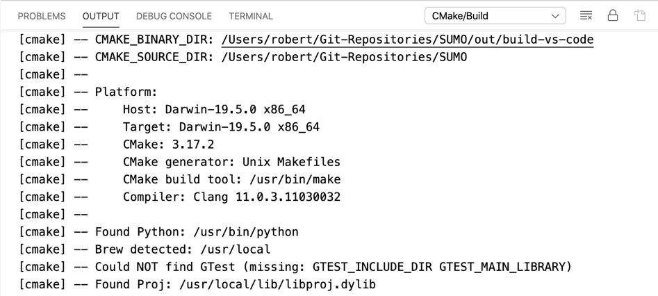

Visual Studio Code is a lightweight integrated development environment. It can be used to develop in C/C++ (among other programming languages) on Windows, Linux and macOS. 

In this document, we describe how Visual Studio Code can be installed and which plugins should be used to work with the SUMO code base.

# Installation

## Download

The proprietary binaries for Visual Studio Code can be downloaded from [here](https://code.visualstudio.com/). There are also open source binaries which can be downloaded from [here](https://vscodium.com) (MIT license).


## Plugins

The standard installation of Visual Studio Code does provide only basic support for source code editing in C/C++ and Python. For this purpose, Visual Studio Code can be extended with plugins to provide additional functionality. We recommend (at least) the following plugins:

* **C/C++** from Microsoft to simplify code browsing, enable code completion and debugging
* **CMake Tools** from Microsoft to benefit from CMake build support 
* **Python** by Microsoft to benefit from code browing, code completion and debugging in Python
* **CMake** by twxs to have support for the CMake specification language when editing `CMakeLists.txt` files



After you successfully installed these plugins, you will probably have to restart Visual Studio Code before they can be used.

## Configuration

Before opening the SUMO code base in Visual Studio Code, you should make sure, that the **CMake Tools** Plugin is properly configured. A click on the cogwheel of the plugin allows you to open the extension settings window.



Please note, that you can set these settings either for the **user** or for the current **workspace**, thus affecting all CMake projects in your workspace.

We would recommend to modify the following settings:

* **Cmake: Build Directory**: set to your out of source build directory, e.g. `${workspaceFolder}/build/vscode`
* **Cmake: Parallel Jobs**: if you have multiple CPUs or multiple CPU cores, set to a value of `2 * N`, whereas `N` denotes the number of cores on your machine, e.g. `2`

## Working with the SUMO Repository

You can now open the local SUMO git repository in Visual Studio Code with `File` -> `Open ...` and point it to the directory of the repository. 

### CMake Configuration

The CMake Tools plugin should automatically recognize the `CMakeLists.txt` file in the top-level SUMO directory and trigger a CMake configuration to find the compilers and available libraries. You can see the results of that process in the output window on the bottom.



You may have different C/C++ compilers installed on your machine. In CMake, these different compiler installations are referred to as compiler kits. The CMake Tools plugin allows you to switch between different compiler kits by opening the command palette (`Command+Shift+P` on macOS) and enter `CMake: Select a kit`. 

SUMO provides certain features that may be enabled or disabled during compilation. CMake refers to these features as **variants**. These variants are defined in the `cmake-variants.yaml` file in the top-level directory of your SUMO repository. This file describes certain features or properties for the CMake configuration process. In Visual Studio Code, you can easily switch between different predefined variants by using the command palette and entering `CMake: Select Variant`. You should use this feature to quickly switch between a `release` and a `debug` build of SUMO. 

### CMake Build

A build can be triggered either by using the command palette (`CMake: Build`) or by pressing `F7`. The build process for a specific target can be triggered with the command palette (`CMake: Build Target`) or by pressing `Shift+F7`. You can follow the build results in the output window in the lower half. 

### Running and Debugging

One of the generated binaries either with or without a debugger can be started in the `Run` menu or by pressing `F5` or `Ctrl-F5`. In the next step, you will quickly notice, that Visual Studio Code requires the definition of run configurations. These are defined in the `.vscode/launch.json` configuration file. You can click on the `Add Configuration...` button on the bottom to add a new configuration for SUMO.

A simple configuration to launch `sumo` can be seen here:

```
{
    // Use IntelliSense to learn about possible attributes.
    // Hover to view descriptions of existing attributes.
    // For more information, visit: https://go.microsoft.com/fwlink/?linkid=830387
    "version": "0.2.0",
    "configurations": [
        {
            "name": "Start SUMO ",
            "type": "cppdbg",
            "request": "launch",
            "program": "${workspaceFolder}/bin/sumo",
            "args": [],
            "stopAtEntry": false,
            "cwd": "${workspaceFolder}",
            "environment": [],
            "externalConsole": false,
            "MIMode": "lldb"
        }
    ]
}
```

!!! note 
    If you try to launch `sumo-gui` with a run configuration on macOS, the launch will fail because it cannot find the proper `DISPLAY` variable of the XQuartz server instance. A workaround seems to be to define a `preLaunchTask` in the configuration above which exports the `DISPLAY` variable for the debugging session. However, this needs more testing.

## General Remarks

### Keyboard Shortcuts

Visual Studio Code is designed to be primarily used with a keyboard, therefore it is a very good idea to start memorizing some of the most important shortcuts:

* Show all commands in the command palette: `Shift + Command + P`
* Go to file: `Command + P`
* Start Build: `F7`
* Start Debugging: `F5`

### General Documentation

General documentation to the usage of Visual Studio Code can be found on various places on the internet, e.g. [Visual Studio Code Tutorial for Beginners - Introduction](https://www.youtube.com/watch?v=VqCgcpAypFQ) or [Visual Studio Code Intro & Setup](https://www.youtube.com/watch?v=fnPhJHN0jTE).
