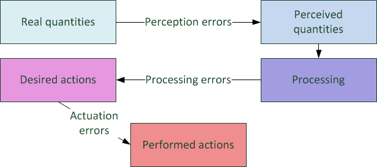

## Overview

The driver state provides a generic mechanism to induce imperfection
into car-following and lane change models. Although errors may enter the
driving process at many stages \[see Figure 1\], SUMO only applies
errors at the perception stage, see
[below](#modeling_of_perception_errors) for details.

*Figure 1: Errors in the driving process.*

Practically, errors are added to the input quantities of the
car-following model's input parameters of spacing and speed difference
(for an integration in [contributed car-following
models](Developer/How_To/Car-Following_Model.md), the
[implementation in the standard
model](https://github.com/eclipse/sumo/blob/master/src/microsim/cfmodels/MSCFModel_Krauss.cpp)
can be adopted (see `MSCFModel_Krauss::stopSpeed()` and
`MSCFModel_Krauss::followSpeed()`).

## Equipping a Vehicle with a Driver State

To apply the imperfect driving functionality for a vehicle it is
equipped with a **Driver State Device**, see [the description of
equipment
procedures](Definition_of_Vehicles,_Vehicle_Types,_and_Routes.md#devices)
(and use <device name>`=driverstate`). The minimal definition required
to equip one vehicle with a Driver State has the following form:

    <routes>
        ...
        <vehicle id="v0" route="route0" depart="0">
            <param key="has.driverstate.device" value="true"/>
        </vehicle>
        ....
    </routes>

In this case all parameters ([see below](#modeling_of_perception_errors)) of the driver state
are set to their default values. The following table gives the full list
of possible parameters for the Driver State Device. Each of these
parameters must be specified as a child element of the form
`<param key=<PARAMETER NAME> value=<PARAMETER VALUE>` of the
appropriate demand definition element (e.g. `<vehicle ... />`, `<vType
... />`, or `<flow ... />`). See [Modeling of Perception
Errors](#modeling_of_perception_errors) for details of the
error dynamics.

| Parameter                                | Type  | Default                     | Description          |
| ---------------------------------------- | ----- | --------------------------- | ---------------------------------------- |
| initialAwareness                         | float | 1.0                         | The initial awareness assigned to the driver state.    |
| errorTimeScaleCoefficient                | float | 100.0                       | Time scale constant that controls the time scale of the underlying error process.   |
| errorNoiseIntensityCoefficient           | float | 0.2                         | Noise intensity constant that controls the noise intensity of the underlying error process.  |
| speedDifferenceErrorCoefficient          | float | 0.15                        | Scaling coefficient for the error applied to the speed difference input of the car-following model. |
| headwayErrorCoefficient                  | float | 0.75                        | Scaling coefficient for the error applied to the distance input of the car-following model.  |
| speedDifferenceChangePerceptionThreshold | float | 0.1                         | Constant controlling the threshold for the perception of changes in the speed difference  |
| headwayChangePerceptionThreshold         | float | 0.1                         | Constant controlling the threshold for the perception of changes in the distance input.      |
| minAwareness                             | float | 0.1                         | The minimal value for the driver awareness (a technical parameter to avoid a blow up of the term `1/minAwareness`).   |
| maximalReactionTime                      | float (s) | original action step length | The value for the driver's actionStepLength atained at minimal awareness. The actionStepLength scales linearly between this and the original value with the awareness between minAwareness and 1.0. |

## Modeling of Perception Errors

An underlying
[Ornstein-Uhlenbeck](https://en.wikipedia.org/wiki/Ornstein%E2%80%93Uhlenbeck_process)
process drives the errors which are applied to the inputs of the
car-following model perception. The characteristic time scale and
driving noise intensity of the process are determined by the driver
state awareness, which is meant to function as an interface between the
traffic situation and the driver state dynamics. We have

- `errorTimeScale = errorTimeScaleCoefficient*awareness(t)`
- `errorNoiseIntensity =
  errorNoiseIntensityCoefficient*(1.-awareness(t))`

\[Figure: Ornstein-Uhlenbeck\]

The error's state error(t) at time t is scaled and added to input
parameters of the car-following model as follows

- `perceivedSpeedDifference = trueSpeedDifference +
  speedDifferenceError(t)`, where `speedDifferenceError(t) =
  speedDifferenceErrorCoefficient*headway(t)*error(t)`
- `perceivedHeadway = trueHeadway + headwayError(t)`, where
  `headwayError(t) = headwayErrorCoefficient*headway(t)*error(t)`

Note that the state `error(t)` of the error process is not directly
scaled with the awareness, which only controls the errors indirectly by
affecting the processes parameters. Further, the scale of the perception
error is assumed to grow linearly with the distance to the perceived
object.

\[Figure: Schematic representation\]

Finally, the driver state induces an update of the input to the
car-following model only if the perceived values have changed to a
sufficient degree. The conditions for updating the car-following input
are:

- headway: `|perceivedHeadway - expectedHeadway| >
  headwayChangePerceptionThreshold*trueGap*(1.0-awareness)`
- speed difference: `|perceivedSpeedDifference -
  expectedSpeedDifference| >
  speedDifferenceChangePerceptionThreshold*trueGap*(1.0-awareness)`

Here, the expected quantities are

- `expectedHeadway = lastRecognizedHeadway -
  expectedSpeedDifference*elapsedTimeSinceLastRecognition`
- `expectedSpeedDifference = lastRecognizedSpeedDifference`