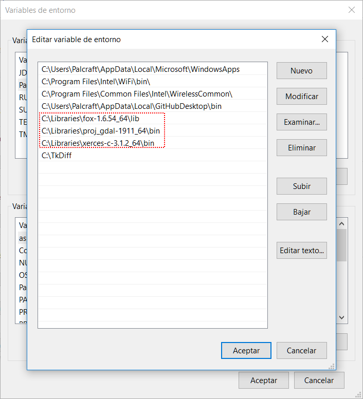
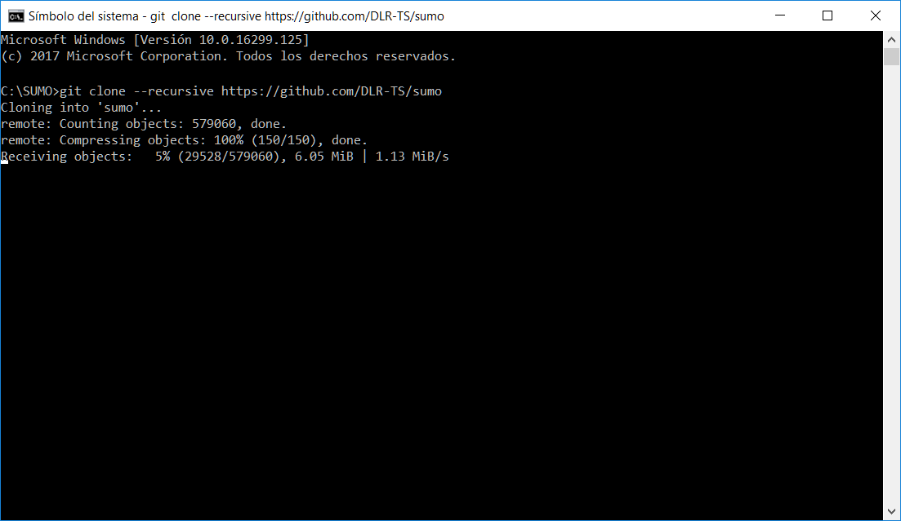
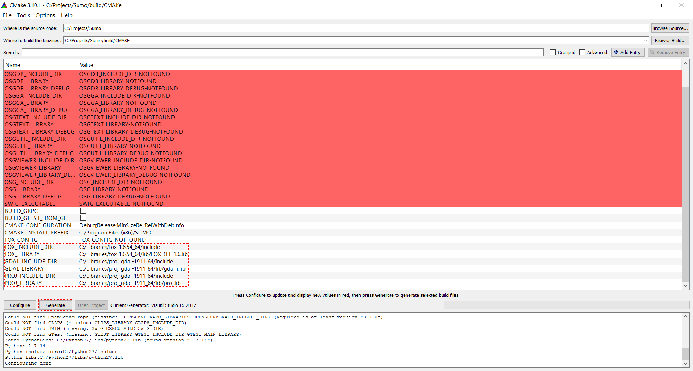
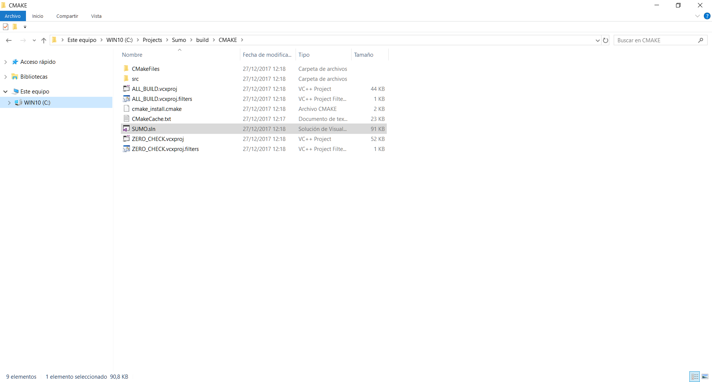
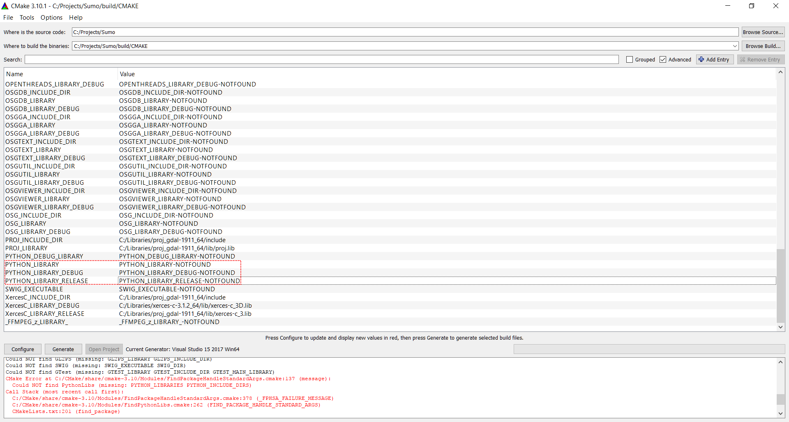
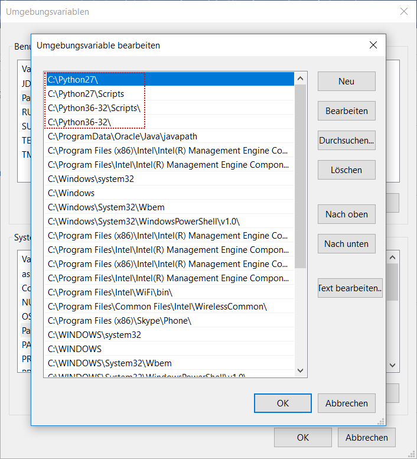

## Prerequisites

- installed [Visual Studio Community, Professional or Enterprise 2013
  or later.](https://www.visualstudio.com)
- installed [cmake for windows](https://cmake.org/download)
- fresh sumo sources (either an unpacked src zip or a git clone, see
  [Installing/Linux_Build\#Getting_the_source_code](../Installing/Linux_Build.md#getting_the_source_code))
- installed libraries (Xerces-C, Proj, Fox) preferably by cloning
  <https://github.com/DLR-TS/SUMOLibraries/>.
  - Make sure that the SUMO_LIBRARIES environment variable points
    to your cloned directory
- Place all relevant dll dirs in the PATH

Lib folders placed in PATH

## Method 1: CMake GUI

- start cmake gui
- select source path (e.g. D:\\projects\\sumo)
- select build path (e.g. D:\\projects\\sumo\\cmake-build)
  - can be identical to source path but it is advised to separate
  - Build dir will be created if necessary
- Start configuration pressing "Configure" button
  - select compiler (default should do)
- Create the Visual Studio solution pressing "Generate" button
- Open *D:\\projects\\sumo\\cmake-build\\SUMO.sln* (from the explorer
or by clicking on open project)
- Build the configurations you want
  - Binaries appear in D:\\projects\\sumo\\bin

Visual guide:

Cloning SUMO

")
Selecting Solution (Visual Studio, Eclipse, etc.)

Libraries successfully configured

Generated solution

## Method 2: CMake command line

- go to source path (e.g. `cd D:\projects\sumo`)
- create build path (e.g. `mkdir cmake-build && cd cmake-build`)
- run cmake with the correct Visual Studio version (e.g. `cmake .. -G
"Visual Studio 12 2013 Win64"`)
  - for a list of possible generators run `cmake --help`
- Open the solution *D:\\projects\\sumo\\cmake-build\\SUMO.sln*
  - or build from the command line using `cmake --build . --config
    Release`

## Additional options and fine tuning

- For a different target platform (e.g. 32bit) start cmake again, do
not use Visual Studio to add a different platform
- To enable [Libsumo](../Libsumo.md) add SWIG dir and exe for
building Python and Java bindings
  - Make sure Python and a JDK are installed
  - Python will only work with the release build (unless you compile
    a debug version of Python yourself)
- To disable certain features delete all values referring to the
feature (e.g. to disable GDAL remove GDAL_INCLUDE_DIR and
GDAL_LIBRARY in the CMake GUI or in CMakeCache.txt) and run the
generator again

## Troubleshooting

- Python cannot be found
  - Make sure that there isn't two different Python version
    installed
  - Python libraries can be specified manually (e.g.
    <PythonFolder\>\\libs\\python<version\>.lib)

Python library field

Two different python version at the same time