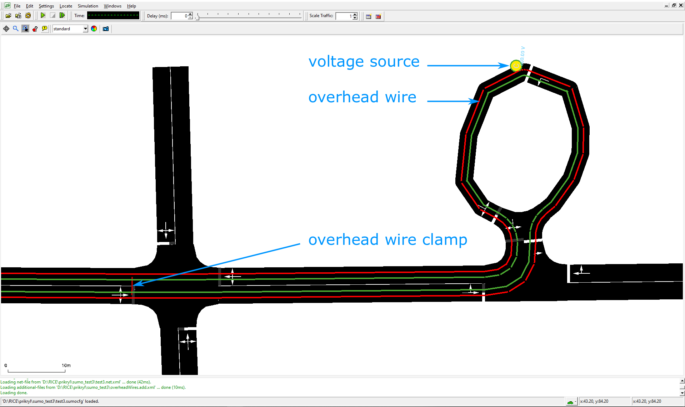
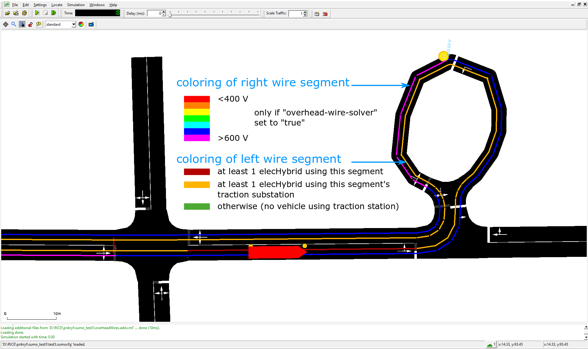

# Overview

Since version 1.5.0 SUMO extends the original [electric](Electric.md) vehicle model with a model that simulates
also internal electric parameters of an partial trolleybus, i.e. a vehicle that is being powered by overhead wires and
has also a battery pack installed, that is being charged from the overhead wires. The model allows not only for vehicle 
simulation, but the simulation may also include detailed electrical simulation of the overhead wire circuit behavior.
It was implemented by Jakub Ševčík and Jan Přikryl from the [RICE FEL UWB Pilen](https://rice.zcu.cz/en). 
The core of the model is implemented in the [vehicle device](../Developer/How_To/Device.md) *device.elechybrid*. Additional
features are a set of overhead wires (which can be placed on any lane in the
network) including wire clamps, a traction substation powering these wires, and a new output options
**--elechybrid-output** {{DT_FILE}}, **--overheadwiresegments-output** {{DT_FILE}} and **--substations-output** {{DT_FILE}}.

You can find a test case for these implementations at
[\[1\]](?????)

## Defining Partial Trolleybuses

To define an electric vehicle with in-motion charging system, it must be equipped with a hybrid electric device.
This may be done using the option **--device.elechybrid.explicit <vehID1,vehID2,...\>** or simply setting
**--device.elechybrid.probability 1** to equip all vehicles. Alternatively, the device may be specified using
[Generic vehicle parameters](../Definition_of_Vehicles,_Vehicle_Types,_and_Routes.md#devices).

Additional properties of the vehicle and its electrical components must then be defined via
[parameters of the vehicle or its type](../Simulation/GenericParameters.md).

These values have the following meanings:

| key                           | Value Type | Default      | Description                                                      |
| ----------------------------- | ---------- | ------------ | ---------------------------------------------------------------- |
| maximumBatteryCapacity        | float      | 0 (Wh)       | Maximum battery capacity *E<sub>max</sub>*                       |
| overheadWireChargingPower     | float      | 0 (W)        | Constant power drawn from an overhead wire if charging a battery |
| maximumPower                  | float      | 100000 (W)   | Maximum power of the vehicle electric **drive**                  |
| vehicleMass                   | float      | 1000 (kg)    | Vehicle mass *m<sub>veh</sub>*                                   |
| frontSurfaceArea              | float      | 5 (m2)       | Front surface area *A<sub>veh</sub>*                             |
| airDragCoefficient            | float      | 0.6          | Air drag coefficient *c<sub>w</sub>*                             |
| internalMomentOfInertia       | float      | 0.01 (kg·m2) | Mom. of inertia of int. rot. elements *J<sub>int</sub>*          |
| radialDragCoefficient         | float      | 0.5          | Radial drag coefficient c<sub>rad</sub>                          |
| rollDragCoefficient           | float      | 0.01         | Rolling resistance coefficient *c<sub>roll</sub>*                |
| constantPowerIntake           | float      | 1000 (W)     | Avg. (constant) power of consumers *P<sub>const</sub>*           |
| propulsionEfficiency          | float      | 0.9          | Drive efficiency *η<sub>prop</sub>*                              |
| recuperationEfficiency        | float      | 0.8          | Recuperation efficiency (constant) *η<sub>recup</sub>*           |
| recuperationEfficiencyByDecel | float      | 0.0          | Recuperation efficiency (by deceleration)                        |

!!! note
    In comparison with battery device, focuse attention on maximumPower variable, which defines maximum motor (drive) power of hybrid electric vehicle. The rest of parameters in the table are common for model of electric energy consumption and have the same meaning.

An example of a vehicle with hybrid electric attribute is almost identical with that of an electric vehicle:

```
<routes>
    <vType id="trolleybus" accel="0.8" decel="1.0" length="12" maxSpeed="18.0" sigma="0.0" minGap="2.5"
           emissionClass="Energy/unknown"  vClass="bus" guiShape="bus/trolley" color="0,1,0">
      <param key="maximumBatteryCapacity" value="50000"/>
      <param key="overheadWireChargingPower" value="10000"/>
      <param key="maximumPower" value="200000"/>
      <param key="vehicleMass" value="10000"/>
      <param key="frontSurfaceArea" value="7.5"/>
      <param key="airDragCoefficient" value="0.59"/>
      <param key="internalMomentOfInertia" value="0.01"/>
      <param key="radialDragCoefficient" value="0.5"/>
      <param key="rollDragCoefficient" value="0.061"/>
      <param key="constantPowerIntake" value="5000"/>
      <param key="propulsionEfficiency" value="0.9"/>
      <param key="recuperationEfficiency" value="0.9"/>
      <param key="recuperationEfficiencyByDecel" value="0."/>
      <param key="" value=""/>
    </vType>
</routes>
```

The initial energy content of the battery (in (Wh) by default 0.0 Wh) can be set in the vehicle definitions

```
<routes>
    <vehicle id="0" type="trolleybus" depart="0" route="route1" color="1,0,0">
        <param key="actualBatteryCapacity" value="5000"/>
    </vehicle>
</routes>
```

## Traction Substation

A traction substation represents a transformer station that is responsible for powering a certain
set of overhead wire circuits. The current implementation of this element is quite simple: the
substation provides information about the nominal voltage of the overhead wire and it also specifies
the maximum current that can be drawn from the feeder (this imposes a maximum power limit on that
substation). 

| key                 | Value Type | Value range       | Default   | Description                                                          |
| ------------------- | ---------- | ----------------- | --------- | -------------------------------------------------------------------- |
| **id**              | string     | id                |           | Traction substation ID (Must be unique)                              |
| **voltage**         | float      | voltage \> 0      | 600 (V)   | Voltage of at connection point for the overhead wire                 |
| **currentLimit**    | float      | currentLimit \> 0 | 400 (A)   | Current limit of the feeder line                                     |

```
<additionals>
    <tractionSubstation id="Sub1" voltage="600" currentLimit="1000"/>
</additionals>
```

!!! caution
    The parameter **currentLimit** does not cause any power limit of the feeder in SUMO v1.4.

## Overhead Wires

An overhead wire circuit is a set of overhead wires that are connected to a certain traction substation.
The circuit may contain clamps that interconnect diferent parts of the circuit (typically wires for
vehicles moving in opposite directions on the same street) and that improve electric parameters of the
circuit when it is under higher load (TODO: feeder wires from the substation to more than a single
place in the circuit).

In SUMO, the overhead wire circuit consists of segments that are defined on lanes of the SUMO network.
Each segment may be shorten than the lane length, and a beginning or ending offset may be specified (this
is typically used in trolleybus network to start or end the overhead wire at bus stops where the KLACKY
are put on/off the overhead wire). At least one of the segments that will form a circuit has to be
connected to a substation.

!!! note
    Segments are automatically created for internal lanes of an intersection, unless the lane is 
    explicitly prohibited using forbiddenInnerLanes in overhead circuit/section definition (see below).

| key                 | Value Type | Value range           | Default     | Description                                                               |
| ------------------- | ---------- | --------------------- | ----------- | ------------------------------------------------------------------------- |
| **id**              | string     | id                    |             | Overhead wire segment ID (must be unique)                                 |
| **lane**            | string     | valid lane id         |             | Lane over which the segment is placed                                     |
| **voltageSource**   | boolean    | true or false         | false       | If true, the beginning point of the segment is connected to a substation  |
| startPos            | float      | 0 <= x < lane.length  | 0           | Starting position in the specified lane                                   |
| endPos              | float      | 0 < x <= lane.length  | lane.length | Ending position in the specified lane                                     |


Overhead wire segments are defined in an additional file using the following format:

```
<additionals>
    <overheadWireSegment id="ovrhdSgmnt_gneE0_0" lane="gneE0_0" voltageSource="true" />
    <overheadWireSegment id="ovrhdSgmnt_gneE1_0" lane="gneE1_0" />
    <overheadWireSegment id="ovrhdSgmnt_gneE3_0" lane="gneE3_0" />
    <overheadWireSegment id="ovrhdSgmnt_gneE4_0" lane="gneE4_0" />
    <overheadWireSegment id="ovrhdSgmnt_gneE5_0" lane="gneE5_0" voltageSource="true"/>
    <overheadWireSegment id="ovrhdSgmnt_-gneE3_0" lane="-gneE3_0" />
    <overheadWireSegment id="ovrhdSgmnt_-gneE1_0" lane="-gneE1_0" />
    <overheadWireSegment id="ovrhdSgmnt_-gneE0_0" lane="-gneE0_0"  startPos="0.0" endPos="40." />
</additionals>
```

We can also try to improve electric parameters of the circuit by specifying *overhead wire clamps* that interconnect 
selected overhead wire segments (these are typically overhead wire segments in the opposite directions on the same street):

| key                 | Value Type | Value range         | Default | Description                                                                                 |
| ------------------- | ---------- | ------------------- | ------- | ------------------------------------------------------------------------------------------- |
| **id**              | string     | id                  |         | Overhead wire clamp ID (must be unique)                                                     |
| **substationId**    | string     | valid substation id |         | Substation which can employ the overhead wire clamp                                         |
| idSegmentStartClamp | string     | valid segment id    |         | id of the overhead wire segment, to the start of which the overhead wire clamp is connected |
| idSegmentEndClamp   | string     | valid segment id    |         | id of the overhead wire segment, to the end of which the overhead wire clamp is connected   |   

```
<additionals>
    <overheadWireClamp id="clamp1" substationId="Sub1" idSegmentStartClamp="ovrhdSgmnt_-gneE0_0" idSegmentEndClamp="ovrhdSgmnt_gneE0_0" />
</additionals>
```    

Once the overhead wire segments (and overhead wire clamps) have been specified, an electric circuit can be defined:  

| key                 | Value Type | Value range                       | Default | Description                                                    |
| ------------------- | ---------- | --------------------------------- | ------- | -------------------------------------------------------------- |
| **segments**        | string     | list of overhead wire segment IDs |         | Segments that form the given circuit                           |
| **substationId**    | string     | valid substation id               |         | Substation to which the circuit is connected                   |
| clamps              | string     | list of overhead wire clamps      |         | Overhead wire clamps which interconnect overhead wire segments |
| forbiddenInnerLanes | string     | list of forbidden lanes           |         | Inner lanes, where placing of overhead wire is restricted      |

```
<additionals>
    <overheadWire segments="ovrhdSgmnt_gneE0_0 ovrhdSgmnt_gneE1_0 ovrhdSgmnt_gneE3_0 ovrhdSgmnt_gneE4_0 ovrhdSgmnt_gneE5_0 ovrhdSgmnt_-gneE3_0 ovrhdSgmnt_-gneE1_0 ovrhdSgmnt_-gneE0_0"
                  substationId="Sub1" clamps="clamp1" forbiddenInnerLanes=":gneJ4_2_0" />
</additionals>
```

The overhead wire powering/charging system is represented in the graphical user interface as two-wire system:


Representation of the overhead wire in GUI

If a vehicle equipped with ElectricHybrid device drives under the wire, the color of the *circuit or section (?)* changes
according to the power consumed *(the colormap is currently hardcoded)*


Color of overhead wire in case that some power is supplied to a vehicle

### Electric Substation output

Option --substations-output "nameOfFile.xml" generates a full report of energy provided by substations:

```
<output>
    <substations-output value="substations.out.xml"/>
</output>
```

File `substations.out.xml` has the following structure:

```
<substations-export>
    <overheadWireSegment id="ovrhdSgmnt_gneE0_0" tractionSubstationId="Sub1" totalEnergyCharged="0.00" chargingSteps="0"/>
    <overheadWireSegment id="ovrhdSgmnt_gneE1_0" tractionSubstationId="" totalEnergyCharged="0.00" chargingSteps="0"/>
    ...
    <overheadWireSegment id="ovrhdSgmnt_gneE5_0" tractionSubstationId="Sub1" totalEnergyCharged="250.92" chargingSteps="11">
        <vehicle id="test1" type="trolleybus" totalEnergyChargedIntoVehicle="250.92" chargingBegin="1.00" chargingEnd="11.00" maximumBatteryCapacity="46000.00">
            <step time="1.00" chargingStatus="charging" energyCharged="16.17" partialCharge="16.17" voltage="699.98" actualBatteryCapacity="23011.11"/>
            <step time="2.00" chargingStatus="charging" energyCharged="20.66" partialCharge="36.83" voltage="699.94" actualBatteryCapacity="23022.22"/>
            ...
        </vehicle>
        ...
    </overheadWireSegment>
    ...
    <overheadWireSegment id="ovrhd_inner_:gneJ1_0_1" tractionSubstationId="Sub2" totalEnergyCharged="30.15" chargingSteps="1">
        <vehicle id="test1" type="trolleybus" totalEnergyChargedIntoVehicle="30.15" chargingBegin="12.00" chargingEnd="12.00" maximumBatteryCapacity="46000.00">
            <step time="12.00" chargingStatus="charging" energyCharged="30.15" partialCharge="30.15" voltage="698.54" actualBatteryCapacity="23133.33"/>
        </vehicle>
    </overheadWireSegment>
    ...
</substations-export>
```

For the entire overhead wire segment:

| Name               | Type   | Description                                                 |
| ------------------ | ------ | ----------------------------------------------------------- |
| id                 | string | ChargingStation ID                                          |
| totalEnergyCharged | float  | Total energy charged in W during the entire simulation      |
| chargingSteps      | int    | Number of steps in which charginStation was charging energy |

For a vehicle on the given segment:

| Name                          | Type   | Description                                                   |
| ----------------------------- | ------ | ------------------------------------------------------------- |
| id                            | string | ID of vehicle that is being powered by the segment            |
| type                          | string | type of vehicle                                               |
| totalEnergyChargedIntoVehicle | double | Energy provided during the travel on the segment (Wh)         |
| chargingBegin                 | float  | TimeStep in which vehicle starts with the charge (in seconds) |
| chargingEnd                   | float  | TimeStep in which vehicle ends with the charge (in seconds)   |
| maximumBatteryCapacity        | float  | Maximum battery capacity *E<sub>max</sub>*                    |

For every time step that a vehicle is being powereb by the segment:

| Name                   | Type  | Description                                                          |
| ---------------------- | ----- | -------------------------------------------------------------------- |
| time                   | float | Current timestep (s)                                                 |
| energyCharged          | float | Energy charged in the current time step (Wh)                         |
| partialCharge          | float | Energy charged by the segment since vehicle entered the segment (Wh) |
| voltage                | float | Current voltage in the overhead wire (V)                             |
| actualBatteryCapacity  | float | Current battery capacity of vehicle (Wh)                             |

## ElectricHybrid output

There are three output parameters to be set in the SUMO configuration to
use the battery device:

```
<configuration>
    <input>
        <net-file value="netFile.xml"/>
        <route-files value="routeFile.xml"/>
        <additional-files value="additionalFile.xml"/>
    </input>
    <output>
        <battery-output value="Battery.out.xml"/>
        <battery-output.precision value="4"/>
        <device.battery.probability value="1"/>
        <summary-output value="summary_100.xml"/>
    </output>
</configuration>
```

This will activate an aggregated ElectricHybrid output:

```
<elecHybrid-export-aggregated>
    <timestep time="0.00">
        <vehicle id="test1" maximumBatteryCapacity="46000.0000" actualBatteryCapacity="23000.0000" energyConsumed="0.0000" energyCharged="0.0000" power="-nan(ind)" overheadWireId="" tractionSubstationId="" current="-nan(ind)" circuitVoltage="-nan(ind)" alphaCircuitSolver="-nan(ind)" speed="0.0000" acceleration="0.0000" distance="0.0000" x="-1.4500" y="46.3800" z="0.0000" slope="0.0000" lane="gneE0_0" posOnLane="0.0000"/>
        <vehicle id="test2" maximumBatteryCapacity="46000.0000" actualBatteryCapacity="23000.0000" energyConsumed="0.0000" energyCharged="0.0000" power="-nan(ind)" overheadWireId="" tractionSubstationId="" current="-nan(ind)" circuitVoltage="-nan(ind)" alphaCircuitSolver="-nan(ind)" speed="0.0000" acceleration="0.0000" distance="0.0000" x="36.1600" y="33.7600" z="0.0000" slope="0.0000" lane="-gneE10_0" posOnLane="0.0000"/>
    </timestep>
    <timestep time="1.00">
        <vehicle id="test1" maximumBatteryCapacity="46000.0000" actualBatteryCapacity="23011.1111" energyConsumed="5.0570" energyCharged="11.1111" power="58205.3716" overheadWireId="ovrhdSgmnt_gneE0_0_0" tractionSubstationId="trSubstation1" current="83.1523" circuitVoltage="699.9850" alphaCircuitSolver="1.0000" speed="0.8000" acceleration="0.8000" distance="0.8000" x="-0.6502" y="46.3729" z="0.0000" slope="0.0000" lane="gneE0_0" posOnLane="0.8000"/>
        <vehicle id="test2" maximumBatteryCapacity="46000.0000" actualBatteryCapacity="23011.1111" energyConsumed="5.0570" energyCharged="11.1111" power="58205.3716" overheadWireId="ovrhdSgmnt_-gneE10_0_6" tractionSubstationId="trSubstation2" current="97.0738" circuitVoltage="599.5992" alphaCircuitSolver="1.0000" speed="0.8000" acceleration="0.8000" distance="0.8000" x="36.1308" y="32.9604" z="0.0000" slope="0.0000" lane="-gneE10_0" posOnLane="0.8000"/>
    </timestep>
    ...
</elecHybrid-export-aggregated>    
```

Time step parameters:

| Name                   | Type   | Description                                                                                                               |
| ---------------------- | ------ | ------------------------------------------------------------------------------------------------------------------------- |
| time                   | int    | Current timestep                                                                                                          |

Vehicle parameters:

| Name                   | Type   | Description                                                                                                               |
| ---------------------- | ------ | ------------------------------------------------------------------------------------------------------------------------- |
| id                     | string | ID of vehicle that is being powered by the segment                                                                        |
| maximumBatteryCapacity | float  | Maximum battery capacity *E<sub>max</sub>*                                                                                |
| actualBatteryCapacity  | float  | Energy content of the battery in this timestep in **Wh**                                                                  |
| energyConsumed         | float  | Energy consumption in this timestep in **Wh**                                                                             |
| energyCharged          | float  | Charge received in the current time step from a charging station (Only \!= 0 if vehicle is exactly at a charging station) |
| power                  | float  | Power demand requested from the overhead wire in **W**                                                                    |
| overheadWireId         | string | The id of an overhead wire that is currently powering the vehicle, empty if not under a wire                              |
| tractionSubstationId   | string | The substation that is feeding the current overhead wire, empty if not under a wire                                       |
| current                | float  | Current drawn from the overhead wire in **A**                                                                             |
| circuitVoltage         | float  | The actual voltage at the connection point of the pantograph / trolley poles in **V**                                                                             |
| alphaCircuitSolver     | float  | Circuit solver stabilisation parameter, `0 <= alpha <= 1`, 1 in case that the substation is not overloaded and all power demands were satistifed, NaN if not applicable. |
| speed                  | float  | Speed of vehicle in this timestep                                                                                         |
| acceleration           | float  | Acceleration of vehicle in this timestep                                                                                  |
| x                      | float  | absolute position x of vehicle in the map                                                                                 |
| y                      | float  | absolute position y of vehicle in the map                                                                                 |
| z                      | float  | absolute position z of vehicle in the map                                                                                 |
| slope                  | float  | slope of the edge in degrees                                                                                              |
| lane                   | string | id of the lane that the vehicle is currently on                                                                           |
| posOnLane              | float  | Position of vehicle on its current lane                                                                                   |                                             |

If a detailed output of the vehicles has been requiested using `<elecHybrid-output.aggregated value="false"/>`, the ElectricHybrid output
generates a file with the following structure:

```
<elecHybrid-export maximumBatteryCapacity="46000.00" vehicle="test1">
    <timestep time="0.00" actualBatteryCapacity="23000.0000" energyConsumed="0.0000" energyCharged="0.0000" power="-nan(ind)" overheadWireId="" tractionSubstationId="" current="-nan(ind)" circuitVoltage="-nan(ind)" alphaCircuitSolver="-nan(ind)" speed="0.0000" acceleration="0.0000" distance="0.0000" x="-1.4500" y="46.3800" z="0.0000" slope="0.0000" lane="gneE0_0" posOnLane="0.0000"/>
    <timestep time="1.00" actualBatteryCapacity="23011.1111" energyConsumed="5.0570" energyCharged="11.1111" power="58205.3716" overheadWireId="ovrhdSgmnt_gneE0_0_0" tractionSubstationId="trSubstation1" current="83.1523" circuitVoltage="699.9850" alphaCircuitSolver="1.0000" speed="0.8000" acceleration="0.8000" distance="0.8000" x="-0.6502" y="46.3729" z="0.0000" slope="0.0000" lane="gneE0_0" posOnLane="0.8000"/>
    <timestep time="2.00" actualBatteryCapacity="23022.2222" energyConsumed="9.5487" energyCharged="11.1111" power="74375.3992" overheadWireId="ovrhdSgmnt_gneE0_0_0" tractionSubstationId="trSubstation1" current="106.2593" circuitVoltage="699.9424" alphaCircuitSolver="1.0000" speed="1.6000" acceleration="0.8000" distance="2.4000" x="0.9494" y="46.3586" z="0.0000" slope="0.0000" lane="gneE0_0" posOnLane="2.4000"/>
    ...
</elecHybrid-export>
```

Vehicle parameters:

| Name                          | Type   | Description                                                   |
| ----------------------------- | ------ | ------------------------------------------------------------- |
| vehicle                       | string | ID of vehicle                                                 |
| maximumBatteryCapacity        | float  | Maximum battery capacity *E<sub>max</sub>* (Wh)               |

Timestep parameters:

| Name                   | Type   | Description                                                                                                               |
| ---------------------- | ------ | ------------------------------------------------------------------------------------------------------------------------- |
| time                   | int    | Current timestep                                                                                                          |
| actualBatteryCapacity  | float  | Energy content of the battery in this timestep in **Wh**                                                                  |
| energyConsumed         | float  | Energy consumption in this timestep in **Wh**                                                                             |
| energyCharged          | float  | Charge received in the current time step from a charging station (Only \!= 0 if vehicle is exactly at a charging station) |
| power                  | float  | Power demand requested from the overhead wire in **W**                                                                    |
| overheadWireId         | string | The id of an overhead wire that is currently powering the vehicle, empty if not under a wire                              |
| tractionSubstationId   | string | The substation that is feeding the current overhead wire, empty if not under a wire                                       |
| current                | float  | Current drawn from the overhead wire in **A**                                                                             |
| circuitVoltage         | float  | The actual voltage at the connection point of the pantograph / trolley poles in **V**                                                                             |
| alphaCircuitSolver     | float  | Circuit solver stabilisation parameter, `0 <= alpha <= 1`, 1 in case that the substation is not overloaded and all power demands were satistifed, NaN if not applicable. |
| speed                  | float  | Speed of vehicle in this timestep                                                                                         |
| acceleration           | float  | Acceleration of vehicle in this timestep                                                                                  |
| x                      | float  | absolute position x of vehicle in the map                                                                                 |
| y                      | float  | absolute position y of vehicle in the map                                                                                 |
| z                      | float  | absolute position z of vehicle in the map                                                                                 |
| slope                  | float  | slope of the edge in degrees                                                                                              |
| lane                   | string | id of the lane that the vehicle is currently on                                                                           |
| posOnLane              | float  | Position of vehicle on its current lane                                                                                   |                                             |

## Emission Output

As with electric vehicles, the [Emission model](../Models/Emissions.md#outputs)-outputs of
SUMO can be used together with the ElectricHybrid device when setting the
`<vType>`-parameter `emissionClass="Energy/unknown"`.

## Model Details

All information about the implemented device can be found in our SUMO 2019 paper.

## Known Limitations

### Charging Stations

As the ElectricHybrid device is based on Battery, standard chargers may be in theory used for opportunity charging the vehicle internal
energy storage. This functionality is however not yet supported.

### Saving and Loading Simulation State

The ElectricHybrid device does not currently support saving and loading its internal state.

### TraCI

TraCI connection has not been tested yet and it is probably not functional.

### Other Limitations

As of SUMO 1.4.0 we are aware of the following:

* current limits are ignore by the traction substations
* colormap for coloring the overhead wire voltage is hardcoded
* mesoscopic mode has not been thoroughly tested
* placing more than one overhead wire segment on the specific lane has not been thoroughly tested and is not supported yet


### Publications

- [Ševčík, J., Přikryl, J., A Vehicle Device Tailored for Hybrid Trolleybuses 
   and Overhead Wires Implementation in SUMO. In: Weber, M., Bieker-Walz, L.,
   Hilbrich, R., Behrisch, M. (eds.), SUMO2019. EPiC Series in Computing, vol. 62, 
   pp. 145--157. EasyChair (2019)](https://wvvw.easychair.org/publications/download/bhmq)