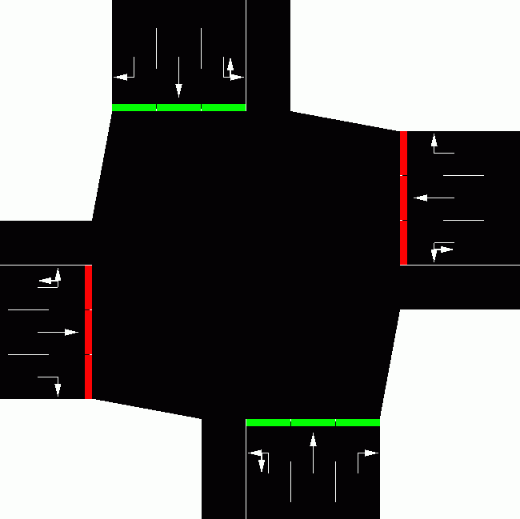
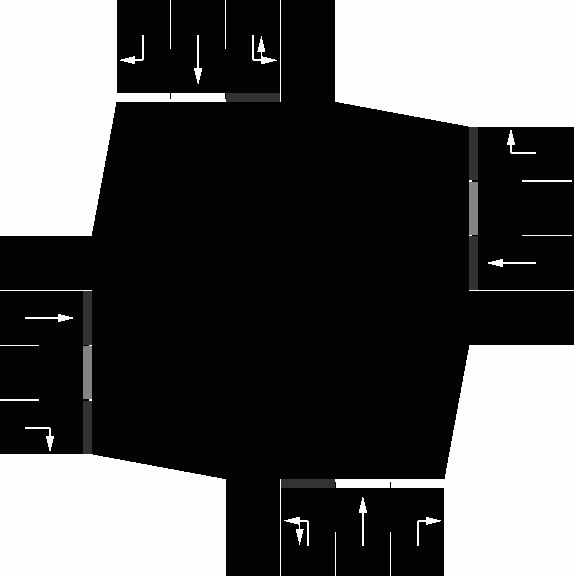
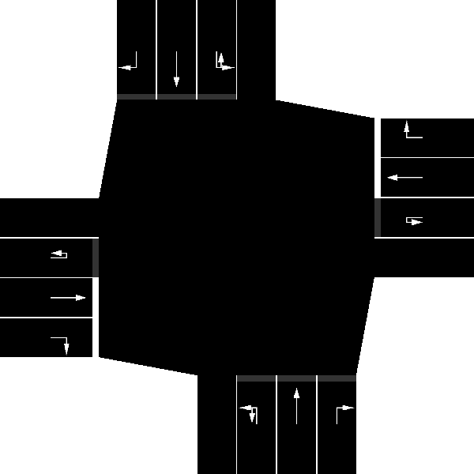

**SUMO**-Networks have two representations:

- A set of *plain-xml* files which describe the network topology and
  geometry
- The *.net.xml* file which is loaded into the simulation. This
  contains lots of generated information such as structures within an
  intersection and right-of-way logic.

[netconvert](../netconvert.md) can [convert freely](../Networks/Export.md#plain) and without information loss
between these two formats. Only the *plain-xml* format is meant to be
edited by the users. In contrast, the *.net.xml* format has lots of
subtle inter-dependencies between it's elements and should never be
edited by hand. The *plain-xml* format is described below.

It is possible to loaded a *net.xml* file along with *plain-xml* patch
files into [netconvert](../netconvert.md) to modify some aspects of
an existing network.

To defined a network at least two files are needed: one file for nodes
and another one for the streets between them. Please notice that herein,
"node" and "junction" mean the same as well as "edge" and "street" do
(see also [Glossary](../Other/Glossary.md)). Besides defining the
nodes and edges, you can also join edge attributes by type and set
explicit connections between edges or lanes. We will describe how each
of these four file types should look like in the following chapters.
Further information on road networks may be also found in the [SUMO Road Networks](../Networks/SUMO_Road_Networks.md) description.

After you have generated the files as described below - you need at
least the edges and the nodes-files, using type and/or a connections
file is optional - you should run [netconvert](../netconvert.md) to
build the network. If you only use edges and nodes, stored in
"MyEdges.edg.xml" and "MyNodes.nod.xml" respectively, the call should
look like:

```
netconvert --node-files=MyNodes.nod.xml --edge-files=MyEdges.edg.xml \
  --output-file=MySUMONet.net.xml
```

If you also use connections and types the call is:

```
netconvert --node-files=MyNodes.nod.xml --edge-files=MyEdges.edg.xml \
  --connection-files=MyConnections.con.xml --type-files=MyTypes.typ.xml \
  --output-file=MySUMONet.net.xml
```

The options used here, including their abbreviations, are documented on
the [netconvert manual page](../netconvert.md#input).

Maybe your edge definitions are incomplete or buggy. If you still want
to import your network, you can try passing **--ignore-errors** to
[netconvert](../netconvert.md). In this case, edges which are not
defined properly are omitted, but [netconvert](../netconvert.md)
tries to build the network anyway. You may also flip the network around
the horizontal axis. Use option **--flip-y-axis** for this.

The structures of the files described in the following are also
available as XML Schema Definitions:

- [nodes files](#node_descriptions):
  <http://sumo.dlr.de/xsd/nodes_file.xsd>
- [edges files](#edge_descriptions):
  <http://sumo.dlr.de/xsd/edges_file.xsd>
- [types files](#type_descriptions):
  <http://sumo.dlr.de/xsd/types_file.xsd>
- [connections files](#connection_descriptions):
  <http://sumo.dlr.de/xsd/connections_file.xsd>
- [tllogic files](#traffic_light_program_definition):
  <http://sumo.dlr.de/xsd/tllogic_file.xsd>

# Node Descriptions

<center>

| Node Descriptions | |
|--------------------|---------------------------------|
| Filename extension | .nod.xml                        |
| Type of content    | Nodes (intersections/junctions) |
| Open format?       | Yes                             |
| SUMO specific?     | Yes                             |
| XML Schema         | [nodes_file.xsd](http://sumo.dlr.de/xsd/nodes_file.xsd)                  |

</center>

Within the nodes-files, normally having the extension ".nod.xml" (see
[Known Extensions](../Other/File_Extensions.md)), every node is
described in a single line which looks like this:
`<node id="<STRING>" x="<FLOAT>" y="<FLOAT>" [type="<TYPE>"]/>` - the straight brackets ('\[' and '\]')
indicate that the parameter is optional. Each of these attributes has a
certain meaning and value range:

| Attribute Name  | Value Type                                | Description                  |
| --------------- | ---------------------------------------------------------------------------- | ------------------------------------------------------------------------- |
| **id**          | id (string)                                                                                                                                                                                                               | The name of the node                                                                                                                               |
| **x**           | float                                                                                                                                                                                                                     | The x-position of the node on the plane in meters                                                                                                  |
| **y**           | float                                                                                                                                                                                                                     | The y-position of the node on the plane in meters                                                                                                  |
| z               | float                                                                                                                                                                                                                     | The z-position of the node on the plane in meters                                                                                                  |
| type            | enum ( "priority", "traffic_light", "right_before_left", "unregulated", "priority_stop", "traffic_light_unregulated", "allway_stop", "rail_signal", "zipper", "traffic_light_right_on_red", "rail_crossing") | An optional type for the node                                                                                                                      |
| tlType          | enum ( **"static"**, "actuated", "delay_based")                                                                                                                                                                                              | An optional type for the [traffic light algorithm](../Simulation/Traffic_Lights.md#actuated_traffic_lights)
| tlLayout        | enum (  **"opposites"**, "incoming", "alternateOneWay")                                                                                                                                                                                              | An optional layout for the traffic light plan (see below)
| tl              | id (string)                                                                                                                                                                                                               | An optional id for the traffic light program. Nodes with the same tl-value will be joined into a single program                                    |
| radius          | positive float;                                                                                                                                                                                                           | optional turning radius (for all corners) for that node in meters *(default 1.5)*                                                                  |
| shape           | List of positions; each position is encoded in x,y or x,y,z in meters (do not separate the numbers with a space\!).                                                                                                       | A custom shape for that node. If less than two positions are given, netconvert will reset that node to use a computed shape.                       |
| keepClear       | bool                                                                                                                                                                                                                      | Whether the [junction-blocking-heuristic](../Simulation/Intersections.md#junction_blocking) should be activated at this node *(default true)* |
| rightOfWay      | string                                                                                                                                                                                                                    | Set algorithm for computing [\#Right-of-way](#right-of-way). Allowed values are *default* and *edgePriority*                            |
| controlledInner | list of edge ids                                                                                                                                                                                                          | Edges which shall be controlled by a joined TLS despite being incoming as well as outgoing to the jointly controlled nodes                         |

!!! note
    You may also use lon/lat values in place of x/y but you then need to add option **--proj.utm** in order to project your coordinates into the cartesian plane.

When writing your nodes-file, please do not forget to embed your node
definitions into an opening and a closing "tag". A complete file should
like the example below, which is the node file "cross3l.nod.xml" for the
examples "{{SUMO}}/data/examples/netbuild/types/cross_usingtypes/" and
"{{SUMO}}/data/examples/netbuild/types/cross_notypes/" example.

```
<nodes> <!-- The opening tag -->

  <node id="0" x="0.0" y="0.0" type="traffic_light"/> <!-- def. of node "0" -->

  <node id="1" x="-500.0" y="0.0" type="priority"/> <!-- def. of node "1" -->
  <node id="2" x="+500.0" y="0.0" type="priority"/> <!-- def. of node "2" -->
  <node id="3" x="0.0" y="-500.0" type="priority"/> <!-- def. of node "3" -->
  <node id="4" x="0.0" y="+500.0" type="priority"/> <!-- def. of node "4" -->

  <node id="m1" x="-250.0" y="0.0" type="priority"/> <!-- def. of node "m1" -->
  <node id="m2" x="+250.0" y="0.0" type="priority"/> <!-- def. of node "m2" -->
  <node id="m3" x="0.0" y="-250.0" type="priority"/> <!-- def. of node "m3" -->
  <node id="m4" x="0.0" y="+250.0" type="priority"/> <!-- def. of node "m4" -->

</nodes> <!-- The closing tag -->
```

As you may notice, only the first node named "0", which is the node in
the middle of the network, is a traffic light controlled junction. All
other nodes are uncontrolled. You may also notice, that each of both
ends of a street needs an according node. This is not really necessary
as you may see soon, but it eases the understanding of the concept:
every edge (street/road) is a connection between two nodes (junctions).

## Traffic lights
For traffic light nodes, [netconvert](../netconvert.md) generates a
default traffic light program. The simulation can [load additional programs](../Simulation/Traffic_Lights.md) which may be used
instead.

### tlType
If you leave out the tlType of the node, it is set to *static*. This
default may be changed using the option **--tls.default-type** {{DT_STR}}.

- `static`: Each phase of the traffic light
  will last for a fixed duration
- `actuated`: Green phases may be prolonged
  depending on traffic measurements from automatically added induction
  loops ("*Zeitlückensteuerung*")

!!! note
    You can load multiple node files at the same time by giving a comma-separated list of file names on the command line. In a configuration file you can use a space separated list as well.
    
### tlLayout
If you leave out the tlLayout of the node, it is set to *opposites*. This
default may be changed using the option **--tls.layout** {{DT_STR}}

- `opposites`: roads from opposite directions get the green light at the same time. Left turns (which conflict with the opposite stream) either have a green-with-conflict ('m') or get their own phase.
- `incoming`: each incoming road gets it's own green phase
- `alternateOneWay`: This program is for a joined controller that regulates alternating one-way access from two or more sides of a work zone (or narrow road). each incoming road gets it's own green phase and there is an all-red phase according to the size of the work zone for traffic to clear before the next direction starts up.

## Node types

If you leave out the type of the node, it is automatically guessed by
[netconvert](../netconvert.md) but may not be the one you intended.
The following types are possible, any other string is counted as an
error and will yield in a program stop:

- `priority`: Vehicles on a low-priority
  edge have to wait until vehicles on a high-priority edge have passed
  the junction.
- `traffic_light`: The junction is
  controlled by a traffic light (priority rules are used to avoid
  collisions if conflicting links have green light at the same time).
- `right_before_left`: Vehicles will let
  vehicles coming from their right side pass.
- `unregulated`: The junction is completely
  unregulated - all vehicles may pass without braking; Collision
  detection on the intersection is disabled but collisions beyond the
  intersection will detected and are likely to occur.
- `traffic_light_unregulated`: The
  junction is controlled by a traffic light without any further rules.
  This may cause collision if unsafe signal plans are used. Note, that
  collisions within the intersection will never be detected.
- `priority_stop`: This works like a
  *priority*-junction but vehicles on minor links always have to stop
  before passing
- `allway_stop`: This junction works like
  an [*All-way stop*](https://en.wikipedia.org/wiki/All-way_stop)
- `rail_signal`: This junction is
  controlled by a [rail signal](../Simulation/Rail_signals.md).
  This type of junction/control is only useful for rails.
- `zipper`: This junction connects edges
  where the number of lanes decreases and traffic needs to merge
  [zipper-style (late merging)](https://en.wikipedia.org/wiki/Merge_%28traffic%29).
- `rail_crossing`: This junction models a
  rail road crossing. It will allow trains to pass unimpeded and will
  restrict vehicles via traffic signals when a train is approaching..
- `traffic_light_right_on_red`: The
  junction is controlled by a traffic light as for type
  *traffic_light*. Additionally, right-turning vehicles may drive in
  any phase whenever it is safe to do so (after stopping once). This
  behavior is known as
  [right-turn-on-red](https://en.wikipedia.org/wiki/Right_turn_on_red).

## Right-of-way

The right-of-way computation at each intersection is based on the `type` of
the node. For the types *priority* and *priority_stop*, the
right-of-way also depends on the `priority`-values of the incoming and outgoing
edges. The [edge priorities are also influenced by speed and lane count](#edge_priorities). Generally, the traffic direction
with the highest edge priorities will get the right of way.

!!! note
    Right-of-way computation also influences connection-guessing and the generated traffic light program.

### Modifying Right-of-Way

The right-of-way can be customized by specifying [additional prohibitions](#setting_connection_priorities) and by
specifying the [connection attribute](#explicitly_setting_which_edge_lane_is_connected_to_which)
`pass="true"`.

Since version 1.1.0, the algorithm for computing right-of-way from the
edge priorities can be switched between two modes using `<node>`-attribute
*rightOfWay*.

### rightOfWay="default"
This mode is useful if the *priority*
attribute of the edges cannot be relied on to determine right-of-way all
by itself. It sorts edges according to *priority*, *speed* and
*laneNumber*. The 2 incoming edges with the highest position are
determined and will receive right-of-way. All other edges will be
classified as minor.

### rightOfWay="edgePriority"
This mode is useful for customizing
right-of-way by tuning edge *priority* attributes. The relationship
between streams of different incoming-edge priority will be solely
determined by edge priority. For equal-priority values, turning
directions are also evaluated.

### Special Cases

- To model a turning priority road, all incoming and outgoing edges
that make up this road must have a a higher priority value than the
non-prioritized road edges.
- For [roundabouts](#roundabouts), the edges within the
roundabout always get the right of way over the edges incoming from
the outside.
- When [two lanes from the same edge approach the same target lane](#multiple_connections_from_the_same_edge_to_the_same_target_lane),
the right of way depends on the node type:
  - If the type is *zipper*, then both lanes will react
    symmetrically to each other and vehicles perform [zipper merging](https://en.wikipedia.org/wiki/Merge_%28traffic%29).
  - Otherwise, the left lane will have priority while the right lane
    will yield.

### Understanding right-of-way rules in a Network

The right-of-way rules are indicated in [sumo-gui by the colored bars at the end of each lane and by the colors of the connection arrows](../sumo-gui.md#right_of_way) when customizing the view with
*junctions-\>show lane to lane connections*.

The right-of-way relationship between any two connections ca be shown in
[netedit using right-of-way mode](../netedit.md#right-of-way).

If a vehicle is braking in the simulation, the responsible foe vehicle
(if any) can also be [identified directly](../sumo-gui.md#right_of_way).

!!! caution
    Never attempt to modify the junction logic within a ***.net.xml*** file manually as there are subtle inter-dependencies with other data structures in the network. Nevertheless, it may be useful to [look into the .net.xml to understand right-of-way](../Networks/SUMO_Road_Networks.md#requests)

## Joining Nodes

Sometimes your network may contain nodes which are very close together
forming a big cluster. This happens frequently when [Importing Networks from OpenStreetMap](../Networks/Import/OpenStreetMap.md).
[netconvert](../netconvert.md) supports the option **--junctions.join** to find such
clusters and join them into a big and well shaped junction. Junctions can also be joined manually with [netedit](../netedit.md#processing_menu_options). It is even possible to [undo joins](../netedit.md#junction) that were computed automatically.

### Reasons for joining node clusters
Within an intersection, special rules of traffic do apply. When modelling an intersection by a cluster of nodes, the edges within the cluster are regular roads where these rules cannot be applied. 
- To prevent jamming cross-traffic, vehicles should only enter an intersection space if they are not prevented from leaving by a downstream jam
- Vehicles that turn left from opposite directions may turn ahead of each other (without intersecting trajectories). In an unjoined cluster long vehicles easily block each other when turning left from opposite directions.

Further Issues:
- Trajectories of left-turning traffic are invalid in an unjoined cluster. Instead of cutting the corner in a smooth curve, the trajectory would consist of two mostly straight legs with a sharp turn in the middle.
- Proper modelling of left-turn dynamics requires extra traffic light signals within the cluster to reflect the changing priorities on the second leg of a left turn (which is also the first leg of a straight movement).
- Automatically generated traffic light plans work much better at a single intersection

### Algorithm for joining node clusters
You can control the joining algorithm by supplying the option **--junctions.join-dist** {{DT_FLOAT}} which sets a
search distance for finding clusters *(default 10m)*. The search for
joinable node clusters works like this:

1.  junction shapes are computed for all nodes
2.  the length of the edges between the junction shapes is compared
    against **join-dist**
3.  nodes within the given distance are transitively added to a
    candidate cluster
4.  nodes with only a single connection to the cluster (nodes at the
    outside) are removed
5.  clusters which are to complex are filtered out (a warning with an
    explanation is issued for each case)
6.  each cluster is turned into a joined node

More fine grained control over joining can be achieved by using the
following syntax within a nodes-file

```
<nodes>
  <join nodes="id0 id23 id24"/>
  <joinExclude nodes="id13 id17"/>
</nodes>
```

This will cause the nodes *id0*,*id23* and *id24* to be joined into a
single junction. It will also prevent the nodes *id13* and *id17* from
being joined. The **joinExclude**-tag is only usefull together with the
option **--junctions.join** but the **join**-tag can also be used all by itself. Nodes to be
excluded from joining can also be specified via the option **--junctions.join-exclude id,[id\]+**.

### Connections after joining nodes

!!! caution
    After merging nodes, the lane-to-lane connections are recalculated. You can override them by resorting to a 2-step process:
    
        # 1. Merging the junctions.
        netconvert --sumo-net-file berlin-separated-junctions.net.xml \
          --output-file berlin-joined-junctions.net.xml \
          --junctions.join
        # 2. Resetting the connections.
        netconvert --sumo-net-file berlin-joined-junctions.net.xml \
          --output-file berlin-with-fixed-connections.net.xml \
          --connection-files berlin-new-connections.con.xml
    
    See [#Connection Descriptions](#connection_descriptions) on how to define connections in **\*.con.xml** format.

When loading networks with defined connections, the results of joining
nodes may be quite surprising. Please note the - quite pathologic -
network on the left side and compare it to the one on the right. You may
note some big differences in lane-to-lane connections, especially for
the edge coming from the south.


The reason is that during joining, edges are subsequently merged, and
the connections are tried to be kept. In the case of the straight
connection on the left lane of the road from south, it is propagated
along the intersection - along all four edges that are lying within the
intersection - yielding in a further right-turning connection.

To avoid surprises like this, you should first join the nodes. Then, set
the connections.

!!! note
    If you use the option **--junctions.join** during OSM import, the connections are guessed based on the joined junctions and no pathologies should occur.

# Edge Descriptions

| Edge Descriptions |   |
|--------------------|-----------------------|
| Filename extension | .edg.xml              |
| Type of content    | Edges (roads/streets) |
| Open format?       | Yes                   |
| SUMO specific?     | Yes                   |
| XML Schema         | [edges_file.xsd](http://sumo.dlr.de/xsd/edges_file.xsd)        |

Within the edges file, each description of a single edge looks like
this: `<edge id="<STRING>" from="<NODE_ID>" to="<NODE_ID>" [type="<STRING>"] [numLanes="<INT>"] [speed="<FLOAT>"] [priority="<UINT>"] [length="<FLOAT>"] [shape="<2D-POSITION>[ <2D-POSITION>]*"] [spreadType="center"] [allow="<VEHICLE_CLASS>[ <VEHICLE_CLASS>]*"] [disallow="<VEHICLE_CLASS>[ <VEHICLE_CLASS>]*"]/>`.

The origin and the destination nodes are defined using their IDs
(`from="<NODE_ID>" to="<NODE_ID>"`). Each
edge is unidirectional and starts at the
"`from`"-node and ends at the
"`to`"-node. If a name of one of the nodes can
not be dereferenced (because they have not been defined within the nodes
file) an error is generated. To avoid the stop of further netconversion
in such cases, you may start [netconvert](../netconvert.md) with
the option **--ignore-errors**.

For each edge, some further attributes should be supplied, being the
number of lanes the edge has (`numLanes`), the
maximum speed allowed on the edge `speed`.
Furthermore, the `priority` may be defined
optionally.

All edge values - beside the length in fact - may either be given for
each edge using according attributes or you can omit them by giving the
edge a "`type`". In this case, you should also
write a [SUMO edge type file](#type_descriptions). A type
with this name should of course be within the used type file, otherwise
an error is reported. Even if you supply a type, you can still override
the type's values by supplying any of the parameter
`allow`, `disallow`,
`numLanes`,
`priority` and
`speed`. You may also leave the edge parameter
completely unset. In this case, default-values will be used and the edge
will have a single lane, a default (unset) priority and the maximum
allowed speed on this edge will be 13.9m/s being around 50km/h. The
length of this edge will be computed as the distance between the
starting and the end point.

As an edge may have a more complicated geometry, you may supply the
edge's shape within the `shape` attribute. If
the length of the edge is not given otherwise, the distances of the
shape elements will be summed. The information
`spreadType="center"` forces
[netconvert](../netconvert.md) to spread lanes to both sides of the
connection between the begin node and the end node or from the list of
lines making up the shape. If not given, lanes are spread to right, as
default.

Let's list an edge's attributes again:

| Attribute Name | Value Type                                        | Description                                        |
| -------------- | ------------------------------------- | -------------------------------------------------------------- |
| **id**         | id (string)                           | The id of the edge (must be unique)                            |
| from           | referenced node id                    | The name of a node within the nodes-file the edge shall start at    |
| to             | referenced node id                    | The name of a node within the nodes-file the edge shall end at      |
| type           | referenced type id                    | The name of a type within the [SUMO edge type file](../SUMO_edge_type_file.md)  |
| numLanes       | int                                   | The number of lanes of the edge; must be an integer value                       |
| speed          | float                                 | The maximum speed allowed on the edge in m/s; must be a floating point number (see also "Using Edges' maximum Speed Definitions in km/h")  |
| priority       | int                                   | The priority of the edge. Used for [\#Right-of-way](#right-of-way)-computation            |
| length         | float                                 | The length of the edge in meter                                                     |
| shape          | List of positions; each position is encoded in x,y or x,y,z in meters (do not separate the numbers with a space\!). | If the shape is given it should start and end with the positions of the from-node and to-node. Alternatively it can also start and end with the position where the edge leaves or enters the junction shape. This gives some control over the final junction shape. When using the option **--plain.extend-edge-shape** it is sufficient to supply inner geometry points and extend the shape with the starting and ending node positions automatically |
| spreadType     | enum ( "right", "center", "roadCenter")                                                                                          | The description of how to compute lane geometry from edge geometry. See [SpreadType](#spreadtype)  |
| allow          | list of vehicle classes               | List of permitted vehicle classes (see [access permissions](#road_access_permissions_allow_disallow))       |
| disallow       | list of vehicle classes               | List of forbidden vehicle classes (see [access permissions](#road_access_permissions_allow_disallow))       |
| width          | float                                 | lane width for all lanes of this edge in meters (used for visualization)                                    |
| name           | string                                | street name (need not be unique, used for visualization)                                                    |
| endOffset      | float \>= 0                           | Move the stop line back from the intersection by the given amount (effectively shortening the edge and locally enlarging the intersection)  |
| sidewalkWidth  | float \>= 0                           | Adds a sidewalk with the given width (defaults to -1 which adds nothing).                              |

The priority plays a role during the computation of the way-giving rules
of a node. Normally, the allowed speed on the edge and the edge's number
of lanes are used to compute which edge has a greater priority on a
junction. Using the priority attribute, you may increase the priority of
the edge making more lanes yielding in it or making vehicles coming from
this edge into the junction not wait.

Also the definitions of edges must be embedded into an opening and a
closing tag and for the example
"{{SUMO}}/data/examples/netbuild/types/cross_notypes/" the whole edges-file
looks like this ("cross3l.edg.xml"):

```
<edges>

  <edge id="1fi" from="1" to="m1" priority="2" numLanes="2" speed="11.11"/>
  <edge id="1si" from="m1" to="0" priority="3" numLanes="3" speed="13.89"/>
  <edge id="1o" from="0" to="1" priority="1" numLanes="1" speed="11.11"/>

  <edge id="2fi" from="2" to="m2" priority="2" numLanes="2" speed="11.11"/>
  <edge id="2si" from="m2" to="0" priority="3" numLanes="3" speed="13.89"/>
  <edge id="2o" from="0" to="2" priority="1" numLanes="1" speed="11.11"/>

  <edge id="3fi" from="3" to="m3" priority="2" numLanes="2" speed="11.11"/>
  <edge id="3si" from="m3" to="0" priority="3" numLanes="3" speed="13.89"/>
  <edge id="3o" from="0" to="3" priority="1" numLanes="1" speed="11.11"/>

  <edge id="4fi" from="4" to="m4" priority="2" numLanes="2" speed="11.11"/>
  <edge id="4si" from="m4" to="0" priority="3" numLanes="3" speed="13.89"/>
  <edge id="4o" from="0" to="4" priority="1" numLanes="1" speed="11.11"/>

</edges>
```

Within this example, we have used explicit definitions of edges. An
example for using types is described in the chapter [Type Descriptions](#type_descriptions).

!!! caution
    There are some constraints about the streets' ids. They must not contain any of the following characters: '_' (underline - used for lane ids), '[' and ']' (used for enumerations), ' ' (space - used as list divider), '*' (star, used as wildcard), ':' (used as marker for internal lanes).

## SpreadType
Each edge has a geometry definition (which defaults to the straight-line between from-junction and to-junction position).
The spreadType defines how to compute the lane geometry from the edge geometry:
- **right** (default): The edge geometry is interpreted as the left side of the edge and lanes flare out to the right. This works well if edges in opposite directions have the same (or rather reversed) geometry.
- **center**: The edge geometry is interpreted as the middle of the directional edge and lanes flare out symmetrically to both sides. This is appropriate for one-way edges
- **roadCenter**: The edge geometry is interpreted as the middle of a bi-directional road. This works well when both directional edges have a different lane number.

## Road access permissions (allow, disallow)

[access permissions](../Simulation/VehiclePermissions.md) are an
important tool for building multimodal scenarios. Either one of the
attributes `allow` or `disallow` may be used to configure this according to the following
semantics:

- neither *allow* nor *disallow* given: no access restrictions.
- *allow* given: Allow only the list of specified vehicle classes
(i.e. `allow="bus bicycle"` allows only busses and bicycles)
- *disallow* given: Allow all classes except the list of specified
ones (i.e.  allows everything but pedestrians)
  - the special value *all* may be used to disallow everything (`disallow="all"`) to
    denote green verges or other kinds of spacing between lanes.

## Lane-specific Definitions

You may allow/forbid explicit vehicle classes to use a lane. The
information which vehicle classes are allowed on a lane may be specified
within an edges descriptions file by embedding the list of lanes
together with vehicle classes allowed/forbidden on them into these
edge's lanes. Assume you want to allow only buses to use the leftmost
lane of edge "2si" from the example above. Simply change this edge's
definition into:

```
... previous definitions ...
  <edge id="2si" from="m2" to="0" priority="3" numLanes="3" speed="13.89">
    <lane index="2" allow="bus"/>
  </edge>
... further definitions ...
```

If you would like to disallow passenger cars and taxis, the following
snippet would do it:

```
... previous definitions ...
  <edge id="2si" from="m2" to="0" priority="3" numLanes="3" speed="13.89">
    <lane index="2" disallow="passenger taxi"/>
  </edge>
... further definitions ...
```

The definition of a lane contains the following optional attributes:

| Attribute Name | Value Type                                             | Description                                     |
| -------------- | ------------------------------------------------- | ---------------------------------------------------------------------------- |
| **index**      | int                                                                                                                 | The enumeration index of the lane (0 is the rightmost lane, <NUMBER_LANES\>-1 is the leftmost one)                                          |
| allow          | list of vehicle classes                                                                                             | List of permitted vehicle classes (see [access permissions](#road_access_permissions_allow_disallow))                  |
| disallow       | list of vehicle classes                                                                                             | List of forbidden vehicle classes (see [access permissions](#road_access_permissions_allow_disallow))                  |
| speed          | float                                                                                                               | speed in meters per second                                                                                                                 |
| width          | float                                                                                                               | width in meters (used for visualization)                                                                                                   |
| endOffset      | float \>= 0                                                                                                         | Move the stop line back from the intersection by the given amount (effectively shortening the lane and locally enlarging the intersection) |
| shape          | List of positions; each position is encoded in x,y or x,y,z in meters (do not separate the numbers with a space\!). | A custom shape for this lane.<br><br>**Note:** The lane lengths will be averaged in the generated network. Lane-changing will ignore gaps between lanes.     |

See "Vehicle Classes" for further information about [allowed vehicle classes](../Definition_of_Vehicles,_Vehicle_Types,_and_Routes.md#abstract_vehicle_class)
and their usage.

## Road Segment Refining

Normally, each edge has a certain number of lanes and a fixed speed;
road widenings and speed reductions are defined using consequent edges.
Though, in some cases, it is more comfortable to set up a single edge
and change the number of its lanes or the speed along its length.

This is possible using "split" - a subelement of an XML-edge definition
after 02.09.2009. A split may be given as following:

```
... previous definitions ...
    <edge id="2si" from="m2" to="0" priority="3" numLanes="3" speed="13.89">
      <split pos="30" lanes="0 1" speed="10"/>
    </edge>
... further definitions ...
```

What happens here is the following: 30meters from its begin
(`pos="30"`) the edge is split, inserting a
node named <EDGE_ID\>.<POSITION\>. Until this node, the edge includes all
lanes. After this node, only the lanes given in the
`lanes` attribute are inserted and their speed
is reduced. This yields in two edges which replace the initial one and
the second edge contains only two lanes with a maximum speed of 10m/s.

The most common usage example is the other way round: lanes must be
added, not removed along a road. The following snippet shows the by
example:

```
... previous definitions ...
  <edge id="2si" from="m2" to="0" priority="3" numLanes="3" speed="13.89">
    <split pos="0" lanes="0 1"/>
    <split pos="30" lanes="0 1 2"/>
  </edge>
... further definitions ...
```

There are several things to note:

- In the road definition, we use the maximum lane number (3)
- We add an "split" at position 0; in this case, no node is built, but
  the lane number is applied to the edge directly.
- If we add a split with a position only, it resets lane number and
  speed to the default values for the edge (so in the example above we
  could have left out the lanes attribute in the second split).

It is also possible to add a common split in both directions of a road.
With the example below, one new node is created which splits the forward
and backward edge:

```
   <edge id="123">
       <split id="newNode" pos="150"/>
   </edge>
```

```
   <edge id="-123">
       <split id="newNode" pos="-150"/>
   </edge>
```

The definition of a split uses the following attributes:

| Attribute Name                             | Value Type              | Description                       |
| ------------------------------------------ | ----------------------- | --------------------------------- |
| **pos**                                    | float                   | The position along the edge at which the split shall be done (in m); if a negative position is given, the split is inserted counting from the end of the edge |
| lanes                                      | list of lane ids (ints) | Information which lanes should exist after the split      |
| speed                                      | float                   | The speed in m/s after the split position                 |
| id                                         | id (string)             | The id of the newly created node. IDs of existing nodes may also be used. (by default the id is generated from the edge id and *pos*                          |
| idBefore                                   | id (string)             | The id of the edge before the split (defaults to the original id)   |
| idAfter                                    | id (string)             | The id of the edge after the split (defaults to <origID.pos\>)       |
| type, tl, tlType, shape, radius, keepClear |                         | see [\#Node_Descriptions](#node_descriptions)                          |

## Roundabouts

Edges may be part of a roundabout. This influences the right of way
computation and disables turn-arounds for edges entering the roundabout
from outside. A roundabout is specified within an *.edg.xml*-file in the
following way:

```
<edges>
  ...   <!--Edge Definitions -->

  <roundabout edges="<EDGE_ID> <EDGE_ID> [<EDGE_ID>..]"/>

</edges>
```

Manual specification of roundabouts is a useful supplement for the
existing roundabout heuristic (activated via option **--roundabouts.guess**). Guessed
roundabouts are written as part of the *plain-xml* output (option **--plain-output-prefix**).
This output can then be customized by the user and fed back into
[netconvert](../netconvert.md).

## Neighboring opposite-direction Lanes

To enable
[opposite-direction-driving](../Simulation/OppositeDirectionDriving.md),
the adjacency information for opposite direction lanes must be defined.
This can be done explicitly by using the `<neigh>` element in an *.edg.xml* file
as follows:

```
<edges>
  <edge id="a" from="X" to="Y" numLanes="2">
      <neigh lane="b_0"/>
  </edge>

  <edge id="b" from="Y" to="X">
      <neigh lane="a_1"/>
  </edge>
</edges>
```

In the above input the inner-most lanes of edges *a* and *b* are
declared as adjacent.

## Deleting edges or lanes

In order to delete an edge or lane which comes from a different source
or a preprocessed net one can give the edge id and the optional index in
the following way:

```
<edges>
  <delete id="a"/> <!-- deletes the edge "a" -->
  <delete id="a" index="0"/> <!-- deletes the first lane of edge "a" -->
</edges>
```

It is also possible to remove all edges of a specific type (see below)
by giving the attribute remove="true" to the type.

# Type Descriptions

| **Edge Type Descriptions** | |
|--------------------|----------------|
| Filename extension | .typ.xml       |
| Type of content    | Edge Types     |
| Open format?       | Yes            |
| SUMO specific?     | Yes            |
| XML Schema         | [types_file.xsd](http://sumo.dlr.de/xsd/types_file.xsd) |

As mentioned, [edge types](../SUMO_edge_type_file.md) are meant to
be used to ease the definition of edges. Each description of an edge
should include information about the number of lanes, the maximum speed
allowed on this edge and optionally this edge's priority and its allowed
and disallowed vehicle classes. See [SUMO edge type file](../SUMO_edge_type_file.md) for a complete description of edge
types and the format of those files.

The attributes of a type are of course exactly the same as for edges
themselves. The information about the nodes the edge starts and ends at
is not given within the types' descriptions. They can only be set within
the edge's attributes. Here's an example on referencing types in edge
definitions:

```
<edges>

  <edge id="1fi" from="1" to="m1" type="b"/>
  <edge id="1si" from="m1" to="0" type="a"/>
  <edge id="1o" from="0" to="1" type="c"/>

  <edge id="2fi" from="2" to="m2" type="b"/>
  <edge id="2si" from="m2" to="0" type="a"/>
  <edge id="2o" from="0" to="2" type="c"/>

  <edge id="3fi" from="3" to="m3" type="b"/>
  <edge id="3si" from="m3" to="0" type="a"/>
  <edge id="3o" from="0" to="3" type="c"/>

  <edge id="4fi" from="4" to="m4" type="b"/>
  <edge id="4si" from="m4" to="0" type="a"/>
  <edge id="4o" from="0" to="4" type="c"/>

</edges>
```

The according types file looks like this (see [SUMO edge type file](../SUMO_edge_type_file.md)):

```
<types>

  <type id="a" priority="3" numLanes="3" speed="13.889"/>
  <type id="b" priority="2" numLanes="2" speed="11.111"/>
  <type id="c" priority="1" numLanes="1" speed="11.111"/>

</types>
```

As you can see, we have joined the edges into three classes "a", "b",
and "c" and have generated a description for each of these classes.
Doing this, the generated net is similar to the one generated using the
settings described above (example
"{{SUMO}}/docs/examples/netconvert/types/cross_notypes/" ).

## vehicle-class specific speed limits

Using `<type>` definitions it is possible to implement vClass specific speed
limits:

```
<type id="a" priority="3" numLanes="3" speed="38.89"/>
   <restriction vClass="truck" speed="27.89"/>
</type>
```

the value of *vClass* must be a single class from [the list of possible vehicle classes](../Definition_of_Vehicles,_Vehicle_Types,_and_Routes.md#abstract_vehicle_class).

An example use of vehicle-class specific speed limits would be trucks on
German motorways which are not permitted to exceed 100km/h even where
passenger cars have a higher speed limit. While this could also be
modeled by setting a lower `maxSpeed` for trucks, that approach would preclude the
use of `speedDev` and `speedFactor` to easily model the variation of speeds around the legal
speed limit.

# Connection Descriptions

| **Connection Descriptions** | |
|--------------------|----------------------|
| Filename extension | .con.xml             |
| Type of content    | Connections          |
| Open format?       | Yes                  |
| SUMO specific?     | Yes                  |
| XML Schema         | [connections_file.xsd](http://sumo.dlr.de/xsd/connections_file.xsd) |

"Connections" describe how a node's incoming and outgoing edges are
connected (for example to prohibit left-turns at some junctions). Your
can specify connections on the edge level or you can declare in in
detail which incoming lane shall be connected to which outgoing lanes.
If you leave some connections unspecified
[netconvert](../netconvert.md) automatically computes the missing
information based on heuristics.

!!! caution
    It is possible to connect two incoming lanes to the same outgoing lane. This should be avoided at traffic lights as it may cause collisions. At priority junctions, SUMO vehicles are aware of the conflicts set up this way and [this can sometimes be a useful tool for network modelling](../Simulation/Motorways.md#combined_on-off-ramps).

## Explicitly setting which Edge / Lane is connected to which

Though guessed if not given, definitions of connections between edges or
lanes may be manually set up and given to
[netconvert](../netconvert.md) using connection files. The
connection file specifies which edges outgoing from a junction may be
reached by a certain edge incoming into this junction and optionally
also which lanes shall be used on both sides.

If you only want to describe which edges may be reached from a certain
edge, the definition is:`<connection from="<FROM_EDGE_ID>" to="<T0_EDGE_ID>"/>`. This tells
[netconvert](../netconvert.md) not only that vehicles shall be
allowed to drive from the edge named *<FROM_EDGE_ID\>* to the edge named
*<TO_EDGE_ID\>*, but also prohibits all movements to other edges from
*<FROM_EDGE_ID\>*, unless they are specified within this file. Let's
repeat the parameters:

| Attribute Name | Value Type         | Description                                                                                                                          |
| -------------- | ------------------ | ------------------------------------------------------------------------------------------------------------------------------------ |
| **from**       | referenced edge id | The name of the edge the vehicles leave                                                                                              |
| to             | referenced edge id | The name of the edge the vehicles may reach when leaving "from". If omitted or set to "" the incoming edge will have no connections. |

When using this kind of input, [netconvert](../netconvert.md) will
compute which lanes shall be used if any of the connected edges has more
than one lane. If you also want to override this computation and set the
lanes by hand, use the following: `<connection from="<FROM_EDGE_ID>" to="<T0_EDGE_ID>" fromLane="<INT_1>" toLane="<INT_2>"/>`
Here, a connection from the edge's "*<FROM_EDGE_ID\>*" lane with the number *<INT_1\>* is build to the lane *<INT_2\>* of the edge "*<TO_EDGE_ID\>*". Lanes are counted from the right (outer) to the left (inner) side of the road beginning with 0. Again the parameter:

| Attribute Name | Value Type                             | Default | Description      |
| -------------- | -------------------------------------- | ------- | ----------------------------------------------------------------------- |
| **from**       | referenced edge id                                                                                                  |         | The name of the edge the vehicles leave                                                                                                                                                                                                                                                                                                                                      |
| to             | referenced edge id                                                                                                  |         | The name of the edge the vehicles may reach when leaving "from"                                                                                                                                                                                                                                                                                                              |
| fromLane       | *<INT\>*                                                                                                             |         | the lane index of the incoming lane (numbers starting with 0)                                                                                                                                                                                                                                                                                                                |
| toLane         | *<INT\>*                                                                                                             |         | the lane index of the outgoing lane (numbers starting with 0)                                                                                                                                                                                                                                                                                                                |
| pass           | bool                                                                                                                | false   | if set, vehicles which pass this (lane-2-lane) connection) will not wait                                                                                                                                                                                                                                                                                                     |
| keepClear      | bool                                                                                                                | true    | if set to *false*, vehicles which pass this (lane-2-lane) connection) will not worry about [blocking the intersection](../Simulation/Intersections.md#junction_blocking).                                                                                                                                                                                               |
| contPos        | float                                                                                                               | \-1     | if set to 0, no [internal junction](../Networks/SUMO_Road_Networks.md#internal_junctions) will be built for this connection. If set to a positive value, an internal junction will be built at this position (in m) from the start of the internal lane for this connection.                                                                                            |
| visibility     | float                                                                                                               | 4.5     | specifies the distance to the connection \[in m.\] below which an approaching vehicle has full sight of any other approaching vehicles on the connection's foe lanes (i.e. vehicle can accelerate if none are present). Note, that a too low visibility (<=0.1m.) will prevent vehicles from crossing a minor link. For major links the attribute has no effect, currently. |
| speed          | float                                                                                                               | \-1     | specifies the maximum speed while moving across the intersection using this connection (in m/s). By default the mean speed of the edge before and after the connection is used. With the default value, the speed is set to the average of the incoming and outgoing lane or to a radius based limit if option **--junctions.limit-turn-speed** is set.                                                      |
| shape          | List of positions; each position is encoded in x,y or x,y,z in meters (do not separate the numbers with a space\!). |         | specifies a custom shape for the internal lane(s) for this connection. By default an interpolated cubic spline is used.                                                                                                                                                                                                                                                      |
| uncontrolled   | bool  | false   | if set to *true*, This connection will not be TLS-controlled despite its node being controlled. |
| allow     | list of vehicle classes    |    | set custom permissions independent of from-lane and to-lane permissions. |
| disallow  | list of vehicle classes    |    | set custom permissions independent of from-lane and to-lane permissions. |

If you only wish to **remove** a connection it may be convenient to use
the following xml definition: `<delete from="<FROM_EDGE_ID>" to="<T0_EDGE_ID>"/>`. The attributes are the same as for the
simple connection element:

| Attribute Name | Value Type         | Description                                                |
| -------------- | ------------------ | ---------------------------------------------------------- |
| **from**       | referenced edge id | The source edge id of the connection to be removed         |
| **to**         | referenced edge id | The destination edge id of the connection to be removed    |
| fromLane       | referenced lane no | The source lane index of the connection to be removed      |
| toLane         | referenced lane no | The destination lane index of the connection to be removed |

!!! note
    Note that in basic format (that is, without **fromLane** and **toLane** attributes) the defenition deletes **all** connections from given incoming edge to the given outgoing edge. When **fromLane** and **toLane** attributes are provided, only the connection from given lane to given lane is removed.

There are two examples within the distribution. Both use the nodes and
edges descriptions from the example located in
"{{SUMO}}/docs/examples/netconvert/types/cross_notypes/". The junction in the
center of this example looks like shown within the next figure. We will
now call it the "unconstrained network" because all connections and
turnarounds are computed using the default values.


Unconstrained Network

The example
{{SUMO}}/docs/examples/netconvert/connections/cross3l_edge2edge_conns/" shows
what happens when one uses connections to limit the number of reachable
edges. To do this we built a connections file where we say that the
horizontal edges ("1si" and "2si") have only connections to the edges
right to them and the edge in straight direction. The file looks like
this:

```
<connections>

  <connection from="1si" to="3o"/>
  <connection from="1si" to="2o"/>

  <connection from="2si" to="4o"/>
  <connection from="2si" to="1o"/>

</connections>
```

As you may see in the next picture, the horizontal edges within the
result network contain no left-moving connections.


Network with explicit edge-2-edge connections

In the second example located in
{{SUMO}}/docs/examples/netconvert/connections/cross3l_lane2lane_conns" we
additionally describe which lanes shall be connected. The according
connections file says that the connections going straight shall be start
at the second lane of the incoming edges:

```
<connections>

  <connection from="1si" to="3o" fromLane="0" toLane="0"/>
  <connection from="1si" to="2o" fromLane="2" toLane="0"/>

  <connection from="2si" to="4o" fromLane="0" toLane="0"/>
  <connection from="2si" to="1o" fromLane="2" toLane="0"/>

</connections>
```

The built network looks like this:


Network with explicit lane-2-lane connections

!!! caution
    Please do not use both types of connection declarations (those with an lane attribute and those without) for the same from-edge! The behaviour is not verified and tested for these settings.

## Setting Connection Priorities

Since version 0.9.6 you can also let vehicles passing a connection
between two edges wait for another stream. Let's take another look at
"Network with explicit edge-2-edge connections" above. Here, all
right-moving vehicles may drive. The following definition within the
connections file lets vehicles on vertical edges moving right wait for
those which move straight on horizontal edges:

```
<connections>

  <!-- The next four connection definitions are same as in
      "Network with explicit edge-2-edge connections" -->
  <connection from="1si" to="3o"/>
  <connection from="1si" to="2o"/>

  <connection from="2si" to="4o"/>
  <connection from="2si" to="1o"/>

  <!-- now, let's prohibit the vertical connections by the horizontal -->
  <!-- prohibit moving right from top to left by straight from right to left -->
  <prohibition prohibitor="2si->1o" prohibited="4si->1o"/>
  <!-- prohibit moving straight from top to bottom by straight from right to left -->
  <prohibition prohibitor="2si->1o" prohibited="4si->3o"/>
  <!-- prohibit moving left from top to right by straight from right to left -->
  <prohibition prohibitor="2si->1o" prohibited="4si->2o"/>

  <!-- prohibit moving right from bottom to right by straight from left to right -->
  <prohibition prohibitor="1si->2o" prohibited="3si->2o"/>
  <!-- prohibit moving straight from bottom to top by straight from left to right -->
  <prohibition prohibitor="1si->2o" prohibited="3si->4o"/>
  <!-- prohibit moving left from bottom to right by straight from left to right -->
  <prohibition prohibitor="1si->2o" prohibited="3si->1o"/>

</connections>
```

As one may see, it was necessary to prohibit all connections from a
vertical edge by the counter-clockwise straight connection on a
horizontal edge because otherwise the vehicles on the horizontal edge
want to wait due to right-before-left - rule. The network looks like
this:


Network with explicite prohibitions

The syntax of a prohibition-tag is: `<prohibition prohibitor="<PROHIBITING_FROM_EDGE_ID>-><PROHIBITING_TO_EDGE_ID>" prohibited="<PROHIBITED_FROM_EDGE_ID>-><PROHIBITED_TO_EDGE_ID>"/>`.
This means we define two connections (edge-to-edge), the prohibiting one
(prohibitor) and the prohibited (prohibited). Each connection is defined
by a from-edge and a to-edge, divided by "-\>".

## Multiple connections from the same edge to the same target lane

From version 0.25.0 on, specifying conflicting connections from the same
edge will cause a priority order to be established among them, allowing
for a collision-free simulation. By default, the right-most lane will
have the right of way but this can be customized by using attribute
*pass* as shown below:

```
<connections>
  <connection from="WC" to="CE" fromLane="0" toLane="0"/>
  <connection from="WC" to="CE" fromLane="1" toLane="0" pass="true"/>
</connections>
```

# Traffic Light Program Definition

| ** Traffic light Descriptions** | |
|--------------------|--------------------------|
| Filename extension | .tll.xml                 |
| Type of content    | traffic light definition |
| Open format?       | Yes                      |
| SUMO specific?     | Yes                      |
| XML Schema         | [tllogic_file.xsd](http://sumo.dlr.de/xsd/tllogic_file.xsd)         |

This file describes traffic lights, signal plans and defines which
connections they control. It consists of two types of elements described
below. Files of this type must be loaded in
[netconvert](../netconvert.md) using the option **--tllogic-files** {{DT_FILE}}.

## traffic light definitions

`<tlLogic ...>`-elements follow the same format as described in
[Simulation/Traffic_Lights](../Simulation/Traffic_Lights.md). By
using them in [netconvert](../netconvert.md), multiple programs
(even for the same intersection) may be embedded in the *.net.xml* file
instead of loading them into SUMO.

!!! caution
    Embedding [WAUTs (scheduled switching between programs)](../Simulation/Traffic_Lights.md#defining_program_switch_times_and_procedure) in the network via [netconvert](../netconvert.md) is currently not supported. These definitions must be loaded as [additional-file](../sumo.md#format_of_additional_files) at the start of the simulation.

## controlled connections

`<connection .../>`-elements are an extension of
[\#Connection_Descriptions](#connection_descriptions) and
are used to define the relationship between a signal plan and the
controlled connections.

This may be used to simplify signal plans by implementing signal groups.
In this case multiple connections are defined by the same index of the
signal plan. It can also be used to define traffic light controllers
which control multiple intersections.

| Attribute Name | Value Type         | Description                                                                        |
| -------------- | ------------------ | ---------------------------------------------------------------------------------- |
| **from**       | referenced edge id | The name of the edge the vehicles leave                                            |
| **to**         | referenced edge id | The name of the edge the vehicles may reach when leaving "from"                    |
| **fromLane**   | int                | the lane index of the incoming lane (numbers starting with 0)                      |
| **toLane**     | int                | the lane index of the outgoing lane (numbers starting with 0)                      |
| **tl**         | string             | id of the traffic light which controls this connection                             |
| **linkIndex**  | int                | the index in the *state*-attribute of the `<phase>`-elements which controls this connection |

You can easily get examples for this type of file by loading a
*sumo.net.xml* in [netconvert](../netconvert.md) and using option **--plain-output-prefix**.

# Pedestrian Crossings

When building a network for [pedestrian simulation](../Simulation/Pedestrians.md), pedestrian crossings at
intersections can be specified explicitly. This is done using  elements
within a
[*connection-file*](#connection_descriptions).

```
<crossing node="C" edges="edge1 edge2" priority="true"/>
```

The attributes are described in the following.

| Attribute Name | Value Type                                     | Description                              |
| -------------- | ---------------------------------------------- | ------------------------------------------------------------------ |
| **node**       | id (string)                                                                                                         | The name of the node at which this crossing is located                                                                                                        |
| **edges**      | ids (list of strings)                                                                                               | The (road) edges which are crossed                                                                                                                            |
| priority       | bool                                                                                                                | Whether the pedestrians have priority over the vehicles (automatically set to true at tls-controlled intersections).                                          |
| width          | real (m)                                                                                                            | The width of the crossings.                                                                                                                                   |
| shape          | List of positions; each position is encoded in x,y or x,y,z in meters (do not separate the numbers with a space\!). | specifies a custom shape for this crossing. By default it is straight.<br><br>**Caution:** The shape must be defined in counter-clockwise direction around the intersection.                                                                                        |
| linkIndex      | int                                                                                                                 | specifies a custom index within the signal plan (for the forward direction)                                                                                   |
| linkIndex2     | int                                                                                                                 | specifies a custom index within the signal plan (for the backward direction)                                                                                  |
| discard        | bool                                                                                                                | Whether the crossing with the given edges shall be discarded. If discard is set to *true* omitting the *edges* attribute results in discarding all crossings. |

Pedestrians may only cross the street at a crossing. Crossings may have
priority which means, pedestrians are free to walk without
considerations for vehicular traffic. This can be used to model the
behavior at controlled intersections and at marked pedestrian crossings
(at least for some countries such as Germany). At uncontrolled
intersections pedestrians may only cross when there is a suitable gap in
road traffic.

!!! note
    When two edges that define a bidirectional road are separated (i.e. by a green verge) it is permitted to define a separate crossing for each of the edges. This will result in a so called *split crossing* with an in-between walkingArea.

# Walking Areas

When building a network for [pedestrian simulation](../Simulation/Pedestrians.md) walking areas are
generated automatically. These network elements are used to connect
multiple side walks and pedestrian crossings (typically one in each
corner of an intersection). The shape of a walking area can be specified
explicitly. This is done using `walkingArea` element within a
[*connection-file*](#connection_descriptions).

```
<walkingArea node="C" edges="SC" shape="115.88,88.57 120.38,88.57 120.38,86.87 120.37,83.87 119.86,80.83 118.46,78.53 115.46,78.50 113.74,78.55 113.73,83.05"/>
```

The attributes are described in the following.

| Attribute Name | Value Type                                                                               | Description          |
| -------------- | --------------------------------------------------- | --------------------------------------------------------------------------------------------- |
| **node**       | id (string)                                                       | The name of the node at which this walking area is located      |
| **edges**      | ids (list of strings)                                                                                               | The (road) edges which uniquely define the walking area. Usually a single edge with a side walk that connects to the walking area is sufficient. In case the walking area does not connect to any side walks but rather connects two pedestrian crossings, the edges that are being crossed by both crossings must be used. |
| **shape**      | List of positions; each position is encoded in x,y or x,y,z in meters (do not separate the numbers with a space\!). | specifies a custom shape for this walking area.
