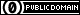

[{{SUMO}}/data/typemap/osmNetconvertUrbanDe.typ.xml]({{Source}}data/typemap/osmNetconvertUrbanDe.typ.xml)

SUMO edge type file for importing OpenStreetMap files. It contains the
edge type configuration for roads inside of towns and located in
Germany. If you want to import such an OpenStreetMap file, you can use
this file as is. In some rare cases, you might want to consider modified
values for some edge types though. See [SUMO edge type
file](SUMO_edge_type_file.md) for an explanation of the file's
content.

<table>
<tbody>
<tr class="odd">
<td>
Author
</td>
<td>
<a href="http://sourceforge.net/users/w-bamberger">W. Bamberger</a>
</td>
</tr>
<tr class="even">
<td>
Source
</td>
<td>
Own work (see also <a href="SUMO_edge_type_file.html" title="wikilink">SUMO edge type file</a>)
</td>
</tr>
<tr class="odd">
<td>
History
</td>
<td>
This file is located in the SUMO repository. See the log there.
</td>
</tr>
<tr class="even">
<td>
License
</td>
<td>

 This work is licensed under a <a href="http://creativecommons.org/publicdomain/zero/1.0/">Creative Commons CC0 1.0 Universal license</a>. To the extent possible under law, the person who associated CC0 with this work has waived all copyright and related or neighboring rights to this work.

</td>
</tr>
</tbody>
</table>