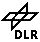

## About

"**S**imulation of **U**rban **MO**bility", or "SUMO" for short, is an
open source, microscopic, multi-modal traffic simulation. It allows to
simulate how a given traffic demand which consists of single vehicles
moves through a given road network. The simulation allows to address a
large set of traffic management topics. It is purely microscopic: each
vehicle is modelled explicitly, has an own route, and moves individually
through the network. Simulations are deterministic by default but there
are various options for [introducing
randomness](Simulation/Randomness.md).

If you download the SUMO package, you will note that it contains further
applications besides SUMO. These applications are used to import/prepare
road networks and demand data for being used in SUMO, see [\#Included
Applications](#included_applications) for a more verbose
list.

## Features

- Includes all applications needed to prepare and perform a traffic
simulation (network and routes import, DUA, simulation)
- Simulation
  - Space-continuous and time-discrete vehicle movement
  - Different vehicle types
  - Multi-lane streets with lane changing
  - Different right-of-way rules, traffic lights
  - A fast openGL graphical user interface
  - Manages networks with several 10.000 edges (streets)
  - Fast execution speed (up to 100.000 vehicle updates/s on a 1GHz
    machine)
  - Interoperability with other application at run-time
  - Network-wide, edge-based, vehicle-based, and detector-based
    outputs
  - Supports person-based inter-modal trips
- Network Import
  - Imports VISUM, Vissim, Shapefiles, OSM, RoboCup, MATsim,
    OpenDRIVE, and XML-Descriptions
  - Missing values are determined via heuristics
- Routing
  - Microscopic routes - each vehicle has an own one
  - Different Dynamic User Assignment algorithms
- High portability
  - Only standard C++ and portable libraries are used
  - Packages for Windows main Linux distributions exist
- High interoperability through usage of XML-data only
- Open source ([EPL](https://eclipse.org/legal/epl-v20.html))

## Usage Examples

Since 2001, the SUMO package has been used in the context of several
national and international research
[projects](Other/Projects.md). The applications included:

- traffic lights evaluation
- route choice and re-routing
- evaluation of traffic surveillance methods
- [simulation of vehicular communications](Topics/V2X.md)
- traffic forecast

## Included Applications

The package includes:

| Application Name                                    | Short Description                                         |
| --------------------------------------------------- | --------------------------------------------------------- |
| [sumo](sumo.md)                             | The microscopic simulation with no visualization; command line application                                         |
| [sumo-gui](sumo-gui.md)                     | The microscopic simulation with a graphical user interface                                                        |
| [netconvert](netconvert.md)                 | Network importer and generator; reads road networks from different formats and converts them into the SUMO-format   |
| [netedit](netedit.md)                       | A graphical network editor.                                                                                  |
| [netgenerate](netgenerate.md)               | Generates abstract networks for the SUMO-simulation                    |
| [duarouter](duarouter.md)                   | Computes the fastest routes through the network, importing different types of demand description. Performs the DUA      |
| [jtrrouter](jtrrouter.md)                   | Computes routes using junction turning percentages                                                               |
| [dfrouter](dfrouter.md)                     | Computes routes from induction loop measurements                                                     |
| [marouter](marouter.md)                     | Performs macroscopic assignment                                                            |
| [od2trips](od2trips.md)                     | Decomposes O/D-matrices into single vehicle trips                                       |
| [polyconvert](polyconvert.md)               | Imports points of interest and polygons from different formats and translates them into a description that may be visualized by [sumo-gui](sumo-gui.md) |
| [activitygen](activitygen.md)               | Generates a demand based on mobility wishes of a modeled population                                |
| [emissionsMap](Tools/Emissions.md#emissionsmap)          | Generates an emission map                                                                   |
| [emissionsDrivingCycle](Tools/Emissions.md#emissionsdrivingcycle) | Calculates emission values based on a given driving cycle                           |
| [Additional Tools](Tools.md)           | There are some tasks for which writing a large application is not necessary. Several solutions for different problems may be covered by these tools.            |

Several parties have extended the SUMO package during their work and
submitted their code. These contributions are usually not tested and may be outdated. Find a list of all Contributions [here](Contributed.md).

## History

The development of SUMO started in the year 2000. The major reason for
the development of an open source, microscopic road traffic simulation
was to support the traffic research community with a tool with the
ability to implement and evaluate own algorithms. The tool has no need
for regarding all the needed things for obtaining a complete traffic
simulation such as implementing and/or setting up methods for dealing
with road networks, demand, and traffic controls. By supplying such a
tool, the DLR wanted to i) make the implemented algorithms more
comparable by using a common architecture and model base, and ii) gain
additional help from other contributors.

## Software design criteria

Two major design goals are approached: the software shall be fast and it
shall be portable. Due to this, the very first versions were developed
to be run from the command line only - no graphical interface was
supplied at first and all parameter had to be inserted by hand. This
should increase the execution speed by leaving off slow visualisation.
Also, due to these goals, the software was split into several parts.
Each of them has a certain purpose and must be run individually. This is
something that makes SUMO different to other simulation packages where,
for instance, the dynamical user assignment is made within the
simulation itself, not via an external application like here. This split
allows an easier extension of each of the applications within the
package because each is smaller than a monolithic application that does
everything. Also, it allows the usage of faster data structures, each
adjusted to the current purpose, instead of using complicated and
ballast-loaded ones. Still, this makes the usage of SUMO a little bit
uncomfortable in comparison to other simulation packages. As there are
still other things to do, we are not thinking of a redesign towards an
integrated approach by now.

## Contributors and Participants

<table>
<thead>
<tr class="header">
<th>
Org.
</th>
<th>
Name
</th>
<th>
Topics / Contribution
</th>
</tr>
</thead>
<tbody>
<tr class="odd">
<td><figure>

</figure></td>
<td>
Christian Rössel
</td>
<td>
Initial microsimulation core; initial detectors implementation
</td>
</tr>
<tr class="even">
<td rowspan="11"><figure>

</figure></td>
<td>
Peter Wagner
</td>
<td>
Models, organisation, spiritual lead
</td>
</tr>
<tr class="odd">
<td>
Daniel Krajzewicz
</td>
<td>
Everything
</td>
<td></td>
</tr>
<tr class="even">
<td>
Julia Ringel
</td>
<td>
Traffic Light &amp; WAUT Algorithms
</td>
<td></td>
</tr>
<tr class="odd">
<td>
Eric Nicolay
</td>
<td>
Everything
</td>
<td></td>
</tr>
<tr class="even">
<td>
Michael Behrisch
</td>
<td>
Everything
</td>
<td></td>
</tr>
<tr class="odd">
<td>
Yun-Pang Wang
</td>
<td>
User Assignment
</td>
<td></td>
</tr>
<tr class="even">
<td>
Danilot Teta Boyom
</td>
<td>
Vehicular Communication Model (removed from the source)
</td>
<td></td>
</tr>
<tr class="odd">
<td>
Sascha Krieg
</td>
<td></td>
<td></td>
</tr>
<tr class="even">
<td>
Lena Kalleske
</td>
<td></td>
<td></td>
</tr>
<tr class="odd">
<td>
Laura Bieker
</td>
<td>
Tests, Python scripts
</td>
<td></td>
</tr>
<tr class="even">
<td>
Jakob Erdmann
</td>
<td>
network import, <a href="netedit.html" title="wikilink">netedit</a>
</td>
<td></td>
</tr>
<tr class="odd">
<td></td>
<td>
Andreas Gaubatz
</td>
<td></td>
</tr>
<tr class="even">
<td></td>
<td>
Maik Drozdzynski
</td>
<td></td>
</tr>
<tr class="odd">
<td rowspan="3">
Uni Lübeck
</td>
<td>
Axel Wegener
</td>
<td>
TraCI initiator
</td>
</tr>
<tr class="even">
<td>
Thimor Bohn
</td>
<td>
TraCI
</td>
<td></td>
</tr>
<tr class="odd">
<td>
Friedemann Wesner
</td>
<td>
TraCI
</td>
<td></td>
</tr>
<tr class="even">
<td></td>
<td>
Felix Brack
</td>
<td></td>
</tr>
<tr class="odd">
<td></td>
<td>
Tino Morenz
</td>
<td></td>
</tr>
<tr class="even">
<td rowspan="4">
 
 
 
 
 
 

</td>
<td>
Christoph Sommer
</td>
<td>
TraCI merge with <a href="http://veins.car2x.org/">Veins</a>, Subscription Interface, Misc.
</td>
</tr>
<tr class="odd">
<td>
David Eckhoff
</td>
<td>
TraCI, deterministic simulation behavior
</td>
<td></td>
</tr>
<tr class="even">
<td>
Falko Dressler
</td>
<td>
TraCI
</td>
<td></td>
</tr>
<tr class="odd">
<td>
Tobias Mayer
</td>
<td>
Traffic model abstraction, IDM model port
</td>
<td></td>
</tr>
<tr class="even">
<td>
HU Berlin
</td>
<td>
Matthias Heppner
</td>
<td>
Unittests
</td>
</tr>
<tr class="odd">
<td rowspan="3"><figure>

</figure></td>
<td>
Piotr Woznica
</td>
<td>
<a href="activitygen.html" title="wikilink">activitygen</a>
</td>
</tr>
<tr class="even">
<td>
Walter Bamberger
</td>
<td>
Development of <a href="activitygen.html" title="wikilink">activitygen</a> as a base for the evaluation of trust scenarios in VANETs. The work is part of the project <a href="http://www.ldv.ei.tum.de/fidens/">Fidens: Trust between Cooperative Systems</a> featuring trusted probabilistic knowledge processing in vehicular networks.
</td>
<td></td>
</tr>
<tr class="odd">
<td>
Matthew Fullerton
</td>
<td></td>
<td></td>
</tr>
<tr class="even">
<td>
IIT Bombay, India
</td>
<td>
Ashutosh Bajpai
</td>
<td>
randomDepart.py, a python script to generate the real traffic pattern by exponential Distribution.
</td>
</tr>
<tr class="odd">
<td><figure>

</figure></td>
<td>
Enrico Gueli
</td>
<td>
<a href="http://sourceforge.net/projects/traci4j/">TraCI4J</a>
</td>
</tr>
<tr class="even">
<td></td>
<td>
Leontios Papaleontiou
</td>
<td>
<a href="Contributed/SUMO_Traffic_Modeler.html" title="wikilink">Contributed/SUMO Traffic Modeler</a>
</td>
</tr>
<tr class="odd">
<td><figure>

</figure></td>
<td>
Karol Stosiek
</td>
<td>
Documentation, network building
</td>
</tr>
</tbody>
</table>