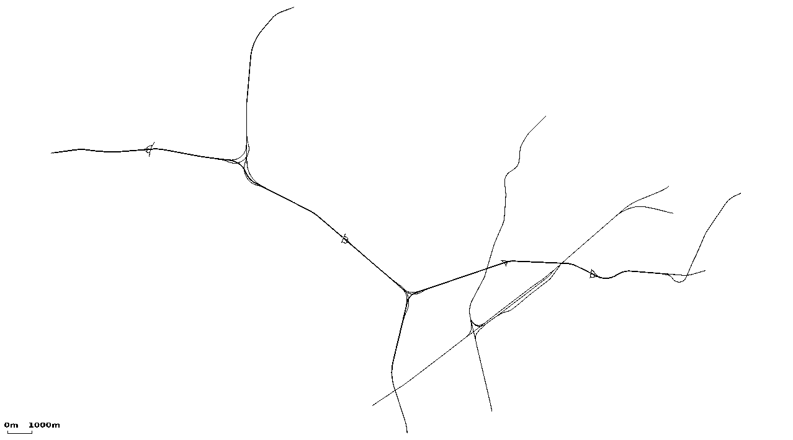
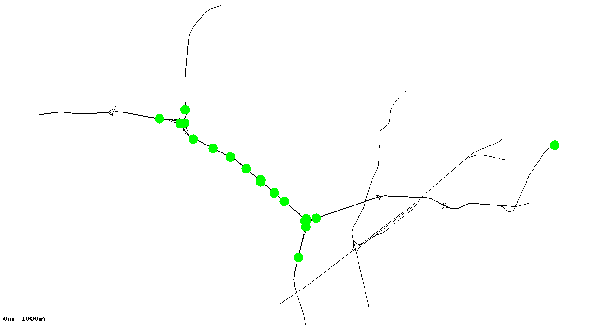
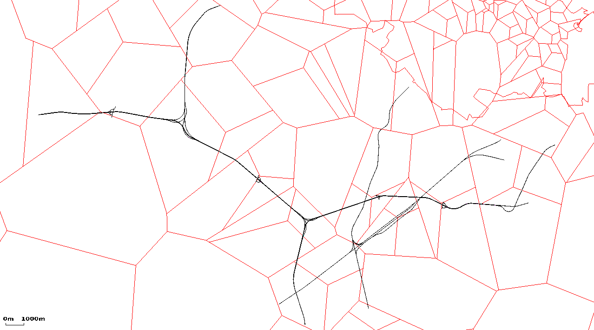
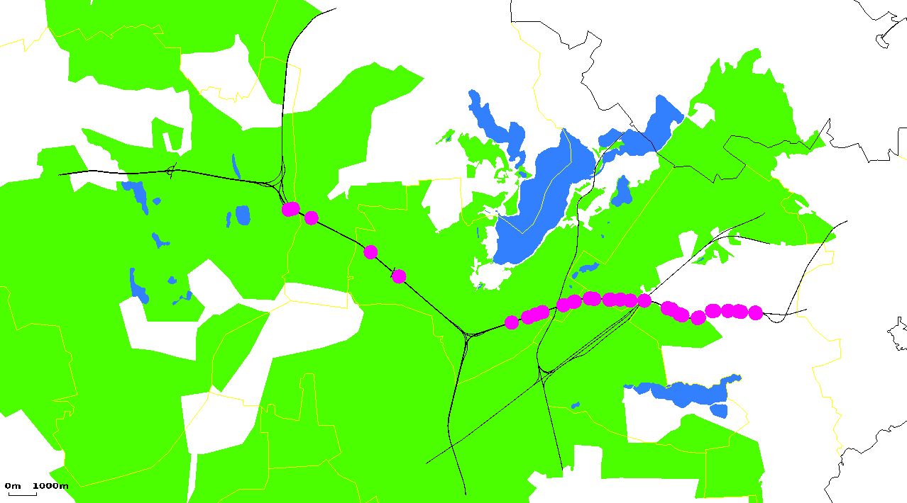
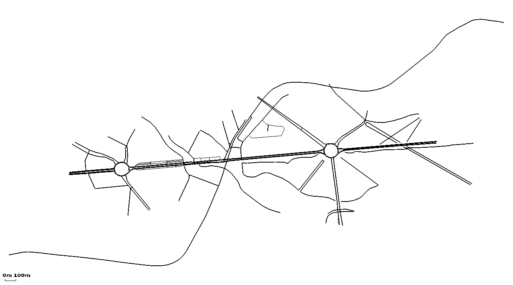
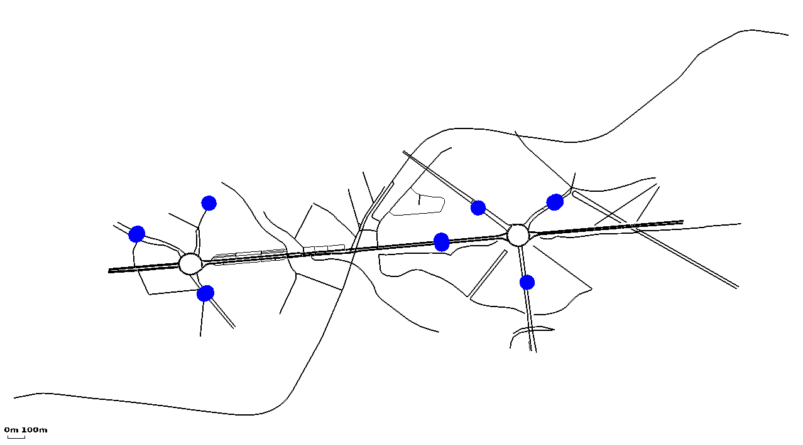
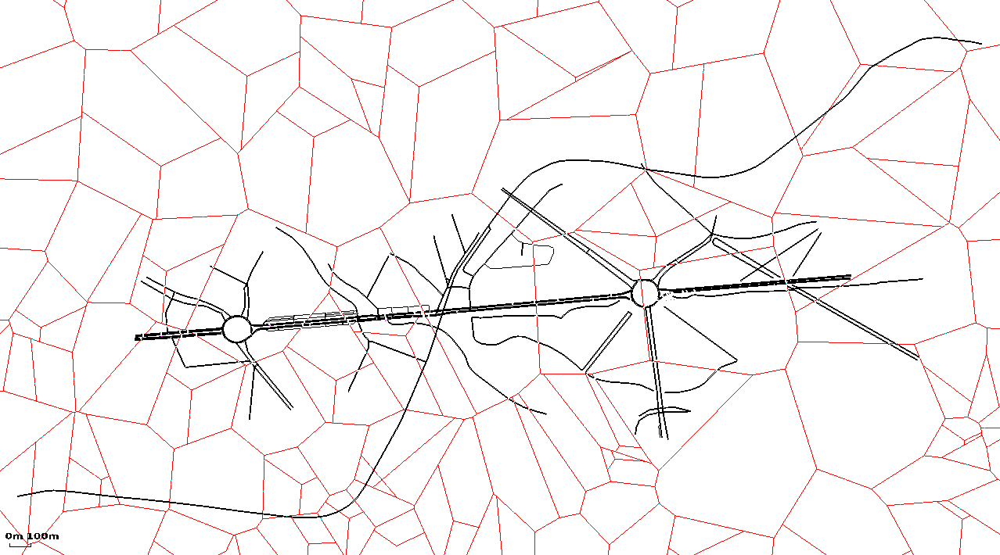
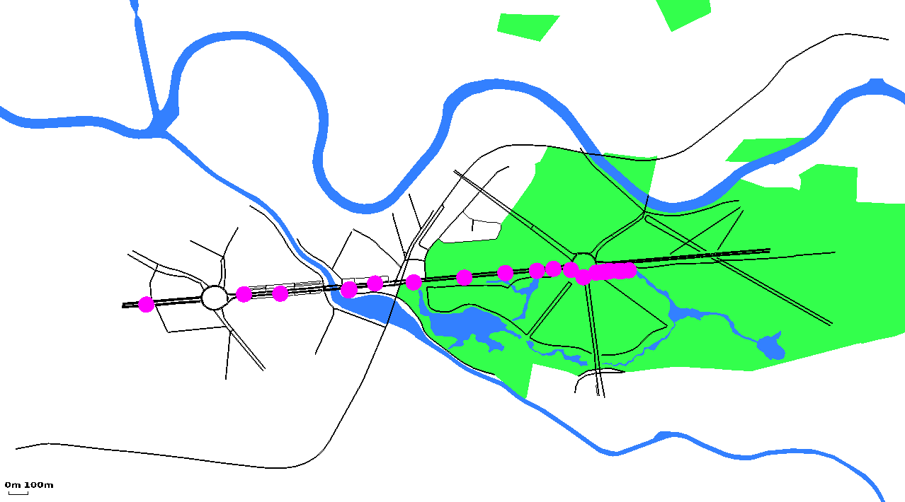

# Using points of interest and polygons

## Examples for using polygons and POIs from Traffic Online

### Area\#1

Plain road network

With induction loop positions shown as POIs

With the GSM network

With environment and TOL-points shown as POIs

### Area\#3

Plain road network

With induction loop positions shown as POIs

With the GSM network

With environment and TOL-points shown as POIs