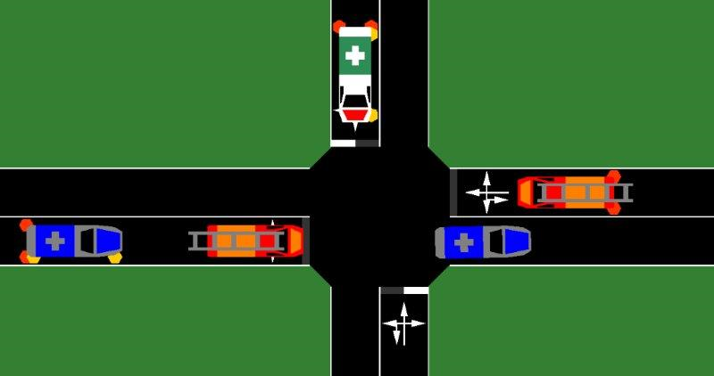

# Emergency Vehicle simulation

The simulation of emergency vehicles and their special rights is
partially possible with SUMO. Additional capabilities are planned for
the future.

- [Blue light device](../sumo.md#bluelight_device): A blue light device indicates that the emergency
  vehicle is driving with special rights (using blue flashing light
  and sirene). Emergency vehicles can ignore red traffic lights.
  Other traffic participants are forced to form a virtual middle lane
  (rescue lane) to let the emergency vehicle pass if the vehicle has a
  blue light device. To use this the feature, the [sublane model](../Simulation/SublaneModel.md) must be active
  -  All vehicles in front of the emergency vehicle in a distance of 25 meters (configurable with **--device.bluelight.reactiondist**) are moving towards the side of their current lane.
  - Vehicles on the leftmost lane move towards the left side (latAlignment="left")
  - Vehicles on all other lanes move towards the right side (latAlignment="right")
  - Vehicles do not currently change their speed in response to the bluelight device
  - After the emergency vehicle has passed the vehicles resume normal driving (with their previous  lateral Alignment).  
- Disregarding right-of-way and traffic lights: 
  - supported by using the [TraCI 'speed mode'
  command](../TraCI/Change_Vehicle_State.md#speed_mode_0xb3) to disable intersection related safety checks.
  - supported by [junction model parameters](Safety.md#junction_model)
- Exceeding the speed limit: This is supported by setting the
  vType-attribute [*speedFactor*](../Definition_of_Vehicles,_Vehicle_Types,_and_Routes.md#vehicle_types)
  (a value of 1.5 allows driving with 150% of the road speed limit).
- Overtaking on the right: This is always permitted for vehicles with `vClass="emergency"`
- [Overtaking on the opposite side](OppositeDirectionDriving.md) on a multi-lane road is the exclusive privilege of vehicles with `vClass="emergency"`

# Visualization

The visualization of emergency vehicles is supported in
[sumo-gui](../sumo-gui.md). When setting the vType-attribute `guiShape="emergency"` a
white vehicle with the international sign for first aid is drawn.
Furthermore a police car will be drawn with vType-attribute `guiShape="police"` and a
firebrigade with vType-attribute `guiShape="firebrigade"`. When additionally setting the
vType-attribute `vClass="emergency"` a blue flashing light will be drawn also.

# References

Bieker, Laura (2015) Traffic safety evaluations for Emergency Vehicles.
Young Researchers Seminar, 17.-19. Juni 2015, Rom, Italien.

Bieker, Laura (2011) Emergency Vehicle Prioritization using
Vehicle-To-Vehicle Communication. Young Researchers Seminar, 8.-10. Jun.
2011, Kopenhagen, Dänemark.
