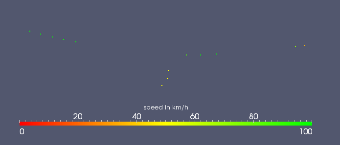

This output option offers you the possibility to visualise/analyse your
simulation data using the famous VTK file format. There are several
Tools and Frameworks to get started with VTK e.g.
[ParaView](http://paraview.org/).

The generated output file is very basic, so each vehicle is presented by
only one point. In the VTK file the vehicles were stored in
3-dimensional coordinate system, until now the Z-coordinate is always
set to zero.

## Instantiating within the Simulation

The simulation is forced to generate this output using the option **--vtk-output** {{DT_FILE}}. {{DT_FILE}} is
the name of the folder where all the VTK files will be written to. It's
very important that the destination folder exists. For every timestep a
new VTK file will be written. The generated VTK files will be detected
as a timeseries in ParaView and can be imported very easily.

## Generated Output

The generated VTK files also contains the speed for each vehicle which
can be rendered for every timestep.

To get a more realistic output it's possible to load a 3D model of each
vehicle instead of the basic point. In order to do that you have to
define different models. Another interesting fact is that you have the
opportunity to build videos or create streamlines of your simulation.