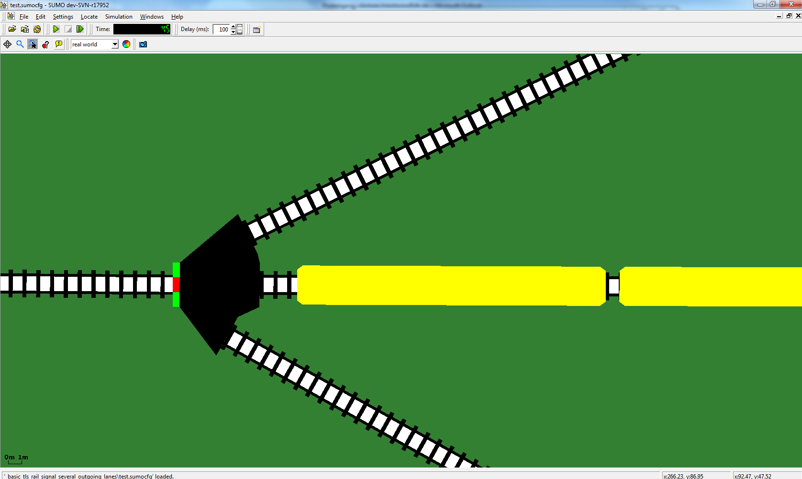
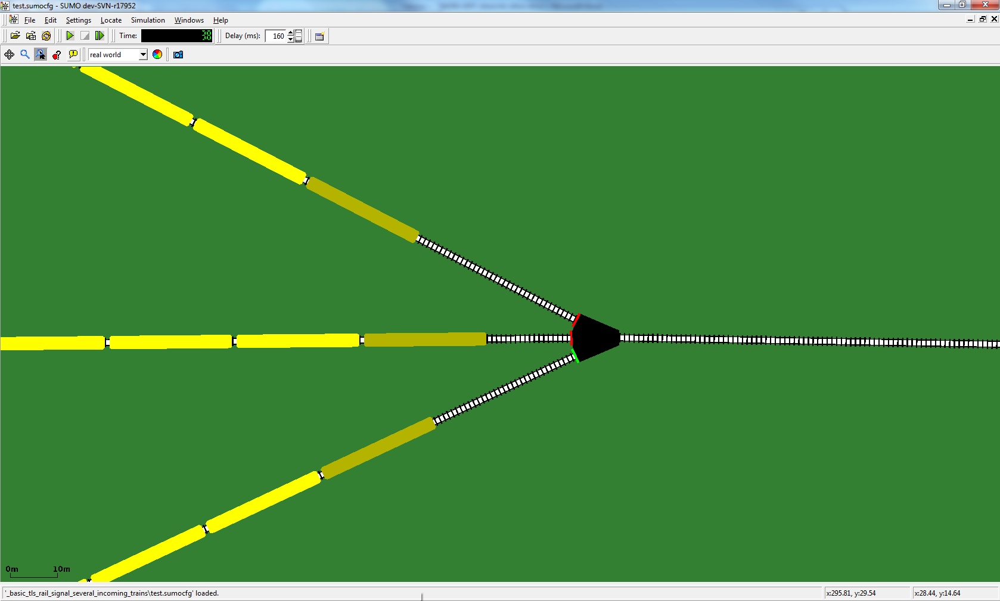

Rail signals are
[node](../Networks/PlainXML.md#node_descriptions)
types for controllig rail traffic.

# Loading a rail signal

One simply has to define a node to have the
`type` *rail_signal*, as in the following
example:

```
<nodes> <!-- The opening tag -->

    <node id="1" x="-500.0" y="0.0" type="rail_signal"/>
    <node id="2" x="+500.0" y="0.0" type="rail_signal"/>

</nodes> <!-- The closing tag -->
```

# Usage

If one uses a rail network (here, we mean a network consisting
exclusively of [edges that allow
only](../Networks/PlainXML.md#edge_descriptions)
trains) within its simulation, it is not required to use rail signals.
Instead one could choose all junctions withing this network to be of the
type *priority*, which results, however, in an unrealistic behavior of
the rail traffic. To achieve a more realistic behavior, one can make
use of rail signals. For that, one can split a longer rail section
without any junctions in between into so called *blocks*, by choosing
nodes within this section to have rail signals. Then, a *block* is the
set of edges between two rail signals. The rail signal will then
indicate green (we use green and red as for traffic lights) if there is
no train in the block after the rail signal. A train will move from one
block to the next one, and each time it wants to enter a block, the rail
signal will state if this block is free and the train is allowed to
enter, or if the block is occupied and the train has to wait until the
block is empty.

If one uses one rail signal within its simulation, it is required to use
rail signals for every junction/railroad switch with more than two
tracks for which there exists a path from an existing rail signal.
Otherwise, a warning will be issued. This is required as a rail signal
depends on its adjacent rail signals (or rather the blocks between the
adjacent rail signals and itself). For rail sections without
junctions/railroad switches, one can split them into as many blocks as
one desires, but a block length of a few hundred metres can be
reasonable size. Too large block lengths can result in long waiting times
for trains waiting to enter a block. Too short block lengths can result
in trains following each other very closely.

# Behavior

Rail signals are essentially traffic lights, however their state does
not depend on TLS-programs. Instead, the state of a rail signal depends
on the occupation of certain blocks. At every simulation step, the state
of a rail signal will be updated based on the occupation.

The logic of the rail signals shall guarantee the following points:

- Each block of a rail network is occupied by at most one train.
- If several trains approach the same junction/railroad switch from
  different lanes/edges and want to enter the same lane, at most one
  of these trains gets a green signal and all other trains get a red
  signal, even before one of these trains has entered the targeted
  lane. This will avoid that trains approach a rail signal with high
  velocity and receive suddenly a red signal without having enough
  space to break before the rail signal.

A rail signal indicates green or red for each
[connection](../Networks/PlainXML.md#connection_descriptions)
of the node individually. A connection *c* consists of one incoming lane
*i* and one outgoing lane *o*. The signal for *c* depends on the
occupation of:

- The outgoing block. That is the block leading from the current rail
  signal over *o* to the next rail signal.
- All blocks leading to *o*. A block leading to *o* is a block that is
  leading to the current rail signal for whose last lane there exists
  a connection to *o*. Clearly, the block to which *i* belongs is one
  of the blocks leading to *o*. We denote the set of the blocks
  leading to *o* by *O*.

If there is only one block leading to *o*, namely the one *i* belongs
to, the signal of *c* is green if and only if the outgoing block of *c*
is not occupied by a train. If there is more than one block leading to
*o*, i.e. *|O|\>1*, we consider all connections to *o*. These
connections correspond exactly to the blocks in *O*, and we denote the
set of these connections by *C*. Moreover, we denote the set of
connections in *C*, whose corresponding approaching blocks are occupied,
by *D*. If the outgoing block of *c* is occupied by a train, then the
signals for all connections in *C* are red. If the outgoing block of *c*
is not occupied by a train and all blocks leading to *o* are not
occupied, i.e. *|D|=0*, then the signals for all connections in *C* are
green. If the outgoing block of *c* is not occupied by a train, and at
least one block leading to *o* is occupied by a train, i.e. *|D|\>0*,
then exactly one connection in *D* has a green signal and all other
connections in *C* have a red signal.



Fig. 1: A rail signal for a railroad switch with one incoming lane from
the left and three outgoing lanes to the right. The signal for the
occupied outgoing block is red, all other signals green.



Fig. 2: A rail signal for a railroad switch with three incoming lanes
from the left and one outgoing lane to the right. As all approaching
blocks are occupied, only one signals is green.

# Output

For logging the states of a rail signal, the same method as for [logging
TLS states of traffic
lights](../Simulation/Output/Traffic_Lights.md#tls_states) can be
used. The attribute `source` has to be the ID
of the junction the rail signal belongs to.