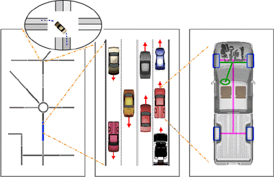
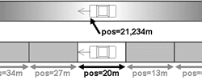

## Traffic Simulation Classes

In traffic research, four classes of traffic flow models are
distinguished according to the level of detail of the simulation. In
*macroscopic* models traffic flow is the basic entity. *Microscopic*
models simulate the movement of every single vehicle on the street,
mostly assuming that the behavior of the vehicle depends on both, the
vehicle's physical abilities to move and the driver's controlling
behavior (see
[ChowdhurySantenSchadschneider2000](../Publications.md#chowdhurysantenschadschneider2000)).
Within SUMO, the microscopic model developed by Stefan Krauß is used
(see [Krauss1998_1](../Publications.md#krauss1998_1),
[Krauss1998_2](../Publications.md#krauss1998_2)), extended by some
further assumptions. *Mesoscopic* simulations are located at the
boundary between microscopic and macroscopic simulations. Herein,
vehicle movement is mostly simulated using queue approaches and single
vehicles are moved between such queues. *Sub-microscopic* models regard
single vehicles like microscopic, but extend them by dividing them into
further substructures, which describe the engine's rotation speed in
relation to the vehicle's speed or the driver's preferred gear switching
actions, for instance. This allows more detailed computations compared
to simple microscopic simulations. However, sub-microscopic models
require longer computation times. This restrains the size of the
networks to be simulated.

**Figure: The different simulation granularities; from left to right:
macroscopic, microscopic, sub-microscopic (within the circle:
mesoscopic)**

Within a *space-continuous* simulation each vehicle has a certain
position described by a floating-point number. In contrast,
*space-discrete* simulations are cellular automata. They divide streets
into cells and vehicles driving on the simulated streets "jump" from one
cell to another.

**Figure: The difference between a space-continuous (top) and a
space-discrete (bottom) simulation**

Almost every simulation package uses its own model for vehicle movement.
Almost all models are so-called *"car-following-models"*: the behavior
of the driver is herein meant to be dependent on his distance to the
vehicle in front of him and of this leading vehicle's speed.

## User Assignment

It seems obvious, that each driver is trying to use to shortest path
through the network. But when all are trying to do this, some of the
roads - mainly the arterial roads - would get congested reducing the
benefit of using them. Solutions for this problem are known to traffic
research as *user assignment*. For solving this, several approaches are
available and SUMO uses the *dynamic user assignment* (DUA) approach
developed by Christian Gawron (see
[Gawron1998_1](../Publications.md#gawron1998_1)).