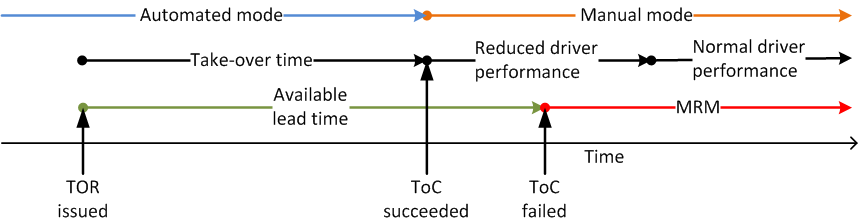

## Overview

The ToC Device provides facilities to model a take-over of control (ToC)
in automated vehicles.

To this end the user has to specify at least the two [vehicle
types](Definition_of_Vehicles,_Vehicle_Types,_and_Routes.md#vehicle_types),
which should be used as models of automated and manual driving. All
supported parameters are described below.

The transition of control can take place in two directions:

- driver-\>automation ("upward transition")
- automation-\>driver ("downward transition")

Presumably, the more complex process is the downward transition, where
the human driver is supposed to take back control from the vehicle
automation, as the driver's condition right after the take-over event may
allow only a reduced driving performance. The ToC Device divides the
downward transition into two states:

- The 'preparing' state, where a take-over request (TOR) has been
  issued, but the driver has not taken back the control of the
  vehicle.
- The 'recovering' state, just after the ToC, where the driver shows
  decreased driving performance (see below for details).

Further, the device induces a minimum risk maneuver (MRM) if the driver
does not take back the vehicle control within a specified lead time (see
figure).



*Figure 1: Timeline of a ToC as modelled by the ToC Device*

## Configuration

To equip vehicles with the ToC functionality, the generic equipment
functionality of devices can be employed, see [the description of
equipment
procedures](Definition_of_Vehicles,_Vehicle_Types,_and_Routes.md#devices)
(and use `<device name>=toc`). The minimal definition required to equip
one vehicle with a ToC Device has the following form:

```
<routes>
    ...
    <vehicle id="v0" route="route0" depart="0">
        <param key="has.toc.device" value="true"/>
        <param key="device.toc.automatedType" value=<AUTOMATED_VTYPE_ID> />
        <param key="device.toc.manualType" value=<MANUAL_VTYPE_ID> />
    </vehicle>
    ....
</routes>
```

The following table gives the full list of possible parameters for the
ToC Device. Each of these parameters must be specified as a child
element of the form `<param key=<PARAMETER NAME> value=<PARAMETER VALUE>` of the appropriate demand definition element
(e.g. `<vehicle ... />`, `<vType ... />`, or `<flow ... />`)

| Parameter             | Type             | Default          | Description                                                                                                                                                                                                                                                    |
| --------------------- | ---------------- | ---------------- | -------------------------------------------------------------------------------------------------------------------------------------------------------------------------------------------------------------------------------------------------------------- |
| manualType            | vTypeID (string) | none (mandatory) | ID of the vehicle type used to model manual driving.                                                                                                                                                                                                           |
| automatedType         | vTypeID (string) | none (mandatory) | ID of the vehicle type used to model automated driving.                                                                                                                                                                                                        |
| responseTime          | float            | 5.0              | The time (in \[s\]) it takes the driver after the TOR ([see TORs below](#take-over_requests)) to take back the control over the vehicle.                                                                                                            |
| initialAwareness      | float            | 0.5              | The awareness assigned to the driver after a the ToC. The value must lie within \[0.0, 1.0\], where 1.0 corresponds to normal driving performance and lower values lead to increased perception errors ([see below](#reduced_driving_performance)). |
| lcAbstinence          | float            | 0.0              | The awareness level below which no lanechanges are performed by the driver. The value must lie within \[0.0, 1.0\]. Per default this is disabled, setting its value to 1.0 prevents deliberate lane changes for the whole recovery phase.                      |
| recoveryRate          | float            | 0.1              | The rate (in \[1/s\]) at which the driver's performance recovers after the ToC.                                                                                                                                                                                |
| mrmDecel              | float            | 1.5              | The braking rate (in \[m/s²\]) at which the vehicle brakes if the driver does not take back control within a specified time ([see TORs below](#take-over_requests)).                                                                                |
| dynamicToCThreshold   | float            | 0.0              | Time, which the vehicle requires to have ahead to continue in automated mode. The default value of 0.0 indicates no dynamic triggering of ToCs.                                                                                                                |
| dynamicMRMProbability | float            | 0.05             | Probability that a dynamically triggered TOR is not answered in time.                                                                                                                                                                                          |
| mrmKeepRight          | bool             | false            | If true, the vehicle tries to change to the right during an MRM.                                                                                                                                                                                               |
| mrmSafeSpot           | string           | ""               | If set, the vehicle tries to reach the given named stopping place during an MRM.                                                                                                                                                                                               |
| mrmSafeSpotDuration   | float            | 60.0             | Duration the vehicle stays at the safe spot after an MRM.                                                                                                                                                                                               |
| maxPreparationAccel   | float            | 0.0              | Maximal acceleration that may be applied during the ToC preparation phase.                                                                                                                                                                                     |
| ogNewSpaceHeadway     | float            | 0.0              | The target additional space headway during the preparatory phase before a ToC (see [openGap()](TraCI/Change_Vehicle_State.md#open_gap_0x16)).                                                                                                    |
| ogNewTimeHeadway      | float            | original value   | The target time headway during the preparatory phase before a ToC (see [openGap()](TraCI/Change_Vehicle_State.md#open_gap_0x16)).                                                                                                                |
| ogChangeRate          | float            | 1.0              | The change rate of headway adaption during the preparatory phase before a ToC (see [openGap()](TraCI/Change_Vehicle_State.md#open_gap_0x16)).                                                                                                    |
| ogMaxDecel            | float            | 1.0              | The maximal deceleration rate due to headway adaption during the preparatory phase before a ToC (see [openGap()](TraCI/Change_Vehicle_State.md#open_gap_0x16)).                                                                                  |
| useColorScheme        | bool             | True             | Whether the equipped vehicles shall be colored according to their current ToC State. The colors for the transitional states (*preparing ToC, recovering from ToC,* and *executing MRM*) are hard-coded, currently.                                             |
| file                  | string           | ""               | Specifying a filename here switches on the output for the device, which reports events of the take over process (ToCup, ToCdown, TOR, MRM).                                                                                                                    |

If none of the `og...` elements is given, no headway adaptation will be
performed during the ToC preparation phase.

## Take-over requests

To induce a switch between the manual and automated vehicle types, the
user has to issue a take-over request (TOR) via
[TraCI](TraCI.md). The corresponding command is (here exemplary
for the python client)

```
traci.vehicle.setParameter(<VEHICLE_ID>, "device.toc.requestToC", <AVAILABLE_LEAD_TIME>)
```

If the current driving mode is automated, this will induce a switch to
the manual vehicle type after the specified (or default) `responseTime`,
or, if `responseTime > availableLeadTime`, an MRM is initiated (and
interrupted after `responseTime`). During the MRM, the vehicle brakes at
the specified (or default) constant rate `mrmDecel`. After
`responseTime` has elapsed, the vehicle type is switched and the
awareness parameter of the vehicle's [driver
state](Driver_State.md) is set to the `initialAwareness`.
Hereafter, the awareness grows linearly with rate `recoveryRate` until it
reaches its maximum value (=1.0) after
`(1.0-initialAwareness)/recoveryRate` seconds.

If the current driving mode is manual, a TOR will induce an immediate
switch to the automated vehicle type and any given value for the
`availableLeadTime` is ignored (a warning will be issued if positive
values are given).

### Dynamic TORs

A TOR can be issued without external command if the parameter
`dynamicToCThreshold` is supplied with a positive value. It induces a
TOR if the vehicle cannot continue on its current route for longer than
the given value (in seconds) due to impeded lane changes. The
corresponding TOR is currently issued with a lead time of 3/4 of the
given dynamic-ToC threshold.

## Reduced Driving Performance

During the recovering phase following a ToC, the driver of the automated
vehicle is assumed to drive with a decreased performance. This is
modeled by temporarily elevated magnitudes of the driver's perception
errors, i.e., a decreased driver awareness (see [Driver
State](Driver_State.md)).