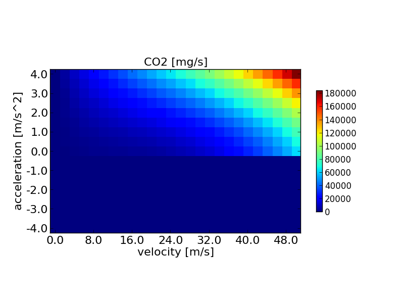

SUMO includes some small-sized tools and tests that help to develop and
evaluate the implemented [emission
models](../Topics/Environmental_Issues.md#models). These tools are
presented in the following.

# emissionsMap

This tool generates matrices of emissions for a given range of
velocities, accelerations, and slopes, given the vehicle's emission
class mainly.



The tool obtains parameter that describe the ranges and the emission classes to generate. If the option **--iterate** {{DT_BOOL}} is set, emissionsMap iterates over all available emission classes. In this case, the option **--output-file** {{DT_PATH}} should denote a folder the emission maps shall be written into. If **--iterate** {{DT_BOOL}} is not set, **--output-file** {{DT_FILE}} should name the file to generate and the emission class to write the map for must be defined using the option **--emission-class** {{DT_STR}}. If PHEMlight shall be used, one has to define the path to the CEP-files using the option **--phemlight-path** {{DT_PATH}}.

The tool is located in {{SUMO}}/bin.

The image shows the visualisation of CO2 emission of the [HBEFA v2.1-based](../Models/Emissions/HBEFA-based.md) "P_7_6" emission class. 


## Options

### Processing

| Option                                   | Description                                                                                |
|------------------------------------------|--------------------------------------------------------------------------------------------|
| **-i** {{DT_BOOL}}<br>**--iterate** {{DT_BOOL}}            | If set, maps for all available emissions are written                                       |
| **-e** {{DT_STR}}<br>**--emission-class** {{DT_STR}} | Defines the name of the emission class to generate the map for                             |
| **--v-min** {{DT_FLOAT}}                          | Defines the minimum velocity boundary of the map to generate (in [m/s]); *default: **0***        |
| **--v-max** {{DT_FLOAT}}                          | Defines the maximum velocity boundary of the map to generate (in [m/s]); *default: **50***       |
| **--v-step** {{DT_FLOAT}}                         | Defines the velocity step size (in [m/s]); *default: **2***                                      |
| **--a-min** {{DT_FLOAT}}                          | Defines the minimum acceleration boundary of the map to generate (in [m/s^2]); *default: **-4*** |
| **--a-max** {{DT_FLOAT}}                          | Defines the maximum acceleration boundary of the map to generate (in [m/s^2]); *default: **4***  |
| **--a-step** {{DT_FLOAT}}                         | Defines the acceleration step size (in [m/s^2]); *default: **.5***                               |
| **--s-min** {{DT_FLOAT}}                          | Defines the minimum slope boundary of the map to generate (in [°]); *default: **-10***           |
| **--s-max** {{DT_FLOAT}}                          | Defines the maximum slope boundary of the map to generate (in [°]); *default: **10***            |
| **--s-step** {{DT_FLOAT}}                         | Defines the slope step size (in [°]); *default: **1***                                           |

### Output

| Option                            | Description                                                                  |
|-----------------------------------|------------------------------------------------------------------------------|
| **-o** {{DT_FILE}}<br>**--output-file** {{DT_FILE}} | Defines the file (or the path if **--iterate** was set) to write the map(s) into |

The format of the output is a CSV-like with **;** as the column
separator:

```
<speed>;<acceleration>;<slope>;<Pollutant-Type>;<Polutant-Value-in-mg/s-or-ml/s>
```

### Emissions

| Option                               | Description                                          |
|--------------------------------------|------------------------------------------------------|
| **-p** {{DT_PATH}}<br>**--phemlight-path** {{DT_PATH}} | Determines where to load [PHEMlight](../Models/Emissions/PHEMlight.md) definitions from. |

### Report

| Option                        | Description                                |
|-------------------------------|--------------------------------------------|
| **-v** {{DT_BOOL}}<br>**--verbose** {{DT_BOOL}} | Switches to verbose output; *default: **false*** |
| **-?** {{DT_BOOL}}<br>**--help** {{DT_BOOL}}    | Prints the help screen                     |

# emissionsDrivingCycle

This tools computes emissions given a timeline of speeds/accelerations
for a single vehicle. The driving cycle definition must be given using
the option **--timeline-file** {{DT_FILE}}. It must be a ';'-separated .csv-file with the following
columns:

- time (in \[s\]); must start at zero and be increasing in steps of 1
  s
- velocity (in \[m/s\] unless **--kmh** is set, see below)
- acceleration (in \[m/s^2\]); this column may be omitted or
  recalculated using the option **--compute-a**
- optional: slope (in \[°\]); if given, one has to enable it using the
  option **--have-slope**

The tool generates a ';'-separated .csv file which contains the
following columns:

- time (in \[s\])
- velocity (in \[m/s\])
- acceleration (in \[m/s^2\])
- slope (in \[°\])
- CO emissions (in \[mg/s\])
- CO2 emissions (in \[mg/s\])
- HC emissions (in \[mg/s\])
- PMx emissions (in \[mg/s\])
- NOx emissions (in \[mg/s\])
- fuel consumption (in \[ml/s\])
- electricity consumption (in \[Wh/s\])

Additionally, the sums of the generated emissions / the consumed fuel
are printed on the screen.

The tool is located in {{SUMO}}/bin.

## Options

### Input

| Option                                   | Description                                                                           |
|------------------------------------------|---------------------------------------------------------------------------------------|
| **-t** {{DT_FILE}}<br>**--timeline-file** {{DT_FILE}}      | Defines the file to read the driving cycle from.                                      |
| **-n** {{DT_FILE}}<br>**--netstate-file** {{DT_FILE}}      | Defines the file to read the trajectory from either in netstate or in Amitran format. |
| **-e** {{DT_STR}}<br>**--emission-class** {{DT_STR}} | Defines for which emission class the emissions shall be generated.                    |

### Processing

| Option                           | Description                                                                               |
|----------------------------------|-------------------------------------------------------------------------------------------|
| **-a** {{DT_BOOL}}<br>**--compute-a** {{DT_BOOL}}  | If set, the acceleration is computed instead of being read from the file.                 |
| **-s** {{DT_BOOL}}<br>**--skip-first** {{DT_BOOL}} | If set, the first line of the read file is skipped.                                       |
| **--kmh** {{DT_BOOL}}                     | If set, the given speed is interpreted as being given in km/h.                            |
| **--have-slope** {{DT_BOOL}}              | If set, the fourth column is read and used as slope (in [°]).                             |
| **--slope** {{DT_FLOAT}}                  | Sets a global slope (in [°]) that is used if the file does not contain slope information. |

### Output

| Option                            | Description                                                |
|-----------------------------------|------------------------------------------------------------|
| **-o** {{DT_FILE}}<br>**--output-file** {{DT_FILE}} | Defines the file to write the emission cycle results into. |

### Emissions

| Option                               | Description                                          |
|--------------------------------------|------------------------------------------------------|
| **-p** {{DT_PATH}}<br>**--phemlight-path** {{DT_PATH}} | Determines where to load [PHEMlight](../Models/Emissions/PHEMlight.md) definitions from. |

### Report

| Option                      | Description                                                 |
|-----------------------------|-------------------------------------------------------------|
| **-q** {{DT_BOOL}}<br>**--quiet** {{DT_BOOL}} | When set, the tool does not report anything; *default: **false*** |
| **-?** {{DT_BOOL}}<br>**--help** {{DT_BOOL}}  | Prints the help screen                                      |

<div style="border:1px solid #909090; min-height: 35px;" align="right">
<span style="float: right; margin-top: -5px;"><a href="http://cordis.europa.eu/fp7/home_en.html"></a>
<a href="http://colombo-fp7.eu/"></a></span>
<span style="">This part of SUMO was developed, reworked, or extended within the project 
<a href="http://colombo-fp7.eu/">"COLOMBO"</a>, co-funded by the European Commission within the <a href="http://cordis.europa.eu/fp7/home_en.html">Seventh Framework Programme</a>.</span></div>