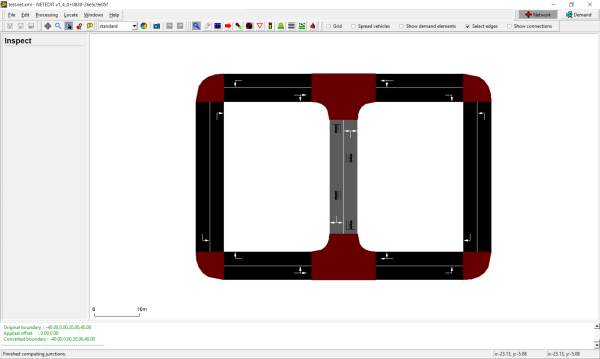
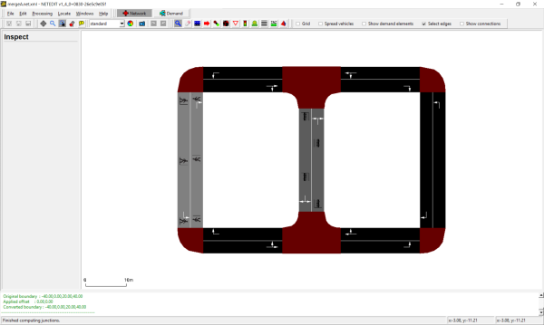

# netdiff.py

This script compares two *.net.xml* files. The call

```
<SUMO_HOME>/tools/net/netdiff.py A.net.xml B.net.xml diff
```

will produce 4 [plain-XML network](../Networks/PlainXML.md) files

- diff.nod.xml
- diff.edg.xml
- diff.con.xml
- diff.tll.xml

These files contain groups of xml elements (i.e. nodes) that have been
delete, created or modified and can be used to investigate differences
between the two networks *A* and *B*. Furthermore these files be used to
maintain change-sets for making repeatable modifications:

```
netconvert --sumo-net-file A.net.xml -n diff.nod.xml -e diff.edg.xml -x diff.con.xml -i diff.tll.xml -o B.net.xml
```

The above call can be used to recreate network *B* based on *A* and the
recorded change-set. Note, that for any modified elements (i.e. modified
speed limit for an edge) the file *diff.edg.xml* only contains to
modified attributes.

A typical use case for *netdiff.py* is this:

1.  [Import a network from
    OSM](../Networks/Import/OpenStreetMap.md) (call this
    *A.net.xml*)
2.  make some modifications with [netedit](../netedit.md) (save
    this under the new name *B.net.xml*)
3.  use *netdiff.py* to create the *diff*-files
4.  At a later date, re-import the OSM network (with a newer OSM file, a
    new version of [netconvert](../netconvert.md) or different
    options)
5.  re-apply the *diff*-files to avoid repeating manual corrections with
    [netedit](../netedit.md)





## patching on import

If the patch file is to be applied during the initial network import
(e.g. from OSM), the netdiff option **-i** must be set. Due to the way
connections are guessed during network import, all connections for an
edge must be included in the patch file if any of them was changed. This
is accomplished by setting **-i** (**--patch-on-import**).

# createRoundaboutConnections.py

This script generates additional connections for roundabouts from a
given network. The following connections are added:

- vehicles can stay inside of the roundabout on every lane.
- vehicles can leave a roundabout even if they are driving on an inner
  lane if there are enough outgoing lanes.

# netcheck.py

This tool checks the network (first parameter) for weak connectivity
(whether there is a route from every node to every other node,
regardless of edge direction) and prints the connected components if
not.

Additionally you may run this script to discover which edges are
reachable from a particular edge

```
<SUMO_HOME>/tools/net/netcheck.py <your.net.xml> --source <edge_id> --selection-output selection.txt
```

This will create a file called *selection.txt* which can be loaded in
[sumo-gui](../sumo-gui.md) to visualize the portion of the network
reachable from <edge_id\>. To visualize the selection you must load the
file using the menus **Edit-\>Edit chosen**. Then you need to enable
edge coloring by selection status in the view settings dialog
**Street-\>Color by: selection**. The reachable portion of the network
will be colored differently from the unreachable portion which is
usually sufficient to figure out network modelling errors.

The options can be shortened to **-s <edge_id\>** for source edges and **-o <filename\>** for selection
output.

Using option **--destination <edge_id\>**, or **-d <edge_id\>**, lists edges which can reach the given edge. By
adding the option **--vclass <vClass\>**, or **-l <vClass\>**, the check becomes
[vClass](../Definition_of_Vehicles,_Vehicle_Types,_and_Routes.md#abstract_vehicle_class)
aware.

The option **--component-output <filename\>**, or **-c <filename\>**, writes all the identified components and their
constituent edges to the specified file. The option **--results-output <filename\>**, or **-r <filename\>**, writes the
whole network summary of largest component percentage coverage and
component edge count distribution to the specified file.

The **--component-output** and **--results-output** options are not compatible with the **--destination** or **--source options**.

Use the option **--help** for the latest version information.

# netextract.py

This tool extracts nodes and edges from a given network for their reuse
in netconvert.

!!! note
    netconvert is able to import *.net.xml* files and export [plain xml files](../Networks/PlainXML.md) which makes this tool obsolete. It is retained for educational purposes as it demonstrates working with a sumo network from python.

# xmledges_applyOffset.py and xmlnodes_applyOffset.py

Both tools apply the given offset to the geometrical information of
edges or nodes given in the input file. The results are written into
<XMLEDGES\>.mod.xml or <XMLNODES\>.mod.xml, respectively.

```
xmledges_applyOffset.py <XMLEDGES> <X-OFFSET> <Y-OFFSET>
xmlnodes_applyOffset.py <XMLNODES> <X-OFFSET> <Y-OFFSET>
```

- <XMLEDGES\>/<XMLNODES\>: The edges/nodes file which content shall be
  shited
- <X-OFFSET\>: The x-offset to apply
- <Y-OFFSET\>: The x-offset to apply

# xmlconnections_mapEdges.py

Reads edge id replacements from "edgemap.txt"; the format of this file
is

```
<OLD_EDGE_ID>-><NEW_EDGE_ID>
```

Reads the given connections file <CONNECTIONS\> and replaces old edge
names by new. The result is written to <CONNECTIONS\>.mod.xml

```
xmlconnections_mapEdges.py <CONNECTIONS>
```

- <OLD_EDGE_ID\>: Id of an edge as used within <CONNECTIONS\>
- <NEW_EDGE_ID\>: Id of the edge as to use instead
- <CONNECTIONS\>: The connections file to change

# net2kml.py

converts '.net.xml' road geometries to [KML](https://en.wikipedia.org/wiki/Keyhole_Markup_Language) format.

```
<SUMO_HOME>/tools/net/net2kml.py -n your.net.xml -o output.kml
```

By default, normal edge geometries will be exported. This can be changed with options
- **--lanes**: write lane geometries
- **--internal**: write junction-internal edges or lanes

# net2geojson.py

converts '.net.xml' road geometries to [GeoJSON](https://en.wikipedia.org/wiki/GeoJSON) format.

```
<SUMO_HOME>/tools/net/net2geojson.py -n your.net.xml -o output.geojson
```

By default, normal edge geometries will be exported. This can be changed with options
- **--lanes**: write lane geometries
- **--internal**: write junction-internal edges or lanes
