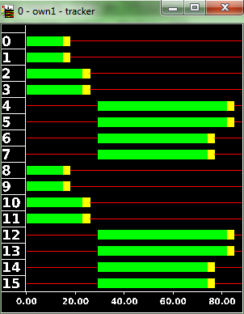
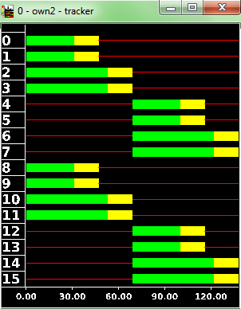

# tlsCoordinator.py

This script modifies the traffic-light offsets to coordinate them for a
given traffic demand. Example call:

```
<SUMO_HOME>/tools/tlsCoordinator.py -n net.net.xml -r routes.rou.xml -o tlsOffsets.add.xml
```

This would generate the file *tlsOffsets.add.xml* which can be loaded
into [sumo](../sumo.md):

```
sumo -n net.net.xml -r routes.rou.xml -a tlsOffsets.add.xml
```

!!! note
    It is advisable to run this with a *.net.xml* file where all traffic lights have the same cycle time. This is the default since version 0.25.0 but older networks should be rebuilt

!!! caution
    The route input must contain `<vehicle>`s with `<route>`-child-elements. Flows and trips are not supported.

# tlsCycleAdaptation.py

This script modifies the duration of green phases according to Websters
formula to best accomodate a given traffic demand. Example call:

```
<SUMO_HOME>/tools/tlsCycleAdaptation.py -n net.net.xml -r routes.rou.xml -o newTLS.add.xml
```

This would generate the file *newTLS.add.xml* which can be loaded into
[sumo](../sumo.md):

```
sumo -n net.net.xml -r routes.rou.xml -a newTLS.add.xml
```

!!! caution
    The route input must contain `<vehicle>`s with `<route>`-child-elements. Flows and trips are not supported.

# tls_csv2SUMO.py

This tool requires the program definition and the SUMO-network it shall
be converted to:

```
tls_csv2SUMO.py <TLS_CSV> <NET>
```

It prints the generated TLS definition on stdout (you can pipe it to a
file).

The format of the CSV description is as following. At first, three
header lines must be given, which name the tls (which is the id of the
tlLogic in the network), the program's subkey, and the offset at which
the program shall start in seconds - normally 0:

```
    key;<KEY>
    subkey;<SUBKEY>
    offset;<OFFSET>
```

Then, it is defined which signal (number) in the program is responsible
for which link. The link may be described either using the incoming edge
only, or the incoming lane only, or also incorporating the outgoing
edge/lane. This means the following lines are all valid:

```
    link;<LINK_NUMBER>;<FROM_EDGE>;;0
    link;<LINK_NUMBER>;<FROM_LANE>;;0
    link;<LINK_NUMBER>;<FROM_EDGE>;<TO_EDGE>;0
    link;<LINK_NUMBER>;<FROM_EDGE>;<TO_LANE>;0
    link;<LINK_NUMBER>;<FROM_LANE>;<TO_EDGE>;0
    link;<LINK_NUMBER>;<FROM_LANE>;<TO_LANE>;0
```

It is also possible to assign more than one link to a single signal.

Then, the signals' states are given:

```
<LINK_NUMBER>;<STATES>
```

The states are encoded using the signal colors (please note that only
lower-case letters are used, see below) described above, separated by
';'. An example signal phase definition (for signal 1) could be:

```
1;g;g;g;g;y;r;r;r;r;r
```

Please not that the number of states must be the same for all defined
links.

Now, we only have to define the phase times:

```
time;<TIMES>
```

The times are given in seconds, again separated using ';'. An example
could be:

```
time;18;33;3;6;3;3;9;15;90
```

A complete CSV-description could look like:

```
    key;102
    subkey;utopia
    offset;0
    link;1;4643;;0
    link;1;3078;;0
    link;2;3074;;0
    link;2;-6494;;0
    1;g;g;y;r;r;r;r;r
    2;r;r;r;r;g;g;y;r
    3;r;r;r;r;g;y;y;r
    4;g;y;y;r;r;r;r;r
    min;21;3;3;2;20;9;3;2
    time;45;3;3;2;36;9;3;2
    max;78;3;3;2;62;9;3;2
```

## Example

The example shows what is tested in
[\[1\]](http://sourceforge.net/apps/trac/sumo/browser/trunk/sumo/tests/tools/tls/csv2sumo/both_ok).
It is not a real-world program plan, only a demonstration for using the
script.

We have a simple four-arms intersections which is controlled by traffic
lights, see next figure.

**Figure: example intersection**


Now, we define two different programs for this intersection. The first:

```
key;0
subkey;own1
offset;0
link;1;4si;3o;0
link;1;4si;1o;0
link;1;3si;4o;0
link;1;3si;2o;0
link;2;4si;4o;0
link;2;4si;2o;0
link;2;3si;1o;0
link;2;3si;3o;0
link;3;1si;1o;0
link;3;1si;4o;0
link;3;2si;2o;0
link;3;2si;3o;0
link;4;1si;3o;0
link;4;1si;2o;0
link;4;2si;1o;0
link;4;2si;4o;0
1;g;y;r;r;r;r;r;r;r;r
2;g;g;g;y;r;r;r;r;r;r
3;r;r;r;r;r;g;y;r;r;r
4;r;r;r;r;r;g;g;g;y;r
min;10;3;5;3;3;10;3;5;3;3
time;15;3;5;3;3;45;3;5;3;3
max;30;3;15;3;3;60;3;15;3;3
```

This means that we have four streams: two for north/south (edges 3si and
4si) and two for east/west (edges 1si and 2si). Two, because we give
green longer for the respective left-movers. The key is the ID of the
traffic light ("0"), the subkey is the name of our program ("own1").

The second program looks like this:

```
key;0
subkey;own2
offset;0
link;1;4si;3o;0
link;1;4si;1o;0
link;1;3si;4o;0
link;1;3si;2o;0
link;2;4si;4o;0
link;2;4si;2o;0
link;2;3si;1o;0
link;2;3si;3o;0
link;3;1si;2o;0
link;3;1si;3o;0
link;3;2si;1o;0
link;3;2si;4o;0
link;4;1si;4o;0
link;4;1si;1o;0
link;4;2si;3o;0
link;4;2si;2o;0
1;g;y;r;r;r;r;r;r
2;g;g;g;y;r;r;r;r
3;r;r;r;r;g;y;r;r
4;r;r;r;r;g;g;g;y
time;31;16;6;16;31;16;6;16
```

We convert those program definitions using

```
tools/tls/tls_csv2SUMO.py lsa_def.csv,lsa_def2.csv input_net.net.xml
```

And obtain the following programs after loading them into
[sumo-gui](../sumo-gui.md):

**Figure: converted programs**




# tls_csvSignalGroups.py

Converts a csv-tls-description into one SUMO can read as additional
file. This tool differs from **tls_csv2SUMO.py** by being based on
signal groups in a way that is closer to the typical representation used
by traffic engineers. It accepts green times per signal group and
creates the [sumo](../sumo.md) tls representation out of it using
the . Example call to convert two csv-tls-descriptions into the
additional file *tls.add.xml*:

```
<SUMO_HOME>/tools/tls/tls_csvSignalgroups.py -n net.net.xml -i tl1.csv,tl2.csv -o tls.add.xml
```

In the opposite direction, templates for csv-tls-descriptions of all tls
in a [sumo](../sumo.md) network can be written to a given directory
and completed by hand:

```
<SUMO_HOME>/tools/tls/tls_csvSignalgroups.py -n net.net.xml -m .
```

The input csv file contains input blocks divided by titles in brackets.
The block \[general\] sets general information relating to the signal
program like the tls ID, the program ID, the cycle time \[s\] and the
offset time \[s\]. Additional 0..n optional parameters can also be
supplied. The \[links\] block lists the relations between signal groups
and junction connections in [sumo](../sumo.md). The relation is
build from the edges/lanes controlled by the respective signal group.
The target edge/lane can be omitted. The last block \[signal groups\]
contains the table of green times and signal group properties. The table
uses a header row with the following keywords and their meanings:

| Header   | Description                                                                           |
| -------- | ------------------------------------------------------------------------------------- |
| id       | signal group id, see block \[links\]                                                  |
| on1      | start time (signal state green) \[s\] for the first green time in the cycle           |
| off1     | end time (signal state green) \[s\] for the first green time in the cycle             |
| on2      | optional start time (signal state green) \[s\] for the second green time in the cycle |
| off2     | optional end time (signal state green) \[s\] for the second green time in the cycle   |
| transOn  | duration \[s\] for special signal state before green (red-yellow)                     |
| transOff | duration \[s\] for special signal state after green (yellow)                          |

The keywords may have a different order than shown above. The definition
of a second green time per cycle (keywords *on2* and *off2*) is
optional, so are the keywords.

## Example with a single green phase per signal group

```
[general]
cycle time;60
key;1
subkey;SZP_LeftTurn
offset;0
parameter;key1;value1
parameter;key2;value2
[links]
FZ11;-474_0;
FZ12;-474_1;
FZ21;-472_0;
FZ31;-468_0;
FZ32;-468_1;
FZ41;-470_0;
[signal groups]
id;on1;off1;transOn;transOff
FZ11;0;25;1;3
FZ12;0;35;1;3
FZ21;40;55;1;3
FZ31;0;25;1;3
FZ32;0;35;1;3
FZ41;40;55;1;3
```

## Example with two green phases for some groups

```
[general]
cycle time;60
key;1
subkey;SZP_2Green
offset;0
[links]
FZ11;-474_0;
FZ12;-474_1;
FZ21;-472_0;
FZ31;-468_0;
FZ32;-468_1;
FZ41;-470_0;
[signal groups]
id;on1;off1;transOn;transOff;on2;off2
FZ11;0;15;1;3;;
FZ12;0;15;1;3;40;55
FZ21;25;35;1;3;;
FZ31;0;25;1;3;;
FZ32;0;15;1;3;40;55
FZ41;25;35;1;3;;
```