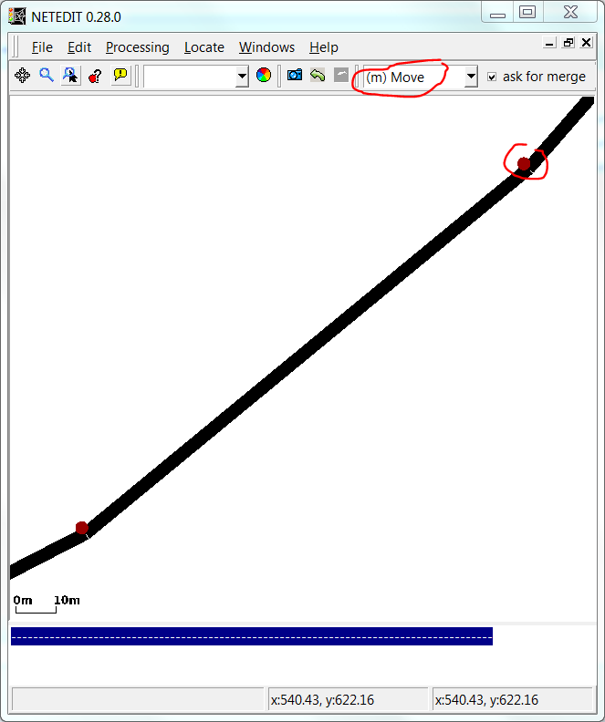
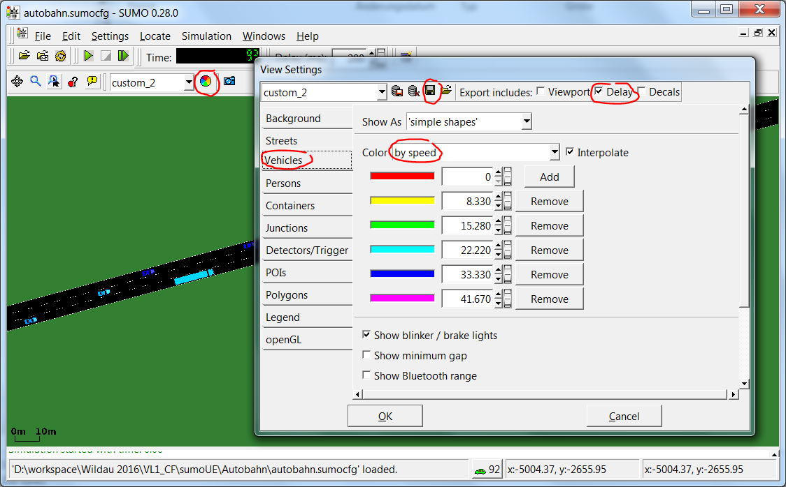

This tutorial covers the very basic elements for creating heterogeneous
flows on a multi-lane highway and modifying and saving view settings.

# Building a Highway



Editing geometry points

Open [netedit](../netedit.md) to
create a fictional highway. We keep this very simplistic for the start
and consider a segment without on- or off-ramps. Enter the edge creation
mode by pressing `e` and create an edge that is a few kilometers long.
<b>Hint</b>: you can start with a long straight edge and then change to
the move-mode (press `m`) to add and drag around geometry points on the
edge to alter its shape. Save your highway as `autobahn.net.xml`. Now
add some more lanes to the edge by right clicking on it and selecting
"Duplicate lane". Now enter the inspect mode (press `i`) and click on
the edge. For the "speed" enter 36.11 (recall that SUMO always uses m/s
as the unit for speed, 36.11m/s \~ 130km/h). Then split a short (about
one hundred meters long) initial segment (right click on edge -\> context
menu -\> Split edge here) of the edge and name it "entry" (press `i` and
click on the edge, then find the right textfield in the left panel). Do
the same at the end of the long edge and call the shorter edge at the
end "exit". Give the long edge the name "longEdge".

# Create Traffic

To populate the highway with traffic, we want to add different vehicle
types:

- many normal passenger cars
- some trucks
- a few coaches
- a few sporty passenger cars (higher desired travelling speed, less
  dawdling)

All of these should in themselves have a certain heterogeneity that can
be achieved in a simple way by giving the corresponding `vType`-element
an attribute `speedDev` (see [Speed
Distributions](../Definition_of_Vehicles,_Vehicle_Types,_and_Routes.md#speed_distributions)).
We will use this approach here but for more sophisticated realizations
of vehicle variability we recommend the script
`createVehTypeDistribution.py` in the {{SUMO}}/tools directory.

Create a routes-file `autobahn.rou.xml` with the following content:

```
<routes>
    <vType id="normal_car" vClass="passenger" maxSpeed="40" speedFactor="0.9" speedDev="0.2" sigma="0.5" />
    <vType id="sporty_car" vClass="passenger" maxSpeed="60" speedFactor="1.3" speedDev="0.1" sigma="0.1" />
    <vType id="trailer" vClass="trailer"  maxSpeed="30" speedFactor="1.1" speedDev="0.1" />
    <vType id="coach" vClass="coach"  maxSpeed="30" speedFactor="1." speedDev="0.1" />
    <flow id="normal" type="normal_car" begin="0" end="5000" number="5000" from="entry" to="exit" departPos="last" departLane="best" />
    <flow id="sporty" type="sporty_car" begin="0" end="5000" number="300" from="entry" to="exit" departPos="last" departLane="best" />
    <flow id="coach" type="coach" begin="0" end="5000" number="300" from="entry" to="exit" departPos="last" departLane="best" />
    <flow id="trailer" type="trailer" begin="0" end="5000" number="700" from="entry" to="exit" departPos="last" departLane="best" />
</routes>
```

# Run the Simulation

Create a config-file `autobahn.sumocfg`:

```
<configuration>
   <input>
       <net-file value="autobahn.net.xml"/>
       <route-files value="autobahn.rou.xml"/>
   </input>
</configuration>
```



Editing and saving of view settings

Start SUMO with this config. In the
simulation, select the visualization scheme "real world" from the
dropdown menu in the toolbar. Then click on the View Settings button
(looks like a color wheel, right beside the scheme selection) and go to
the tab "vehicles" in the appearing View Settings dialog. In the
Color-dropdown menu, you can choose from a lot of ways to encode
information about the vehicles in their color. For now, let us select
"by speed". Then set the time step delay to 200ms and run the
simulation.

It is possible to export the view settings into an additional xml-file
and load it on simulation start. Optionally, check the checkbox for
including delay in the export. To save our current visualization scheme,
click on the floppy-icon in the View Settings dialog and save it as
`autobahn.view.xml`. Then adapt the configuration to load the view
settings by adding a `<gui-settings-file ... />`-element:

```
<configuration>
   <input>
       <net-file value="autobahn.net.xml"/>
       <route-files value="autobahn.rou.xml"/>
       <gui-settings-file value="autobahn.view.xml"/>
   </input>
</configuration>
```

If you now restart SUMO with the configuration, it will automatically
load the view settings stored in `autobahn.view.xml`.

Back to [Tutorials](../Tutorials.md).