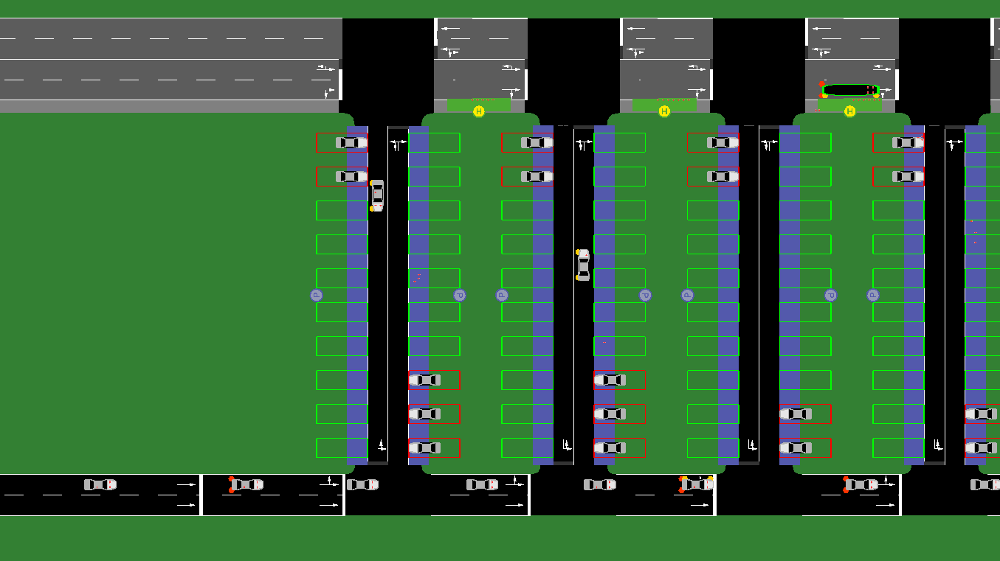

The *city_mobil* subdirectory in {{SUMO}}/docs/tutorial contains the setup for
a simulation of a parking lot using sumo with its taxi device to build a demand 
responsive transport service. Most of the files in the directory are for the
[old CityMobil tutorial](CityMobil_old.md),
for the new version only `createNetTaxi.py` is relevant.

This tutorial explains how to build such a scenario programmatically by generating
all input files with a (python) script we call `createNetTaxi.py`. The easiest way
of following it is probably to read the existing code side by side with this tutorial
since not every line wil be covered here. Some basic knowledge of Python is assumed.

Most parameters for the application (including the paths to the
executables) are in constants.py and can be easily adapted there to modify the scenario.
These parameters are written in ALL_CAPS below.

At the start of our script we will import those constants as well as modifying the 
system path to be able to use the sumolib (this is optional if you installed sumolib via
pip).
```
... # more imports
import os
import sys
from constants import PREFIX, DOUBLE_ROWS, ROW_DIST, SLOTS_PER_ROW, SLOT_WIDTH
... # more constants
sys.path.append(os.path.join(os.environ['SUMO_HOME'], 'tools'))
import sumolib
```

## The Scenario



The setup consists of a parking lot with access streets in several rows and parking
areas on both sides of the road. Vehicles with passengers arrive on the main street
in the lower left corner, drive to a parking lot where the passengers exit and walk
to a bus stop on the top road where an automated shuttle service brings them to their
final destination in the upper right corner. The shuttle service will be demand driven,
so it will only stop when passengers want to enter or leave.

## Network building

The main parameters of the network are the number of (double) rows the parking lot has 
(DOUBLE_ROWS), the number of slots per row (SLOTS_PER_ROW) and the distance of the rows 
(ROW_DIST). They define the layout assuming a fixed width of each slot.

We generate a node file defining the positions of the junctions and an edge file
specifiying the connections between the nodes together with parameters such as the 
number of lanes and the allowed vehicle classes.

We open the files as standard text files and use a helper function from the sumolib to 
write the XML header:
```
nodes = open("%s.nod.xml" % PREFIX, "w")
sumolib.xml.writeHeader(nodes, root="nodes")
```
This results in a header like this in our node file:
```
<?xml version="1.0" encoding="UTF-8"?>
<!-- generated on 2020-09-01 11:03:05.263997 by createNetTaxi.py v1_6_0+1864-1ecf301a37
  options: 
-->
<nodes xmlns:xsi="http://www.w3.org/2001/XMLSchema-instance" xsi:noNamespaceSchemaLocation="http://sumo.dlr.de/xsd/nodes_file.xsd">
```
This gives complete information on how and when this file has been generated as well
as a schema reference which allows for validating the input. This makes it easier to find mistakes 
such as typing errors in attribute names which could go unnoticed otherwise.

After opening the edges file in the same way we can start writing the node and edge definitions.
We first define a starting point for the insertion edge which is located 100m to the
left of the first parking row and then one junction at the start of 
each double row:
```
print('<node id="in" x="-100" y="0"/>', file=nodes)
for row in range(DOUBLE_ROWS):
    nextNodeID = "main%s" % row
    x = row * ROW_DIST
    print('<node id="%s" x="%s" y="0"/>' % (nextNodeID, x), file=nodes)
```
We can generate the edges in the same loop, which extends the code to:
```
nodeID = "main0"
print('<node id="in" x="-100" y="0"/>', file=nodes)
print('<edge id="mainin" from="in" to="%s" numLanes="2"/>' % nodeID, file=edges)
for row in range(DOUBLE_ROWS):
    nextNodeID = "main%s" % row
    x = row * ROW_DIST
    print('<node id="%s" x="%s" y="0"/>' % (nextNodeID, x), file=nodes)
    if row > 0:
        print('<edge id="main%sto%s" from="%s" to="%s" numLanes="2"/>' %
              (row - 1, row, nodeID, nextNodeID), file=edges)
    nodeID = nextNodeID
```
Note that we need to keep track of the id of the previous node and we need one
edge less than nodes. The edge has almost no additional parameters except for the
number of lanes, which is 2 to allow for overtaking vehicles which slowly turn
into the lot.

The code for the (cyber)bus edges follows the same pattern but is a little bit 
more involved because it needs also a street in the opposite direction since the busses
need to turn around. Furthermore it needs a sidewalk (modelled as a lane for pedestrians).
The code for generating a forward and back connection between two parking streets is:
```
print("""<edge id="%s" from="cyber%s" to="cyber%s" numLanes="3" spreadType="center">
    <lane index="0" allow="pedestrian" width="2.00"/>
    <lane index="1" allow="taxi bus"/>
    <lane index="2" allow="taxi bus"/>
</edge>""" % (edgeID, row - 1, row), file=edges)
print("""<edge id="-%s" from="cyber%s" to="cyber%s" numLanes="2" spreadType="center">
    <lane index="0" allow="taxi bus"/>
    <lane index="1" allow="taxi bus"/>
</edge>""" % (edgeID, row, row - 1), file=edges)
```
Note that the back leading streets do not have a side walk because the passengers are 
only allowed to enter and leave on the side of the parking lot.

Now we only need the vertical running streets and we are done with the basic network.
Here we do not need further nodes, we only connect the existing parts, but we need
sidewalks again on both sides for the people to walk to the bus.
```
for row in range(DOUBLE_ROWS):
    print("""<edge id="road%s" from="main%s" to="cyber%s" numLanes="2">
    <lane index="0" allow="pedestrian" width="2.00"/>
    <lane index="1" disallow="pedestrian"/>
</edge>""" % (row, row, row), file=edges)
    print("""<edge id="-road%s" from="cyber%s" to="main%s" numLanes="2">
    <lane index="0" allow="pedestrian" width="2.00"/>
    <lane index="1" disallow="pedestrian"/>
</edge>""" % (row, row, row), file=edges)
```
Now we can close the files and run netconvert:
```
subprocess.call([sumolib.checkBinary('netconvert'),
                 '-n', '%s.nod.xml' % PREFIX,
                 '-e', '%s.edg.xml' % PREFIX,
                 '-o', '%s.net.xml' % PREFIX])
```
You can already open the resulting network with netedit or sumo-gui
and it will look like the picture above except for the parking slots and the
bus stops which we add next.

## Additional infrastructure and vehicle types

For the bus stops and the parking areas we use a so called additional file 
which we open and write a header like above. The definition of the parking areas
looks like that:
```
for row in range(DOUBLE_ROWS):
    print("""
    <parkingArea id="ParkArea%s" lane="road%s_1" 
	             roadsideCapacity="%s" angle="270" length="8"/>
    <parkingArea id="ParkArea-%s" lane="-road%s_1" 
	             roadsideCapacity="%s" angle="270" length="8"/>""" %
          (row, row, SLOTS_PER_ROW, row, row, SLOTS_PER_ROW), file=stops)
```
Here we use a small trick. Since sumo attaches the parking lot to the vehicle lane (which is not the rightmost) it 
would block (only visually but still) the sidewalk, so we enlarge the slots a little to 8m and define an 
angle which lets all vehicles park forward leaving some space for the pedestrians.

For the bus stops the only small surprise is that we need one less than parking lots because they are only 
inbetween the parking roads.
```
for row in range(DOUBLE_ROWS-1):
    edgeID = "cyber%sto%s" % (row, row + 1)
    print('    <busStop id="%sstop" lane="%s_1" startPos="2" endPos="12"/>' % (edgeID, edgeID), file=stops)
```
Now we could close the additional file and already load it to the see the infrastructure.

We will however reuse the additional file to start defining the vehicles (at least the vehicle types).
Most of the vehicle type definiton is for the look (the color) and the vehicle class such that
it will only use the right roads. The cyber car also has a taxi device to react to passenger requests.
We will also define a regular bus to allow for comparisons with a regular bus service in further iterations
of this tutorial.
```
print(("""    <vType id="car" color="0.7,0.7,0.7"/>
    <vType id="ped_pedestrian" vClass="pedestrian" color="1,0.2,0.2"/>
    <vType id="cybercar" vClass="taxi" length="%s" minGap="1" guiShape="evehicle" maxSpeed="%s"
           color="green" emissionClass="HBEFA2/P_7_7" personCapacity="%s">
        <param key="has.taxi.device" value="true"/>
    </vType>
    <vType id="bus" vClass="bus" color="blue" personCapacity="%s"/>
""") % (CYBER_LENGTH, CYBER_SPEED, CYBER_CAPACITY, BUS_CAPACITY), file=stops)
```

Now we are ready to define the traffic demand.

## Traffic Demand

We define the cybercars and the passenger vehicles in different route files. For the cybercars a simple flow is enough:
```
print("""    <flow id="c" type="cybercar" begin="50" period="100" number="%s" line="taxi">
        <route edges="cyberin cyber0to1"/>
    </flow>""" % (TOTAL_CAPACITY // CYBER_CAPACITY), file=routes)
```
The only special thing here is line which uses the reserved string "taxi" to denote that this will be a demand driven 
transport system answering to special transportation requests. This specialty will also take care of the fact that 
the vehicle should not leave the scenario after it reached the end of its initial route but wait for new requests.

The persons are slightly more complex as they arrive in their own car, drive to the parking lot, leave the car, walk to
the bus stop and then enter the cybercar to got to their final destination. We do everything here in two nested loops 
because we want to fill all slots of all rows.
```
for v in range(SLOTS_PER_ROW):
        for idx in range(DOUBLE_ROWS):
```
Since the persons need to start in their car we need to define the cars first:
```
print("""    <trip id="v%s.%s" type="car" depart="%s" from="mainin" to="road%s">
        <stop parkingArea="ParkArea%s" duration="1000"/>
    </trip>""" % (idx, v, v * period, idx, idx), file=routes)
```
Now we generate a random number of passengers per car each with her own plan:
```
print("""    <person id="%sp%s" type="ped_pedestrian" depart="triggered">
        <ride from="mainin" to="%sroad%s" lines="%s"/>
        <walk busStop="%s"/>
        <ride to="cyberout" lines="taxi"/>
    </person>""" % (vehId, p, infix, idx, vehId, busStop), file=routes)
```
The first ride uses the private vehicle to the parking lot, then we walk to the 
bus stop and ride with the cybercar. The "triggered" depart is needed to let the 
person start in the car.

That's already it! We sum up everything in writing a nice configuration file which binds together the network,
the additional file (for stops and parking lots), the cyber-route file and the passenger route file.

```
print("""<configuration>
    <input>
        <net-file value="%s.net.xml"/>
        <route-files value="%s_cyber.rou.xml,%s_demand%02i.rou.xml"/>
        <additional-files value="%s.add.xml"/>
        <no-step-log value="True"/>
        <time-to-teleport value="0"/>
        <device.taxi.dispatch-algorithm value="routeExtension"/>
    </input>
</configuration>""" % (PREFIX, PREFIX, PREFIX, period, PREFIX), file=config)
```
One thing to note here is the usage of the dispatch algorithm which will determine how the cybercars choose 
which request to serve next.

## Running the scenario generation and the scenario
Now finally we can run by double clicking the script or if you are on a Linux / MacOS console:
```
./createNetTaxi.py
```
It will create configuration files for the different demands
which you can open and run with sumo-gui (again double click or from the console):
```
sumo-gui park05_cyber.sumocfg
```
Feel free to change the layout of the parking lot and the behavior
(speed, capacity etc.) of the vehicles. Whenever you edit constants.py
or createNetTaxi.py remember to re-execute createNetTaxi.py before running the scenario.

## Description of the dispatching algorithm
TBD

## Evaluation
TBD

## Comparison with a simple bus
TBD
