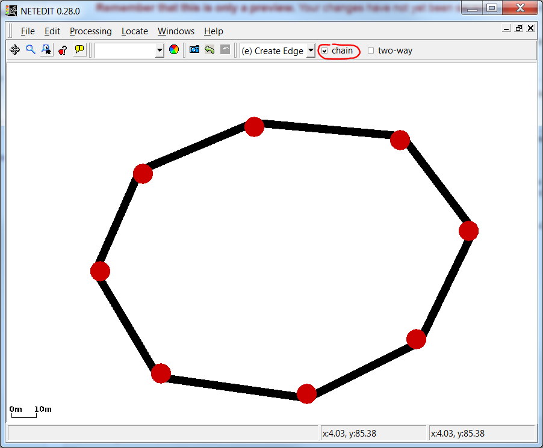
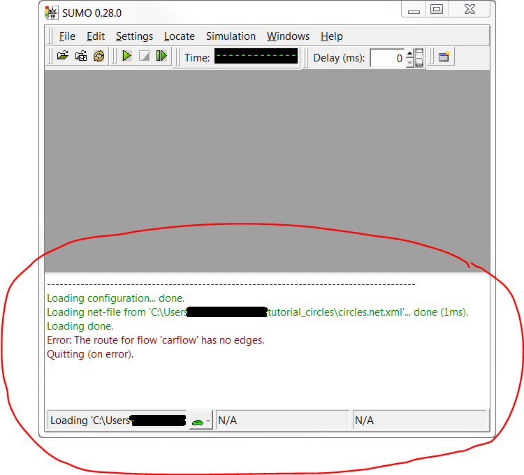
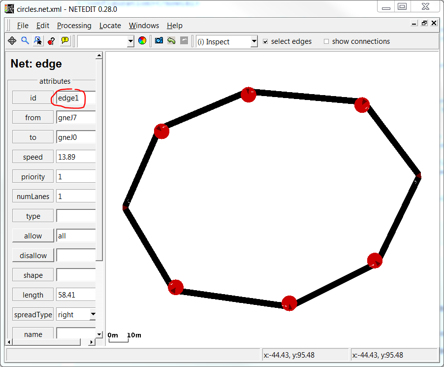
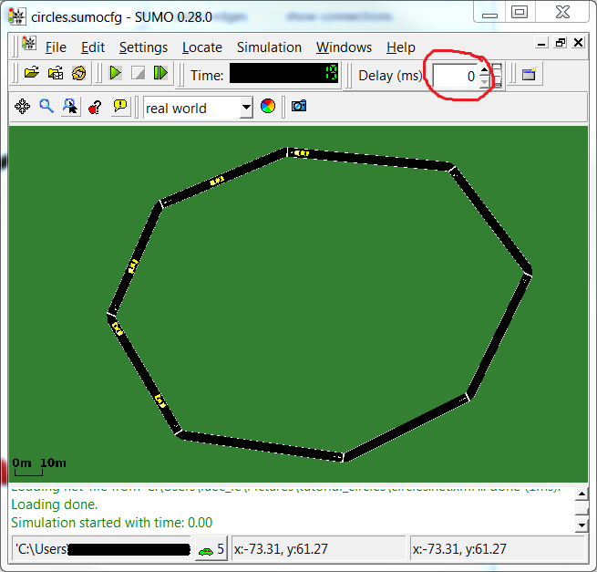
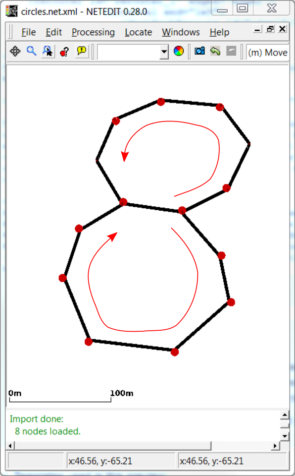

In this tutorial we will build a simple circular net with netedit and
use [rerouters](../Simulation/Rerouter.md) to make vehicles drive
in circles. All definition files can also be found in the
{{SUMO}}/docs/tutorial/circles directory.

# Build a network

First open [netedit](../netedit.md) and create edges to form a
closed loop. To do that press `Ctrl-N` to create a new network and then
press `e` to enter the edge editing mode. Now create a closed loop of
edges (you might consider to check 'chain' just right from the edit-mode
selection, see figure).



The result should look more or less like shown in the figure. The
important thing is the circular shape. Now save the network somewhere
(`Ctrl-Shift-S`) in an empty directory (we will refer to that place by
`baseDir`). As name for the created net-file type in `circles.net.xml`.

# Create vehicles and run SUMO

In the `baseDir` create two empty text-files, call them
`circles.rou.xml` and `circles.sumocfg`. These files will define our
vehicles and the run configuration.

First, we edit `circles.rou.xml` and define a vehicle flow of five
standard passenger cars. The file contents should look like this:

```
<routes>
   <vType id="car" type="passenger" length="5" accel="3.5" decel="2.2" sigma="1.0"/>
   <flow id="carflow" type="car" beg="0" end="0" number="5"/>
</routes>
```

For further explanation of how to define flows and vTypes see the
respective Wiki-pages: [Flow
Definitions](../Demand/Shortest_or_Optimal_Path_Routing.md#flow_definitions)
and [Vehicle
Types](../Definition_of_Vehicles,_Vehicle_Types,_and_Routes.md#vehicle_types).

To use the route-file and the generated net-file with SUMO, we edit the
configuration-file `circles.sumocfg` to tell SUMO where it finds vehicle
and net definitions:

```
<configuration>
    <input>
       <net-file value="circles.net.xml"/>
       <route-files value="circles.rou.xml"/>
    </input>
</configuration>
```



First attempt to run the simulation

Now let us try to start sumo with the config that we have just created.
To do so either double-click on the configuration-file `circles.sumocfg`
(under Windows, if your installation was done with default settings) or
change to the `baseDir` in a terminal and start sumo (with graphical
user interface) there by typing `sumo -c circles.sumocfg`. (If this does
not start sumo, you might have to add the SUMO/bin directory to your
PATH?)

Did it work? No.

Let us have a look at the Message Window at the bottom of the GUI to
endeavor what went wrong (by the way: the Message Window is often a very
useful resource for information for setting up a simulation take a look
at it first, if you run into problems).

It says: `Error: The route for flow 'carflow' has no edges.` This means
that SUMO does not know from where to where the vehicles of the flow we
declared in `circles.rou.xml` should take. To do this, we need to add
attributes `to` and `from`, and provide corresponding edge-ids to the
flow.



Renaming an edge in netedit

The edge-ids can be inspected and modified in netedit: open your
network-file `circles.net.xml` and press `i` to enter the inspect-mode.
Left-click on an arbitrary edge and rename it to `edge1`. Left-click on
a different edge and rename it to `edge2`. Then save your network
(`Ctrl-S`).

Now we add the from-edge and the to-edge to the flow in
`circles.rou.xml`:

```
 ...
    <flow id="carflow" type="car" beg="0" end="0" number="5" from="edge1" to="edge2"/>
 ...
```



Running five cars on the circular net

Let's try to run SUMO again. The window should now show the network you
have created before in netedit and you can start the simulation by
clicking on the play button () or the step button (). If you use , be sure to adjust the value for the animation delay
time between consecutive simulation steps (the field labeled "Delay
(ms):", see figure). Otherwise SUMO will run the simulation as fast as
possible and you will probably see nothing happening at all. (Note that
the the figure uses the style "real world" from the
representation-dropdown-menu in the toolbar.)

The cars will drive from the beginning of edge1 to the end of edge2 and
then leave the net (side remark: you can control the positions of
departure and arrival by additional arguments to the flow, see [Flow
Definitions](../Demand/Shortest_or_Optimal_Path_Routing.md#flow_definitions)).
The simulation ends when all vehicles have left the net.

# Circular rerouting

Now let us make the vehicles drive in circles around the track again and
again. To this end we will create a rerouter

")

Create a rerouter in netedit (full implementation pending!)

!!! caution
    Editing rerouters in netedit is not implemented completely currently. Alter the tutorial correspondingly, when this has been done! (See [netedit#Rerouter](../netedit.md#rerouter))

!!! note
    In the future the editing of rerouters will be possible in netedit. Up to now rerouters have to be added manually (see below). Here is what can be done in netedit so far: Open your network `circles.net` and press `a` to enter the additionals edit-mode. From the dropdown menu "Additional element" on the left select `rerouter` and from "Edges" select `edge1` (see figure). Then click somewhere in the editing window to create the rerouter (the rerouter icon is placed at the location where you click, but the location has no further meaning). Repeat the steps to create a rerouter for `edge2`.

Since in SUMO the additional elements are not considered as elements of
the net, we have to specify them in a separate file (the
"additionals-file"). Create and open a file `circles.add.xml` in the
`baseDir` and add the following xml-code (see [Rerouter/Assigning a new
Destination](../Simulation/Rerouter.md#assigning_a_new_destination)
for details):

```
<additionals>
    <rerouter id="rerouter_0" edges="edge1">
        <interval end="1e9">
           <destProbReroute id="edge2"/>
        </interval>
    </rerouter>
    <rerouter id="rerouter_1" edges="edge2">
        <interval end="1e9">
           <destProbReroute id="edge1"/>
        </interval>
    </rerouter>
</additionals>
```

Then we have to tell SUMO to include the rerouters into the simulation
by adding a line to the config `circles.sumocfg`. Within the `<input>` tag
add a child:

```
<additional-files value="circles.add.xml"/>
```

This will add two (destination-)rerouters to our network making the
vehicles go around the circle until the given end time (i.e., until one
hundred million seconds have passed). Effectively, each rerouter will
update the destination for each vehicle entering its edge (specified by
its `edge`-attribute) and set it to the edge given in the `id`-attribute
of the `destProbReroute`-element. So as soon as a vehicle enters `edge1`
(its current destination), its destination will be updated to `edge2`
and vice-versa, when entering `edge2` it will be rerouted towards
`edge1`, thus following a circular route.

# Exercises

Here are some simple ideas to extend this toy example:


A net with two loops

1.  add more lanes in netedit and another vehicle flow with faster cars
    to observe SUMO's overtaking behavior.
2.  add a scooter flow and use the [Sublane
    Model](../Simulation/SublaneModel.md) to observe SUMO's sublane
    model.
3.  add another loop (see figure) and trigger the next loop for each
    vehicle by a probabilistic choice of the destination
    ([Rerouter/Assigning a new
    Destination](../Simulation/Rerouter.md#assigning_a_new_destination)),
    observe merging at the location where both loops are connected.
4.  Insert more vehicles, lower the simulation [time-step
    length](../Simulation/Basic_Definition.md#defining_the_time_step_length_and_integration_method)
    and try to observe stop-and-go waves, experiment with different
    [car-following models](../Car-Following-Models.md), [color the
    vehicles](../sumo-gui.md#vehicle_visualisation_settings) by
    speed.

If you create solutions for the exercises post them on this page\!

Back to [Tutorials](../Tutorials.md)