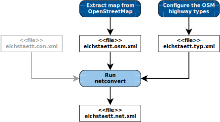
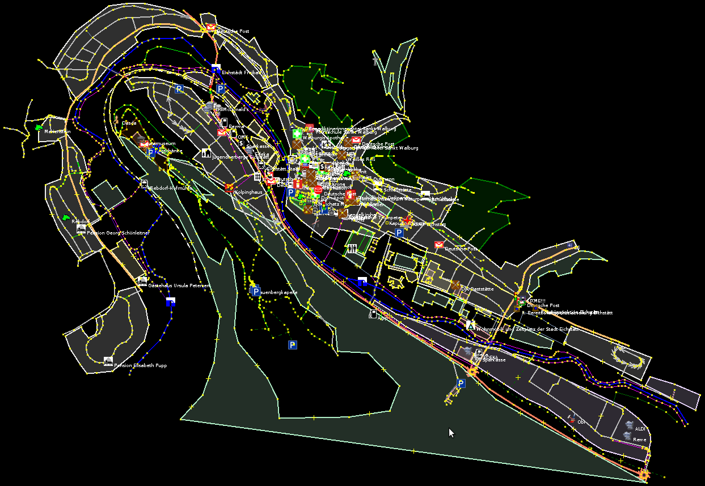
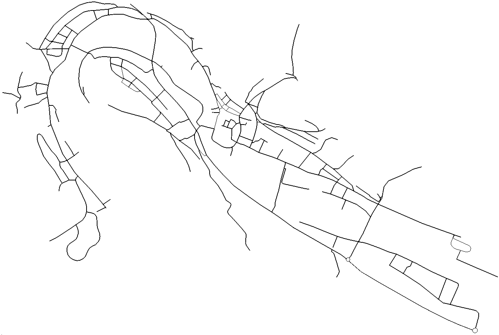

Overview of the steps: Make up the map, compile an edge type file, and generate the SUMO network file.


OpenStreetMap is a valuable source for
real-world map data. This tutorial shows you

1.  how to prepare a map of OpenStreetMap to be useful for traffic
    simulation and
2.  how to import this map to SUMO.

You may also find the following pages useful:

- [Tutorials/OSMWebWizard](../Tutorials/OSMWebWizard.md)
- [Networks/Import/OpenStreetMap](../Networks/Import/OpenStreetMap.md)
- [Tutorials/PT_from_OpenStreetMap](../Tutorials/PT_from_OpenStreetMap.md)
- [OpenStreetMap file](../OpenStreetMap_file.md)
- [Networks/Import/OpenStreetMapDownload](../Networks/Import/OpenStreetMapDownload.md).

## Prepare the Map of OpenStreetMap



The OpenStreetMap file created in this step. It shows the German city Eichstätt opened in JOSM.

The first step in this tutorial is to obtain a map the vehicles can drive in. If
you do not want to perform this step, you can take
[Tutorials/OSMActivityGen/eichstaett.osm](../Tutorials/OSMActivityGen/eichstaett.osm.md).
It has been prepared with this tutorial.

To get a detail out of OpenStreetMap, you can either use the export
function of the web site or the program JOSM. Both can save a selection
of objects (usually given as a rectangular range) into a file: the
[OpenStreetMap file](../OpenStreetMap_file.md). You can simply use
this file as the map for your traffic simulation with SUMO.

The data in OpenStreetMap is often not completely ready for traffic
simulation though. For a good simulation, the map must usually be
enhanced. I recommend you to do the following steps:

1.  Complete the map directly in OpenStreetMap. Follow the guidelines on
    the [OpenStreetMap wiki](http://wiki.openstreetmap.org) in the area
    *Map Making*. They give valuable hints what software to use and how
    to encode all attributes of the map. You should ensure that the map
    contains all data related to traffic simulation. (At this stage,
    fill in only correct data that can be well understood by others. Do
    not tweak the map just for your simulation. This comes below.)
    For the given example of the city Eichstätt, I found that most
    streets were already in the map – they were sufficient for my
    simulation. So I did only look at the tags (description of
    properties) of the streets in OpenStreetMap and did not add new
    streets. I took a notebook with the OpenStreetMap editor JOSM, drove
    through the city and corrected the following attributes:
  - The type (importance) of a street is defined with the tag
    *highway*. This attribute helps SUMO to determine the implicit
    speed limit and right of way rule.
  - All streets with speed limits that differ from the implicit
    regulatory limits (i.e. speed limits set by traffic signs)
    should have a tag *maxspeed*. The correct speed limits help SUMO
    to find reasonable routes through the road network.
  - One-way streets often have a significant impact on the traffic
    flow. They can be marked in OpenStreetMap with the key-value
    pair *oneway=yes*.
  - The correct number of lanes helps to avoid unrealistic traffic
    congestions in the simulation. The tag *lanes* specifies the
    total number of lanes of a street, for both directions together.
    So you cannot describe various complex lane configurations in
    OpenStreetMap (like two lanes in one direction, another lane for
    turning right and one lane for the opposite direction). They can
    only be defined in the [SUMO network
    file](../Networks/SUMO_Road_Networks.md) directly or its
    corresponding [SUMO XML description
    files](../Networks/PlainXML.md).
    Such lane configurations go beyond this tutorial.
  - In OpenStreetMap, traffic lights are nodes marked with the
    key-value pair *highway=traffic_signals*. Each traffic light is
    independent; you cannot associate several interdependent traffic
    lights at a big junction with each other. Again the [SUMO
    network file](../Networks/SUMO_Road_Networks.md) can
    contain such a complex logic and netconvert tries to detect such
    interdependent traffic lights when you use the option
    --try-join-tls (see section [\#Convert the Map in the SUMO Net
    Format](#convert_the_map_in_a_sumo_network)
    below).
  - Finally go through the warnings of JOSM. Most of them do not
    affect your work, but some of them help you to find significant
    errors in the map (like unconnected streets).
    During this step, do regularly upload your modifications to
    OpenStreetMap to avoid conflicts with the modifications of other
    editors.
2.  Now the map in OpenStreetMap should have the necessary quality for
    your simulation. Next you should determine the desired detail of the
    map and export it in an [OpenStreetMap
    file](../OpenStreetMap_file.md). Be careful to never upload the
    map back to OpenStreetMap from now on.
3.  Finally you can enhance the map for your specific purpose: Open the
    OpenStreetMap file in JOSM. Find the right nodes at which streets
    should end and remove unnecessary objects (which are out of the
    desired detail). The section [Networks/Import/OpenStreetMap\#Editing
    OSM
    networks](../Networks/Import/OpenStreetMap.md#editing_osm_networks)
    describes further ways to clean up the OSM file. But actually, most
    clean up is done by netconvert anyway (see section [\#Convert the
    Map in the SUMO Net
    Format](#convert_the_map_in_a_sumo_network) below).
    You are able to tweak the map for your purpose, for example, by
    adding or removing roads, changing their type, …

Now you have a good map for your simulation in an [OpenStreetMap
file](../OpenStreetMap_file.md). The image on the top shows the map
of the city Eichstätt, which I have prepared for traffic simulation. You
can [download the map
(eichstaett.osm)](../Tutorials/OSMActivityGen/eichstaett.osm.md) to
follow this tutorial.

While the OpenStreetMap format is a widely spread format to describe a
map, SUMO has its own format for this: the [SUMO network
format](../Networks/SUMO_Road_Networks.md). As a consequence, you
must first convert the OpenStreetMap file in a SUMO network file. The
next two steps guide you through the conversion process.

## Configure Implicit Attributes of the Map

In a [OpenStreetMap file](../OpenStreetMap_file.md), the highway
attribute implicitly determines values of some other attributes, like
the speed limit. You must tell SUMO these implicit values in the [SUMO
edge type file](../SUMO_edge_type_file.md). It assigns default
values to the road attributes speed limit, number of lanes, priority,
one-way street and allowed vehicle classes depending on the highway
type. The article [SUMO edge type file](../SUMO_edge_type_file.md)
provides several pre-defined SUMO edge type files and explains how you
can compile your own edge type file.

So determine in this step of the tutorial the implicit values of every
highway type as defined by the OpenStreetMap community. [Several
edge-type files suitable for OpenStreetMap are included with SUMO. Some
of them are meant to be
combined.](../Networks/Import/OpenStreetMap.md#recommended_typemaps)

For this tutorial, the type files [{{SUMO}}/data/typemap/osmNetconvert.typ.xml]({{Source}}data/typemap/osmNetconvert.typ.xml) and [{{SUMO}}/data/typemap/osmNetconvertUrbanDe.typ.xml]({{Source}}data/typemap/osmNetconvertUrbanDe.typ.xml) were used. Please make a copy to
your local directory if you want to modify them.

## Convert the Map in a SUMO Network

You can now create a [SUMO network
file](../Networks/SUMO_Road_Networks.md). The minimum options are
the OSM file and the name of the output file. [Further options are
recommended when importing OSM data into
SUMO](../Networks/Import/OpenStreetMap.md#recommended_netconvert_options):

```
    netconvert --xml-type-files osmNetconvert.typ.xml,osmNetconvertUrbanDe.typ.xml \
     --osm-files eichstaett.osm --output-file eichstaett.net.xml \
     --geometry.remove --roundabouts.guess --ramps.guess \
     --junctions.join --tls.guess-signals --tls.discard-simple --tls.join
```

netconvert extracts the simulation-related information from the
OpenStreetMap file (see the image of
[Tutorials/OSMActivityGen/eichstaett.osm](../Tutorials/OSMActivityGen/eichstaett.osm.md)
above) and puts it out in the SUMO network file (see the image of
[Tutorials/OSMActivityGen/eichstaett.net.xml](../Tutorials/OSMActivityGen/eichstaett.net.xml.md)
below). During this process, it adds some assumptions about the traffic
lights and the connections between lanes at junctions. You can read
further information on this process in
[netconvert](../netconvert.md),
[Networks/Import/OpenStreetMap](../Networks/Import/OpenStreetMap.md)
and [SUMO Road Networks](../Networks/SUMO_Road_Networks.md).

 

The map stored in the file eichstaett.net.xml. In this map, SUMO runs its simulation. Compare it with its source, the OpenStreetMap file shown in the image above.


Further options of netconvert can be very useful for the OpenStreetMap import:

- **--remove-edges.by-vclass / --keep-edges.by-vclass**

  In the SUMO edge
  type file, you could discard roads of a certain type. In addition,
  SUMO can discard roads that are restricted to certain vehicle
  classes. These classes are given with this option. In [SUMO edge
  type file](../SUMO_edge_type_file.md) you can find a list of
  SUMO vehicle classes. Reducing unnecessary roads makes (i.e.
  footpaths) makes it easier to work the with network. To obtain a
  network for simulation of passenger traffic only, the option **--keep-edges.by-vclass passenger** can be
  used.

- **--keep-edges.components**

  Keeps only the {{DT_INT}} largest connected
  components of the network (Usually only *1* is desired). Warning:
  This could remove railroads or other edges you would like to keep.
  So check the messages of netconvert.
  
-  **--verbose**
  
  Prints additional output.

Now read the messages netconvert printed out very carefully. Try to
understand the warnings. They give you a hint how your OpenStreetMap
file could be improved to make it suitable for conversion. Get back to
your OpenStreetMap file in JOSM to fix errors or tweak the map for
conversion. I found, for example, unconnected roads with this process. I
also moved some junctions slightly, because netconvert had problems if
two junctions are very close together. But finally, I managed to convert
the OpenStreetMap file without any warnings in a SUMO network file.
(Certainly the OpenStreetMap file eichstaett.osm I provided above is
already the improved version.)

*Congratulations\! When you performed all the steps so far, you have a
map suitable for traffic simulation with SUMO.* It is in the [SUMO
network format](../Networks/SUMO_Road_Networks.md). The map of the
tutorial's example is in the file
[Tutorials/OSMActivityGen/eichstaett.net.xml](../Tutorials/OSMActivityGen/eichstaett.net.xml.md).
Above on the right, you see an image that visualises the file. I opened
eichstaett.net.xml with the program sumo-gui and took a screenshot.

When you look back at the work you have done so far, most of it was
necessary to polish the OpenStreetMap data for traffic simulation and to
add missing information. A good map is hard to obtain but very important
for traffic simulation.