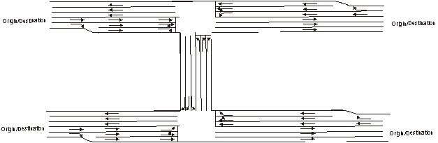
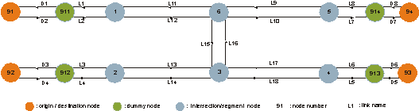
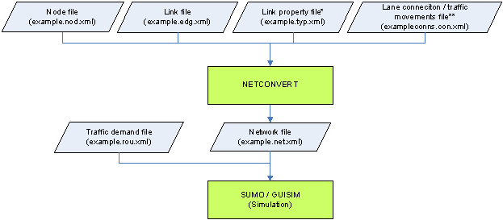
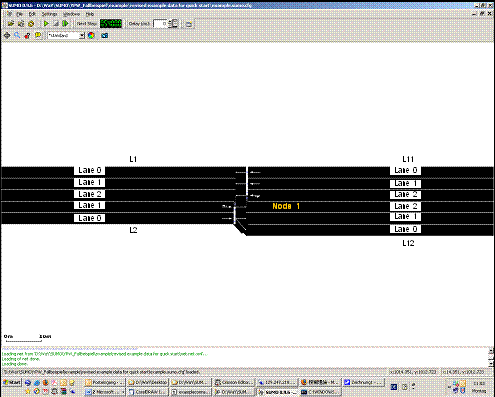
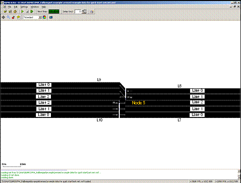
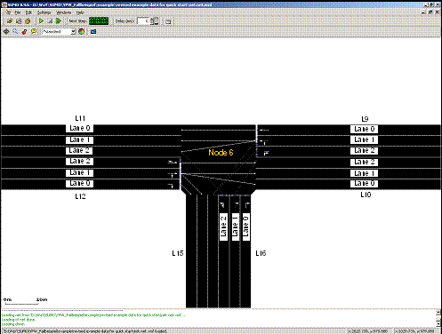
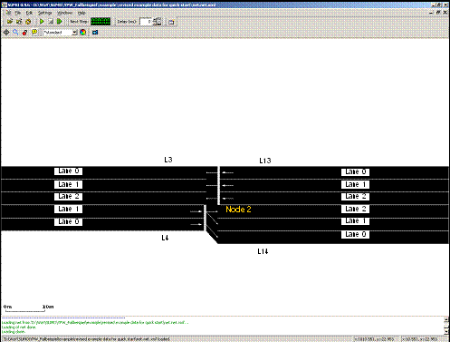

This tutorial covers a basic application and essential functions of SUMO
for traffic analysis using an example network.

All files mentioned here can also be found in the
{{SUMO}}/docs/tutorial/quickstart directory. The most recent version can be
found in the repository at [{{SUMO}}/tests/complex/tutorial/quickstart/data]({{Source}}tests/complex/tutorial/quickstart/data).

## Example description

In this example the traffic state will be analyzed with the application
of SUMO. The example network includes four origins, four destinations as
well as two unsignalized intersections. In the investigated area each
road for outbound traffic has three lanes and the allowed traffic
movements on each lane are restricted. U-turn behaviors are prohibited
at all intersections. Moreover, a higher priority has been given to the
eastbound and westbound traffic. The corresponding network layout is
shown in Figure 1.1.



**Fig. 1.1: Network layout**

## Data Preparation

Before conducting the traffic analysis in SUMO, the example network in
Figure 1.1 should be first converted to a node-link based network, shown
in Figure 1.2. The coordination data of nodes are listed in Table 1.2.



**Fig. 1.2: Layout of the node-link based example network**

**Table 1.2 Coordination data of the example network**

| node name | x-coordinate | y-coordinate |
| --------- | ------------ | ------------ |
| 91        | \-1000.0     | \+1000.0     |
| 92        | \-1000.0     | 0.0          |
| 93        | \+3000.0     | 0.0          |
| 94        | \+3000.0     | \+1000.0     |
| 911       | \-500.0      | \+1000.0     |
| 912       | \-500.0      | 0.0          |
| 913       | \+2500.0     | 0.0          |
| 914       | \+2500.0     | \+1000.0     |
| 1         | 0.0          | \+1000.0     |
| 2         | 0.0          | 0.0          |
| 3         | \+1000.0     | 0.0          |
| 4         | \+2000.0     | 0.0          |
| 5         | \+2000.0     | \+1000.0     |
| 6         | \+1000.0     | \+1000.0     |

In general, we have to convert the given information into three files,
which will be read in SUMO as input data. Two of the files contain the
network information, which will be converted into node and link
information in SUMO and is usually named with extension *.nod.xml* and
*.edg.xml* respectively. The file containing the traffic demand and
route information will be named with extension *.rou.xml*. In addition,
two more files with extensions *.con.xml* and *.typ.xml* will be
included if specification of allowed traffic movements and lane
connections at intersections as well as link types are required. A
general overview of the required input files for our example is
indicated in Figure 1.3.



**Fig. 1.3: The required input files for the example network in SUMO**

(\*) Link geometry data can also be defined in the link file
    *quickstart.edg.xml*.

(\*\*) It is an optional file. If this file is not given, lane
    connections and traffic movements will be generated by defaults.

All file names in the bracket are the file names used in the example.

### Network Editing

#### Node

Based on the coordination data in Table 1.2 and the node-link based
network layout in Figure 1.2 the intersections, origins, and
destinations are coded respectively as nodes 1-6 and nodes 91-94 by
giving the respective x- and y-coordinates in the *.nod.xml* file. Due
to the change of the number of lanes nodes 1, 2, 4 and 5 need to be
added, although no respective intersection exists. Dummy nodes 911-914
are needed for analyzing the traffic performance on the incoming and
outgoing links in the network. More dummy nodes can be applied if
needed. In instances such as for accurate geometric alignment or for the
specification of detector locations.

The definitions of the attributes in the node file are listed below.

- (a) **id**: the ID name of the node, defined by users with numbers,
    word strings or both.
- (b) **x**: the x-coordinate location of the defined node (in meters)
- (c) **y**: the y-coordinate location of the defined node (in meters)
- (d) **type**: the signal control type of the defined node. It is an
    optional attribute and defined with *priority* and *traffic_light*
    for unsignalized and signalized intersections respectively.

The complete node file of the example network is shown in Listing 1.1.

**Listing 1.1 Format of the node file of the example network
(*quickstart.nod.xml*)**

```
<?xml version="1.0" encoding="UTF-8"?>
<nodes xmlns:xsi="http://www.w3.org/2001/XMLSchema-instance"
  xsi:noNamespaceSchemaLocation="http://sumo.sf.net/xsd/nodes_file.xsd">
    <node id="91" x="-1000.0" y="1000.0" />
    <node id="92" x="-1000.0" y="0.0" />
    <node id="93" x="3000.0" y="0.0" />
    <node id="94" x="+3000.0" y="+1000.0" />
    <node id="911" x="-500.0" y="+1000.0" />
    <node id="912" x="-500.0" y="0.0" />
    <node id="913" x="+2500.0" y="0.0" />
    <node id="914" x="2500.0" y="+1000.0" />
    <node id="1" x="0.0" y="+1000.0" />
    <node id="2" x="0.0" y="0.0" />
    <node id="3" x="+1000.0" y="0.0" />
    <node id="4" x="+2000.0" y="0.0" />
    <node id="5" x="+2000.0" y="+1000.0" />
    <node id="6" x="+1000.0" y="+1000.0" />
</nodes>
```

#### Link

Roads are represented as links in SUMO like in other traffic simulation
software. To define link characteristics the identification (**id**) of
each link has to be defined first either with numbers, word strings or
both. The information about the upstream node, the downstream node and
the link type is then stored in a file with extension *.edg.xml*. The
information about each link type can either be defined in an additional
file with extension *.typ.xml* or *.edg.xml* right after the downstream
node. Listing 1.2 shows the link type file used for the example network
and four attributes are defined:

- (a) **id**: defined by users with numbers, word strings or both.
- (b) **priority**: driving priority based on traffic regulations and
    is defined with numbers. The higher the number, the higher the
    priority for the respective road. The priority information will
    override information from the node file, if both of them exist.
- (c) **numLanes**: number of lanes on the respective road.
- (d) **speed**: maximum allowed link speed.

Types (a) and (b) are for the eastbound and westbound roads with 3 lanes
and 2 lanes respectively. Type (c) is then for the northbound and
southbound roads with a lower priority.

**Listing 1.2 Link type file of the example network
(*quickstart.typ.xml*)**

```
<?xml version="1.0" encoding="UTF-8"?>
<types>
    <type id="a" priority="3" numLanes="3" speed="13.889"/>
    <type id="b" priority="3" numLanes="2" speed="13.889"/>
    <type id="c" priority="2" numLanes="3" speed="13.889"/>
</types>
```

With the use of the link type file the link file for the example network
is generated and shown in Listing 1.3. The defined attributes include:

- (a) **id**: link ID, defined by users with numbers, word strings or
    both.
- (b) **from**: ID of the upstream node of the respective link.
- (c) **to**: ID of the downstream node of the respective link.
- (d) **type**: ID of the link type, defined in the link type file.
- (e) **allow/disallow**: ID of the vehicle group which is defined in
    the SUMO and might not be identical with the vehicle types defined
    by users. More information on the application of this attribute is
    available in Section 4.2.

**Listing 1.3 Link file of the example network (*quickstart.edg.xml*)**

```
<?xml version="1.0" encoding="UTF-8"?>
<edges xmlns:xsi="http://www.w3.org/2001/XMLSchema-instance"
  xsi:noNamespaceSchemaLocation="http://sumo.sf.net/xsd/edges_file.xsd">
    <edge id="D1" from="911" to="91" type="a"/>
    <edge id="D2" from="91" to="911" type="b"/>
    <edge id="D3" from="912" to="92" type="a"/>
    <edge id="D4" from="92" to="912" type="b"/>
    <edge id="D5" from="913" to="93" type="a"/>
    <edge id="D6" from="93" to="913" type="b"/>
    <edge id="D7" from="914" to="94" type="a"/>
    <edge id="D8" from="94" to="914" type="b"/>
    <edge id="L1" from="1" to="911" type="a"/>
    <edge id="L2" from="911" to="1" type="b"/>
    <edge id="L3" from="2" to="912" type="a"/>
    <edge id="L4" from="912" to="2" type="b"/>
    <edge id="L5" from="4" to="913" type="a"/>
    <edge id="L6" from="913" to="4" type="b"/>
    <edge id="L7" from="5" to="914" type="a"/>
    <edge id="L8" from="914" to="5" type="b"/>
    <edge id="L9" from="5" to="6" type="a"/>
    <edge id="L10" from="6" to="5" type="a"/>
    <edge id="L11" from="6" to="1" type="a"/>
    <edge id="L12" from="1" to="6" type="a"/>
    <edge id="L13" from="3" to="2" type="a"/>
    <edge id="L14" from="2" to="3" type="a"/>
    <edge id="L15" from="6" to="3" type="c"/>
    <edge id="L16" from="3" to="6" type="c"/>
    <edge id="L17" from="4" to="3" type="a"/>
    <edge id="L18" from="3" to="4" type="a"/>
</edges>
```

#### Traffic movements

The default in SUMO based on the given geometric design of all possible
and logical traffic movements. U-turns, are allowed, if there is no
corresponding specification. The default setting is that the rightmost
lane of each link is aligned to the rightmost lane of the respective
downstream link. To specify traffic movements and lane connections an
additional file with extension *.con.xml* is required. Listing 1.4 shows
the corresponding settings for the example network. The meaning of each
attribute is as following:

- (a) **from**: ID of the link which the traffic movements will be
    specified.
- (b) **to**: ID of the link which is the downstream link of the above
    defined link.
- (c) **fromLane**/**toLane**: lane number of the defined link in (a)
    and the lane number of the link in (b), which are connected.

For example, the first row
`<connection from="L2" to="L12" fromLane="0" toLane="0"/>`
and the second row
`<connection from="L2" to="L12" fromLane="0" toLane="1"/>`
in Table 1.6 means that the traffic on Lane 0 of Link L2 will only use
Lanes 0 and 1 of Link L12 (see Figure 1.4). In contrast, Figure 1.5
shows the allowed traffic movements based on the default setting as
reference. Another example is given in Figure 1.6 for the specification
of the traffic movements on Links L9, L12 and L16, defined in Table 1.6.

The prohibition of u-turn movements can only be defined globally and by
executing network generation. Explanation will be provided in Section
1.3.

**Listing 1.4 Specification of traffic movements
(*quickstart.con.xml*)**

```
<?xml version="1.0" encoding="UTF-8"?>
<connections xmlns:xsi="http://www.w3.org/2001/XMLSchema-instance"
  xsi:noNamespaceSchemaLocation="http://sumo.sf.net/xsd/connections_file.xsd">
    <connection from="L2" to="L12" fromLane="0" toLane="0"/>
    <connection from="L2" to="L12" fromLane="0" toLane="1"/>
    <connection from="L2" to="L12" fromLane="1" toLane="2"/>
    <connection from="L4" to="L14" fromLane="0" toLane="0"/>
    <connection from="L4" to="L14" fromLane="1" toLane="1"/>
    <connection from="L4" to="L14" fromLane="1" toLane="2"/>
    <connection from="L9" to="L11" fromLane="0" toLane="0"/>
    <connection from="L9" to="L11" fromLane="1" toLane="1"/>
    <connection from="L9" to="L11" fromLane="1" toLane="2"/>
    <connection from="L9" to="L15" fromLane="1" toLane="1"/>
    <connection from="L9" to="L15" fromLane="2" toLane="2"/>
    <connection from="L16" to="L10" fromLane="0" toLane="0"/>
    <connection from="L16" to="L10" fromLane="1" toLane="1"/>
    <connection from="L16" to="L10" fromLane="1" toLane="2"/>
    <connection from="L16" to="L11" fromLane="2" toLane="2"/>
    <connection from="L12" to="L15" fromLane="0" toLane="0"/>
    <connection from="L12" to="L15" fromLane="1" toLane="1"/>
    <connection from="L12" to="L10" fromLane="1" toLane="0"/>
    <connection from="L12" to="L10" fromLane="1" toLane="1"/>
    <connection from="L12" to="L10" fromLane="2" toLane="2"/>
    <connection from="L14" to="L16" fromLane="1" toLane="1"/>
    <connection from="L14" to="L16" fromLane="1" toLane="0"/>
    <connection from="L14" to="L16" fromLane="2" toLane="2"/>
    <connection from="L14" to="L18" fromLane="0" toLane="0"/>
    <connection from="L14" to="L18" fromLane="1" toLane="1"/>
    <connection from="L14" to="L18" fromLane="1" toLane="2"/>
    <connection from="L17" to="L16" fromLane="0" toLane="0"/>
    <connection from="L17" to="L16" fromLane="1" toLane="1"/>
    <connection from="L17" to="L16" fromLane="1" toLane="2"/>
    <connection from="L17" to="L13" fromLane="1" toLane="0"/>
    <connection from="L17" to="L13" fromLane="1" toLane="1"/>
    <connection from="L17" to="L13" fromLane="2" toLane="2"/>
</connections>
```



**Fig. 1.4: Allowed traffic movements from Link L2 to Link L12 (with the
specified lane connection setting)**



**Fig. 1.5: Allowed traffic movements from Link L8 to Link L9 and from
Link L10 to Link L7 (default setting)**



**Fig. 1.6: The allowed traffic movements at Node 6**

### Network generation

Network file in SUMO is named with extension *.net.xml*. With the above
defined files, *quickstart.nod.xml*, *quickstart.edg.xml*,
*quickstart.con.xml* and *quickstart.typ.xml*, the network file
*quickstart.net.xml* will be generated by apply the module
[netconvert](../netconvert.md). For efficient execution, a
configuration file that includes the names of the input files, the name
of the output network file and other required actions should be created.
If the files and the module [netconvert](../netconvert.md) do not
locate in the same directory, the respective path for each file should
be specified. The configuration file for the example network is shown in
Listing 1.6 and named as *quickstart.netc.cfg*. If u-turn movements are
not allowed, the command
`<no-turnarounds value="true"/>` should be
added to the configuration file. As stated previously, the prohibition
of u-turn movements can only be conducted globally.

**Listing 1.6 Configuration file for generating the network file
(quickstart.netc.cfg)**

```
<configuration>
    <input>
        <edge-files value="quickstart.edg.xml"/>
        <node-files value="quickstart.nod.xml"/>
        <type-files value="quickstart.typ.xml"/>
        <connection-files value="quickstart.con.xml"/>
    </input>
    <output>
        <output-file value="quickstart.net.xml"/>
    </output>
    <processing>
        <no-turnarounds value="true"/>
    </processing>
</configuration>
```

In our example, the network file *quickstart.net.xml* will be generated
by executing the following command in the command line

```
netconvert –c quickstart.netccfg
```

The generated network file can be viewed with the use of
[sumo-gui](../sumo-gui.md) for checking if the network is built
accurately. Figure 1.7 shows that the U-turn movements are prohibited,
when the command `
<no-turnarounds value="true"/>` is given in the configuration file
in Listing 1.6.



**Fig. 1.7: The allowed traffic movements at Node 2 (with U-turn
prohibition)**

### Traffic demand

For traffic demand there are four vehicle types (Cars A, B, C and D) in
the example network. All drivers are 50% perfect in driving. The
corresponding information is listed in Table 1.1. One vehicle per
vehicle type is going to leave from each origin to each destination
every 30 seconds in the period under investigation from 15:00 to 15:15.

**Table 1.1 Vehicle types and vehicular characteristics in the example
network**

| Vehicle type | Max. acceleration(m/s) | Max. deceleration(m/s) | Length(m) | Max. speed(m/s) |
| ------------ | ---------------------- | ---------------------- | --------- | --------------- |
| Car A        | 3.0                    | 6.0                    | 5.0       | 50.0            |
| Car B        | 2.0                    | 6.0                    | 7.5       | 50.0            |
| Car C        | 1.0                    | 5.0                    | 5.0       | 40.0            |
| Car D        | 1.0                    | 5.0                    | 7.5       | 30.0            |

Traffic demand and route data is defined together with vehicle type data
in a file with the extension name *.rou.xml*. The corresponding format
for the example network is shown in Listing 1.5.

#### Vehicle Types

Listing 1.5 shows that all vehicle types are first defined according to
the information in Table 1.1. The related attributes include:

- (a) id: ID of the vehicle type, defined by users with numbers, word
    strings or both;
- (b) accel: maximum acceleration of the respective vehicle type (in
    m/s2);
- (c) decal: maximum deceleration of the respective vehicle type (in
    m/s2);
- (d) sigma: drivers’ imperfection in driving (between 0 and 1);
- (e) length: vehicle length (in meters);
- (f) maxSpeed: maximum vehicular velocity (in m/s);
- (g) color: color of the vehicle type. It is defined with 3 numbers
    (between 0 and 1) for red, green and blue respectively. Values are
    separated by comma and in quotes with no space between the values.
    For example, *1,0,0* represents the red color, *0,1,0* represents
    green color and *0,0,1* represents blue color.

The sequence of the attributes can be changed. The attribute *sigma* is
assigned as 0.5 for all vehicle types.

**Listing 1.5 Traffic demand and route data (quickstart.rou.xml)**

```
<?xml version="1.0" encoding="UTF-8"?>
<routes>
  <vType accel="3.0" decel="6.0" id="CarA" length="5.0" minGap="2.5" maxSpeed="50.0" sigma="0.5" />
  <vType accel="2.0" decel="6.0" id="CarB" length="7.5" minGap="2.5" maxSpeed="50.0" sigma="0.5" />
  <vType accel="1.0" decel="5.0" id="CarC" length="5.0" minGap="2.5" maxSpeed="40.0" sigma="0.5" />
  <vType accel="1.0" decel="5.0" id="CarD" length="7.5" minGap="2.5" maxSpeed="30.0" sigma="0.5" />
  <route id="route01" edges="D2 L2 L12 L10 L7 D7"/>
  <route id="route02" edges="D2 L2 L12 L15 L18 L5 D5"/>
  <route id="route03" edges="D2 L2 L12 L15 L13 L3 D3"/>
  <route id="route04" edges="D4 L4 L14 L18 L5 D5"/>
  <route id="route05" edges="D4 L4 L14 L16 L10 L7 D7"/>
  <route id="route06" edges="D4 L4 L14 L16 L11 L1 D1"/>
  <route id="route07" edges="D6 L6 L17 L13 L3 D3"/>
  <route id="route08" edges="D6 L6 L17 L16 L11 L1 D1"/>
  <route id="route09" edges="D6 L6 L17 L16 L10 L7 D7"/>
  <route id="route10" edges="D8 L8 L9 L11 L1 D1"/>
  <route id="route11" edges="D8 L8 L9 L15 L13 L3 D3"/>
  <route id="route12" edges="D8 L8 L9 L15 L18 L5 D5"/>
  <vehicle depart="54000" id="veh0" route="route01" type="CarA" color="1,0,0" />
  <vehicle depart="54000" id="veh1" route="route02" type="CarA" />
  <vehicle depart="54000" id="veh2" route="route03" type="CarA" />
  <vehicle depart="54000" id="veh3" route="route04" type="CarA" />
  <vehicle depart="54000" id="veh4" route="route05" type="CarA" />
  <vehicle depart="54000" id="veh5" route="route06" type="CarA" />
  <vehicle depart="54000" id="veh6" route="route07" type="CarA" />
  <vehicle depart="54000" id="veh7" route="route08" type="CarA" />
  <vehicle depart="54000" id="veh8" route="route09" type="CarA" />
  <vehicle depart="54000" id="veh9" route="route10" type="CarA" />
  <vehicle depart="54000" id="veh10" route="route11" type="CarA" />
  <vehicle depart="54000" id="veh11" route="route12" type="CarA" />
  <vehicle depart="54000" id="veh12" route="route01" type="CarB" color="1,0,0" />
  <vehicle depart="54000" id="veh13" route="route02" type="CarB" />
  <vehicle depart="54000" id="veh14" route="route03" type="CarB" />
  <vehicle depart="54000" id="veh15" route="route04" type="CarB" />
  <vehicle depart="54000" id="veh16" route="route05" type="CarB" />
  <vehicle depart="54000" id="veh17" route="route06" type="CarB" />
  <vehicle depart="54000" id="veh18" route="route07" type="CarB" />
...
</routes>
```

#### Traffic routes

Following the vehicle type information traffic route data need to be
defined as well. The input attributes include:

- (a) **id**: ID of a certain route and defined by users with numbers,
    word strings or both.
- (b) **edges**: The sequence of the names of the links, composing the
    defined route.

#### Traffic demand

Traffic demand data are defined with four attributes:

- (a) **depart**: departure time of a certain vehicle.
- (b) **id**: ID of a certain vehicle and defined by users with
    numbers, word strings or both.
- (c) **route**: the route used by the defined vehicle;
- (d) **type**: ID of the defined vehicle type.

## Simulation

Traffic simulation in SUMO can be conducted in two ways as described
below. The overview of the simulation process is given in Figure 1.8.

All file names in the bracket are the file names used in the example.


**Fig. 1.8: Overview of traffic simulation process**

### Command line

An efficient traffic simulation execution can be achieved with the use
of command line, especially when dealing with large and sophisticated
traffic networks. To simplify the execution process it is recommended
that all the required execution actions, e.g. the path and the name of
the input files, the output types, the output directory and the
simulation time period is specified in a configuration file. For the
example network the respective configuration file is shown in Listing
1.7 and the traffic simulation can then be carried out with the use of
the following command.

```
sumo –c quickstart.sumocfg
```

**Listing 1.7 Configuration file for the traffic simulation of the
example network (quickstart.sumo.cfg)**

```
<?xml version="1.0" encoding="iso-8859-1"?>
<configuration xmlns:xsi="http://www.w3.org/2001/XMLSchema-instance"
  xsi:noNamespaceSchemaLocation="http://sumo.sf.net/xsd/sumoConfiguration.xsd">
    <input>
        <net-file value="quickstart.net.xml"/>
        <route-files value="quickstart.rou.xml"/>
    </input>
    <time>
        <begin value="54000"/>
        <end value="54900"/>
    </time>
    <time-to-teleport value="-1"/>
</configuration>
```

We use the `<time-to-teleport value="-1"/>`
option here, to disable the automatic removal of vehicles which wait too
long in front of an intersection.

### sumo-gui

The application of [sumo-gui](../sumo-gui.md) is the other way to
execute the traffic simulation with SUMO. During the execution each
vehicular movement and the traffic progression can be observed and the
possible bottlenecks can be visually identified. A configuration file
for all execution actions, e.g. the one in Table 1.9, is required in
[sumo-gui](../sumo-gui.md). Double-click on the Program
*sumo-gui.exe* [sumo-gui](../sumo-gui.md) will be activated and a
work window will be automatically open. The investigated network can be
activated by opening the corresponding configuration file under the
File-Menu of the menu bar. Traffic simulation can then be performed by
pressing the green triangle button in the main tool bar. The simulation
can be stopped any time when the user presses the red squared button. A
stopped simulation can be further performed by pressing green triangle,
if the simulation time is not up. An illustration example is given in
Figure 1.9.


**Fig. 1.9: Illustration of the example network in sumo-gui**

!!! note
    If you start the tutorial with [sumo-gui](../sumo-gui.md) the whole network is visible at first but no vehicles can be seen because the view is zoomed out very far. You need to zoom in by holding the right mouse button and moving the mouse to be able to see any vehicles. Furthermore, you need not set the delay value to something greater than 0. Otherwise, the simulation may be over very quickly and you do not get to see vehicle movements.

Back to [Tutorials](../Tutorials.md)