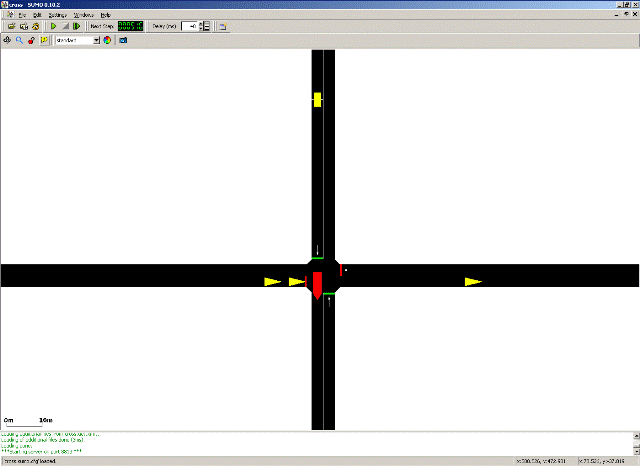

This shows how to use the [Traffic Control Interface (in short
TraCI)](../TraCI.md) on a simple example. TraCI gives the
possibility to control a running road traffic simulation. TraCI uses a
TCP-based client/server architecture where SUMO acts as a server and the
external script (the “controller”) is the client. In this tutorial the
“controller” is a Python-Script which receives information about the
simulation state from the server and then sends instructions back.

It is assumed that road network building and routes definition is known
from other tutorials, as [Tutorials/Hello
SUMO](../Tutorials/Hello_SUMO.md), [Tutorials/quick
start](../Tutorials/quick_start.md) or [Tutorials/Quick Start old
style](../Tutorials/Quick_Start_old_style.md).

All files mentioned here can also be found in the
{{SUMO}}/docs/tutorial/traci_tls directory of your installation. The most
recent version can be found in the repository at [{{SUMO}}/tests/complex/tutorial/traci_tls/]({{Source}}tests/complex/tutorial/traci_tls/).

# Example description

Our example plays on a simple signalized intersection with four
approaches. We only have traffic on the horizontal axis and important
vehicles (like trams, trains, fire engines, ...) on the vertical axis
from north to south. On the approach in the north we have an induction
loop to recognize entering vehicles. While no vehicle enters from the
north we give green on the horizontal axis all the time but when a
vehicle enters the induction loop we switch the signal immediately so
the vehicle can cross the intersection without a stop.



# Running the example

To run the example you need to execute the script *runner.py* with
python

```
python runner.py
```

!!! caution
    You need to press start in the simulation gui to run the tutorial.

# Data preparation

The net-definition can be found in the files `cross.nod.xml`,
`cross.edg.xml`, `cross.con.xml` and `cross.det.xml`. The route data is
generated randomly by the script. The vehicles leave the source
according to a Poisson process approximated here by a binomial
distribution. So a parameter `p=1./30` in the script means that a
vehicle is generated every 30 seconds in average.

# Code

The control logic resides in the python script *runner.py*. It generates
the routes, acts with the server and controls the traffic light. It
makes use of the TraCI python API bundled with SUMO. A description of
the API can be found at
[TraCI/Interfacing_TraCI_from_Python](../TraCI/Interfacing_TraCI_from_Python.md).
For a detailed list of available functions see the [pydoc generated
documentation](http://sumo.dlr.de/daily/pydoc/traci.html).

# Simulation

The main program is implemented in the script *runner.py*. There, we
first generate the routes as described above. Then `traci.start` is used
to start [sumo-gui](../sumo-gui.md) with the config file
`cross.sumocfg`. The start call also connects our script with the
[sumo-gui](../sumo-gui.md) running as a server.

Then we start to control the simulation. We let the server simulate one
simulation step, read the induction loop and switch the phase of the
traffic light until the end is reached where no vehicle exists on the
road anymore. If we find a vehicle on the induction loop the phase is
switched such that the north south direction gets green. If no vehicle
is on the detector, and we are not already in the process of switching
(so EW has still green), we try to keep this phase by simply setting it
again. At the end we close the connection.

# TraCI

We want to run this simulation in SUMO, acting as a server, and control
the signal dependent on the actual simulation state. For this task TraCI
offers commands which are described in the corresponding article
[TraCI](../TraCI.md) in detail. For this example we will use only
four commands: [Simulation
Step](../TraCI/Control-related_commands.md#command_0x01:_simulation_step),
[Get Induction Loop
Variable](../TraCI/Induction_Loop_Value_Retrieval.md#command_0xa0:_get_induction_loop_variable),
[Change Traffic Lights
State](../TraCI/Change_Traffic_Lights_State.md) and
[Close](../TraCI/Control-related_commands.md#command_0x7F:_close).

The commands are embedded in TCP messages but the direct client server
communication is opaque to the user. The four commands needed in this
tutorial are implemented in the methods `traci.simulationStep(step)`,
`traci.inductionloop.getLastStepVehicleNumber(IndLoopID)`,
`traci.trafficlight.setPhase(TLID, phase)` and `traci.close()`.

# Appendix

The methods for sending and receiving the messages, `_recvExact()` and
`_sendExact()`, respectively, are hidden in the script
`traci/__init__.py` and there is no need to call them directly. In this
section we will show the composition of a command using the example of
`traci.trafficlight.setRedYellowGreenState`.

## setPhase

This method sets the phase of a traffic light, so it gets the ID of the
traffic light and the new phase as parameter. The phase definitions can
be read from the sumo network and are described in [Simulation/Traffic
Lights\#Loading new
TLS-Programs](../Simulation/Traffic_Lights.md#loading_new_tls-programs).
If the phase is already the current one, it is restarted from the
beginning. The command is described at [TraCI/Change Traffic Lights
State](../TraCI/Change_Traffic_Lights_State.md).