This tutorial covers a basic application and essential functions of SUMO
for traffic analysis using an example network.

All files mentioned here can also be found in the
{{SUMO}}/docs/tutorial/quickstart directory. The most recent version can be
found in the repository at [{{SUMO}}/tests/complex/tutorial/quickstart/data]({{Source}}tests/complex/tutorial/quickstart/data).

## Example description

In this example, the traffic state will be analyzed with the application
of SUMO. The example network includes four origins, four destinations as
well as two unsignalized intersections. In the investigated area, each
road for outbound traffic has three lanes and the allowed traffic
movements on each lane are restricted. U-turn behaviors are prohibited
at all intersections. Moreover, a higher priority has been given to the
eastbound and westbound traffic. The corresponding network layout is
shown in Figure 1.1.

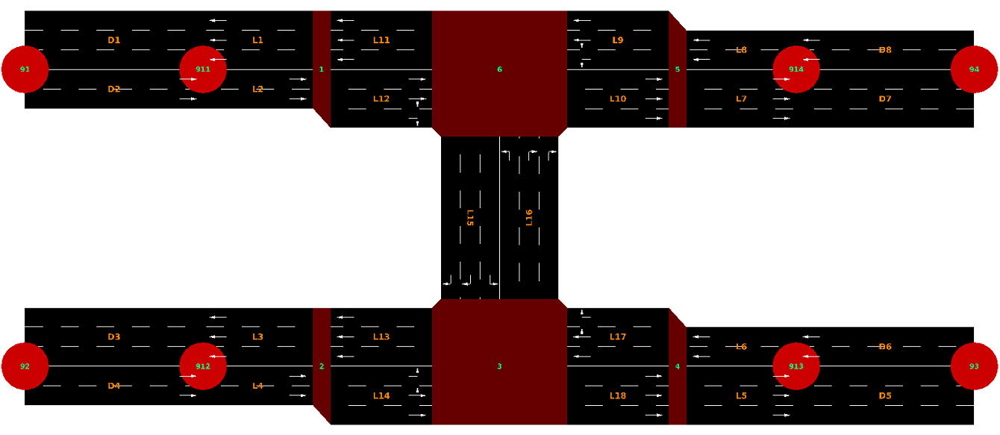

**Figure 1.1. Network layout**

## Data Preparation

Before conducting the traffic analysis in SUMO, the example network in
Figure 1.1 should be first built with the information listed in Table
1.2. (Please note\! Fig. 1.1 is not true to scale with the
specifications given in Table 1.2\!)

**Table 1.2. Coordinate data of the example network**

| node name | x-coordinate | y-coordinate |
| --------- | ------------ | ------------ |
| 91        | \-1000.0     | \+1000.0     |
| 92        | \-1000.0     | 0.0          |
| 93        | \+3000.0     | 0.0          |
| 94        | \+3000.0     | \+1000.0     |
| 911       | \-500.0      | \+1000.0     |
| 912       | \-500.0      | 0.0          |
| 913       | \+2500.0     | 0.0          |
| 914       | \+2500.0     | \+1000.0     |
| 1         | 0.0          | \+1000.0     |
| 2         | 0.0          | 0.0          |
| 3         | \+1000.0     | 0.0          |
| 4         | \+2000.0     | 0.0          |
| 5         | \+2000.0     | \+1000.0     |
| 6         | \+1000.0     | \+1000.0     |

## Network Editing with netedit

Based on the coordinate data in Table 1.2 and the node-link-based
network layout in Figure 1.1, the intersections, origins, and
destinations are coded, respectively, as nodes 1-6 and nodes 91-94 by
giving the respective x- and y-coordinates with the program netedit.
Open netedit, which you can find in the bin directory of the
SUMO-package. First, create a new network ("File" -\> "New Network...").

- Then choose the Edit mode, which is possible in two ways:

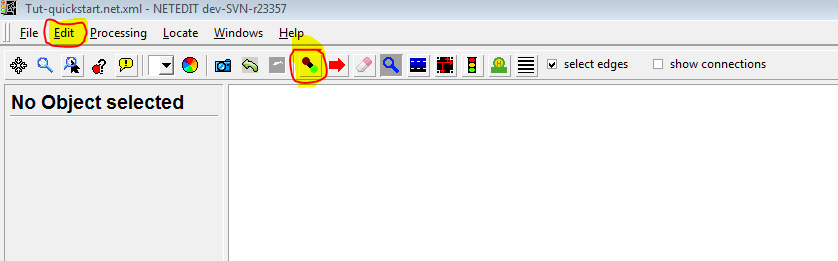

- Or you can use shortcuts to switch between modes, which you can see
  in the dropdown menu of the edit button:

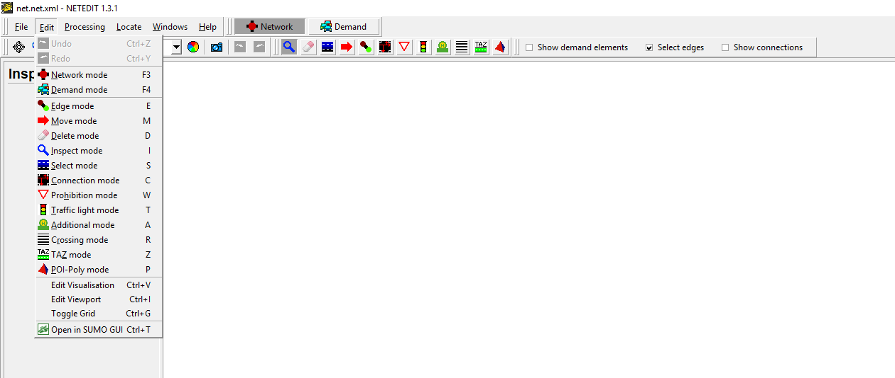

- First of all, you create one node and then a second one by clicking
  on the canvas. Both will be connected automatically and you will get
  your first edge.

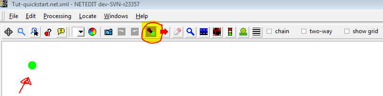 


- Next step is to switch to the Inspection mode and replace the name
  and the position of the nodes as defined in Table 1.2 above. Roads
  are represented as links in SUMO like in other traffic simulation
  software. To define link characteristics, the identification
  (**id**) of each link has to be defined first either with numbers,
  word strings, or both. To edit these values, click on the red circle representing the junction using the left mouse button.

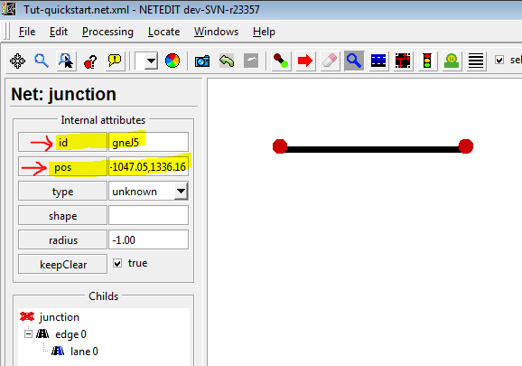 
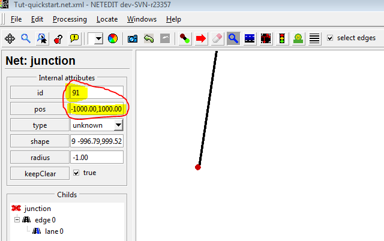

If you press Enter, you will get the new positions.

Now it is time to save your network: You are able to find a selection in
the dropdown menu of **File**. For our purpose here, the ***Save Network
As...*** is adequate. Please choose a suitable name for your network,
for instance quickstart.net.xml. You will use this name later on when
referring to the network from your configuration.

- As you can see in the given example, there are streets in both
  directions. To give your edge this information, you can either
  right-click on your created edge and choose ***Add reverse
  direction*** or select the option ***two-way*** during the creation
  process of an edge.

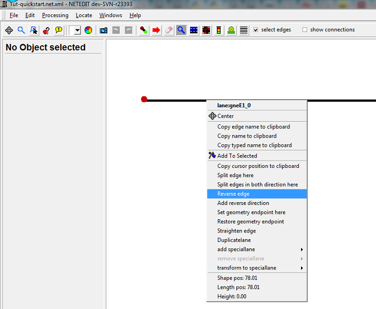 
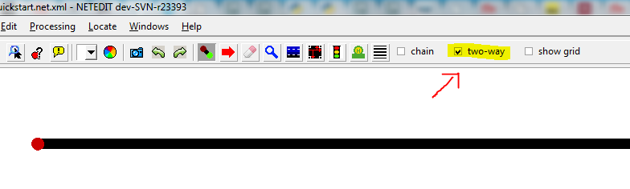

- Furthermore, one attribute must be changed to get a similar output
  as in the example description: the number of lanes. You can change
  the number of lanes easily if you are in the Inspect Mode and click
  on the relevant edge and change it directly.

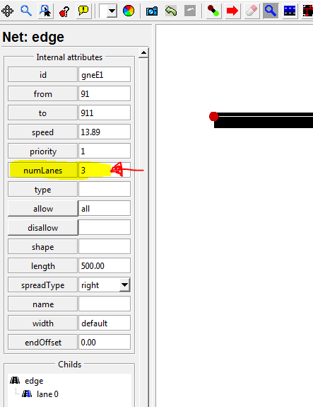

Now you should be able to create the rest of the given nodes and edges
in this example and change the names, the number of lanes, and reset the
positions. Don't forget to save your work from time to time. The Dummy
nodes 911-914 are needed for analyzing the traffic performance on the
incoming and outgoing links in the network. More dummy nodes can be
applied if needed (such as for accurate geometric alignment or for the
specification of detector locations).

- Next step would be to define the connections between the edges. To
  see which connections are already build automatically, please select
  the box ***show connections***.

The default in SUMO is based on the given geometric design of all
possible and logical traffic movements. U-turns are allowed if there is
no corresponding specification. The default setting is that the
right-most lane of each link is aligned to the right-most lane of the
respective downstream link. In our example, the following connections
are expected:

**Table 1.3. The connections between the edges**

| edge ID from | edge ID to | fromLane | toLane |
| ------------ | ---------- | -------- | ------ |
| L2           | L12        | 0        | 0      |
| L2           | L12        | 0        | 1      |
| L2           | L12        | 1        | 2      |
| L4           | L14        | 0        | 0      |
| L4           | L14        | 1        | 1      |
| L4           | L14        | 1        | 2      |
| L9           | L11        | 0        | 0      |
| L9           | L11        | 1        | 1      |
| L9           | L11        | 1        | 2      |
| L9           | L15        | 1        | 1      |
| L9           | L15        | 2        | 2      |
| L16          | L10        | 0        | 0      |
| L16          | L10        | 1        | 1      |
| L16          | L10        | 1        | 2      |
| L16          | L11        | 2        | 2      |
| L12          | L15        | 0        | 0      |
| L12          | L15        | 1        | 1      |
| L12          | L10        | 1        | 0      |
| L12          | L10        | 1        | 1      |
| L12          | L10        | 2        | 2      |
| L14          | L16        | 1        | 1      |
| L14          | L16        | 1        | 0      |
| L14          | L16        | 2        | 2      |
| L14          | L18        | 0        | 0      |
| L14          | L18        | 1        | 1      |
| L14          | L18        | 1        | 2      |
| L17          | L16        | 0        | 0      |
| L17          | L16        | 1        | 1      |
| L17          | L16        | 1        | 2      |
| L17          | L13        | 1        | 0      |
| L17          | L13        | 1        | 1      |
| L17          | L13        | 2        | 2      |

With the meaning of each attribute as follows:

- (a) **from**: ID of the link for which the traffic movements will be
  specified.
- (b) **to**: ID of the downstream link of the above defined link.
- (c) **fromLane**/**toLane**: lane number of the defined link in (a)
  and the lane number of the link in (b), which are connected.

If you change to the Connection Mode, you are able to specify new
connections or change existing connections. This is possible by clicking
on the chosen edge. As you can see on the left side of the following
picture, the different meanings of the dyed edges are shown in the
Legend. 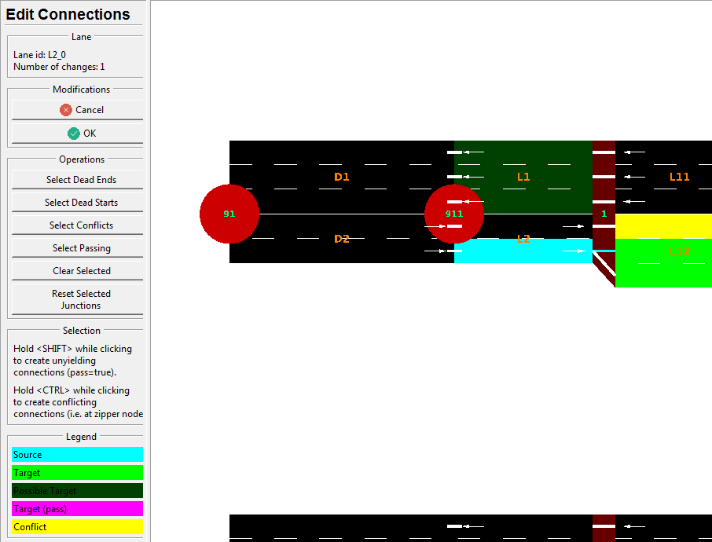
For further information and a deeper sight, please go to
[netedit](../netedit.md).

  - Another topic is the priority of each edge. In our example, the
    priority is 1 by default. To change the priority, please select the
    edges you want to modify (see picture below). Switch to the Inspect
    mode. Then you are able to change the priority information of all
    selected edges by clicking on one of the selected edges. The
    eastbound and westbound roads in the example with 3 lanes and 2
    lanes should have priority 3 and the northbound (L16) and southbound
    (L15) roads the (lower) priority 2.

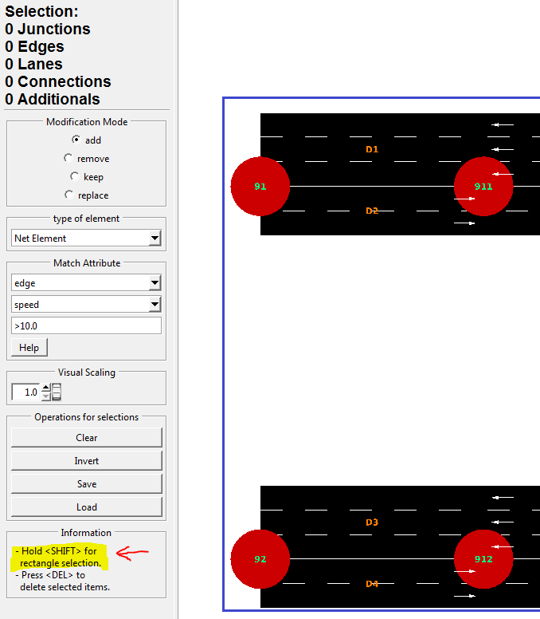 
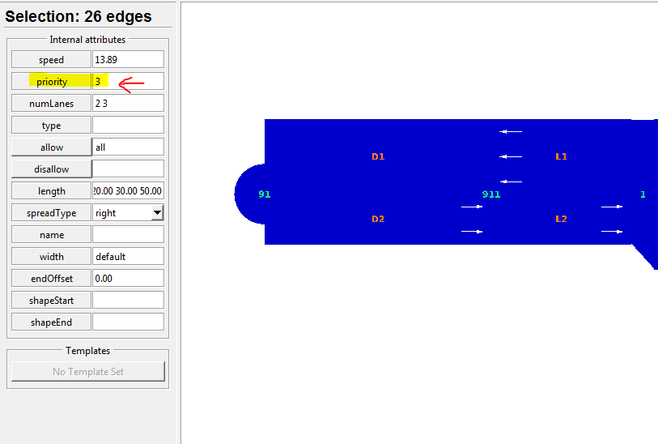

### Traffic demand

For traffic demand, there are four vehicle types (Cars A, B, C, and D)
in the example network. All drivers are 50% perfect in driving. The
corresponding information is listed in Table 1.1. One vehicle per
vehicle type is going to leave from each origin to each destination
every 30 seconds in the period under investigation from 15:00 to 15:15.

**Table 1.1. Vehicle types and vehicular characteristics in the example
network**

| Vehicle type | Max. acceleration(m/s) | Max. deceleration(m/s) | Length(m) | Max. speed(m/s) |
| ------------ | ---------------------- | ---------------------- | --------- | --------------- |
| Car A        | 3.0                    | 6.0                    | 5.0       | 50.0            |
| Car B        | 2.0                    | 6.0                    | 7.5       | 50.0            |
| Car C        | 1.0                    | 5.0                    | 5.0       | 40.0            |
| Car D        | 1.0                    | 5.0                    | 7.5       | 30.0            |

Traffic demand and route data is defined together with vehicle type data
in a file with the extension *.rou.xml*. The corresponding format for
the example network is shown in Listing 1.5.

#### Vehicle Types

Listing 1.5 shows that all vehicle types are first defined according to
the information in Table 1.1. The related attributes include:

- (a) id: ID of the vehicle type, defined by users with numbers, word
    strings, or both;
- (b) accel: maximum acceleration of the respective vehicle type (in
    m/s2);
- (c) decel: maximum deceleration of the respective vehicle type (in
    m/s2);
- (d) sigma: drivers’ imperfection in driving (between 0 and 1);
- (e) length: vehicle length (in meters);
- (f) maxSpeed: maximum vehicular velocity (in m/s);
- (g) color: color of the vehicle type. It is defined with 3 numbers
    (between 0 and 1) for red, green, and blue, respectively. Values are
    separated by comma and in quotes with no space between the values.
    For example, *1,0,0* represents the color red, *0,1,0* represents
    green, and *0,0,1* represents blue.

The sequence of the attributes can be changed. The attribute *sigma* is
assigned as 0.5 for all vehicle types.

**Listing 1.5. Traffic demand and route data (quickstart.rou.xml)**

```
<?xml version="1.0" encoding="UTF-8"?>
<routes>
  <vType accel="3.0" decel="6.0" id="CarA" length="5.0" minGap="2.5" maxSpeed="50.0" sigma="0.5" />
  <vType accel="2.0" decel="6.0" id="CarB" length="7.5" minGap="2.5" maxSpeed="50.0" sigma="0.5" />
  <vType accel="1.0" decel="5.0" id="CarC" length="5.0" minGap="2.5" maxSpeed="40.0" sigma="0.5" />
  <vType accel="1.0" decel="5.0" id="CarD" length="7.5" minGap="2.5" maxSpeed="30.0" sigma="0.5" />
  <route id="route01" edges="D2 L2 L12 L10 L7 D7"/>
  <route id="route02" edges="D2 L2 L12 L15 L18 L5 D5"/>
  <route id="route03" edges="D2 L2 L12 L15 L13 L3 D3"/>
  <route id="route04" edges="D4 L4 L14 L18 L5 D5"/>
  <route id="route05" edges="D4 L4 L14 L16 L10 L7 D7"/>
  <route id="route06" edges="D4 L4 L14 L16 L11 L1 D1"/>
  <route id="route07" edges="D6 L6 L17 L13 L3 D3"/>
  <route id="route08" edges="D6 L6 L17 L16 L11 L1 D1"/>
  <route id="route09" edges="D6 L6 L17 L16 L10 L7 D7"/>
  <route id="route10" edges="D8 L8 L9 L11 L1 D1"/>
  <route id="route11" edges="D8 L8 L9 L15 L13 L3 D3"/>
  <route id="route12" edges="D8 L8 L9 L15 L18 L5 D5"/>
  <vehicle depart="54000" id="veh0" route="route01" type="CarA" color="1,0,0" />
  <vehicle depart="54000" id="veh1" route="route02" type="CarA" />
  <vehicle depart="54000" id="veh2" route="route03" type="CarA" />
  <vehicle depart="54000" id="veh3" route="route04" type="CarA" />
  <vehicle depart="54000" id="veh4" route="route05" type="CarA" />
  <vehicle depart="54000" id="veh5" route="route06" type="CarA" />
  <vehicle depart="54000" id="veh6" route="route07" type="CarA" />
  <vehicle depart="54000" id="veh7" route="route08" type="CarA" />
  <vehicle depart="54000" id="veh8" route="route09" type="CarA" />
  <vehicle depart="54000" id="veh9" route="route10" type="CarA" />
  <vehicle depart="54000" id="veh10" route="route11" type="CarA" />
  <vehicle depart="54000" id="veh11" route="route12" type="CarA" />
  <vehicle depart="54000" id="veh12" route="route01" type="CarB" color="1,0,0" />
  <vehicle depart="54000" id="veh13" route="route02" type="CarB" />
  <vehicle depart="54000" id="veh14" route="route03" type="CarB" />
  <vehicle depart="54000" id="veh15" route="route04" type="CarB" />
  <vehicle depart="54000" id="veh16" route="route05" type="CarB" />
  <vehicle depart="54000" id="veh17" route="route06" type="CarB" />
  <vehicle depart="54000" id="veh18" route="route07" type="CarB" />
...
</routes>
```

#### Traffic routes

Following the vehicle type information, traffic route data needs to be
defined, as well. The input attributes include:

- (a) **id**: ID of a certain route and defined by users with numbers,
    word strings, or both.
- (b) **edges**: The sequence of the names of the links, composing the
    defined route.

#### Traffic demand

Traffic demand data are defined with four attributes:

- (a) **depart**: departure time of a certain vehicle.
- (b) **id**: ID of a certain vehicle and defined by users with
    numbers, word strings, or both.
- (c) **route**: the route used by the defined vehicle.
- (d) **type**: ID of the defined vehicle type.

## Simulation

Traffic simulation in SUMO can be conducted in two ways as described
below. The overview of the simulation process is given in Figure 1.8.

All file names in brackets are the file names used in the example.

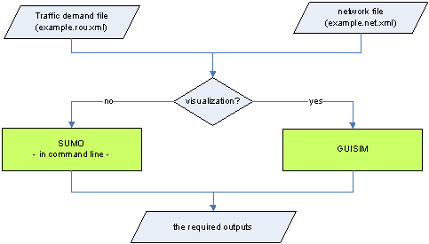

**Figure 1.8. Overview of traffic simulation process**

### Command line

An efficient traffic simulation execution can be achieved with the use
of the command line, especially when dealing with large and
sophisticated traffic networks. To simplify the execution process, it is
recommended that all the required execution actions, e.g. the path and
the name of the input files, the output types, the output directory, and
the simulation time period is specified in a configuration file.

**Listing 1.7. Configuration file for the traffic simulation of the
example network (quickstart.sumocfg)**

```
<?xml version="1.0" encoding="iso-8859-1"?>
<configuration xmlns:xsi="http://www.w3.org/2001/XMLSchema-instance"
  xsi:noNamespaceSchemaLocation="http://sumo.dlr.de/xsd/sumoConfiguration.xsd">
    <input>
        <net-file value="quickstart.net.xml"/>
        <route-files value="quickstart.rou.xml"/>
    </input>
    <time>
        <begin value="54000"/>
        <end value="54900"/>
    </time>
    <time-to-teleport value="-1"/>
</configuration>
```

We use the `<time-to-teleport value="-1"/>` option here to disable the automatic removal of vehicles which wait too
long in front of an intersection.

For the example network, the respective configuration file is shown in
Listing 1.7 and the traffic simulation can then be carried out with the
use of the following command:

```
sumo –c quickstart.sumocfg
```

### sumo-gui

The application of [sumo-gui](../sumo-gui.md) is the other way to
execute the traffic simulation with SUMO. During the execution, each
vehicular movement and the traffic progression can be observed and the
possible bottlenecks can be visually identified. A configuration file
for all execution actions, e.g. the one in Listing 1.7, is required for
[sumo-gui](../sumo-gui.md). Double-click on the Program
*sumo-gui.exe* and a [sumo-gui](../sumo-gui.md) work window will
automatically open. The investigated network can be activated by opening
the corresponding configuration file under the File-Menu of the menu
bar. Traffic simulation can then be performed by pressing the green
triangle button in the main tool bar. The simulation can be stopped any
time when the user presses the red squared button. A stopped simulation
can be resumed by pressing green triangle if the simulation time is not
up. An illustration example is given in Figure 1.9.

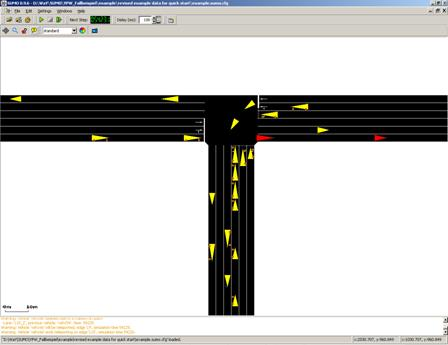

**Figure 1.9. Illustration of the example network in sumo-gui**

!!! note
    If you start the tutorial with [sumo-gui](../sumo-gui.md), the whole network is visible at first but no vehicles can be seen because the view is zoomed out very far. You need to zoom in by holding the right mouse button and moving the mouse to be able to see any vehicles. Furthermore, you need not set the delay value to something greater than 0. Otherwise, the simulation may be over very quickly and you do not get to see vehicle movements.

Back to [Tutorials](../Tutorials.md)