# From 30.000 feet

**netedit** is a graphical network editor for SUMO.

- **Purpose:** create and modify SUMO networks
- **System:** portable (Linux/Windows is tested); opens a window
- **Input (optional):** road network definitions to import
- **Output:** A generated SUMO-road network; optionally also other outputs
- **Programming Language:** c++

# Usage Description

**netedit** is a visual network editor. It can be used
to create networks from scratch and to modify all aspects of existing
networks. With a powerful selection and highlighting interface it can
also be used to debug network attributes. **netedit**
is built on top of [netconvert](netconvert.md). As a general
rule of thumb, anything [netconvert](netconvert.md) can do,
**netedit** can do as well.
**netedit** has unlimited undo/redo capabilities and
thus allows editing mistakes to be quickly corrected. Editing commands
are generally issued with a left-click (according to the current [edit
mode](#edit_modes)). The user interface closely
follows that of
[sumo-gui](sumo-gui.md#interaction_with_the_view). Additional
keyboard hotkeys are documented in the *Help* menu.

## Input

**netedit** is a GUI-Application and inputs are chosen
via menus. The following input formats are supported:

- SUMO-net files
- OSM-files
- [netconvert](netconvert.md)-configuration files

## Output

- SUMO-net files
- plain-xml files

## Hotkeys

| File shortcuts              | Key              | Description                         |
| --------------------------- | ---------------- | ----------------------------------- |
| New Network                 | Ctrl + N         | Create a new network                |
| Open Network                | Ctrl + O         | Open an existing network            |
| Open configuration          | Ctrl + T         | Open an existing SUMO configuration |
| Import foreign network      | Ctrl + F         | Import a foreign network            |
| Reload                      | Ctrl + R         | Reload network                      |
| Save network                | Ctrl + S         | Save network                        |
| Save network as             | Ctrl + Shift + S | Save network in another file        |
| Save plain XML              | Ctrl + L         | Save network as plain XML           |
| Save joined junctions       | Ctrl + J         | Save joined junctions of network    |
| Load additionals and shapes | Ctrl + A         | Load a file with additionals        |
| Save additionals and shapes | Ctrl + Shift + A | Save additionals in a file          |
| Load demand elements        | Ctrl + D         | Load a file with shapes             |
| Save demand elements        | Ctrl + Shift + D | Save demand elements in a file      |
| Load TLS Programs           | Ctrl + K         | Load a file with shapes             |
| Save TLS Programs           | Ctrl + Shift + K | Save Point Of Interest in a file    |
| Close                       | Ctrl + W         | Close network                       |

| Edit shortcuts | Key      | Description          |
| -------------- | -------- | -------------------- |
| Undo           | Ctrl + Z | Undo the last change |
| Redo           | Ctrl + Y | Redo the last change |

| Supermodes shortcuts | Key  | Description                                      |
| -------------------- | ---- | ------------------------------------------------ |
| Network              | F2   | Change to supermode Network (default )           |
| Demand               | F3   | Change to supermode Demand (implies recomputing) |
| Data                 | F4   | Change to supermode Data (implies recomputing)   |

| Common modes shortcuts | Key | Description              |
| ---------------------- | --- | ------------------------ |
| Delete                 | D   | Change to mode "Delete"  |
| Inspect                | I   | Change to mode "Inspect" |
| Select                 | S   | Change to mode "Select"  |
| Move                   | M   | Change to mode "Move"    |

| Network mode shortcuts | Key | Description                    |
| ---------------------- | --- | ------------------------------ |
| Create Edge            | E   | Change to mode "Create Edge"   |
| Connection             | C   | Change to mode "Connection"    |
| Prohibition            | W   | Change to mode "Prohibition"   |
| Traffic light          | T   | Change to mode "Traffic light" |
| Additional             | A   | Change to mode "Additional"    |
| Crossing               | R   | Change to mode "Crossing"      |
| POI-Poly               | P   | Change to mode "POI-Poly"      |

| Demand mode shortcuts | Key | Description                          |
| --------------------- | --- | ------------------------------------ |
| Create Route          | R   | Change to mode "Create Routes"       |
| Create Vehicle        | V   | Change to mode "Create Vehicles"     |
| Create Vehicle Type   | T   | Change to mode "Create Vehicle Type" |
| Create Stop           | A   | Change to mode "Create Stops"        |
| Create person types   | W   | Change to mode "Create Person Types" |
| Create persons        | P   | Change to mode "Create Persons"      |
| Create person plans   | C   | Change to mode "Create Person Plans" |

| Data mode shortcuts | Key  | Description                                 |
| ------------------- | ---- | ------------------------------------------- |
| Edge data           | E    | Change to mode "Create Edge Datas"          |
| Edge relation data  | E    | Change to mode "Create Edge Relation datas" |

| Processing shortcuts    | Key | Description                            |
| ----------------------- | --- | -------------------------------------- |
| Compute Junction        | F5  | Compute junctions of the network       |
| Clean Junction          | F6  | Clean junctions of the network         |
| Join selected Junctions | F7  | Join selected junctions of the network |
| Options                 | F10 | Open options dialog                    |

| Locate shortcuts | Key       | Description                          |
| ---------------- | --------- | ------------------------------------ |
| Locate Junctions | Shift + j | Open dialog to locate junctions      |
| Locate Edges     | Shift + e | Open dialog to locate edges          |
| Locate TLS       | Shift + t | Open dialog to locate Traffic Lights |

| Help shortcuts       | Key  | Description                                      |
| -------------------- | ---- | ------------------------------------------------ |
| Online documentation | F1   | Open the online documentation in the web browser |
| About                | F12  | Open the about dialog                            |

| Text edition shortcuts | Key      | Description                                      |
| ---------------------- | -------- | ------------------------------------------------ |
| Cut                    | Ctrl + X | Cut selected text of a text field                |
| Copy                   | Ctrl + C | Copy selected text of a text field               |
| Paste                  | Ctrl + V | Paste previously cut/copied text in a text field |
| Select all text        | Ctrl + A | Select all text in a text field                  |

In addition to these hotkeys, [all hotkeys for moving and zooming in
sumo-gui](sumo-gui.md#keyboard_shortcuts) are supported.

- <Button-Left\>: Execute mode specific action
- <Button-Right\>: Open context-menu
- <Button-Right-Drag\>: Change zoom
- <Button-Left-Drag\>: Move the view around (*panning*)
  - in 'Move'-mode pointing at an edge: move or create geometry
    points
  - in 'Move'-mode pointing at a junction: move the junction
  - in 'Move'-mode pointing at a selected object: move all selected
    junctions and edges including geometry. If both junctions of an
    edge are selected, move the whole geometry. Otherwise, move only
    the geometry near the cursor
- <ESC\>
  - in 'Create Edge'-mode: clear the currently selected source
    junction
  - in 'Select'-mode: clear the current selection; cancel rectangle
    selection
  - in 'Connect'-mode: deselect current lane and cancel all changes
  - in 'Traffic Light'-mode: revert changes to current traffic light
  - when editing a junction shape: abort editing the current
    junction shape
- <DELETE\>: delete all currently selected items
- <SHIFT\>:
  - in 'Select'-mode: hold <SHIFT\> and drag the mouse for rectangle
    selection
  - in 'Select'-mode: <SHIFT\>-left-click selects lanes instead of
    edges
  - in 'Inspect'-mode: <SHIFT\>-left-click inspects lanes instead of
    edges
  - in 'Delete'-mode: <SHIFT\>-left-click deletes lanes instead of
    edges
- <CTRL\>:
  - in 'Create Edge'-mode, allow moving the view without defining
    junctions
  - in 'Create Additional'-mode, allow moving the view without
    adding additionals
  - in 'POI-Poly'-mode, allow moving the view without adding POIs
- <Enter\>
  - in 'Inspect'-mode: confirm attribute changes
  - in 'Connect'-mode: deselect current lane and save all changes
  - in 'Traffic Light'-mode: save changes to current traffic light
  - in 'TAZ'-mode: save changes to current traffic light
  - when editing a junction shape: save the current junction shape

## Processing Menu Options

- **Compute Junctions** (F5): recomputes the geometry and logic of all
  junctions. This is triggered automatically when entering modes which
  require this information (Connect, Traffic Lights).
- **Clean Junctions** (F6): removes all junctions that do not have any
  adjacent edges (These junctions are not included when saving the
  network. They are kept in the editor until cleaned for potential
  reuse).
- **Join Selected Junctions** (F7): joins the selected junctions into
  a single junction (See [joining
  junctions](Networks/PlainXML.md#joining_nodes)).
- **Options** (F10): inspect and set all options. These are the same
  options that [netconvert](netconvert.md) accepts on the
  commandline or in a configuration.

## Customizing Visualization

Most of the visualization options that are available in
[sumo-gui](sumo-gui.md#changing_the_appearancevisualisation_of_the_simulation)
can also be set in netedit. This includes the facilities for [loading
background images](sumo-gui.md#using_decals_within_sumo-gui).

It is also possible to load [POIs and
Polygons](Simulation/Shapes.md) using the menu *File-\>Load
Shapes*.

### Background Grid

When activating the background grid via the visualization settings
dialog  or
via the *show grid* option in [Create Edge
Mode](#create_edges), all clicks that create or move objects
will snap to the nearest grid point. The resolution of the grid can be
customized in the *Background*-Tab of the visualization settings dialog.

By using hotkey **Ctrl-PageUp** the grid spacing is doubled and with **Ctrl-PageDown** the grid size is reduce by a factor of 2.

## Terminology

The main network elements that are used to represent a road network in
SUMO are [edges, lanes, junctions, connections, traffic
lights](Networks/SUMO_Road_Networks.md). [Additional
infrastructure elements](#additional_elements) such as bus
stops, detectors and variable speed signs are kept in separate files and
loaded at the start of the simulation.

In SUMO the terms **node** and **junction** and **intersection** are
used interchangeably (in netedit the term junction is used throughout).

# Edit Modes

**netedit** is controlled via various editing modes.
This serves to reduce the number of clicks. For example, in **Delete
mode** a click on any object deletes it. Edit modes are divided into two
large sets (Supermodes), but with certain common modes. Supermode
Network is specific to create and edit elements related to
infrastructure, and Supermode Demand is specific to create and edit
elements related to road traffic. Between both modes can be toggled
either using the F3 and F4 keys or through the buttons located at the
top of the window.

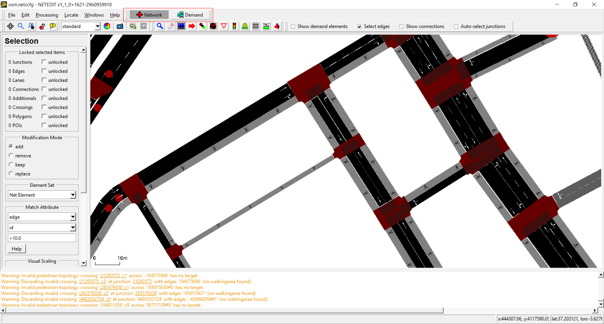Supermodes buttons.

## Common modes

### Inspect

Inspect and modify attributes of edges, lanes, junctions, connections
and additional network items (i.e. bus stops). Modifications have to be
confirmed by hitting <Enter\> (except for Boolean attributes). If the
entered value is not appropriate for the modified attribute, the value
will turn red to indicate the problem.

When inspecting an element that is [selected](#select) along
with multiple elements of the same type this mode behaves differently:

- Only non-unique attributes are listed (i.e. lane-width but not
  lane-ID)
- If the elements differ in their attributes, the whole range of
  occurring values is shown
- All selected elements of the same type are modified at the same time
  when setting a new value

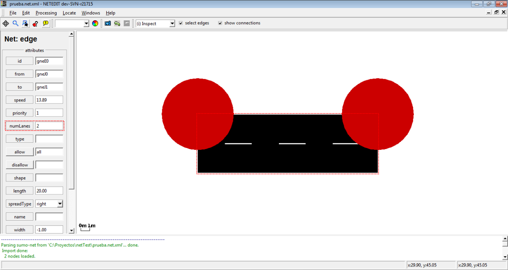Changing the number of lanes of an edge.
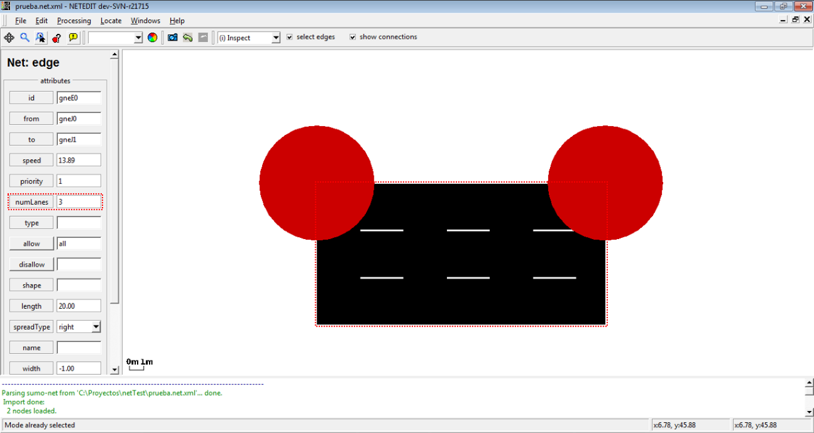Number of lanes of the edge changed

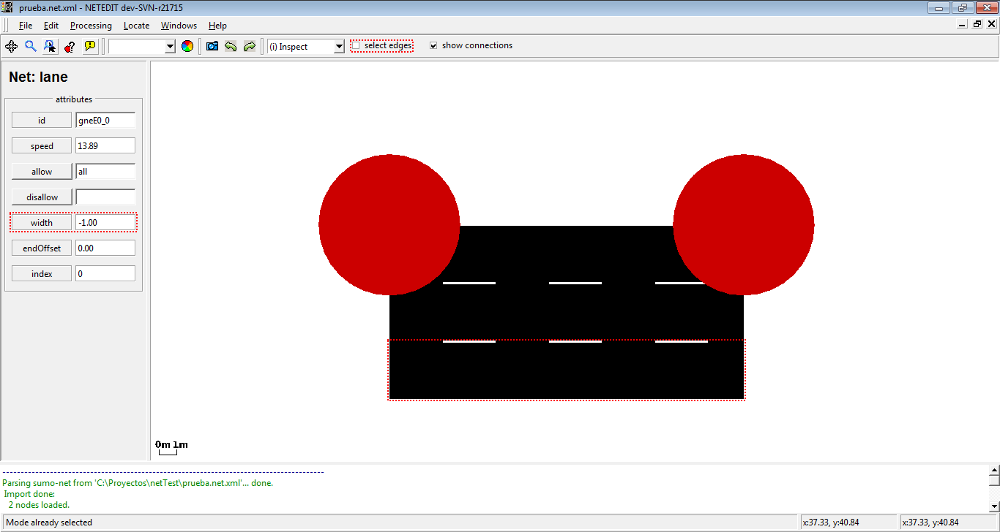Changing the width of a lane. Note that option
"select edges" is disabled. 

Width of lane changed
(gaps will disappear upon triggering recomputation with **F5**)

#### Generic Parameters
Most simulation objects support [Generic Parameters](Simulation/GenericParameters.md) to express custom user data and supplemental configurations. They can be edited with the 'Edit parameters' dialog which is accessible with the 'Edit parameters' button. 

In inspect mode, a serialized form of the parameters is also given. In this form, all parameters are concatenated using the '=' sign between key and value and by using the '|' sign between parameters. Serialization of key value pars that use these separating characters in their key or value is currently not supported by netedit (though permitted by SUMO). 
The serialized form is useful in select mode when selecting objects with a particular parameter.

#### Edge template

When inspecting an edge, the extra buttons *set Edge ... as Template*
and *Copy ... into edge ...* appear in the inspection frame. These can
be used to set default attributes for
[\#Create_Edges](#create_edges) and to copy attributes
between edges.

The following (non-unique) attributes are set/copied:

- speed
- priority
- numLanes
- allow/disallow
- type
- spreadType
- width

When copying attributes from one edge to another, lane-specific
attributes will be copied as well.

### Delete

The Delete mode is used to remove an element of your network. The
following is possible:

- Delete junctions (and all adjoining edges)
- Delete edges
- Delete geometry points of an edge
- Delete a lane (when option *selection edges* is disabled)
- Delete connections (available, when *show connections* is enabled)
- Delete crossings
- Delete additionals

The delete frame own a list of elements that is filled automatically
with the childs of the current element under the cursor. This list of
child elements can be marked using Control + left-Click, and every child
can be centered, inspected or removed individually with a right click
over an element.

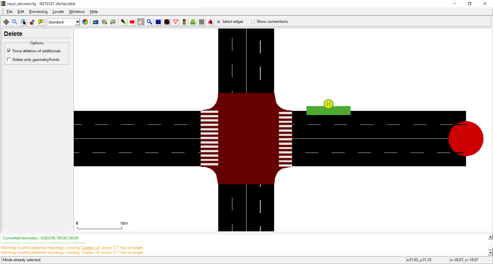General view of the delete frame

Additionally, the delete frame has a list of options to avoid
undesirable deletes:

- Force deletion of additionals: Used to avoid undesirable deletion of
  additionals.

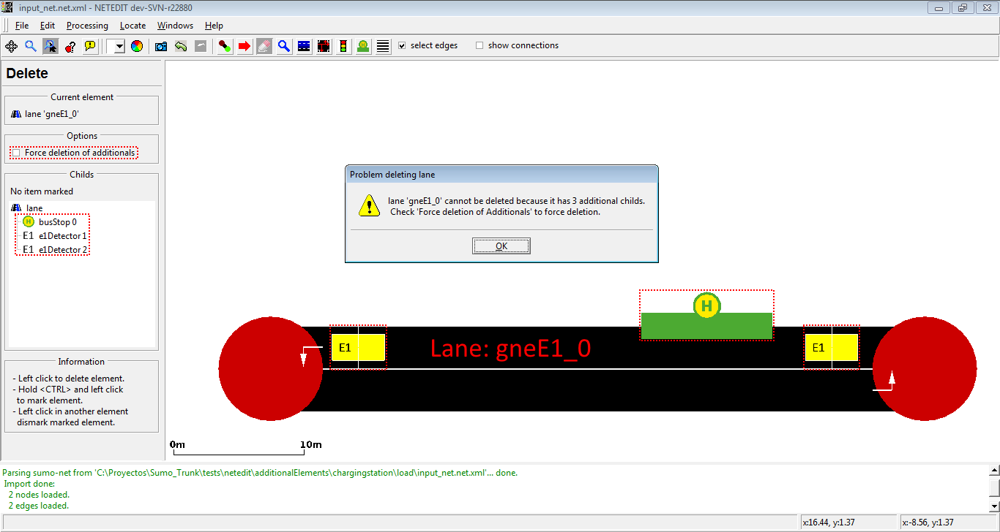If the user tries to remove an element with
additional childs and 'Force deletion of additionals' is disabled,
netedit shows a warning dialog and the element isn't deleted.

- Delete only geometry points: Used to remove only geometry points

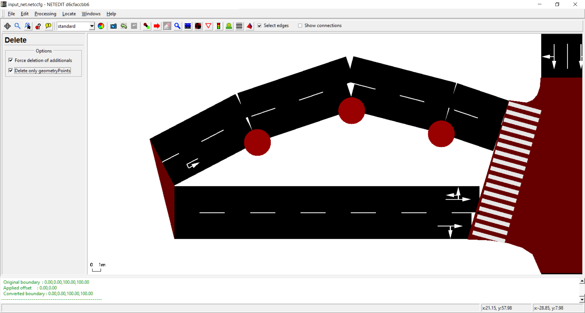Only Geometry points can be deleted

### Select

Select network objects according to various criteria. Selected objects
can be moved or deleted together. It is also possible to set attributes
for all selected junctions (or all edges) at the same time using
**inspect mode**.

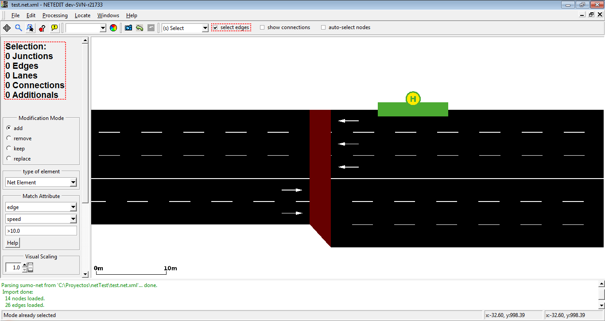The left frame shows information about the current
selected elements. 

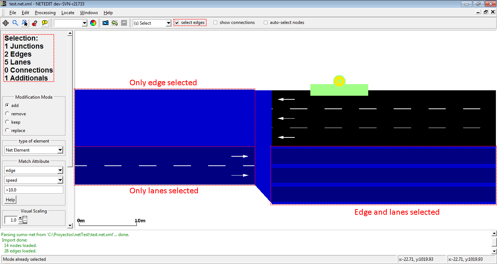Selected elements are painted
with a different color.

#### Methods for selecting

- the selection status of objects is toggled by left-clicking. When
  the *select edges* check-box is unset, lanes, rather than edges will
  be selected/deselected.
- by rectangle-selection via shift+leftClick+drag (When the checkbox
  *auto-select junctions* is enabled, junctions of selected edges will
  be selected automatically)
- by matching object attributes [(see
  below)](#match_attribute)
- by loading a saved selection
- by inverting an existing selection

!!! note
    Junctions and lanes can also be selected by <ctrl\>+<left click\> regardless of editing mode

#### Modification Mode

The *Modification Mode* changes how a new group selection is applied to
the existing selection. A new group selection can be:

- a loaded selection
- a rectangle selection
- a [match-attribute](#match_attribute)-selection

The modification modes have the following functions

- **add**: both selections are added together (in set theory this
  would be called *union*)
- **remove**: all elements from the new selection are removed from the
  old selection. (in set-theory *subtraction*)
- **keep**: only elements common to both selections are kept. (in set
  theory *intersection*)
- **replace**: the existing selection is replaced by the new selection

#### Match Attribute

The 'Match Attribute' controls allow to specify a set of objects by
matching their attributes agains a given expression. When combining this
set with the current selection, the *Modificatiton Mode* is also
applied.

1.  Select an object type from the first input box
2.  Select an attribute from the second input box
3.  Enter a 'match expression' in the third input box and press <return\>

##### Matching rules

- The empty expression matches all objects
- For numerical attributes the match expression must consist of a
comparison operator ('<', '\>', '=') and a number.
  - the attribute matches if the comparison between its attribute
    and the given number by the given operator evaluates to 'true'
- For string attributes the match expression must consist of a
comparison operator ('', '=', '\!', '^') and a string.
  - *(no operator) matches if string is a substring of that
    object's attribute.*
  - '=' matches if string is an exact match.
  - '\!' matches if string is not a substring.
  - '^' matches if string is not an exact match.

#### Special Cases

- For attributes *allow* and *disallow*, the attribute value **all**
  is shown in [\#Inspect](#inspect)-mode when all classes
  are allowed (or disallowed). In this case an edge (or lane) will
  also be selected when using any vClass as match string (and edge
  with attribute `disallow="all"` will also match when filtering for disallow with
  string **passenger**). However, for technical reasons the match
  string **=all** will not match this edge (**all** is expanded to
  **all private emergency passenger bus ... custom1 custom2**).

#### Examples

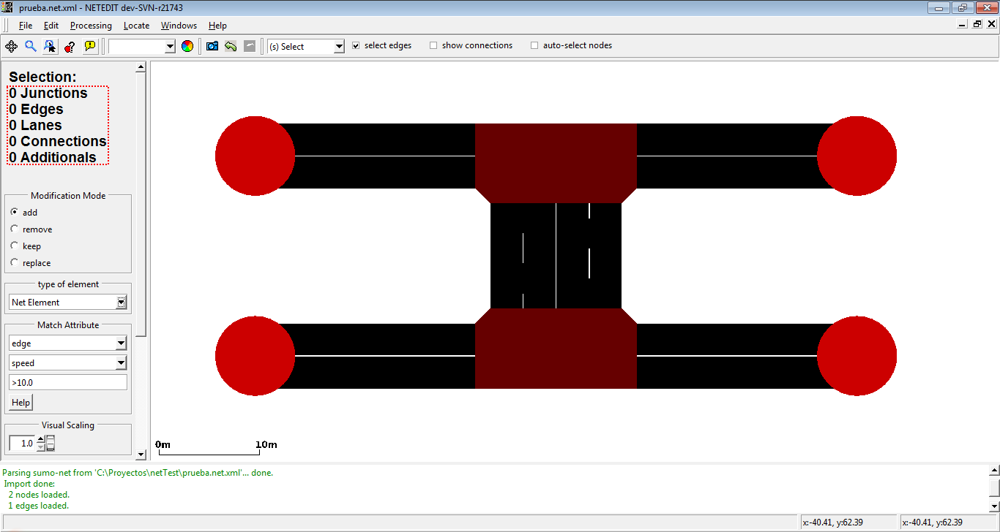We want to select the most external lane of every
edge (i.e. lanes which contains _0 in their id)

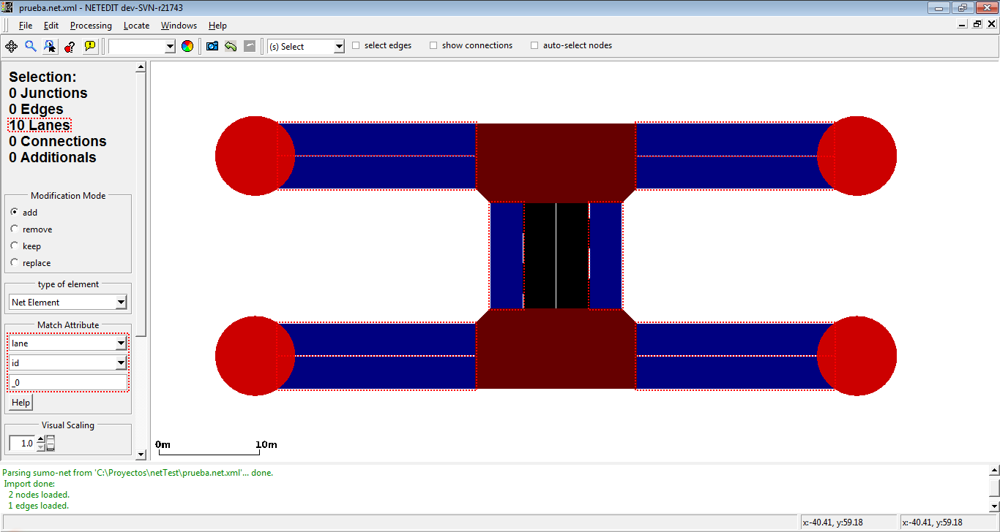We can do it selecting lane as type of element,
and using the match over the attribute "id".

We want now to select the second lane of every
edge (i.e. lanes which contains _1 in their id)

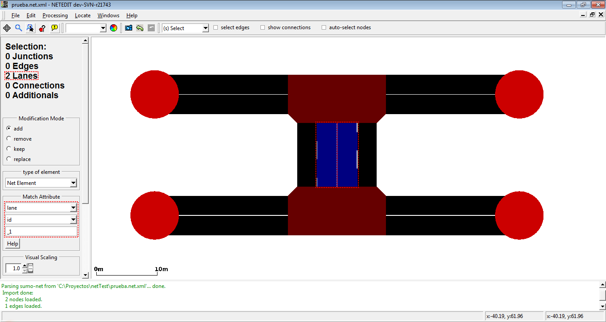Only two lanes are selected because the rest of
edges only have one lane.

We can select all lanes of our net using the
previous selection and the operator "add". 

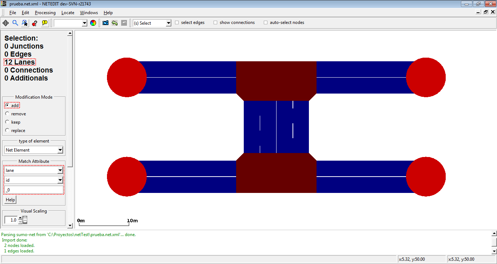All
lanes of the net are selected using selection of lanes which contains
_0 in their id with the "add" operator

With the previous element and the operator invert,
we can select all junctions of the network. 

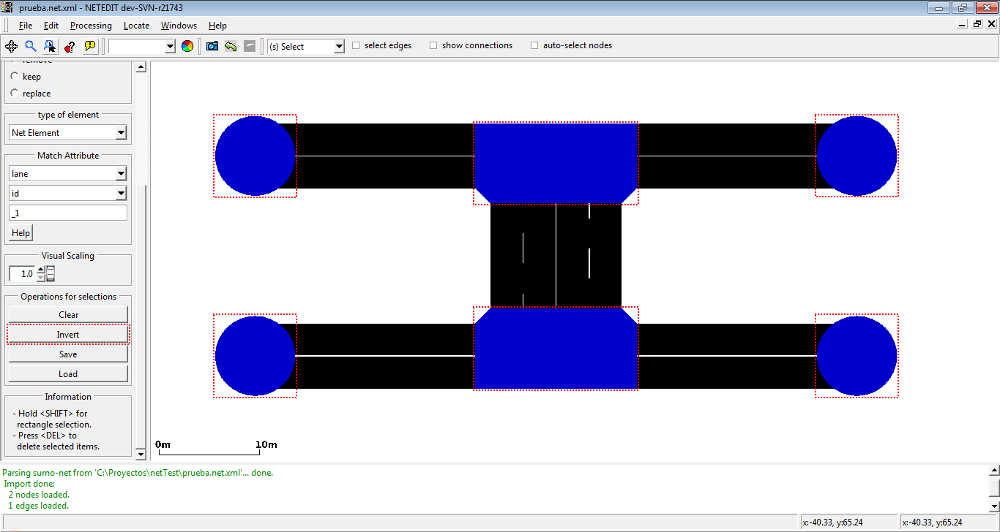Invert
operation select all elements of the net and subtract the current
selected elements

If we have a empty selection, we can select easy
all elements of net . 

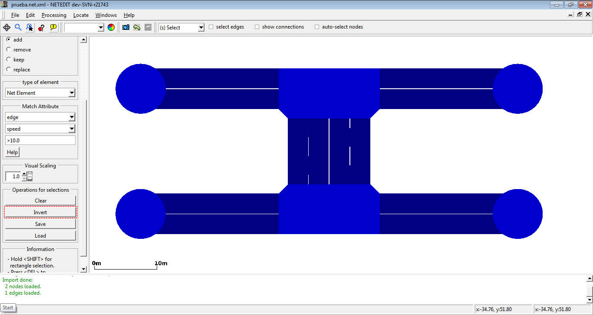With the invert button, we
select all elements of net.

### Move

Move junctions by dragging with the left mouse button. Dragging edges
creates or moves geometry points. Dragging a junction on top of another
junction joins them into a single junction.

By default, the junction shape is updated while moving. However the
final shape after saving or activating full recomputation (F5) may be
slightly different.

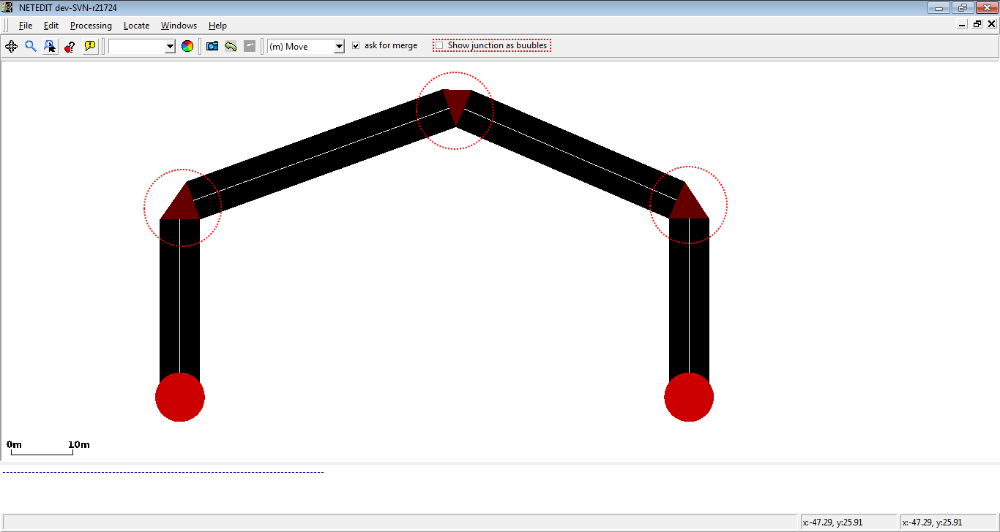By setting the option "show junctions as bubbles",
circles are drawn instead of detailed junction shapes which can improve
visibility.

#### Changing Elevation #####
When checking the 'Elevation' checkbox, elevation of junctions and existing geometry points can be modified by dragging the with the mouse (with their x,y coordinates remaining unchanged). 
At the same time, the numerical elevation value will be displayed for every junction and geometry point. 
It is useful to combine this with [elevation or sloope coloring](Networks/Elevation.md#visualizing_elevation_data).

#### Moving Object Selections

- When selecting neighboring edges and dragging one of them, the
neighboring edge will receive the same shape modifications
- When selecting an edge and its junctions and dragging any part of
the selection, all parts including edge geometry will be moved in
parallel
- When selecting an edge an one if its junctions:
  - When dragging the junction, only the junction will move
  - When dragging the edge, the edge will move locally and the
    junction will move in parallel

#### Moving Polygons and TAZs

- When clicking over an Polygon/TAZ edge or vertex, contour will be moved
- If Polygon/TAZ is inspected an option "block shape" is enabled, then entire shape will be moved
  
## Network specific modes

### Create Edges

This mode creates edges (lanes) and implicitly junctions. The edge
attributes will be taken from the current
[\#Edge_template](#edge_template). If no template is set,
default options such as **default.lanenumber** will be used.

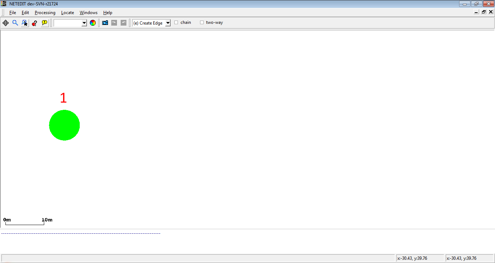In "Create Edge" mode, click over a empty area of
the view to create the junction 

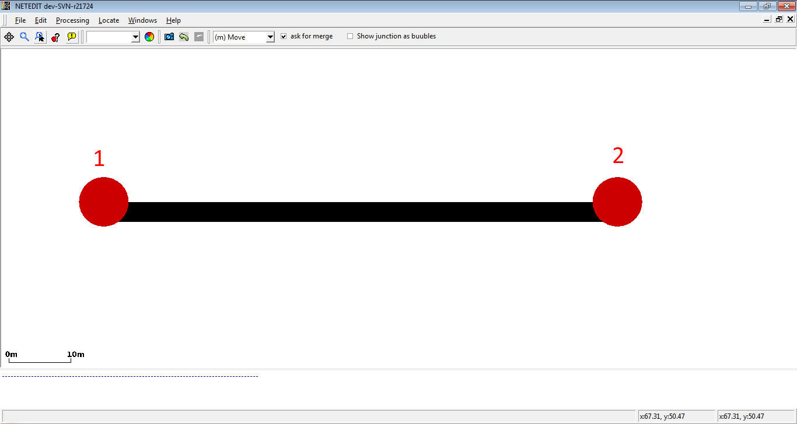Then click in
another empty area to create another junction. An edge with one lane
between both junctions will be created.

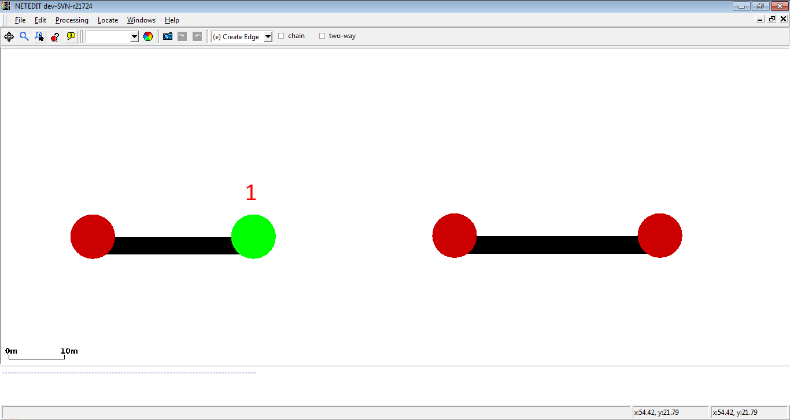To connect two already created edges, click over
the first junction. 

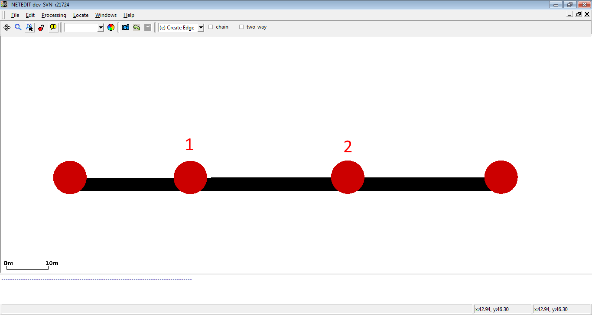Click over the second junction
to create an edge between both.

#### Creating a chain of edges

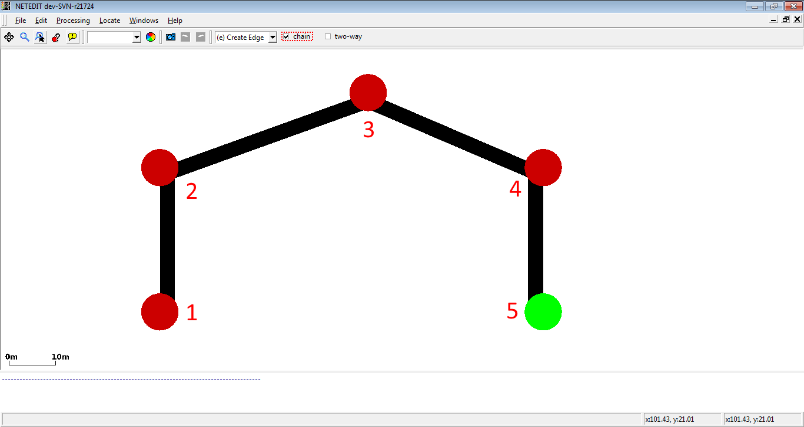A list of connected junctions can be quickly
created by enabling the option *chain*.

#### Creating two-way roads

When setting the option *two-way*, the reverse
direction for an edge will be created automatically (otherwise further
clicks are needed to create the reverse direction manually).

### Edit connections

Connections establish the possible directions that can be taken by a
vehicle when it arrives at a junction.

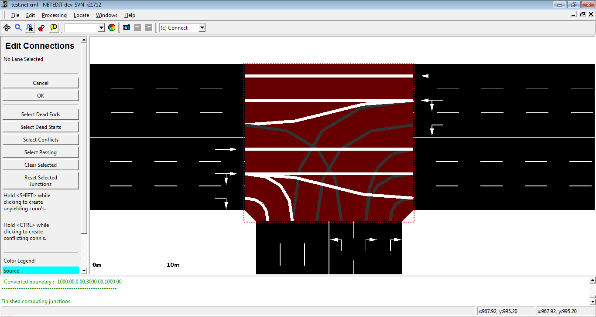Connections in a Junction with six edges and
eighteen lanes

Connection shapes depend of the Junction shapes. If a Junction shape is
too small, the Junction takes a bubble as shape and the connections take
a line as shape

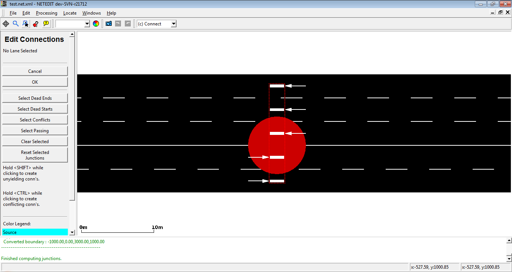Connections in a Junction with a bubble as
shape. 

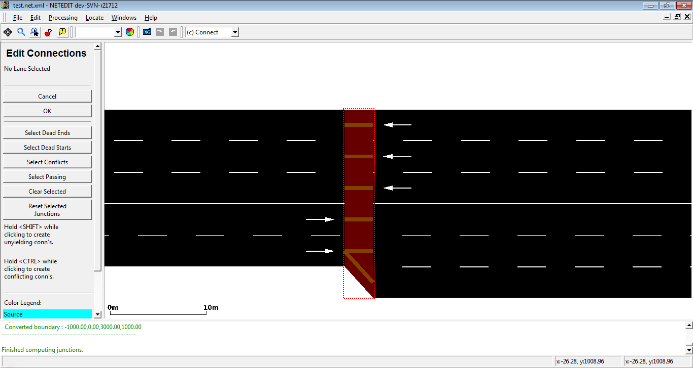Connections in a Junction without a
bubble as shape.

#### Inspecting connections

As the rest of elements of netedit, connections can be inspected and
modified using inspected mode. Note that the option *show connections*
must be enabled. All parameters can be modified excepting *From*, *To*,
*fromLane* and *toLane*.

The connection coloring is done as [in
sumo-gui](sumo-gui.md#right_of_way) with the exception of
traffic-light connections which are brown in inspect-mode.

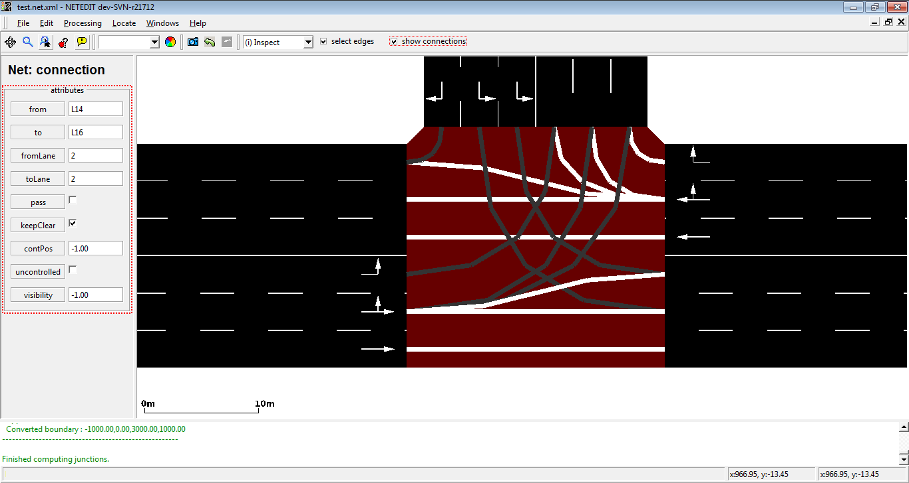Inspecting a connection. Note that check box
"Show connections" is enabled. 

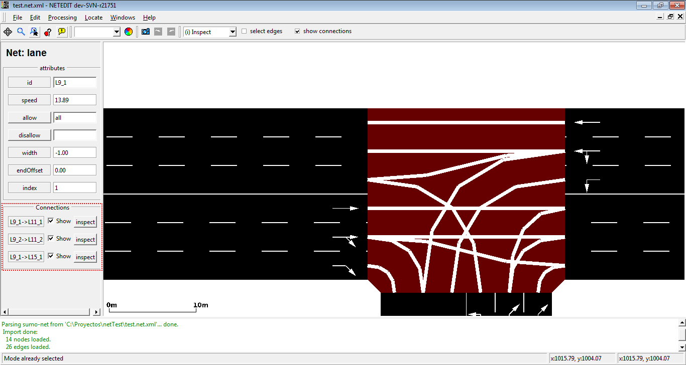Connections
can be inspected through inspection of their **from** lane or it's
corresponding edge.

#### Changing connections

When a new junction is created, or their edges are modified, a set of
new connections is automatically created. But netedit allows also to
customize the connections of a lane using the connection mode. When a
source lane is selected in connection mode all outgoing lanes at the
junction are colored according the the categories below:

| Legend                                                  | Meaning                                    | Result of left-click                                 |
| ------------------------------------------------------- | ------------------------------------------ | ---------------------------------------------------- |
| <span style="background:#00FFFF">Source</span>          | The source lane for editing connections                                                         | Nothing                                                                                                                 |
| <span style="background:#00FF00">Target</span>          | The lane is already connected from the source lane.                                             | Remove connection                                                                                                       |
| <span style="background:#008800">Possible Target</span> | The lane is not yet connected.                                                                  | Add connection (with shift-click, set `pass="true"`)                                                                                 |
| <span style="background:#FF00FF">Target (pass)</span>   | The lane already connected and this connection is forcibly set to have priority (attribute `pass="true"`)    | Remove connection                                                                                                       |
| <span style="background:#FFFF00">Conflict</span>        | The lane is not yet connected. Adding a connection would be unusual for some reason (see below) | Print reason for conflict in status bar. (with ctrl-click add connection, with ctr+shift+click create connection with `pass="true"`) |

To deselect the source edge or cancel the declared connections press
**<ESC\>** or click the *Cancel*-Button. To confirm the change press
**<ENTER\>** or click the *OK*-Button.

###### Conflict reasons

- [double
  connection](Networks/PlainXML.md#multiple_connections_from_the_same_edge_to_the_same_target_lane).
  Usually each lane only has one predecessor from the same edge. A
  counter-example would be a [zipper
  node](Networks/PlainXML.md#node_types).
  May also be useful to model bus bays.
- Incompatible permissions: The source and target lanes have no
  [allowed vehicle class](Simulation/VehiclePermissions.md) in
  common
- Connection from sidewalk: Lane-to-lane connections for pedestrians
  are usually not defined by the user. Instead, the connectivity is
  modeled with [pedestrian
  crossings](Simulation/Pedestrians.md#generating_a_network_with_crossings_and_walkingareas).

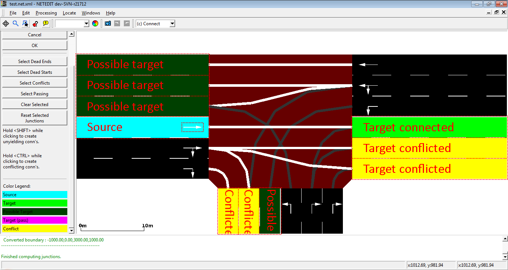Colors of the possible objective lanes change.
In this example, the objective lanes are divided into **Target
Connected**, **Possible Target** and **Target Conflicted**.

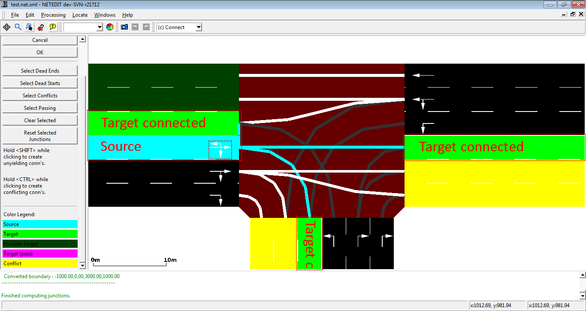Creating two more connections.

Removing all connections.

### Prohibitions

This mode shows right of way-rules for any selected connection using a
color code. To select another connection, cancel the current one with
<ESC\>.

### Traffic Lights
Set junctions to be controlled or uncontrolled by a traffic light. Edit
all aspects of static or actuated signal plans. Visualizes a signal
phase by coloring the controlled lane-to-lane connections according to
the signal state. 

When entering this mode, each traffic light controlled junction is indicated with a traffic light icon.
- Click on an uncontrolled junction to add a traffic light
- Click on a controlled junction to make it uncontrolled, add a program (copy) or change a program.

Editing signal states can be accomplished in either of
the following ways:

- right-clicking on any controlled lane and picking a new state
  (color).
- right-clicking on any of the incoming lanes to change all controlled
  connections from that edge
- If the lane is currently selected, all connections from selected
  lanes incoming to the traffic light will be changed as well
- If the edge is currently selected, all connections from selected
  edges incoming to the traffic light will be changed as well
- If the check-box *apply change to all phases* is activated, all
  phases of the current plan will be affected

You can also change the state by editing the phase table directly.

#### Joined Traffic Lights
To edit the program of a joined traffic light, any of its junctions can be clicked in traffic light mode.
This will cause connections from all controlled junctions to be highlighted.

To create a joined traffic light you need to use inspect mode:

- make all junctions controlled by a traffic light
- set their 'tl' attribute (traffic light id) to the same value

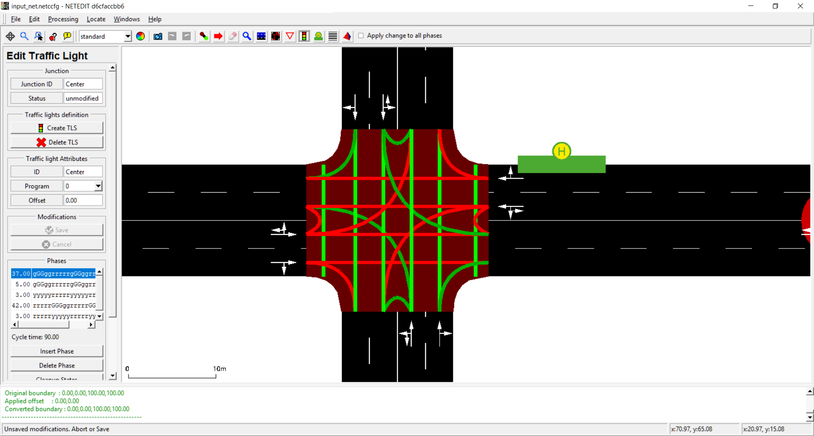General view of the TLS frame

### Additionals

Add additional elements to the net. Additionals can be placed over a
lane or in an empty place of the map. See
[\#Additional_elements](#additional_elements) for more
information. They are saved to a separate file ({{AdditionalFile}}) and are loaded
separately when running the simulation

### Crossings

Add [pedestrian
crossings](Networks/PlainXML.md#pedestrian_crossings)
for use with [pedestrian simulation](Simulation/Pedestrians.md).
Crossings are define relative a junction and edges at this junction.
Their width can be customized and they can either be configured as
priotized (zebra stripes) or unprioritzed (vehicles have right of way).

Crossings are added using the following steps:

1.  activate crossing mode (R)
2.  select a junction
3.  select edges that shall be crossed
4.  click *Create Crossing*

!!! note
    For crossings to be visible in **netedit**, the *Compute Junctions (F5)* functionality must be triggered at once.

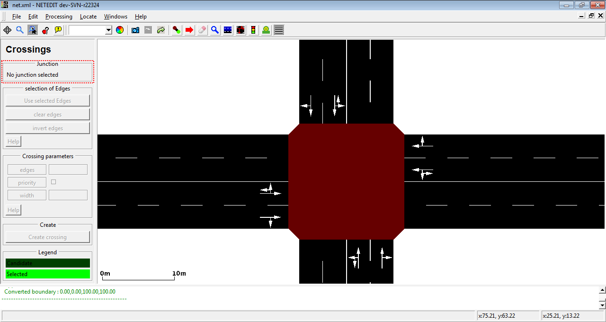In crossing mode, first a junction must be
selected. 

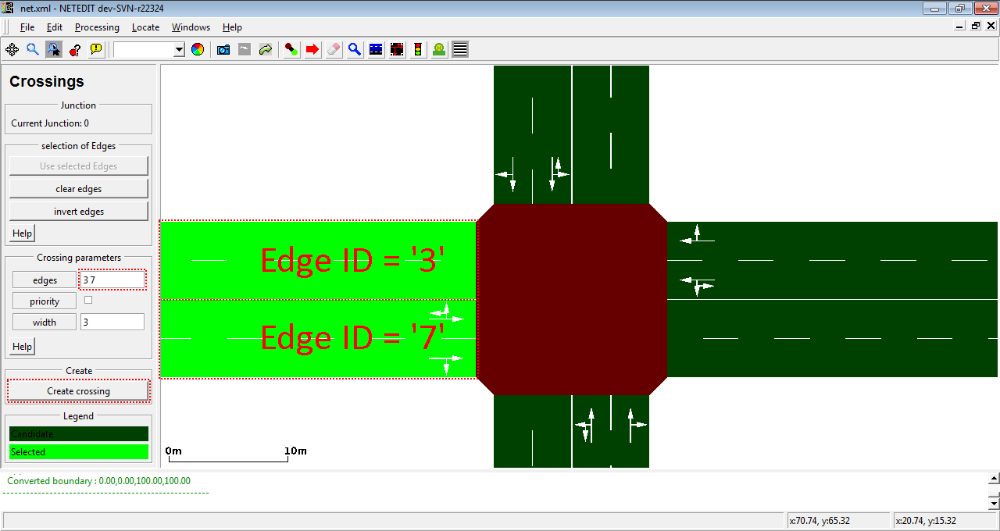Click over junction's edges to
select the edges of crossing.

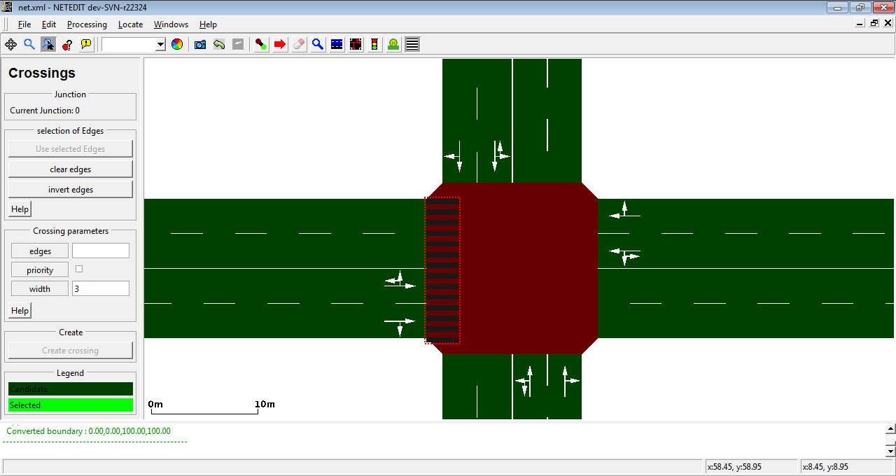After click over "Create crossing" and
recomputing (F5) the new crossing is visible.

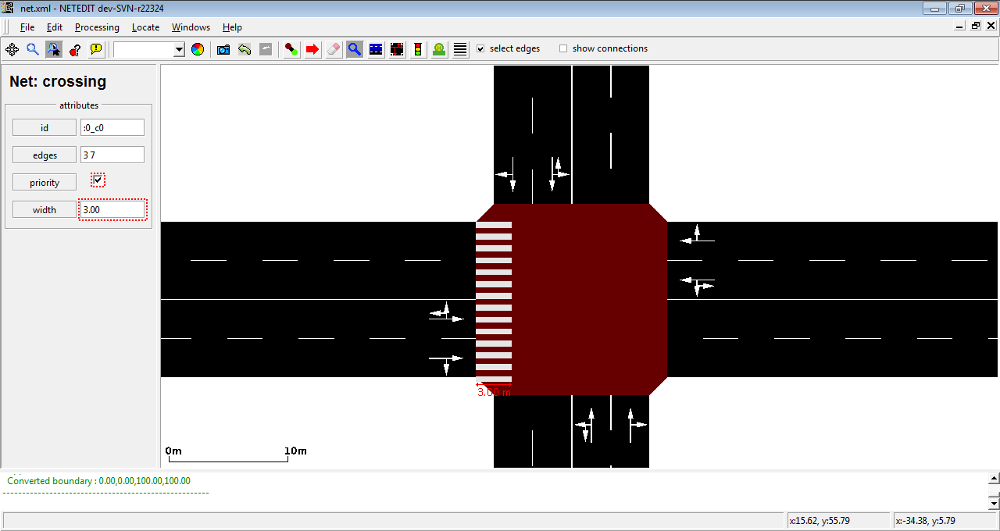Crossing can be inspected as other elements.

Internally, crossing works as edges, and therefore they appear in the
*net.xml* as edges with different functions (crossing or walkingarea)

```
... previous element of net.xml ...
    <edge id=":0_c0" function="'''crossing'''" crossingEdges="3 7">
        <lane id=":0_c0_0" index="0" allow="pedestrian" speed="1.00" length="13.10" width="3.00"
        shape="43.45,56.55 43.45,43.45"/>
    </edge>
... ...
    <edge id=":0_w1" function="walkingarea">
        <lane id=":0_w1_0" index="0" allow="pedestrian" speed="1.00" length="13.10" width="3.00"
        shape="44.95,43.45 41.95,43.45 41.95,56.55 44.95,56.55"/>
    </edge>
... further elements of net.xml...
```

### TAZ (Traffic Analysis Zones)

This mode allows creating and editing
[TAZ](Demand/Importing_O/D_Matrices.md#describing_the_taz).
(Shortcut Z). TAZs are composed of a closed polygon and a list of edges
associated with certain weights for the inputs (Sources) and outputs
(Sinks) (Similar to a [Flow
Network](https://en.wikipedia.org/wiki/Flow_network)).

The creation of TAZs require two steps:

1\) **Creation of the polygon (similar to a polygon shape):** Press
*Start drawing* button (or alternatively press ENTER key) and click over
the view with the mouse left button to add vertices. Press Shift + mouse
left button to remove the last created vertex. To finish creating
polygon, press *Stop drawing* button (or alternatively press ENTER key
again). To abort the creation of the polygon press *Abort drawing*
button (or alternatively press ESC key)

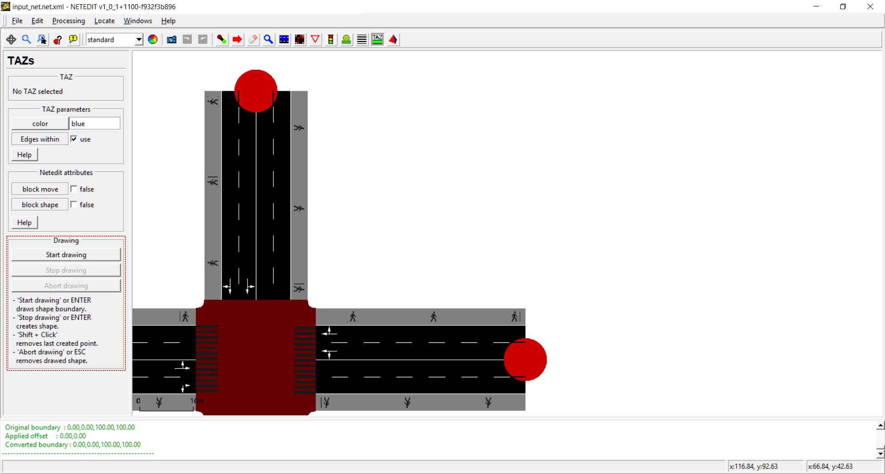Basic view of TAZ creation controls

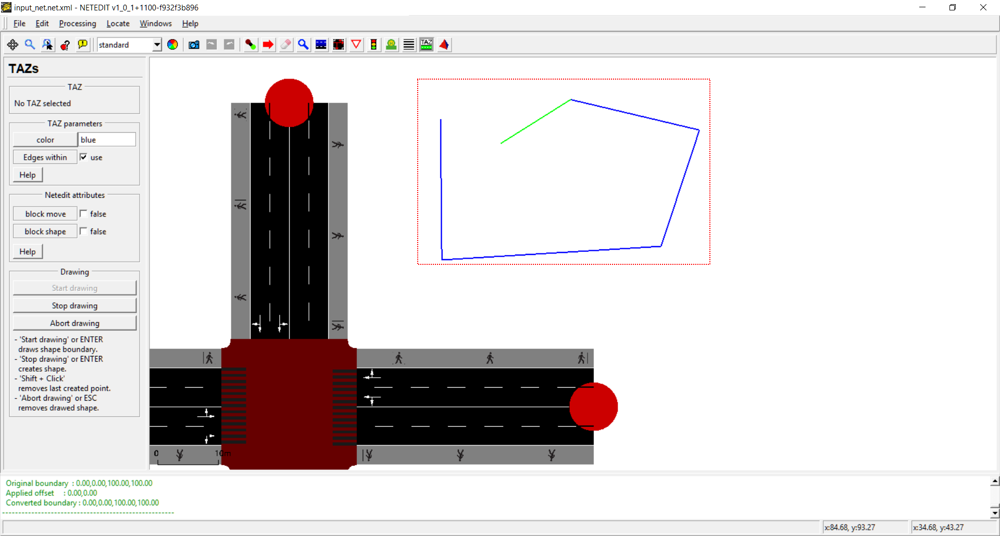Creating a TAZ

2\) **Definition of Edges and its inputs (sources) and outputs
(sinks)**: A single click over a TAZ open the editing fields for
TAZEdges in side menu. If the checkbox *Membership* is enabled (Toogle)
box, a click over an edge will add it to the list of edges vinculated to
the TAZ, (Or will be removed from the list if it was previously
selected). Edge will will be added to the list with the input/output
values given in the *New source*/*New sink* text fields. (note: A TAZ
Edge always has a Source and a Sink).

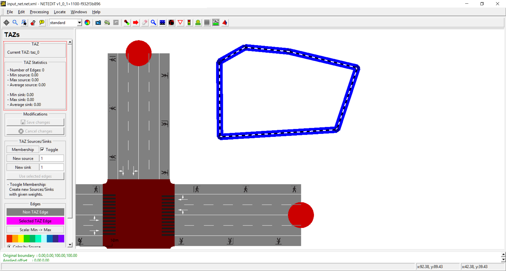Controls after clicking over a TAZ
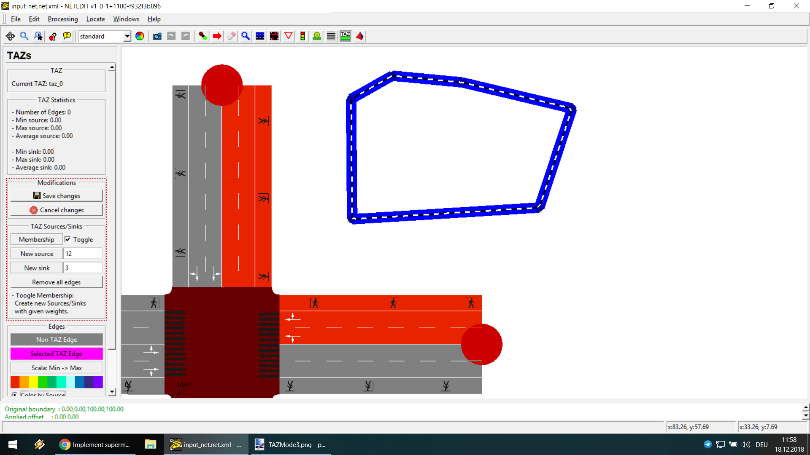Creating two TAZEdges

**Selecting and editing TAZ Edges:** If checkbox *membership* is changed
to "keep", then TAZ Edges can be selected individually and their values
changed. A multiple selection using a rectangle is possible with shift +
right. Statistics of selected TAZEdges can be observed in "Selection
Statistics"

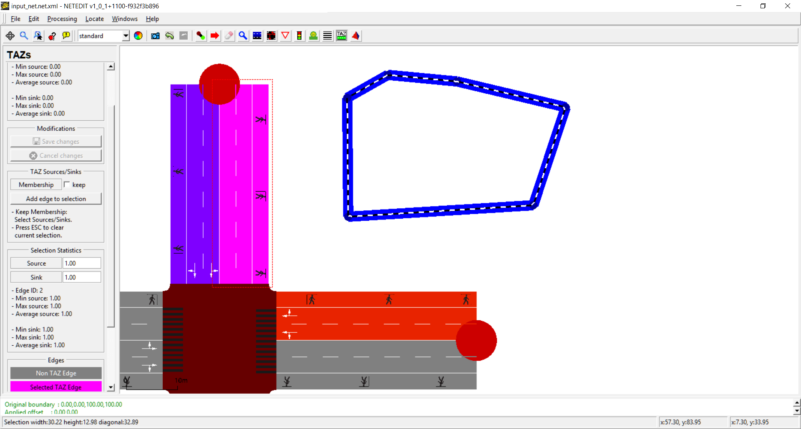TAZ Edge selected (Pink) 

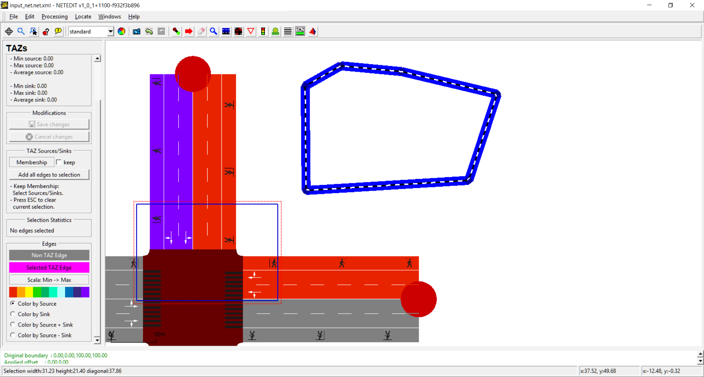Selecting using rectangle

**Saving and discarding changes:** All changes in TAZEdges has to be
saved using button "Save Changes", or in the same way can be also
discarded using "cancel changes" button.

### Shapes

This mode allows the creation of
[Polygons](Simulation/Shapes.md#polygon_definitions) and [POIs
(Points of
Interest)](Simulation/Shapes.md#poi_point_of_interest_definitions)
through Polygon mode (hotkey ‘P’). These objects are used for
visualization and can also be accessed via TraCI. In the polygon frame
you can select the type of shape to edit (Polygons or Point Of
Interest), and the corresponding parameters for each one.

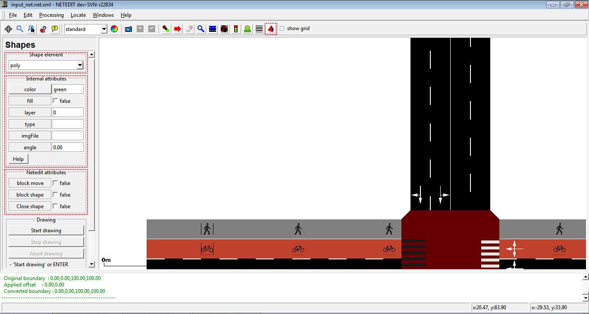General view of the shape frame.
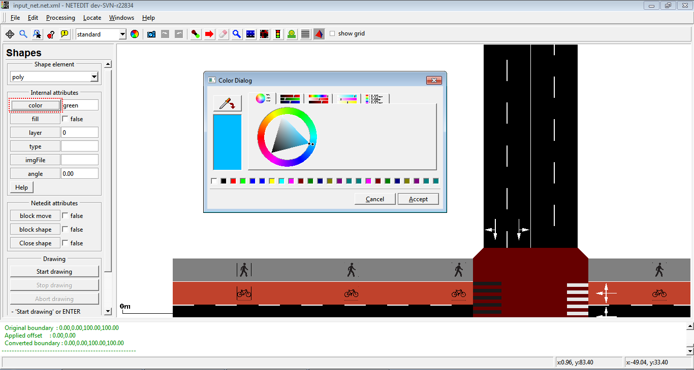Color can be edited clicking over
button "color".

One polygon is composed of mainly an exterior line called “shape”. In
order to create a shape, you have to click on the button “start drawing”
(or enter key), and click on the View above each of the points that will
form the shape. To end the edition, you have to click on “stop drawing”.
A right click on View will remove the last point created and the button
“abort drawing” (or ESC key) will cancel the process of the creation
of the shape. If you want to create a closed shape, you have to activate
the option “closed shape” before starting to draw. The shape of the
polygon can be opened or closed with the contextual menu or through the
Inspector mode.

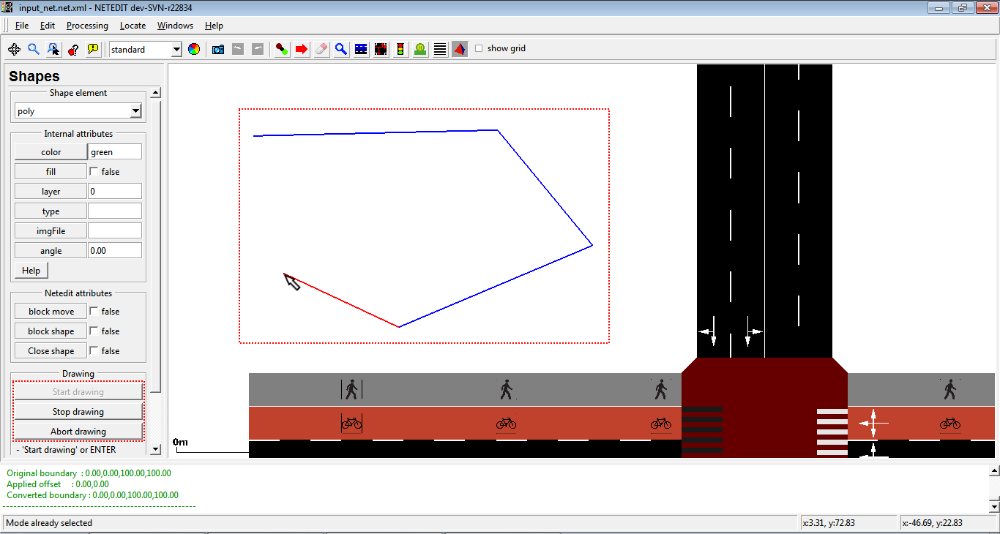Creation of polygon.
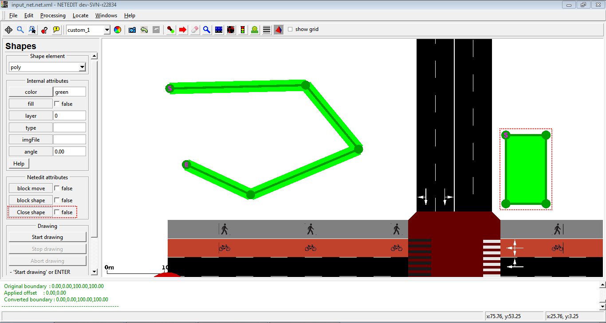Polygon with shape closed.

The points of a shape can be edited in the Move mode by clicking on the
outline to create a new point or above an already existing one in order
to modify its position. If a point moves to the same position of an
adjacent point, they fuse together, and if the final point moves to the
position of the initial point, the polygon gets closed. If the polygon
has the option “block shape” activated, it won’t be editable, but only
moved as a set.

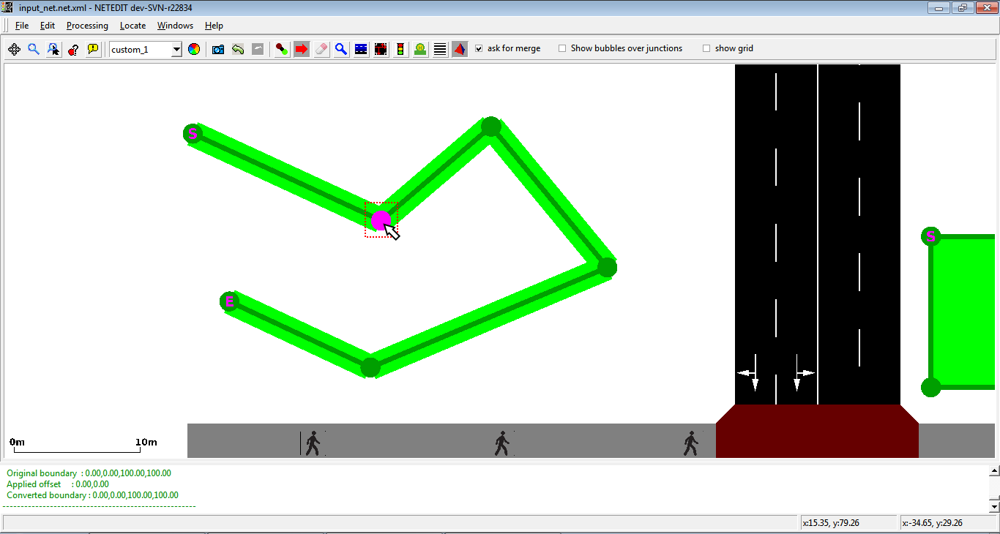Moving Polygon's shape point.
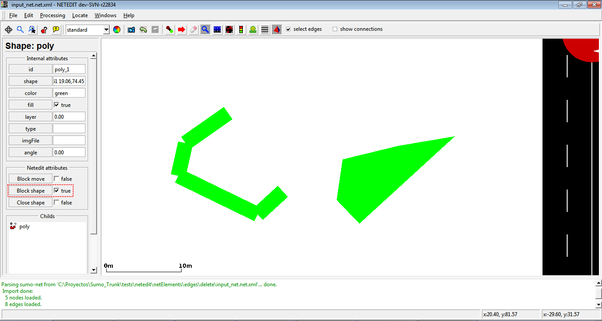Polygons with shape blocked.

Besides, the contextual menu offers several options, like the
aforementioned open or close shape, simplify the shape, erase a vertex
of the shape and establish a vertex of the shape as the initial one.

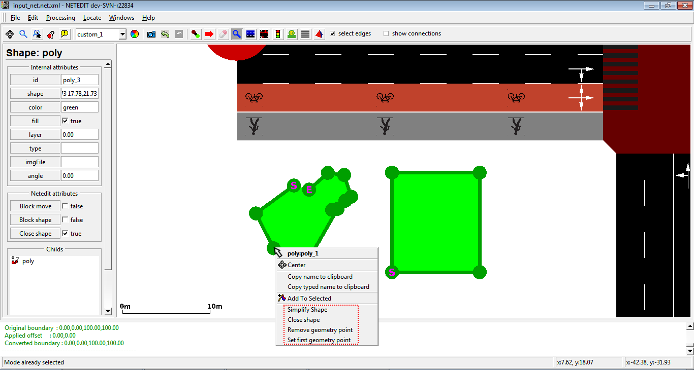Contextual menu of polygon. Left
click over verte show more options.

The Points Of Interest (POIs) are the locations in the map used to mark
several elements relevant to the simulation, which don’t interact with
the rest of elements (monuments, special buildings, etc.). As default,
they are represented as a colored point, but can also be depicted using
an image.

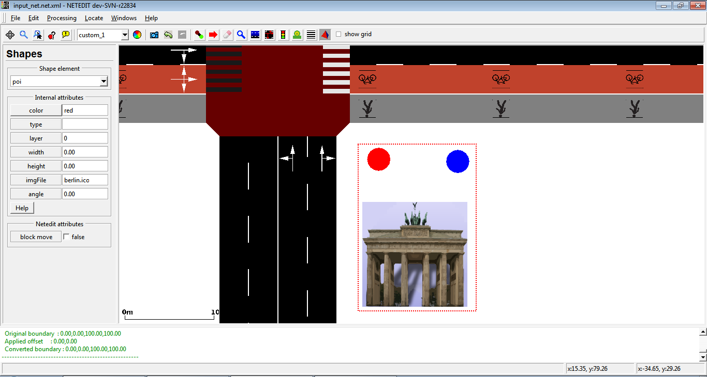Example of POIs with and without imgFile

## Demand specific modes

### Route mode

New route over the current infrastructure can be created using this
mode. Routes are created clicking over consecutive edges (marked with
different colors) and pressing "create route" button or Enter key. Route
creation can be aborted using "abort creation" button or pressing ESC
key. Note that Routes can be created between edges that aren't connected
thought a connection.

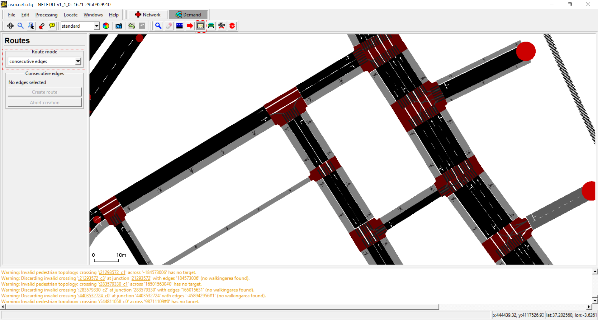General view of Route Mode
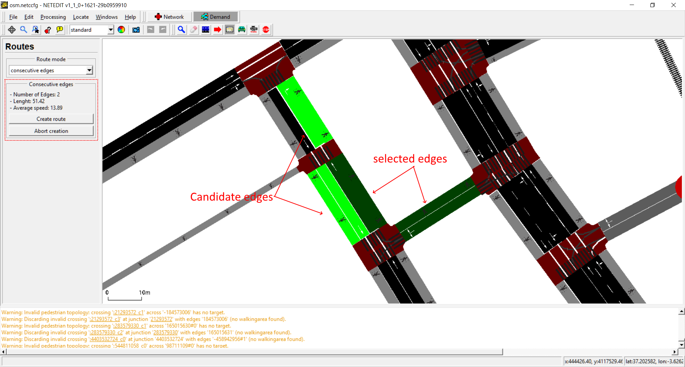Creating a new route. Current selected edges
and candidate edges are marked with different colors

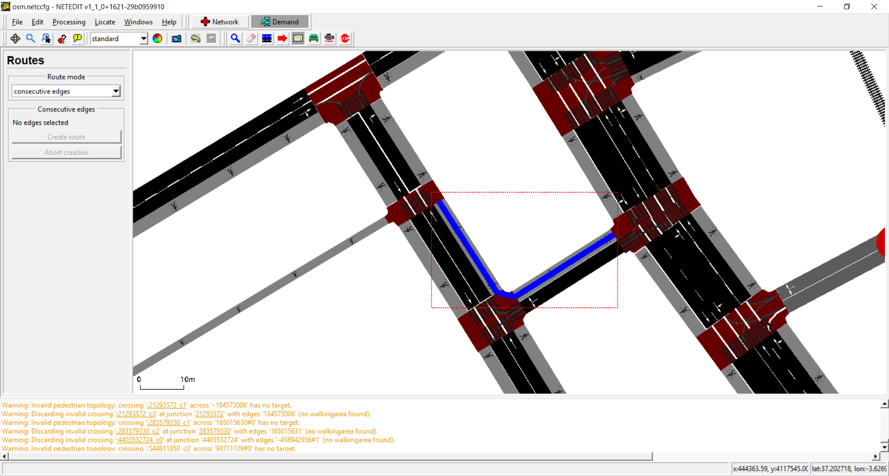Created route.
Inspecting route.

### Vehicle mode

Vehicles, flows and trips can be created using this mode. The term
"vehicle" includes three different elements: Vehicles, flows (both
placed over a Route) and Trips (placed over a "from" edge). Also every
vehicle need to be a "Vehicle Type", therefore both parameters has to be
selected in both list of left frame.

General view of vehicle mode, highlighting
the list of vehicles and vehicle types
Creating a single vehicle clicking over
route

Creating a flow. It's similar to a
vehicle, but with extra parameters, and note that certain are disjoint
parameters. 
Creating a trip. In this case
we need to specify a "from" and "to" edge, therefore we need to click
over two edges. After clicking over edges, press "finish route creation"
or Enter Key to create a trip. If more than two edges are clicked, it
will be interpreted as "via" edges

Inspecting a flow. Note the disjoint
parameters 
Inspecting a trip. In this case
the route is highlighted. Note that a change in the infrastructure can
be change the route trip.

### Vehicle Type mode

Vehicle types can be created and edited using Vehicle Type mode. A
vehicle Type isn't a visual element that can be observed in the view,
but is an "abstract" element that have a big influence in other elements
(for example, vehicles). Every simulation has always two default
vehicle types for Vehicles and Bikes. This default vehicle
type can be edited but not deleted, and only is written in XML if one of
their default value is modified. Due a Vehicle Type has a big number of
parameters, only the most relevant parameters can be edited in left
frame. To edit advanced parameters, use the Vehicle Type Dialog opened
thought "Open attribute editor" button.

General view of Vehicle type Mode
Creating a new vehicle type. Note that
non-default vehicle types can be deleted using "Delete Vehicle Type"

Editing values of a default vehicle
type (Length and Color). Note that this changes has influence in the
existing vehicles 
Opening Vehicle Type
attribute editor. Default values are shown in gray color

Editing values of a vehicle type using
attribute editor.

### Stops mode

Stops used by all type of vehicles (Vehicles, Flows and Trips) can be
created using StopFrame. Stops is an special type of demand elements,
because it always depend of either a route or a vehicle (i.e. It can be
writted in XML within the definition of either a route or a vehicle).
Before creating a new Stop, their demand element parent has to be
selected and the stop type (placed over a Lane or over a stopping
Place). To create it, simply click over a lane or over a stopping place.

General view of Stop Mode. Route and stop
type can be selected in frame. 

Created stop
within the blue route placed over a lane.

Created stop within the blue route placed
over a busStop. If geometry of BusStop is changed, geometry of Stop will
be also changed. 
Inspecting a Stop placed
over a lane.

Inspecting a Stop placed over a busStop.

### Person Type mode

Vehicle types can be created and edited using Person Type mode. A person Type isn't a visual element that can be observed in the view, but is an "abstract". Every simulation has always a basic default pedestrian type. This default pedestrian type can be edited but not deleted, and only is written in XML if one of their default value is modified.

Person Type frame


### Person mode

Persons and personFlows are elements that always requires an auxiliary element called "person plan" to exist. There are four basic types (Trips, Rides, Walks and Stops), and within each several subtypes (Using edges, lanes, routes ...). Therefore, to create a person,their first "Person plan" has to be created at the same time. The person plan frame has two parts: One dedicated to the creation of the person, and another to the creation of the first person plan.

Person Plan frame.

Creating person trip clicking over edges

Created persons.

Clicking over a person highlights their person plan

Person plans have different subtypes (in this case, a walk that ends in a busStop)

Creating a walk that ends in a busStop

Created walk

Person plans can be sorted clicking over person plan in hierarchy. 


Sorting person plans.


### Person plan mode

Person plans can be extended using the PersonPlan frame. Once the Person plan frame is opened, a person or a personFlow has to be chosen. Then the last edge of the plan will be marked, and the new created person plans will start from there.

Person_0 has only a trip, and the last edge of person's trip is marked (green)

Multiple person plans can be added continuously

## Data specific modes

### Edge data mode

Edge data

### Edge rel data mode

Edge rel data


# netedit elements

This elements comprise the road network and can be created and modified
with **netedit**.

## Network Elements

### Junctions

[Junctions](Networks/PlainXML.md#node_descriptions),
(also referred to as *Nodes*), represent intersections. A SUMO junction
is equivalent to a Vertex in graph theory.

Example of different junctions

### Edges

In the SUMO-context,
[edges](Networks/PlainXML.md#edge_descriptions)
represent roads or streets. Note that edges are unidirectional. It's
equivalent to a edge in a graph theory.

Example of edge. Note that the box "select edge" is
**checked**

### Lanes

Each SUMO edge is composed of a set of
[lanes](Networks/PlainXML.md#lane-specific_definitions)
(At least one).

Example of lane. Note that the box "select edge" is
**unchecked**

### Connections

[Connections](Networks/PlainXML.md#connection_descriptions)
describe how incoming and outgoing edges of junctions are connected (for
example to prohibit left-turns at some junctions).

Example of connection between a source lane and
a target lane

### Traffic Lights

A [traffic light
program](Networks/PlainXML.md#traffic_light_program_definition)
defines the phases of a traffic light.

Example of Traffic light

## Additional elements

*Additionals* are elements which do not belong to the network, but may
be used to influence the simulation or generate specific outputs.
Additionals are defined in an {{AdditionalFile}} and can be loaded in
**netedit**. Additionals are created in the
*Additionals* editing mode (shortcut key: a). Once this mode is
selected, the first step is to choose what kind of additional should be
created in the comboBox "additional element". Once selected and if
required, the parameters of the additional can be changed. Finally, with
a click over a Lane/junction/edge (If the additional should be set over
an element of the network), or over an empty area (if the item is
independent of the network) the additional will be created.

Menu for loading additionals
Frame to insert additionals

### Move and references

Additionals can be moved, but the freedom of movement depends of their
relation with the network. Additionals that must be located over a lane
can only move along the lane, and additionals that are located on a map
can be moved in any direction. The movement also depends if the item is
locked or not (symbolized by a lock icon on the item). The movement can
be blocked during the creation of the element. The corresponding
parameter can be changed within the *inspector* mode. Certain
additionals have a length contingent to the length of the lane. To
create a bus stop by choosing a reference point, which marks the initial
position of this additional element, three types of references for the
length can be selected. E.g. for a bus stop with the length 20 in the
point 50 of the lane it will be the following:

- Reference left will create a new bus stop with startPos = 30 and
  endPos = 50.
- Reference right will create a new bus stop with startPos = 50 and
  endPos = 70.
- Reference center will create a new bus stop with startPos = 40 and
  endPos = 60.

Movement of different additionals
Additional locked and unlocked

Some additional types cannot be moved, therefore show a different icon:


Example of additional that cannot be moved

### Parameters

There are two types of parameters for each additional:
User-defined-parameters and **netedit**-parameters.
The first mentioned parameters can be of type *int*, *float*, *bool*
*string*, or *list* and each has a default value. In the case of type
*list* the user can add or remove values using the *add* or *remove*
*row* buttons. In the case of the characteristic parameters of
**netedit**, this is the option to block the movement
of an element, and in the case of the elements have a length, the user
is allowed to change the length and reference.

Adding a list of bus stop lines
Adding additional with different references

### Additional sets

Additional sets are additionals that comprise or contain another
additionals (called childs) (For example, *detectorE3* contains a list
of *detEntry* and *detExit*). Additional sets are inserted in the same
way as an Additional, but the insertion of an additional child is
different. Before the insertion of an additional child in the map, the
ID of the *additionalSet* parent must be selected in the list of IDs
placed on the left frame. In this list the IDs of the additional sets
only appear when they can be parents of the additional child (Referring
to the given example: if the user wants to insert a *detEntry*, than
only IDs of *detectorE3* will appear in the list on the left frame).
Additional sets and their childs are graphically connected by a yellow
line.

Insertion of an additional Set

### Help dialogs

With the help buttons placed in the left frame, users can obtain
information about additional and editor parameters (Full name, type and
description).

Help window for parameters
Help window for editor parameter

### Additional types

This section describes the different types of additional objects which
are supported

#### Stopping Places

Stopping places are sections of lanes, in which vehicles can stop during
a certain time defined by the user.

##### Bus stop

[Bus stops](Simulation/Public_Transport.md) are positions of a
lane in which vehicles ("busses") stop for a pre-given time. Every Bus
stop has an unique ID assigned automatically by
**netedit**, a length and a list of bus lines defined
by the user.

Bus stop

##### Container stops

[Container stops](Specification/Logistics.md) are similar to
BusStops, but they are oriented towards [logistics
simulation](Specification/Logistics.md).

Container stop

##### Charging station

[Charging stations](Models/Electric.md#charging_stations) define
a surface over a lane in which the vehicles equipped with a battery are
charged. Charging stations own an unique-ID generated by
**netedit**, a length, a charging power defined in W,
a charging efficiency, a switch for enable or disable charge in transit,
and a charge delay.

Charging station

##### Parking Areas

!!! caution
    Incomplete.

##### Parking Spaces

!!! caution
    Incomplete.

#### Detectors

Detectors are additionals which save information about vehicles that
passed over a certain position on the lane.

##### Induction Loops Detectors (E1)

A [E1
detector](Simulation/Output/Induction_Loops_Detectors_(E1).md)
owns a ID parameter generated by **netedit**, a
position at a certain lane, a *freq* attribute which describes the
period over which collected values shall be aggregated, a list of
*VTypes* that will be detected, and a *file* attribute which tells the
simulation to which file the detector shall write his results to.

Detector E1

##### Lane Area Detectors (E2)

Most of the [E2
detectors](Simulation/Output/Lanearea_Detectors_(E2).md)'
attributes have the same meaning as for [E1 induction
loops](Simulation/Output/Induction_Loops_Detectors_(E1).md),
including automatic ID and position at a certain lane. As a real
detector has a certain length, "length" must be supplied as a further
parameter. It may be a negative number which let the detector be
extended, upstream to the given start position. The optional parameter
"cont" lets the detector continue over the current lane onto this lane's
predecessors when the detector's length plus his position is larger than
the place available on the lane.

Detector E2

##### Multi-Entry Multi-Exit Detectors (E3)

A [Detector
E3](Simulation/Output/Multi-Entry-Exit_Detectors_(E3).md)
is an AdditionalSet with the same attributes as [Induction Loop Detector
E1](Simulation/Output/Induction_Loops_Detectors_(E1).md). The
difference is that detectors E3 have as childs the Entry/Exit detectors.

Detector E3

##### DetEntry/DetExit

Childs of an AdditionalSet [Multi-Entry Multi-Exit Detectors
E3](Simulation/Output/Multi-Entry-Exit_Detectors_(E3).md).
These additionals have only the attributes ID of a lane in which it is
placed and positioned over a lane.

Detector entry 

Detector exit

##### Instant Induction Loops Detectors (E1Instant)

A [E1
detector](Simulation/Output/Induction_Loops_Detectors_(E1).md)
owns a ID parameter generated by **netedit**, a
position at a certain lane, a *freq* attribute which describes the
period over which collected values shall be aggregated, a list of
*VTypes* that will be detected and a *file* attribute which tells the
simulation to which file the detector shall write his results to.

Detector E1 Instant

#### Route Probe

[RouteProbe detectors](Simulation/Output/RouteProbe.md) are
meant to determine the route distribution for all vehicles that passed
an edge in a given interval. Their real-world equivalent would be a
police stop with questionnaire or a look into the database of navigation
providers such as TomTom.

Route Probe

#### Calibrator

A [calibrator](Simulation/Calibrator.md) generates a flow of
vehicles during a certain time, and allows dynamic adaption of traffic
flows and speeds. A calibrator can be used to modify a simulation
scenario based on induction loop measurements. It will remove vehicles
in excess of the specified flow and will insert new vehicles if the
normal traffic demand of the simulation does not reach the specified
number of vehsPerHour. Furthermore, the defined edge speed will be
adjusted to the specified speed similar of the operation of a variable
speed sign. Calibrators will also remove vehicles if the traffic on
their lane is jammed beyond the specified flow and speed. This ensures
that invalid jams do not grow upstream past a calibrator. A double click
over the calibrator icon opens the values editor.

Calibrator 

Editing
calibrator's values

#### Rerouter

A [rerouter](Simulation/Rerouter.md) changes the route of a
vehicle as soon as the vehicle moves onto a specified edge.

Rerouter is placed off the net.

A double click over the rerouter icon opens the values editor.
Rerouter's values are divided in intervals, and every interval contains
a list of [closing
streets](Simulation/Rerouter.md#closing_a_street), [closing
lanes](Simulation/Rerouter.md#closing_a_lane), [assignations of
new
destinations](Simulation/Rerouter.md#assigning_a_new_destination)
and [assignations of new
routes](Simulation/Rerouter.md#assigning_a_new_route):

Double click open rerouter dialog. One
click over '+' button open a dialog for adding a new interval.
In interval dialog can be specified the
four types of actions, as well as the begin and end of interval.

If values of actions are invalid, a warning
icon appears in every row. This can be applicable in begin and end of
interval. A click over begin or end of
interval opens the Rerouter interval dialog. In the same way, a click
over "x" button removes the interval.

#### Vaporizer

[vaporizers](Simulation/Vaporizer.md) remove all vehicles as
soon as they move onto a specified edge.

Vaporizer placed over edge. Its placed always at
the begins of edge.

!!! caution
    Vaporizers are deprecated

#### Variable Speed Signs

A [Variable Speed Signal](Simulation/Variable_Speed_Signs.md)
modifies the speed of a set of lanes during a certain time defined by
user. A double click over the Variable Speed Signal icon opens the
values editor.

Variable Speed Sign
Variable Speed Signal Sign

## Route elements

!!! missing
    Route elements aren't implemented yet

# Popup-Menu Functions

!!! missing
    Not all menu options have been documented yet

## Edge and Lane

- *Split edge here*: Split an edge into two different edges
  connected with a junction.

Edge is splitted in the mouse cursor position
New edges are connected by a new junction

- *Split edge in both directions here*: Is similar to *Split edge
  here*, but generate splitted edges in both directions.
- *Reverse edge*: Reverse the direction of an edge. If the ID of the
  start and end junctions of edge are respectively A and B, after this
  operation start and end junction will be B and A.
- *Add reverse direction*: If don't exist, add a revere edge between
  two junctions

In this case, a direction from right
to left will be created New edge is
parallel to their reverse edge

- *Set geometry endpoint here*: Create an geometry end point. It's
  useful to mark the start and the end of an road

Geometry endpoint will be created in the
mouse cursor position There isn't an visual
connection between end point and their end junction

- *Restore geometry endpoint*: Restore a geometry endpoint to a normal
  edge
- *Straighten edge*: Allow to restore the visual shape of an edge

With the operation move visual shape of an
edge can be modificed Straighten edge
restore the original shape of an edge

- *Duplicate lane*: duplicate a lane of an edge

### Restricted lanes

Restricted lanes for particulars vehicle class (VClass) can be easily
added in inspect mode. Currently netedit supports sidewalks (where only
vehicles with *VClass="pedestrian"* are allowed), bike lanes (where only
vehicles with *VClass="bike"* are allowed), and bus lanes (where only
vehicle with *VClass="bus"* are allowed). Note that only one type of
restricted lane is allowed in every edge (For example, an edge can own
two restricted lane, one for buses and another for bikes, but not two or
more different restricted lanes for buses.

Example of edge with three restricted lanes

There are two ways to add a restricted lane, either transforming a
existent lane or adding a new restricted lane

Adding a sidewalk using "add restricted lane"
Sidewalk added

Adding a sidewalk using "transform to special
lane" Lane transformed to a sidewalk

A restricted lane can be transformed in a normal lane with the option
*revert transformation*, or can be removed with the option *Remove
restricted lane*

## Junction
- *Split Junction*: Undo a prior join (i.e. one that was computed with option **--junctions.join**)
- *Set custom shape*: Allows drawing a custom junction shape via a
  [\#Modifiable Poly](#modifiable_poly) (see below). The
  junction shape determines where the incoming edges end and the
  outgoing edges start. If the automatic generation of shapes does not
  give a satisfying result it often helps to draw a custom shape
  instead. The shape is a polygon defined by a sequence of (x,y,z)
  geometry points.

Editing junction shape
Junction after editing shape

## Connection

- *Set custom shape*: Allows drawing a custom connection shape via a
  [\#Modifiable Poly](#modifiable_poly) (see below). The
  shape is confirmed with *<Enter\>*.

## Crossing

- *Set custom shape*: Allows drawing a custom crossing shape via a
  [\#Modifiable Poly](#modifiable_poly) (see below). The
  shape is confirmed with *<Enter\>*.

Editing crossing shape
Crossing after editing their shape

## Modifiable Poly

- *Set custom shape*: Apply this shape to the current junction
- *Discard custom shape*: Abort editing the current junction shape
- *Simplify shape*: Replace the current shape by a rectangle
- *Remove geometry point*: Remove the closest geometry point from the
  shape
- The new shape is confirmed with the *<Enter\>* key and discarded with
  *<Esc\>*.

The green polygon outline allows adding and moving geometry points by
left-clicking anywhere on the outline and dragging. Shift-clicking a geometry point deletes it.

## Additionals

- *inner/lane position*: Additionals that are placed over an edge or
  lane haven two different mouse position. Inner position is the
  position of the mouse with respect to the length of the additional,
  and lane position if the position of the mouse with respect to the
  length of lane

Position's parameter of Charging Station

- *Position in view and number of childs*: shows the number of childs
  that own an Additionals, and their position in view

Position and childs of a E3 Detector

- *show parameters*: show all parameters of additional.

Showing of parameters of charging
Stations

## Route
- *Apply distance along route*: Sets the 'distance' attribute of all edges along the route for linear referencing. The distance attribute value of the first edge in the route is take as the start and the remaining edges are assigned a distance value that is counting upwards along the route. If the distance value should decrease along the route, the first edge must have a negative distance value.

# Usage Examples

## Reducing the extent of the network

1.  switch to [selection mode](#select)
2.  enable the *auto-select junctions* checkbox in the top menu bar
3.  select the portion of the network you wish to keep (i.e. by holding
    *<SHIFT\>* and performing a rectangle-selection)
4.  invert the selection with the *Invert* button
5.  delete the inverted selection using the *<DELETE\>* key

!!! caution
    If the checkbox *auto-select junctions* is not set, and connections are not visible during the rectangle selection, all connections will be removed during the *invert+delete* steps.

### Adapting additional objects to a reduced network

Either

- load the additional file when cutting and then save the reduced
  additional file or
- open the reduced network and load the original additional file. All
  objects outside the reduced network will be discarded with a
  warning.

## Specifying the complete geometry of an edge including endpoints

By default, the geometry of an edge starts with the position of the
source junction and ends at the position of the destination junction.
However, this sometimes leads to undesired junction shapes when dealing
with roads that have a large green median strip or when modeling edges
that meet at a sharp angle such as highway ramps. Also, when edges in
opposite directions have unequal number of lanes (i.e. due to added
left-turn lanes) and the road shapes do not line up. The solution is to
define an edge geometry with custom endpoints. Below are three
alternative methods of accomplishing this.

### Using 'Set geometry endpoint'

1.  switch to [move mode](#move)
2.  shift-click near the start or the end of the edge to create/remove a
    custom geometry endpoint (marked with 'S' at the start and 'E' and
    the end).
3.  once create these special geometry points can be moved around like
    normal geometry points

!!! caution
    When right-clicking the geometry point the click must be within the edge shape for this too work.

Afterwards, you will have to recompute the junction shape to see how it
looks (F5). If you want to modify the edge and it's reverse edge at once
this works almost the same way:

1.  switch to [select mode](#select)
2.  select both edges
3.  switch to [move mode](#move)
4.  create/move geometry points for that edge
5.  create new geometry points where the endpoints of the edge should be
6.  switch to [select mode](#select)
7.  deselect both edges
8.  right-click on the new endpoints and select Set geometry endpoint
    here twice (once for each edge)

### Entering the Position manually

1.  switch to [inspect mode](#inspect)
2.  click on the edge that shall be modified
3.  enter new values for attributes *shapeStart* or *shapeEnd*

### Using 'Join Selected Junctions'

1.  create new junctions where the endpoints of the edge should be
  - Either split an existing edge (right-click and select *Split
    edge here*)
  - Or [create a new edge with new junctions in create-edge
    mode](netedit.md#create_edges)
2.  switch to [select mode](#select)
3.  select the original junction and the new junction near it
4.  Menu *Processing-\>Join Selected Junctions (F7)*

This will create a single joined junction but keep the endpoints at the
original junction positions.

## Setting connection attributes

1.  after opening the network press F5 to compute connection objects
2.  in inspect-mode enable the *Show Connections* checkbox in the menu
    bar
3.  click on a connection to inspect it and edit its attributes

## Converting an intersection into a roundabout

1.  For each of the 'legs' of the intersection do a right click and
    select 'split edges in both directions' at some distance from the
    intersection (this will be the radius of the roundabout)
2.  Delete the central intersection
3.  Connect the new intersections with one-way roads going in a circle
4.  Tweak the geometry of the roundabout by creating additional geometry
    points in [move mode](#move) to make it more rounded. 
    You can also use the function 'smooth edge' from the edge context menu.
5.  Check for correct right of way (the inside edge should have priority over the entering edges).
    This should work by default but may fail if the shape of the roundabout is not 'round' enough.
    Either correct the geometry or assign a higher priority value to the roundabout roads
    (compared to the adjoining roads)

Assuming you have a regular intersection

- **Visual example**

We have a intersection (Junction) with four edges.
Split edges in both direction in every edge to
create new junctions.

Intersection with the new junctions.
Remove central Junction.

Connect new junctions circularly.
Move shape of new edges to obtain a circular
shape.

Roundabout in Simulator.

## Correcting [road access permissions](Simulation/VehiclePermissions.md)

In this example we wish to modify a multi-modal road network (i.e.
imported from [OpenStreetMap](Networks/Import/OpenStreetMap.md))
in the following way: **All dedicated bus lanes should allow bicycle
access**.

1.  in *select-mode*, use the Match Attribute panel to select all
    **Lanes** with attribute **allow** that match the string **=bus**
    (the '=' forces exact matches). All dedicated bus lanes are now
    selected
2.  in *inspect-mode*, click on one of the selected lanes and modify the
    allow attribute from *bus* to *bus bicycle*

## Changing all traffic lights to *right_on_red*

1.  in *select-mode*, use the Match Attribute panel to select all
    **Junctions** with attribute **type** that match the string
    **traffic_light**
2.  in *inspect-mode*, click on one of the selected junctions and set
    the type attribute to *right_on_red*

## Creating joined traffic lights

1. make sure all junctions that shall be jointly controlled are of type *traffic_light*
2. (optionally) select all of the above junctions
3. use inspect mode to set the same value for the 'tl' attribute of all junctions that shall be jointly controlled (if the junctions are selected, you can set the 'tl' value for all of them at the same time, otherwise you must set the value individually)

## Adapting Visualization Settings to help editing complicated intersections

Editing complex intersection clusters with many short edges can be
difficult with the default visualization settings. The following
settings may help

- Junction settings
  - lower value for *exaggerate by* (junction shapes drawn with
    reduced size)
  - deactivate *draw junction shapes* (alternatively to reduced
    size, do not draw junction shapes at all)
  - color *by selection*
- Streets
  - lower value for *exaggerate by* (draw thin edges)
  - deactivate *show right of way rules* (to avoid hiding short
    edges)
  - color *by selection*

When setting coloring to *by selection* it may also help to modify
transparency for selected or unselected edges.

## Creating [bidirectional railway tracks](Simulation/Railways.md)

### Make an existing track bidirectional

Using [visualization options or attribute
selection](Simulation/Railways.md#working_with_bidirectional_tracks_in_netedit)
you can check whether an existing railway track can be used in both
directions.

To make a unidirectional track usable in both directions,

1.  set the edge attribute *spreadType* to the value *center* (in many
    cases this value is already set as it is the default value when
    importing tracks).
2.  right-click the edge and select *edge operations-\>add reverse
    direction for edge*

### Creating bidirectional tracks from scratch

1.  use [\#Create_Edges](#create_edges) to create an edge
2.  use [\#Inspect](#inspect) to set the edge attribute
    *allow* to *rail* (or a combination of one or more railway vehicle
    classes)
3.  set edge attribute *spreadType* to *center*
4.  set the new edge as [\#Edge_template](#edge_template)
5.  make the edge bidirectional as explained above in
    [\#Make_an_existing_track_bidirectional](#make_an_existing_track_bidirectional)
6.  in [\#Create_Edges](#create_edges), set the checkbox to
    *Two-way* and optionally to *Chain*
7.  continue to created edges. Each click will create bidirectional
    track

# Planned Features

- Support for editing features already supported by
[netconvert](netconvert.md)
  - Editing `<neigh>` information for
    [Simulation/OppositeDirectionDriving](Simulation/OppositeDirectionDriving.md).

    !!! note
        Currently, the only support is in switching on **--opposites.guess** via the [F10-menu](#processing_menu_options).

  - Editing [walkingarea
    shapes](Networks/PlainXML.md#walking_areas)
- Integration of [netgenerate](netgenerate.md)
- Integration of [netdiff](Tools/Net.md#netdiffpy)
- Adding / merging of sub-networks to the existing network
- ...
