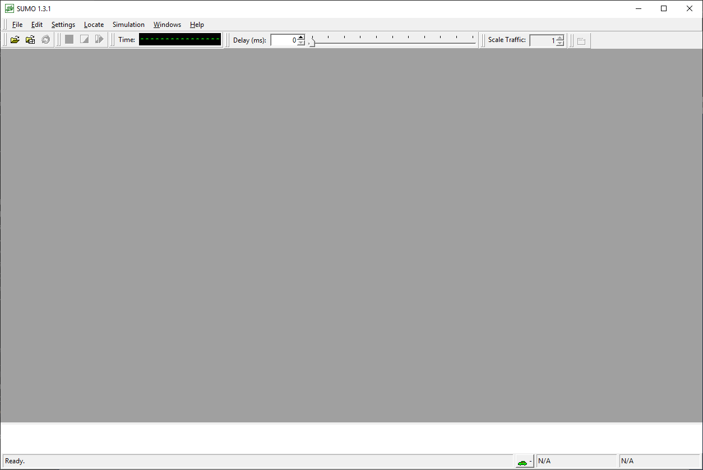
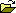
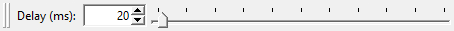
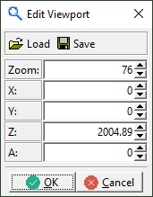
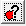
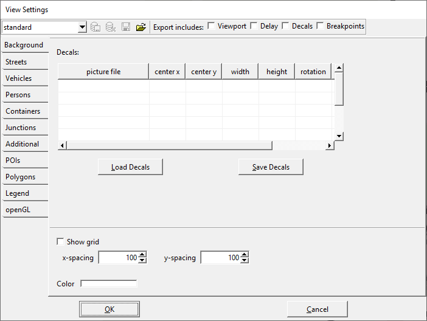

# From 30.000 feet

**sumo-gui** is basically the same application as
[sumo](sumo.md), just extended by a graphical user interface.

- **Purpose:** Simulates a defined scenario
- **System:** portable (Linux/Windows is tested); opens a window
- **Input (mandatory):** A SUMO-configuration file (see [sumo](sumo.md))
- **Output:** sumo-gui generates the same output as [sumo](sumo.md)
- **Programming Language:** C++

# Usage Description



*Initial appearance of sumo-gui; may differ from what you see*

Being a window-based application, sumo-gui is started by a double click
with the left mouse button on Windows, on Linux probably with a single
click. After this, an empty window should show up, similar to the one
shown in the image.

Using either the "File-\>Open Simulation..." menu entry or by using the
"open"-icon (),
you should be able to load an existing [sumo](sumo.md)
[configuration
file](Basics/Using_the_Command_Line_Applications.md#configuration_files),
if it has the proper [extension](Other/File_Extensions.md)
*".sumocfg"*. If the [sumo](sumo.md) [configuration
file](Basics/Using_the_Command_Line_Applications.md#configuration_files)
is erroneous, the errors are reported, otherwise your network referenced
within the configuration file should be shown. Now you can start to
simulate by pressing the "play" button (). The simulation works as if being started on the
command line. The simulation can be halted using the "stop" button
() and continued by pressing
the "play" button again. When stopped, also single steps may be
performed by pressing the "single step" button
().

If the simulation is running, the current simulation second is shown in
the "digital digits" field, right to "Time:"
(). By clicking on the word "Time:", the
display can be toggled between showing <seconds\> and
<hour:minute:seconds\>.

Next to the time display is the delay control
(). This allows you to
slow down the simulation by waiting for the given number of milliseconds
between simulation steps.

!!! note
    By default the *delay* is set to 0. This can result in a simulation that runs too fast to see any vehicles. Increase the delay value if this happens.

Besides loading simulation configurations, it is also possible to load
networks by using either the "File-\>Open Network..." menu entry or by
using the "open network"-icon (). Please note, that normally
**sumo-gui** assumes networks have the
[extension](Other/File_Extensions.md) *".net.xml"*, but also
accepts other extensions.

Both, the loaded simulation or the loaded network may be reloaded using
the "reload" button ()
or the menu entry "File-\>Reload".

If a network or a simulation are loaded, the navigation through the
network is possible with the mouse or with the keyboard. One can drag
the network with the left mouse button pressed into all directions and
zoom either by using the mouse wheel or by pressing the right mouse
button and moving the mouse up and down. For fine grained zooming (half
zoom speed) press the "Control" key while using the mouse wheel, for
double speed use "Shift".

# Interaction with the View

## Basic Navigation



As soon as a network is displayed, one can interact with the view.
Pressing the left mouse button within the view and moving the mouse with
the button pressed, will shift the network. Moving the mouse up and down
while pressing the right mouse button changes the zoom of the network.
It is also possible to change the zoom by using the mouse wheel (holding
*<SHIFT\>* increases the zooming speed and holding *<CTRL\>* lowers it).
Zooming is either focused on the center of the screen or on the cursor
position. The zoom style can be selected with the
 button.

You can also control which part of the network is visible by directly
setting the network coordinates which shall be at the center of the
screen along with the zoom (given a value of 100 the whole network will
fit onto the screen). These settings can be changed by opening the
viewport editor using the
 button. From this editor, it is
possible to save the current settings () or load previously saved ones
( within the
viewport editor).

The viewport is defined as following:
`<viewport zoom="<ZOOM>" x="<X>" y="<Y>"/>`. It can be loaded as a part of viewsettings.

Pressing the center-button () from the menu bar at the top of the view, will
reset the viewport so that the complete network is shown.

## Breakpoints

The simulation can be stopped automatically to allow investigating
specific points in time. Breakpoints can be set via any of the following
methods:

- via menu *Edit-\>Breakpoints*
- by setting option **--breakpoints TIME1,TIME2,...**
- by loading \#Configuration_Files with breakpoint information

## Keyboard Shortcuts

Various menu items are accessible via keyboard shortcuts. These are
documented directly in the menu. (i.e. Ctrl-l Ctrl-e opens the edge
locator, Ctrl-d performs a single simulation step). Additional shortcuts
are listed below:

- Ctrl-LeftClick: toggle selection status of object under cursor
- Arrow Keys: move the view
- Ctrl + Arrow keys: move the view less
- PageUp / PageDow: move the view up/down (a lot)
- Shift + PageUp / PageDow: move the view left/right (a lot)
- \+/-, Keypad +/-: zoom in/out
- Home/Keypad Home: recenter view
- F9: open view settings dialog
- Shift-LeftClick: 
  - vehicle: start tracking
  - rerouter: change routeProbReroute probabilities

## Object Properties / Right-Click-Functions

Right-clicking simulation objects gives access to additional
information:

- copy object id
- object parameter dialog (menu item *Show Parameter*)
- position information (x,y and lat,lon)
- select/deselect object

The following objects can be accessed by right-click:

- Vehicles (some attributes are only availabe when using a specific
  simulation model, i.e. [MESO](Simulation/Meso.md) or [sublane
  model](Simulation/SublaneModel.md#New_Parameters))
- Persons
- Lanes
- Junctions
- Traffic Lights (by clicking on the green/red colored bars)
- Detectors
- Rerouters
- Variable Speed Signs
- POIs
- Polygons
- Simulation (by clicking the background where there is no other
  object). Also accessible by clicking the
   button.

  !!! note
        Simulation Parameters include all values available via [verbose output](Simulation/Output.md#commandline_output_verbose) such as departed, running and arrived vehicles. It also includes network statistics such as number of edges and nodes.

The following additional functions are available via right-click:

- Tracking movements (vehicles and persons)

  !!! note
        Tracking can be disabled via double-click or via context menu.

- Activate additional visualizations (persons and vehicles)
- Select junction foe vehicles (vehicles). Requires coloring vehicles
  *by selection* to be visible
- Close for traffic (edges and lanes)
- Switch programs (traffic lights)
- Set speed limit (variable speed sign)

## Selecting Objects

**sumo-gui** allows for the selection of arbitrary
network elements such as edges, lanes and junctions, which can be saved
to a file (and also loaded from a file) for further processing.
Selection is done by either choosing "Add To Selected" from the context
menu (right click) of the element or by clicking left on an element
while pressing the "Control" key.

The selected elements can be saved / loaded and looked at in the "Edit
Selected" dialog available from the edit menu. The list contains entries
of the form objectType:objectId with each of these entries on a separate
line:

```
edge:someEdge
edge:someOtherEdge
junction:myJunction
```

Most network objects can be colored according to their selection status
(*color by selection*) and selected network elements may be manipulated
as a group in [netedit](netedit.md).

## Locating Objects

All simulation objects can be located based on their ID by using the
locate dialog . By
clicking this button a sub-menu for selecting the object type is
opened. The following types are available:

- [Junction](Networks/PlainXML.md#node_descriptions)
- [Edge](Networks/PlainXML.md#edge_descriptions)
- [Vehicle](Definition_of_Vehicles,_Vehicle_Types,_and_Routes.md)
- [Person](Specification/Persons.md)
- [Traffic light](Simulation/Traffic_Lights.md)
- Additional infrastructure for
  [detecting](Simulation/Output.md#simulated_detectors) or for
  [influencing
  traffic](index.md#traffic_management_and_other_structures).
- [Point of Interest
  (PoI)](Simulation/Shapes.md#poi_point_of_interest_definitions)
- [Polygon](Simulation/Shapes.md#polygon_definitions)

After selecting the object type, a dialog opens that provides a text box
for entering the object ID. Search for objects starts after the first
characters are entered until an object ID that starts with these
characters is found. Once selected in the object list, the view can be
centered on that object.

The button *Hide unselected*, restricts the object list to [selected
objects of that type](#selecting_objects). The *Locate Menu*
in the main menu bar also contains a check-box that toggles whether
[internal edges](Networks/SUMO_Road_Networks.md#internal_edges)
and [internal
junctions](Networks/SUMO_Road_Networks.md#internal_junctions)
shall be listed in the object locator dialog.

# Influencing the simulation

Currently, there is only limited interaction that can be done from
the GUI. This will change in the future (see below)

## Switching Traffic Lights

By right-clicking on the [colored bars](#right_of_way) at an
intersection, a popup-menu allows switching between all [signal plans
that have been
loaded](Simulation/Traffic_Lights.md#loading_a_new_program). The
special program *off* is always available and can be used to switch the
intersection into a priority-intersection.

## Closing and Opening Edges and Lanes

By right clicking on a lane, each lane (or the corresponding edge) can
be closed for all traffic (except vClass *authority* and *ignoring*) by
selecting the option *Close lane* or *Close edge*. In the same way lanes
or edges can be reopened for traffic by selecting *Reopen lane* or
*Reopen edge*.

## Scaling the amount of Traffic

The 'Scale Traffic' input in the top menu bar allows scaling the amount of traffic up and down. This works as for the sumo option **--scale**. The frequency / probability of any loaded flows is scaled in proportion and any newly loaded vehicles will be scaled as well.

## Setting Vehicle Speed Factor

When tracking a vehicle (Shift-Click on Vehicle or Vehicle context menu option 'Start Tracking'), a new speedFactor slider is shown.
This slider allows setting the speedFactor to values between 0 and 2.

## Setting Rerouter Probabilities

When loading [Rerouters with routeProbReroute definitions](Simulation/Rerouter.md#assigning_a_new_route), directional arrows will be shown where the available routes diverge. Shift-Clicking on the rerouter icon or the directional arrows will set 100% probability to one of the available routes. Clicking repeatedly will cycle through the routes and again set 100% to a route.

## Starting and Stopping Vehicles
From the vehicle context menu, the current vehicle can be made to stop (at the earliest possible location with maximum deceleration). If the vehicle is currently stopped it can also be made to abort the current stop.

## Removing Vehicles
From the vehicle context menu, the current vehicle can be removed from the simulation.

## Planned Interactions

In the future more interactions are planned for exploratory simulation:

- changing simulation options dynamically (i.e. **--scale, --time-to-teleport, ....**)
- adding traffic
- changing vehicle or vehicle type parameters
- testing TraCI function calls

# Understanding what you see

## Right of way

At the end of every lane and at the outset of a junction there is a
little colored bar which indicates right of way. When there are multiple
target lanes from one lane, the bar is split in smaller parts each
indication the rules for one connection. The colors a defined as
follows:

- <span style="color:#00FF00; background:#00FF00">FOO</span> Traffic
  light, green phase, vehicle has right of way
- <span style="color:#00B300; background:#00B300">FOO</span> Traffic
  light, green phase, vehicle has to yield to some streams
- <span style="color:#FF0000; background:#FF0000">FOO</span> Traffic
  light, red phase, vehicle has to wait
- <span style="color:#FF8000; background:#FF8000">FOO</span> Traffic
  light, red/yellow phase, indicates upcoming green phase, vehicle has
  to wait
- <span style="color:#FFFF00; background:#FFFF00">FOO</span> Traffic
  light, yellow phase, vehicle should stop if possible
- <span style="color:#804000; background:#804000">FOO</span> Traffic
  light, off-blinking, vehicle has to yield
- <span style="color:#00FFFF; background:#00FFFF">FOO</span> Traffic
  light, off-no-signal, vehicle has right of way
- <span style="color:#FFFFFF; background:#FFFFFF">FOO</span>
  uncontrolled, vehicle has right of way
- <span style="color:#333333; background:#333333">FOO</span>
  uncontrolled, vehicle has to yield to some streams
- <span style="color:#808080; background:#808080">FOO</span>
  uncontrolled, right-before-left rules, all vehicles yield to the
  rightmost incoming lane
- <span style="color:#800080; background:#800080">FOO</span>
  uncontrolled, stop-sign / controlled, right-turn arrow, vehicle has
  to stop and then yield
- <span style="color:#0000C0; background:#0000C0">FOO</span>
  uncontrolled, allway-stop, all vehicles have to stop and then drive
  in the order of arrival
- <span style="color:#c08140; background:#c08140">FOO</span>
  uncontrolled, zipper, vehicles have to perform [zipper
  merging](https://en.wikipedia.org/wiki/Merge_%28traffic%29)
- <span style="color:#000000; background:#000000">FOO</span> dead-end,
  vehicle may not drive there
- <span style="color:#FF00FF; background:#FF00FF">FOO</span> suspicious dead-end,
  there are outgoing edges but the vehicle may not continue anywhere

!!! note
    If a vehicle is braking in the simulation, the responsible foe vehicle (if any) can also be identified directly by taking the following steps:

    - set vehicle coloring to *color* by *selection*
    - right-click the braking vehicle and then click *Select Foes*
    The foe vehicles will then be color with the selection color (typically blue).

## Road Access Permissions

[Road access permissions](Simulation/VehiclePermissions.md) are
an important tool for building multi-modal scenarios. To better
understand the road network configuration there are various ways to
support coloring according to permissions.

### Default Coloring

The default coloring scheme (*uniform*) aims to color roads in a
realistic way and also show some basic [access
permissions](Simulation/VehiclePermissions.md). The road colors
have the following meanings:

- <span style="color:#808080; background:#808080">FOO</span> sidewalk (`allow="pedestrian"`)
- <span style="color:#C0422C; background:#C0422C">FOO</span> bike lane (`allow="bicycle"`)
- <span style="color:#5C5C5C; background:#5C5C5C">FOO</span> bus lane (`allow="bus"`)
- <span style="color:#96C8C8; background:#96C8C8">FOO</span> waterway (`allow="ship"`)
- <span style="color:#FF0000; background:#FF0000">FOO</span> closed lane (`allow="authority"`)
- <span style="color:#C8FFC8; background:#C8FFC8">FOO</span> green verge (`disallow="all"`)
- <span style="color:#5C5C5C; background:#5C5C5C">FOO</span> anything
  else that does not allow passenger
- <span style="color:#000000; background:#000000">FOO</span> anything
  else

### Color by *permission code*

Each possible set of access combinations is represented by a unique
numerical code. The code for each lane can be retrieved from the lane
parameter dialog (permission code). The lane coloring scheme *permission
code* allows assigning an individual color for each of code. This can be
used for arbitrary coloring according to the users needs (the default
coloring scheme can be regarded as a special case of this coloring
type).

### Show permissions for a specific vehicle class

To investigate connectivity in the network, it is often useful to
quickly highlight lanes that allow a specific vehicle class. This can be
done from the main menu by selecting *Edit*-\>*Select lanes which allow
...*-\>*the desired vehicle class*.

This changes the current selection to the set of all lanes that allow
the specified vehicle class and also changes the coloring scheme to
*color by selection*. All lanes that allow the selected vehicle class
will be shown in blue (by default).

## Connectivity

At each intersection all incoming lanes that allow driving across the
intersection have one or more white arrows to show the allowed driving
directions. However, these arrows only give partial information since
every lane may have more connections than the number of arrows. For
example, when a lane targets two lanes one the same edge beyond the
intersection, only one arrow will be drawn even though two distinct
connections exist.

- To see all connections, activate the junction visualization option
  *Show lane to lane connections*. The colors of the connection lines
  correspond to the
  [\#Right_of_way](#right_of_way)-colors.
- Each connection at an intersection has a unique index starting at 0
  and going clockwise around the intersection. These indices can be
  shown using the junction visualization option *Show link junction
  index*.
- Each connection that is controlled by a traffic light has a unique
  index with regard to that traffic light. By default each traffic
  light controls one intersection and these indices are identical to
  the *link junction index* mentioned above. In the case of joined
  traffic lights which control multiple intersections, the indices are
  different. Also, the indices may be freely customized by the user
  (e.g. to define signal groups). These indices are shown using the
  junction visualization option *Show link tls index*.
  
### Check connected components
Since version 1.4 you can show all network components that are reachable from a particular lane by right-clicking on a lane and then using the 'select reachable' menu option. A new menu opens where you have to select the vehicle class to check. After choosing a vehicle class, all reachable lanes will be added to the lane selection and the edge coloring mode will be set to 'color by selection'. 
Consequently, all reachable lanes will be colored blue and all unreachable lanes will be gray.

# Changing the appearance/visualisation of the simulation

The View Settings menu allows to change and customize the simulations'
appearance and visualization. To open the visualization settings use
 in the
menu bar at the top of the view.

For customizing the simulation one can make changes e.g. to the
background coloring, streets and vehicle appearance as well as the
visualization of POIs. Furthermore one can save
() and delete
(‎) settings to the registry or export
() custom made settings
files and load previews settings again
. So one can
use different favorite settings files for any simulation.

The current settings file is shown in a drop down menu in the top bar of
the View Settings window where you can switch back to default settings.

## Common Visualization Settings

Separate settings exist for different simulation objects such as
vehicle, lanes, persons and detectors. Some options exist for all (or
most) of these objects:

- Size options
  - *Exaggerate by*: Draws objects bigger to make them more visible
  - *Minimum Size*: Do not draw objects below a minimum size
  - *Draw with constant size when zoomed out*: Automatically
    increase the drawing size when zooming out to keep the visual
    size constant.
- Name options
  - *Show name*: Disable drawing of object IDs
  - *Size*: Size of the drawn ID (visual size will stay constant
    when zooming)
  - *Color*: Color of drawn ID
- Coloring options: Color by some attribute and change the color
value/range
  - Show color value: show the numerical value that is used for
    coloring

## Vehicle Visualisation Settings

**Table 1.1 Vehicle shape schemes**

| Name          | Description                                                                                                             |
| ------------- | ----------------------------------------------------------------------------------------------------------------------- |
| triangle      | All vehicles are shaped triangular                                                                                      |
| boxes         | All vehicles are shaped square                                                                                          |
| simple shapes | All vehicles have simple car shape                                                                                      |
| raster images | All vehicles are drawn with a loaded bitmap defined for their type using attribute `imgFile` (using *simple shapes* as fallback) |

**Table 1.2 Vehicle coloring schemes and boundaries**

| Name                           | Measure | Description                                                                                                                                                                                                   |
| ------------------------------ | ------- | ------------------------------------------------------------------------------------------------------------------------------------------------------------------------------------------------------------- |
| given vehicle/type/route color | \-      | The color given within the vehicle definition with fallback to type and then to route color                                                                                                                   |
| uniform                        | \-      | All vehicles are colored uniformly                                                                                                                                                                            |
| given/assigned vehicle color   | \-      | The color given within the vehicle definition                                                                                                                                                                 |
| given/assigned type color      | \-      | The color given within the vehicle type definition                                                                                                                                                            |
| given/assigned route color     | \-      | The color given within the vehicle route definition                                                                                                                                                           |
| depart position as HSV         | \-      | The depart position of each vehicle, relative to the network center, is used to color the vehicle. Direction will be used as H(ue), distance from the center as S(aturation), V(alue) is always 1.            |
| arrival position as HSV        | \-      | The arrival position of each vehicle, relative to the network center, is used to color the vehicle. Direction will be used as H(ue), distance from the center as S(aturation), V(alue) is always 1.           |
| direction/distance as HSV      | \-      | The direction and distance between a vehicle's departure and arrival position, are used to color the vehicle. Direction will be used as H(ue), distance from the center as S(aturation), V(alue) is always 1. |
| by speed                       | m/s     | The current vehicle speed                                                                                                                                                                                     |
| by waiting time                | s       | The time for which a vehicle is halting                                                                                                                                                                       |
| by accumulated waiting time    | s       | The total time for which a vehicle has been halting recently (default: within the last 300s.)                                                                                                                 |
| by time since last lanechange  | s       | The time since the last lane change. The color also indicates the direction of the last lane-change (negative values indicated a change to the right).                                                        |
| by max speed                   | m/s     | Vehicle's maximum velocity                                                                                                                                                                                    |
| by CO2 emissions               | g/s     | The amount of CO2 currently emitted by the vehicle                                                                                                                                                            |
| by CO emissions                | g/s     | The amount of CO currently emitted by the vehicle                                                                                                                                                             |
| by PMx emissions               | g/s     | The amount of PMx currently emitted by the vehicle                                                                                                                                                            |
| by NOx emissions               | g/s     | The amount of NOx currently emitted by the vehicle                                                                                                                                                            |
| by HC emissions                | g/s     | The amount of HC currently emitted by the vehicle                                                                                                                                                             |
| by fuel consumption            | l/s     | The consumed fuel                                                                                                                                                                                             |
| by electricity consumption     | kWh/s   | The consumed electricity (for electric vehicles only)                                                                                                                                                         |
| by noise emissions             | dbA     | The noise produced by the vehicle                                                                                                                                                                             |
| by reroute number              | count   | The number of times this vehicle has bee rerouted                                                                                                                                                             |
| by selection                   | \-      | Colors selected and unselected vehicles differently                                                                                                                                                           |
| by offset from best lane       | count   | By the number of immediate lane changes the vehicle must perform in order to follow its route                                                                                                                 |
| by acceleration                 | m/s^2   |                                                                                                                                                                                                               |
| by time gap                    | s       | By the time to collide with the leader vehicle assuming constant speeds                                                                                                                                       |

In addition to the vehicle shape and coloring one can display blinker
and brake lights, the minimum gap, and the vehicle name. The vehicle
names will always be scaled to the chosen size, no matter which zoom
step is chosen.

## Edge/Lane Visualisation Settings

**Table 2.1 Lane coloring schemes**

| Name                                     | Measure | Description                                                                                                                                                            |
| ---------------------------------------- | ------- | ---------------------------------------------------------------------------------------------------------------------------------------------------------------------- |
| uniform                                  | \-      | All road edges are drawn using the same color. Bicycle lanes are drawn in brown, sidewalks in grey and prohibited lanes (allowing no vehicle classes) are transparent. |
| by selection (lane-/streetwise)          | \-      | selected lanes are drawn different than those that are not                                                                                                             |
| by permission code                       | \-      | all lanes are colored according to the permitted vehicle classes. The code for each lane can be retrieved from the lane parameter dialog (permission code).            |
| by allowed speed (lanewise)              | m/s     | The maximum velocity allowed on this lane                                                                                                                              |
| by current occupancy (lanewise, brutto)  | % / 100 | By the amount of place that is covered by vehicles (including minGap)                                                                                                  |
| by current occupancy (lanewise, netto)   | % / 100 | By the amount of place that is covered by vehicles (excluding minGap)                                                                                                  |
| by first vehicle waiting time (lanewise) | s       | By the time the first vehicle on the lane waits                                                                                                                        |
| by lane number (streetwise)              | \-      | By the number of lanes this edge has                                                                                                                                   |
| by CO2 emissions                         | g/s     | The mean amount of CO2 emitted per a lane's meter                                                                                                                      |
| by CO emissions                          | g/s     | The mean amount of CO emitted per a lane's meter                                                                                                                       |
| by PMx emissions                         | g/s     | The mean amount of PMx emitted per a lane's meter                                                                                                                      |
| by NOx emissions                         | g/s     | The mean amount of NOx emitted per a lane's meter                                                                                                                      |
| by HC emissions                          | g/s     | The mean amount of HC emitted per a lane's meter                                                                                                                       |
| by fuel consumption                      | l/s     | The mean amount of consumed fuel per a lane's meter                                                                                                                    |
| by electricity consumption               | kWh/s   | The mean amount of consumed electricity per a lane's meter                                                                                                             |
| by noise emission                        | dBa     | The noise generated by the vehicles on the lane                                                                                                                        |
| by global travel time                    | s       | The travel time on that edge loaded from a weight file                                                                                                                 |
| by global speed percentage               | %       | By the fraction of the maximum speed that the edge allows based on travel times from a loaded weight file                                                              |
| by given length/geometrical length       |         | The factor by which the geometrical length differs from the user-specified edge length                                                                                 |
| by angle                                 |         | The angle of the edge measured from start to end (excluding in-between geometry)                                                                                       |
| by loaded weight                         |         | By the value loaded using options **--weight-files, --weight-attribute**   |
| by priority                              |         | By the right-of-way priority using during network building                                                                                                             |
| by height at start                       | m       | By the z-coordinate at the start of the lane                                                                                                                           |
| by height at segment start               | m       | By the z-coordinate at the start of each geometry segment                                                                                                              |
| by inclination                           | %       | By the average change in height between start and end of the lane per m                                                                                                |
| by segment inclination                   | %       | By the average change in height between start and end of each geometry segment                                                                                         |
| by average speed                         | m/s     | By the average speed of vehicles on the lane                                                                                                                           |
| by average relative speed                | %       | By the average speed of vehicles on the lane as percentage of the allowed speed                                                                                        |

**Table 2.2 Lane scaling schemes**

| Name                                     | Measure | Description                                                                                               |
| ---------------------------------------- | ------- | --------------------------------------------------------------------------------------------------------- |
| by selection (lane-/streetwise)          | \-      | selected lanes are drawn different than those that are not                                                |
| by allowed speed (lanewise)              | m/s     | The maximum velocity allowed on this lane                                                                 |
| by current occupancy (lanewise, brutto)  | % / 100 | By the amount of place that is covered by vehicles (including minGap)                                     |
| by current occupancy (lanewise, netto)   | % / 100 | By the amount of place that is covered by vehicles (excluding minGap)                                     |
| by first vehicle waiting time (lanewise) | s       | By the time the first vehicle on the lane waits                                                           |
| by lane number (streetwise)              | \-      | By the number of lanes this edge has                                                                      |
| by CO2 emissions                         | g/s     | The mean amount of CO2 emitted per a lane's meter                                                         |
| by CO emissions                          | g/s     | The mean amount of CO emitted per a lane's meter                                                          |
| by PMx emissions                         | g/s     | The mean amount of PMx emitted per a lane's meter                                                         |
| by NOx emissions                         | g/s     | The mean amount of NOx emitted per a lane's meter                                                         |
| by HC emissions                          | g/s     | The mean amount of HC emitted per a lane's meter                                                          |
| by fuel consumption                      | l/s     | The mean amount of consumed fuel per a lane's meter                                                       |
| by electricity consumption               | kWh/s   | The mean amount of consumed electricity per a lane's meter                                                |
| by noise emission                        | dBa     | The noise generated by the vehicles on the lane                                                           |
| by global travel time                    | s       | The travel time on that edge loaded from a weight file                                                    |
| by global speed percentage               | %       | By the fraction of the maximum speed that the edge allows based on travel times from a loaded weight file |
| by given length/geometrical length       |         | The factor by which the geometrical length differs from the user-specified edge length                    |
| by angle                                 |         | The angle of the edge measured from start to end (excluding in-between geometry)                          |
| by loaded weight                         |         | By the value loaded using options **--weight-files, --weight-attribute**                                  |
| by priority                              |         | By the right-of-way priority using during network building                                                |
| by average speed                         | m/s     | By the average speed of vehicles on the lane                                                              |
| by average relative speed                | %       | By the average speed of vehicles on the lane as percentage of the allowed speed                           |

In addition to the lane / edge coloring one can display lane borders,
link decals, rails, edge names, street names, internal edge names, and
hide macro connectors. The edge names as well as the street and internal
edge names will always be scaled to the chosen size, no matter which
zoom step is chosen.

## Loading Shapes and POIs

[Polygonal shapes and Points of Interests
(POIs)](Simulation/Shapes.md) can either be loaded in a
*.sumocfg* configuration file or interactively through the *Open Shapes*
option in the *File*-menu.

Shapes and POIs can be [located based on their unique
ID](#locating_objects) and their appearance can be
[customized as
well](#changing_the_appearancevisualisation_of_the_simulation).

## Showing Background Images

In addition to changing the appearance of simulated structures, one may
also load additional background images ("decals") into
**sumo-gui**. For this, open the visualisation
settings using  and - if you are not yet here - choose the
"Background" panel (figure 1.1). You will see a table with following
columns: **picture file**, **center x**, **center y**, **width**,
**height**, and **rotation**.



**Fig. 1.1: The decals GUI.**

Now, if you click into the first row of the "picture file" column, you
should be able to enter the complete path of an image file. Confirming
the path by pressing RETURN should force **sumo-gui**
to load and display the file below the road network, as shown in figure
1.2.


**Fig. 1.2: Example of a background image (decal).**

Currently, **sumo-gui** may load .gif, .png and .bmp
files. If built with gdal-support further formats such as .tif are also
usable.

Now, you may position/stretch/rotate the image using the columns
**center x**, **center y**, **width**, **height**, and **rotation**.

When setting the column **relative** to *1*, position and size values
will be taken as screen-relative pixel values instead of
network-relative meter values.

After aligning your decals, you can save them using the "Save Decals"
button located in the dialog. Accordingly, previously saved decals can
be loaded by pressing the "Load Decals" button.

When defining decals in XML a single line which looks like this:

```
<decal file="background.gif" centerX="550.00" centerY="1530.00" width="64.00" height="64.00" rotation="0.00"/>
```

The following attributes are supported

| Attribute Name | Value Type    | Description                                                                                                                     |
| -------------- | ------------- | ------------------------------------------------------------------------------------------------------------------------------- |
| **file**   | path (string) | *picture file*, the full name of the background image                                                                           |
| **centerX**    | float         | *center x*, the x-position of the center of the image in network coordinates (in meters)                                        |
| **centerY**    | float         | *center y*, the y-position of the center of the image in network coordinates (in meters)                                        |
| **width**      | float         | The width of the image in network coordinates (in meters)                                                                       |
| **height**     | float         | The height of the image in network coordinates (in meters)                                                                      |
| rotation       | float         | The angle of the image in degrees                                                                                               |
| layer          | float         | The layer at which the image is drawn in meters over ground                                                                     |
| screenRelative | bool          | *relative*, whether the position and size are pixel coordinates relative to the screen rather then the network coordinates      |
| centerZ        | float         | The z-position of the center of the object in network coordinates (in meters), only used in 3D visualization instead of *layer* |
| tilt           | float         | The tilt angle of the object, only used in 3D visualization                                                                     |
| roll           | float         | The roll angle of the object, only used in 3D visualization                                                                     |

!!! note
    The contents of a decal-configuration can also be embedded in a view-settings file and thus loaded on startup. see [Configuration Files](#configuration_files)

!!! note
    When loading an image file with an embedded geo-reference (i.e. [GeoTIFF](https://en.wikipedia.org/wiki/GeoTIFF)) and the simulation network also has a geo-reference, then the image will be positioned automatically.
    
!!! note
    Background images for a network can be downloaded with the [tileGet tool](Tools/Misc.md#tilegetpy).

## Transparency

All image files in the visualization support transparency. For vehicles,
pois and polygons, this transparency can be set dynamically by changing
the color via [TraCI](TraCI.md) and setting the alpha-channel.

All objects that have their color set (via input files or visualisation
settings) support (Red,Green,Blue,Alpha) color values.

# Configuration Files

**sumo-gui** uses the same configuration files as
SUMO. The recognized options can be obtained by calling *sumo --help* or
you save a configuration file with default settings by calling `sumo --save-template <file> --save-commented`. The option **--gui-settings-file** is specific
to **sumo-gui**. It allows you to load a previously
saved gui-settings file. The easiest way to obtain a gui-settings file
is via the *View Settings*-Dialog
. Simply modify the settings and
save .

Note, that the gui-settings-file obtained this way only contain
information about the viewport (zoom and offset), delay, breakpoints and
decals if the corresponding check-boxes are activated before saving.
When you are done the configuration files should look like below:

*example.sumocfg*

```
    <configuration>
        <net-file value="yournetwork.net.xml"/>
        <gui-settings-file value="gui-settings.cfg"/>
    </configuration>
```

*gui-settings.cfg*

```
    <viewsettings>
        <scheme name="...
           ...
        </scheme>

        <viewport zoom="200" x="100" y="-100"/>
        <delay value="42"/>
        <decal file="background.gif" centerX="550.00" centerY="1530.00" width="64.00" height="64.00" rotation="0.00"/>
        <breakpoint value="42"/>
        <breakpoint value="1337"/>
    </viewsettings>
```

Alternatively, you can manually add a breakpoint-file definition to your
settings

```
<viewsettings>
    ...
    <breakpoints-file value="breakpoints.txt"/>
</viewsettings>
```

A file, suitable for loading breakpoints can be obtained by setting
breakpoints in the gui and using the menu-option for saving (Edit-\>Edit
Breakpoints-\>save).

You may either load *example.sumocfg* using the *open simulation*-dialog
or by using the command-line `sumo-gui -c example.sumocfg`.

You may use a XML schema definition file for setting up a sumo-gui
configuration:
[sumoConfiguration.xsd](https://sumo.dlr.de/xsd/sumoConfiguration.xsd).

It is also possible to reference a predefined scheme by it's name alone:

```
<viewsettings>
    <scheme name="real world"/>
</viewsettings>
```

## Screenshots

It is possible to take screenshots at predefined times by adding
elements to the configuration:

```
<viewsettings>
    <snapshot file="myScreenshot.png" time="42"/>
</viewsettings>
```

# Multiple Views

Using the ()-button, multiple viewing windows can be opened onto the same
simulation. The visualization settings can be set
independently for each view. The viewing windows can be managed using
the *Windows* menu in the main menu bar.

When passing multiple files to the [sumo](sumo.md)-option **--gui-settings-file**, one
viewing window is opened for each file at the start of the simulation.

## 3D Visualization

When sumo-gui was compiled with [OSG
(OpenSceneGraph)](http://www.openscenegraph.org/) support an additional
()-button is
present which can be used to open a 3D-View.

!!! caution
    The 3D-Visualization is highly experimental

An pre-compiled windows version for testing is available
[here](https://sumo.dlr.de/daily/sumo-win64extra-git.zip).

# Visualizing edge-related data

Several applications generated edge-related measures for one or more
time-intervals.

- [edgeData-output
  files](Simulation/Output/Lane-_or_Edge-based_Traffic_Measures.md)
- edge-probability files generated by
  [randomTrips.py](Tools/Trip.md#customized_weights)
- [marouter netload-output](marouter.md#macroscopic_outputs)
- [Smoothed traveltimes from
  device.rerouting](Demand/Automatic_Routing.md) when running
  [sumo](sumo.md) with option **--device.rerouting.output**.
- [showDepartsAndArrivalsPerEdge.py](Tools/Routes.md#showdepartsandarrivalsperedge)

These files can be used with
[duarouter](Demand/Shortest_or_Optimal_Path_Routing.md#custom_edge_weights)
and with [sumo](sumo.md) to affect vehicle routing. When running
**sumo-gui**, these files can be visualized by
setting the edge coloring *by loaded weight*.

**sumo-gui** can also be used to visualize the
contained data to see how various traffic measures changed over time
(without running a simulation at the same time).

!!! note
    In the gui-settings dialog, the function 'Recalibrate Rainbow' can be used to adapt the coloring to the data range of the current attribute.

Edgedata files for visualization can be loaded by setting option **--edgedata-files**. All
attributes will be loaded and can be selected in the edge visualization
settings They can also be loaded in **sumo-gui** from
the menu using *File-\>Open EdgeData*. The simulation end time will be
automatically adjusted to the end of the data range.

To make use of the loaded data, edge coloring must be set to **color by
edgeData**. The button *Recalibrate Rainbow* can be used to generate a
coloring scheme to show the whole data range.

!!! note
    edgeData is time based so it will only be shown when the simulation time has advance to the begin time of the respective data interval. Make sure to advance the simulation to time 0 (step once) or to whatever begin time was used for edgeData generation before using *Recalibrate Rainbow*. To see further data frames, advance the simulation by using delay or breakpoints.

When defining a color scheme, a dedicated color for missing data ('No Data') can always be configured.

# Usage Examples

## Visualizing Shapes and Points of Interest

see [Using additional Polygons and POIs within the
Simulation](Simulation/Shapes.md)

## Showing routes and route-related information

- To show the route(s) of a vehicle in the simulation, right-click and
  select *Show Current Route* or *Show all Routes*. 
  - To show only the remaining portion of the current route, select *Show Future Route*.
  - The upcoming stops and their planned timing (or trigger condition) is automatically shown along the route. To show only the next round of a cyclic route (i.e. for public transport), disable the checkbox 'show looped route'
  - Direction reversal of rail vehicles will be shown along the route with the text 'reverse' and an index.
  - To show the index of each edge along the route, the vehicle visualization option 'Show route index' can be activated
- Thow show the route of person, right click and select *Show Current
  Route*. To show the trajectory on a walkingarea, select *Show
  Walkingarea Path*.
- To highlight an arbitrary set of edges in the simulation create a
  [selection file](#selecting_objects) and [color edges *by
  selection*](#edgelane_visualisation_settings)
- To Visualize all routes in a route file use the tool
  [Tools/Routes\#route2poly.py](Tools/Routes.md#route2polypy)
  or
  [Tools/Routes\#route2sel.py](Tools/Routes.md#route2selpy)
- To Visualize the number of vehicles arriving or departing at any
  edge use the tool
  [Tools/Routes\#showDepartsAndArrivalsPerEdge](Tools/Routes.md#showdepartsandarrivalsperedge)

## Investigating internal edges and lanes

[Internal Edges](Networks/SUMO_Road_Networks.md#internal_edges)
define the movements across an intersection. By default they are hidden
behind the shape of the junction to give a prettier visualisation.
Occasionally it is of interest to understand which internal lane
corresponds to which movement as their IDs may be referenced in the
output or in error messages. The following visualisation settings are
helpful:

- Junction settings:
  - disable *draw junction shape*
  - *show internal edge name*
  - *show internal junction name*
  - *show link junction index* (to see the correspondence between
    IDs and link indices)
- Edge settings:
  - *Exaggerate width by 0.1* (otherwise the shapes overlap which
    makes it hard to understand them)
  - *Color by selection* (coloring individual lanes makes it easier
    to understand geometry before and after [internal
    junctions](Networks/SUMO_Road_Networks.md#internal_junctions))

-----

## Investigation Stopping At Intersections

1.  Select Vehicle visualization settings "color by selection"
2.  Right-Click on a vehicle and activate "Select Foes"

The foe vehicles which cause a vehicle to stop or slow down will be
highlighted.
