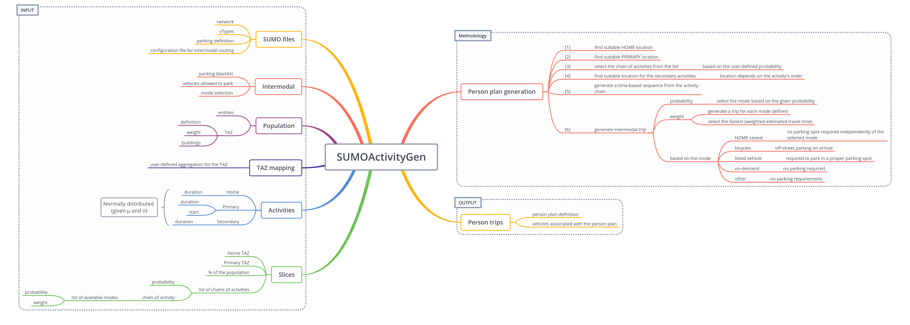

# Activity-based Mobility Generation for SUMO Simulator

The program `activitygen.py` generates person plans for a given transportation infrastructure and configuration file.

## System Overview

## The Configuration File

The configuration file is written in JSON format.

* `seed`: INT, seed used for the random number generator
* `maxNumTry`: INT, maximum number of tries (for each journey) before aborting due to too many inconsistencies.
* `outputPrefix`: STRING, prefix (optionally with path) for the output files. One for each slice.
* `mergeRoutesFiles`: BOOL, merges all the slices in a single file.
* `sumocfg`: STRING, SUMO configuration file used to generate the (intermodal) routes.
* `SUMOnetFile`: STRING, SUMO network definition <https://sumo.dlr.de/wiki/Networks/PlainXML>.
* `SUMOadditionals`: DICT, {}
  * `vTypes`: STRING, SUMO vType definitions <https://sumo.dlr.de/wiki/Definition_of_Vehicles,_Vehicle_Types,_and_Routes#Vehicle_Types>
  * `parkings`: STRING, SUMO parkingArea definitions <https://sumo.dlr.de/wiki/Simulation/ParkingArea>
* `intermodalOptions`: DICT, {}
  * `parkingAreaBlacklist`: LIST of STRINGS, ID of all the parking areas defined in the scenario that cannot be used.
  * `vehicleAllowedParking`: LIST of STRINGS, vType of all the vehicles allowed to use the parking areas.
  * `modeSelection`: `PROBABILITY` or `WEIGHT`, interpretation of the FLOAT value associated with each mode in the activity chains. If PROBABILITY is used, only one mode is selected and used to generate the journey. If WEIGHT is used, one journey for each mode is generated and the weight is used as a multiplier for the actual cost of journey. The journey with th minimum cost is selected.
* `population`: DICT, {}
  * `entities` : INT, number of people to generate.
  * `tazDefinition`: STRING, SUMO TAZs definitions <https://sumo.dlr.de/wiki/Demand/Importing_O/D_Matrices#Describing_the_TAZ>
  * `tazWeights`: STRING, weight definition for all the TAZs.
  * `buildingsWeight`: STRING, folder containing the definitions with `building --> TAZ --> edges --> weight`
 `PoIsDefinition`: `TBD`
* `taz`: DICT, {}
  * STRING: LIST of STRINGs, the key in the dictionary is the name that will be used in the slices, the list of strings contains the aggregated TAZ ids.
* `activities`: DICT, {}
  * `P-*`: DICT, {}, used to define all the PRIMARY activities, the name must be nunique and start with `P-`.
    * `start`: DICT, {}
      * `m`:  INT, mean in seconds.
      * `s`: INT, standard deviation in seconds.
    * `duration`: DICT, {}
      * `m`: INT, mean in seconds.
      * `s`: INT, standard deviation in seconds.
  * `S-*`: DICT, {}, used to define all the SECONDARY activities, the name must be nunique and start with `S-`.
    * `duration`: DICT, {}
      * `m`: INT, mean in seconds.
      * `s`: INT, standard deviation in seconds.
  * `Home`: DICT, {}, used to fine the home location. The duration is used if the activity appears not in the first or last place of the chain.
    * `duration`: DICT, {}
      * `m`: INT, mean in seconds.
      * `s`: INT, standard deviation in seconds.
* `slices`: DICT, {}, definition of all the slices of mobility.
  * STRING: DICT, the string is the user-defined name for the mobility slice and it's going to be used to name the final route file.
    * `perc`: FLOAT, percentage of `entities` to be associated with the slice.
    * `loc_origin`: STRING, Home location. ID of the aggregated TAZs in the `taz` dictionary.
    * `loc_primary`: STRING, Primary activity location. ID of the aggregated TAZs in the `taz` dictionary.
    * `activityChains`: LIST of LISTS, list of activity chains with probability and associated modes.
      * [ (probability), (chain), (modes) ]
        * (probability): FLOAT, probability to chose this chain of activities.
        * (chain): LIST of STRINGs, user define list of activities. The order matters to compute the location of the SECONDARY activities. Every chain _must_ start and end with `Home`, and it _must_ contain at least one PRIMARY activity. For example, `["Home", "P-Work", "Home", "S-Evening", "Home"]` it generate a plan from the home location to a primary ativity (work), then back to home for a time, then to a secondary location for the evening, and finally home again. 
        * (modes): LIST of [(mode), (value)], it defines all the availalbe transportation modes for the given chain.
          * (mode): STRING, one of the following modes:
            * `public`: for public transports (walking and public transportation).
            * `bicycle`: for bicycle (walking and cycling).
            * `on-demand`: for taxi.
            * (vType): as defined in the vType definitions to use any other vehicle.
* `minEdgeAllowed`: FLOAT, minimum lenght of an edge to che chosed as location in the planning.
* `stopBufferDistance`: FLOAT, buffer distance to be used in SUMO for the `<stop startPos="..." endPos="..."/>` definition.

## Output

For each person, the sowtware generates a person plan as defined in <https://sumo.dlr.de/wiki/Specification/Persons> and, if required, the associated vehicles as defined in <https://sumo.dlr.de/wiki/Definition_of_Vehicles,_Vehicle_Types,_and_Routes#Vehicles_and_Routes>.

## Metodology

The metodology used to generate a single person plan is presented in the figure, in the `Methodology` box.
Being this software under active development, this is actually the section that is going to change more often. Hence, the description is going to be brief, but all the implementation can be verified in the code.

In order to generate the plan of one person, the first step is to [1] find suitable HOME location and then to [2] find suitable PRIMARY location. Then, based on the user-defined probability, [3] the chain of activities is selected from the list. Using the ordering of the activities, [4] one or more suitable locations for the secondary activities is computed. With "suitable" it's implied that it exist at least one route that links the location in the given order. Next, [5] a time-based sequence from the activity chain is generated. Finally, [6] the actual intermodal trip is generated. In case `PROBABILITY` is used, one single mode is selected from the list and used for the plan generation. If `WEIGHT` is used, one trip for each mode is generated, and the fastest (weighted estimated travel time) is used. Based on the modes involved in the journey, the following properties are used:

* HOME caviat: independenty of the mode, no parking spot is required.
* bicycles: parked off-street on arrival
* vehicles listed in `vehicleAllowedParking`: required to park in a proper parking spot
* on-demand: no parking required
* other: no parking requirements
