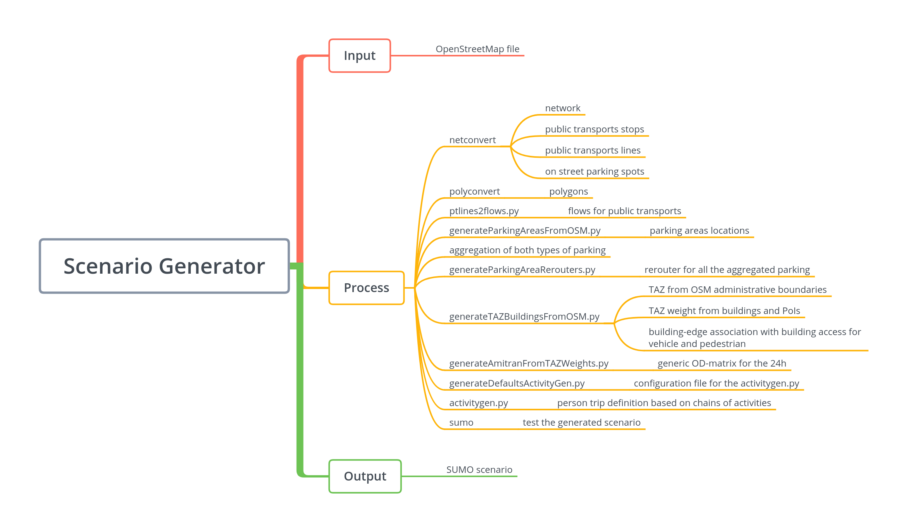

# Automated Scenario Generation from OSM

Using `scenarioFromOSM.py` it is possible to generate a complete scenario from an [OSM](https://www.openstreetmap.org) file.

The main program, `python3 scenarioFromOSM.py --osm file.osm --out target_directory`, generates the scenario step by step, writing all the intermediate configuration files in the target directory. The generation of a functional mobility scenario is an iterative process. This scenario generation tool enables the iterative regeneration of the scenario after the manual change of the intermediary files.

Depending on the OSM file and the requirements, additional parameters can be used:

* `--lefthand` is used to generate a left-hand traffic scenario.
* `--population` is used to change the number of people plans to generate. The default is 1000. This parameter tunes `generateDefaultsActivityGen.py`.
* `--density` is used to define the average population density in square kilometers to be used in the origin-destination matrix. The default is 3000. This paprameter tunes `generateAmitranFromTAZWeights.py`.
* `--single-taz` is used to ignore the administrative boundaries and generate only one TAZ. This paprameter tunes `generateTAZBuildingsFromOSM.py`.
* `--admin-level` is used to filter the administrative boundaries using the `admin_level` values in OSM. This paprameter tunes `generateTAZBuildingsFromOSM.py`.
* `--taz-plot` is used to plot the generated TAZs as an OSM overlay in a HTML file. It requires the folium library. This paprameter tunes `generateTAZBuildingsFromOSM.py`.
* `--from-step` is used for successive iteration of the program after a manual change of the files. The number defines from which step the generation should be recomputed:
  *  0 - Copy default files.
  *  1 - Run netconvert & polyconvert.
  *  2 - Run [ptlines2flows.py](https://github.com/eclipse/sumo/blob/master/tools/ptlines2flows.py).
  *  3 - Generate parking areas using [generateParkingAreasFromOSM.py](../generateParkingAreasFromOSM.py).
  *  4 - Generate parking area rerouters using [generateParkingAreaRerouters.py](https://github.com/eclipse/sumo/blob/master/tools/generateParkingAreaRerouters.py).
  *  5 - Extract TAZ from administrative boundaries using [generateTAZBuildingsFromOSM.py](../generateTAZBuildingsFromOSM.py).
  *  6 - Generate OD-matrix using [generateAmitranFromTAZWeights.py](../generateAmitranFromTAZWeights.py)
  *  7 - Generate SUMOActivityGen defaults using [generateDefaultsActivityGen.py](../generateDefaultsActivityGen.py).
  *  8 - Run the actual activity generation using [activitygen.py](../activitygen.py).
  *  9 - Launch SUMO.
  * 10 - Report.
* `--profiling` is used to enable the Python 3 cProfile feature.
* `--no-profiling` is the default option and it disables the Python 3 cProfile feature.

## System Overview

In the figure is depicted the complete generation process from the OSM file to the mobilty scenario for SUMO.

## Default files

In the `defaults` directory are stored the files with the basic skeleton on which `scenarioFromOSM.py` builds upon.
_Note: to tune the generation, the program uses command line parameters too. Hence, depending on the step in the genration, the default file saved may reflect only partially what it has been done._

## Parking Areas: generateParkingAreasFromOSM.py

SUMO netconvert retrieves on street parking directly form OSM, but not the parking areas tagged as a point of interest. The program `generateParkingAreasFromOSM.py` reads them from OSM, associate them with the proper street, and generates the parking area for sumo.
It is a stand-alone program with the following parametrization:

* `--osm` is the OSM file.
* `--net` is the SUMO network file.
* `--out` is the SUMO parking areas outout file.
* `--default-capacity` is the default parking areas capacity if the OSM tag is missing.
* `--parking-len` is the length for the parking areas. This value is only for visualization purposes.
* `--parking-angle` is the angle for the parking areas. This value is only for visualization purposes.
* `--distance-from-intersection` is the buffer area defined to avoid having the parking entrance too close to an intersection.

## Traffic Assignment Zones and Buildings: generateTAZBuildingsFromOSM.py

The program `generateTAZBuildingsFromOSM.py` builds the TAZs using the administrative boundaries defined in OSM, and then associate the buildings retrieved from OSM. For each building it computes the closest accesses for vehicles and for pedestrians, and its area.
It can be used as stand-alone program with the following parametrization:

* `--osm` is the OSM file.
* `--net` is the SUMO network file.
* `--taz-output` is the TAZ output file (XML).
* `--weight-output` is the TAZ's weight output file (CSV).
* `--poly-output` is the prefix for the builgings output files (CSV).
* `--single-taz` is used to ignore administrative boundaries and generate only one TAZ.
* `--admin-level` is used to filter the administrative boundaries using the `admin_level` values in OSM.
* `--taz-plot` is used to plot the generated TAZs as an OSM overlay in a HTML file. It requires the folium library.
* `--processes` is the number of processes spawned to associate buildings and edges.

## Origin-Destination matrix: generateAmitranFromTAZWeights.py

The program `generateAmitranFromTAZWeights.py` uses the TAz weight file to build the Origin-Destination matrix to be used with the activity generation. The Amitran format is available at <https://sumo.dlr.de/wiki/Demand/Importing_O/D_Matrices#The_Amitran_format>.
To be used as stand-alone, the program requires the following parameters:

* `--taz-weights` is the weighted TAZ file (CSV).
* `--out` is the outout file with the OD matrix in Amitran format.
* `--density` it is the average population density in square kilometers. The default is 3000.

## Default Activities and Activity Chains definitions: generateDefaultsActivityGen.py

The program `generateDefaultsActivityGen.py` starts from a default configuration file and the OD-matrix in Amitran format, and generates the complete configuration file reqired by the `activitygen.py`.
The complete list of parameters is:

* `--conf` is the configuration file with the default values.
* `--od-amitran` is the OD matrix in Amitran format.
* `--out` is the output file.
* `--population` is the number of entities to generate.

## Report: sagaActivityReport.py

The program `sagaActivityReport.py` starts from the tripinfo file generated from sumo and computes the average starting time and duration for each activity type defined in the `activitygen.py` configuration file.
The complete list of parameters is:

* `----tripinfo` is the SUMO tripinfo.xml output file.
* `--out` is the output file.
