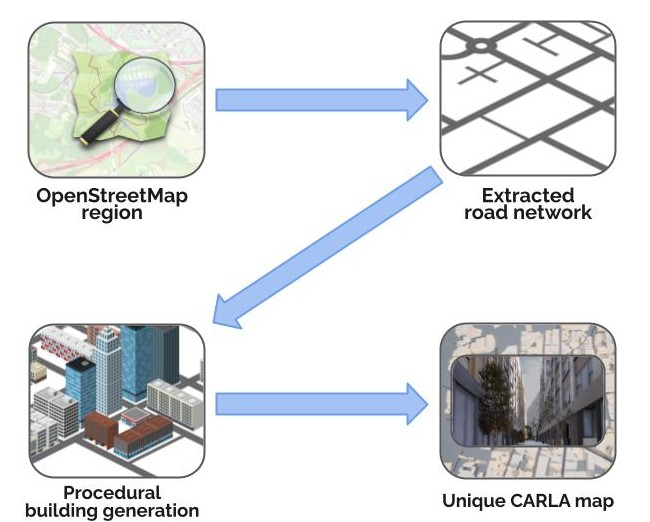
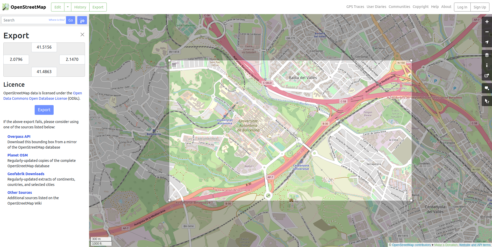
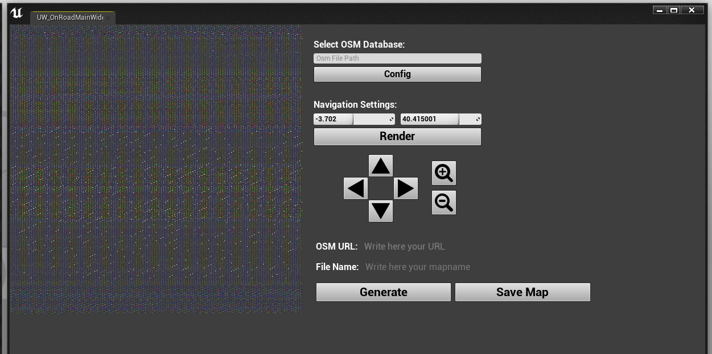
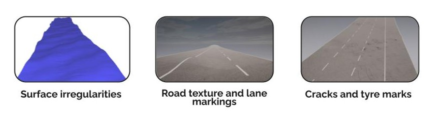
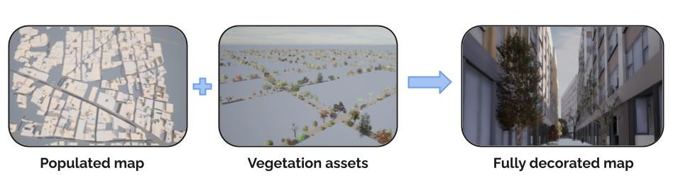
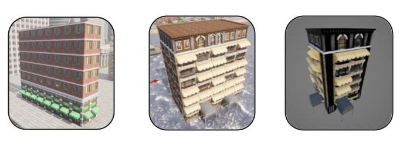

!!! note
	The __Digital Twin Tool__ is currently an __experimental feature__ and is not considered *production ready* at this stage. Some parts of maps may be undecorated or untextured. Hence it should only be used for experimental research projects.

# Digital Twin Tool



- [__Downloading and preparing OSM map data__](#downloading-and-preparing-osm-map-data)
- [__OpenStreetMap browser__](#openstreetmap-browser)
- [__Procedural environment generation__](#procedural-environment-generation)
	- [Road decoration](#overview)
	- [Buildings](#alsm)
- [__Generate the map__](#generate-the-map)
- [__Save the map__](#save-the-map)

The __Digital Twin Tool__ enables procedural generation of unique 3D environments based on road networks derived from the [OpenStreetMap](https://www.openstreetmap.org) (OSM) service. Through the Digital Twin Tool interface in CARLA's Unreal Engine editor a user can select a region of map from OSM and download the road network as the basis for a new CARLA map. The tool then fills the spaces between the roads with procedurally generated 3D buildings that adjust to the layout of the road, creating a realistic 3D road environment with high variability.

## Building the OSM renderer

If you are using Linux, you have the option of using the OSM renderer in the CARLA interface to navigate a large OSM map region that you have downloaded. You first need to build the OSM renderer. Run `make osmrenderer` inside the CARLA root directory. You may need to upgrade your version of CMake to v3.2 or above in order for this to work. This will create two folders in your build directory called `libosmcout-source` and `libosmcout-build`. Windows users do not have the option of using the OSM renderer and must use directly a URL. 

## Downloading and preparing OSM map data



In a web-browser, go to the [OpenStreetMap website](https:/www.openstreetmap.org) and choose an area of the map which you would like to use. Define your region and then export the data as an `.osm` file, or you can use a URL, as explained later. Alternatively, you could use other tools based on the OpenStreetMap service such as [GeoFabrik](https://download.geofabrik.de/), which allows specific map regions such as states or territories to be extracted from the OSM data.

There are two ways to use the OSM data. Using a URL or downloading an OSM file: 

### Using a URL

In the [OpenStreetMap website](https:/www.openstreetmap.org) website, navigate to an area of interest, then press `Export`, you may also want to use the `Manually select a different area` option. Then, right click on `Overpass API` and select `Copy link` from the context menu. You must ensure that the file will be no bigger than 1 Gb. Take this link and paste it into the URL field of the interface.

### Downloading an OSM file and navigating in the interface

This option is only available to Linux users. You may download a larger region of map, for example an entire state or territory, then use the OSM interface in CARLA to navigate the map using the arrow and zoom buttons. Download your desired region of OSM data as a `.osm` file, then place this file in the `{CARLA_ROOT}/Build/libosmcout-source/maps/` folder. Open a terminal inside this folder and run the following command:

```sh
cd {CARLA_ROOT}/Build/libosmcout-source/maps/
./build.sh <path_to_osm_file>
```

## OpenStreetMap browser

To open the OSM browser, open the content browser and navigate to `CarlaToolsContent/OnroadMapGenerator`. Right click on *UW_OnRoadMainWidget* and select *Launch Editor Utility Widget* from the context menu. This will open the tool's interface. 


The interface enables browsing of a region of OSM map that has been downloaded from the OSM database and baked. First, you should enter the directory location where you stored the processed OSM data in the previous step in the *Select OSM Database* field in the interface. If you are using a URL directly, paste it into the `OSM URL` field, you will not be able to use the navigator in this case. 



Use the directional arrows and the zoom icons to navigate the map and find a part of the road network you want to turn into a CARLA map. The square region you see in the preview will be the extent of your map. Enter an appropriate name in the `File Name` field and then press *generate* to start the procedural generation process. The map generation process may take several minutes, or more if you are using a large region.

## Procedural environment generation

### Road decoration

The tool extracts the road network from the OSM data as the basis of the map. The road surface is decorated with realistic surface irregularities, road markings and textures. 



### Buildings

The empty spaces between the roads are populated with buildings or open areas that will adjust their shape and dimensions to fill the space between the roads. 


The procedural generation tool extracts the building footprints and height information from the OSM data to generate virtual buildings with similar dimensions. Detailed cladding is applied to simulate windows, doors and balconies. Different decoration styles are applied depending upon the dimensions of the building, with the tallest buildings having an office style, smaller buildings have a commercial or residential style applied according to the area of the building footprint.



Vegetation is also added to the pavements in the next step step for additional detail.


*Digital Twin Tool building styles*

The buildings are in a variety of styles that are randomly distributed throughout the city, the architectural style of an area is chosen based on the characteristic dimensions of the buildings extracted from the OSM data.

## Generate the map

The generation step will take around 10 minutes for a 2x2 km<sup>2</sup> region, larger regions will take longer. Once the generation process has finished, you can examine the map in 3D in the Unreal Engine editor. 

## Save the map

If you are satisfied with the generated map then you can press *Save Map* button to save the map. __This step will take a significant amount of time__, it may take over an hour and could take several. You should prepare to leave your computer running for several hours while this step is completed. Once this step is completed, the map will be available through the Unreal Engine editor or through the CARLA API, the same as any other map. 

