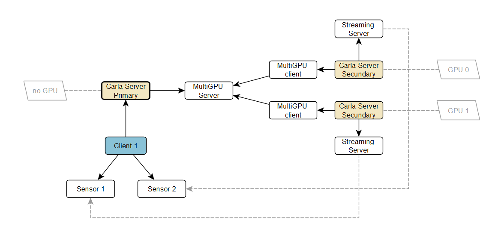

# Carla Multi-GPU feature

Multi-GPU in carla means that the user can  start several servers (called secondary servers) that will do render work for the main server (called primary server) using a dedicated GPU from the system. The primary server will distribute the sensors, that are created by the user, to the different secondary servers available.

We need to start the primary server (usually with a flag to avoid using any GPU). This server will process all physics and synchronize the scene data to the others secondary servers. Then we can start any secondary server as we want (usually one per dedicated GPU in the system), using the parameters we will describe further. After this, the client can connect (always to the primary server) and proceed as usual.
All the system is transparent to the user, who don't need to know from which server comes the sensor data, he just receives the data directly from a secondary server.

## Primary server

The steps are, first, start the primary server without any render capability.
The parameters we can use are:
* `-nullrhi`: disables any render capabilities (GPU free)
* `-carla-primary-port`: TCP port used to listen for secondary servers (default 2002)

For example

**./CarlaUE4.sh -nullrhi**

The primary server will use by default the port 2002 to listen for secondary servers. If you need to listen on another port, then you can change it with the flag

**./CarlaUE4.sh -nullrhi -carla-primary-port=3002**

## Secondary servers

Then we need to start as many servers as we want, but the ideal is to have as many secondary servers as GPU. Through parameters we need to specify the GPU we want the server use and also the host/port where the primary server is listenning, with the flags:
  * `-carla-rpc-port`: TCP port to accept client connections (for secondary servers it is not needed, but the port needs to be free)
  * `-carla-primary-host`: IP of the primary server to connect
  * `-carla-primary-port`: TCP port of the primary server to connect
  * `-ini:[/Script/Engine.RendererSettings]:r.GraphicsAdapter`: tells which GPU device to use for this secondary server

For example, if the primary server is executing in the same computer than the secondary servers and with the default port, we can use this:

**./CarlaUE4.sh -carla-rpc-port=3000 -carla-primary-host=127.0.0.1 -ini:[/Script/Engine.RendererSettings]:r.GraphicsAdapter=0**

Here, the secondary server will use port 3000 as the RPC server to avoid conflicts with other ports (but it will never be used), and will connect to the primary server located at IP 127.0.0.1 (localhost) in the default port (2002), and also this server will use the GPU device 0.

If we want to start another secondary server in the same machine using another GPU, we could use this command:

**./CarlaUE4.sh -carla-rpc-port=4000 -carla-primary-host=127.0.0.1 -carla-primary-port=2002 -ini:[/Script/Engine.RendererSettings]:r.GraphicsAdapter=1**

This secondary server will use port 4000 as the RPC server to avoid conflicts with other ports and will connect to the primary server located at IP 127.0.0.1 in the port 2002, and also this server will use the GPU device 1.

## Synchronous mode

After the first secondary server connects to the primary server, the system is setup to synchronous mode automatically, with the default values of 1/20 delta seconds.

