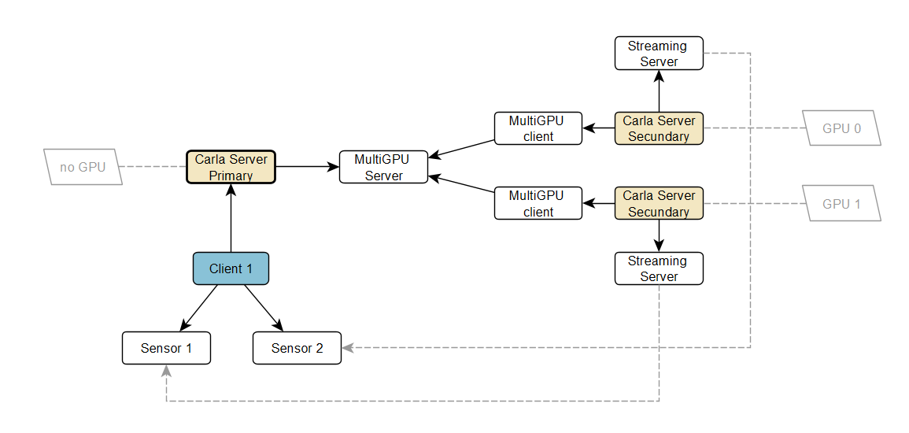

# Multi-GPU

CARLA can split one simulation across several server processes, typically one per GPU. One **primary server** runs the simulation. One or more **secondary servers** render the sensors. Clients connect to the primary as usual. The primary assigns each sensor to a secondary, and the sensor data streams from that secondary straight to the client. The client does not need to know which server produces a sensor's data.



- [__Architecture__](#architecture)
- [__Primary server__](#primary-server)
- [__Secondary servers__](#secondary-servers)
- [__Example: two GPUs__](#example-two-gpus)
- [__Sensor assignment__](#sensor-assignment)
- [__Synchronous mode__](#synchronous-mode)
- [__ROS 2__](#ros-2)
- [__Limitations__](#limitations)

---

## Architecture

- **Primary server (authority).** It owns the simulation: physics, actors, traffic, the RPC API used by clients and the world state. On every tick it sends the frame data (actor spawns and removals, transforms, vehicle and walker animation, lights, traffic-light states and so on) to each connected secondary. It is normally started with `-nullrhi`, so it never creates a GPU device and uses no VRAM.
- **Secondary servers (renderers).** Each one connects to the primary, mirrors the world from the frame data it receives, and renders the sensors assigned to it. It then streams their data directly to the clients. Run one secondary per GPU.
- **Clients** connect only to the primary's RPC port. When a client calls `listen()` on a sensor, the primary returns a stream token that points at the secondary that owns the sensor, and the client receives the data from there.

---

## Primary server

Start the primary without rendering:

```sh
./CarlaUnreal.sh -nullrhi -carla-rpc-port=2000
```

| Option | Meaning |
|---|---|
| `-nullrhi` | Run without a rendering backend: no GPU device, no VRAM. This is the recommended primary mode. |
| `-carla-rpc-port=N` | RPC port for clients (default `2000`). The streaming port defaults to `N+1` and the port that secondaries connect to defaults to `N+2`. |
| `-carla-secondary-port=N` | Port the primary listens on for secondary servers (default: RPC port + 2, so `2002`). |

At startup a primary started with `-nullrhi` logs:

```
Rendering disabled (-nullrhi): running as a non-rendering, authority-only primary. ...
```

A `-nullrhi` primary has no fallback renderer:

- It never renders a camera itself. Every camera (RGB, depth, semantic and instance segmentation, normals, optical flow, DVS and the wide-angle and ray-traced lens cameras) needs a connected rendering secondary.
- If no secondary is connected when a client calls `listen()` on a camera, the call fails with a `RuntimeError` ("this server cannot render (-nullrhi) and no rendering secondary server is connected ..."). The server stays up and keeps simulating.
- `enable_for_ros()` on a camera is refused in the same situation, but the refusal only appears in the server log: the Python call does not wait for the server's answer, so it returns without raising.
- CPU sensors (LiDAR, semantic LiDAR, radar, GNSS, IMU, collision, obstacle) do not need a GPU and keep working on a `-nullrhi` primary.

A primary started without `-nullrhi` also works. It keeps a GPU device, loads the world's render resources into VRAM and renders any camera that is not assigned to a secondary. This costs several GB of VRAM that it does not need, so start it with `-nullrhi` unless it must also render cameras on its own.

---

## Secondary servers

Start one secondary per GPU and point each one at the primary:

```sh
./CarlaUnreal.sh -RenderOffScreen -carla-rpc-port=3000 \
    -carla-primary-host=127.0.0.1 -carla-primary-port=2002 -graphicsadapter=0
```

| Option | Meaning |
|---|---|
| `-carla-primary-host=IP` | Address of the primary. Setting it makes this process a secondary. |
| `-carla-primary-port=N` | The primary's secondary port (default `2002`). |
| `-carla-rpc-port=N` | Must be set to a free port for each secondary (and `N+1`, `N+2` must be free as well). Clients never use it. |
| `-graphicsadapter=N` | Selects the GPU. |
| `-RenderOffScreen` | Render without a window, as usual for servers. |

!!! Note
    `-graphicsadapter` is the Vulkan device index, which does not always match the `nvidia-smi` index. For example, a duplicate Vulkan ICD registration makes each GPU appear twice. Check the `LogVulkanRHI: ... DeviceName:` line in each secondary's log to confirm which GPU it opened.

Each secondary follows the primary through `load_world()`: after the reload it resynchronizes the full world state before it renders again.

!!! Warning
    A secondary that starts, or restarts, after the primary called `load_world()` or `reload_world()` loads the primary's current map when it connects, because the primary remembers the last map name it loaded, even if no secondary was connected at that time. The primary waits for the secondary to finish loading, so a late secondary can stall the simulation tick for the duration of the map load. A map generated with `load_opendrive` is not forwarded to secondaries at all, and the primary does not forget the previous named map, so a secondary that connects afterwards loads that previous map instead of the OpenDRIVE one. The recovery described under [Sensor assignment](#sensor-assignment) has only been validated while the primary is on its default map.

---

## Example: two GPUs

Primary without a GPU, one secondary on each of two GPUs, all on one host:

```sh
# Primary: authority only, no GPU.
./CarlaUnreal.sh -nullrhi -carla-rpc-port=2000 &

# Secondary on the first GPU.
./CarlaUnreal.sh -RenderOffScreen -carla-rpc-port=3000 \
    -carla-primary-host=127.0.0.1 -carla-primary-port=2002 -graphicsadapter=0 &

# Secondary on the second GPU.
./CarlaUnreal.sh -RenderOffScreen -carla-rpc-port=4000 \
    -carla-primary-host=127.0.0.1 -carla-primary-port=2002 -graphicsadapter=1 &
```

Then connect clients to the primary as usual:

```py
client = carla.Client('127.0.0.1', 2000)
world = client.get_world()
```

On a CPU with many cores, pinning each process to its own cores (for example with `taskset`) keeps the processes from competing for the same cores.

---

## Sensor assignment

- A sensor is assigned when a client first calls `listen()` or `enable_for_ros()` on it, not when it is spawned.
- While at least one secondary is connected, the primary assigns every sensor round-robin across the connected secondaries. That includes CPU sensors such as LiDAR, GNSS and IMU. The exceptions are the collision sensor and the world observer stream, which always stay on the primary.
- The assignment is sticky. The sensor stays on its secondary until it is destroyed or that secondary is lost (see below). It never rebalances, and assignment does not take the load on each GPU into account.
- When no secondary is connected, sensors are served by the primary. On a `-nullrhi` primary that only works for CPU sensors, as described above.
- A secondary that disconnects takes its sensors' streams with it: they stop delivering data until a secondary connects again.
- When a secondary connects, the primary assigns it the sensors that were lost, under the same stream ids, and re-enables ROS 2 publication on the ones that had it. Destroyed sensors are not reassigned.
- Clients that are already listening resume without calling `listen()` again only if the new secondary uses the same streaming address and port as the one that left (for example, the same secondary restarted with the same command line, with the primary on a map loaded by name, see the warning above). Otherwise they must call `listen()` again.
- If several secondaries restart at once, the first one to connect takes all the lost sensors, whichever secondary served them before.

---

## Synchronous mode

Use synchronous mode (`synchronous_mode=True` with a `fixed_delta_seconds`) with Multi-GPU:

- When the first secondary connects, a primary in asynchronous mode switches itself to synchronous mode with `fixed_delta_seconds = 0.05`. Secondaries always run synchronously, driven by the primary's frame data.
- There is currently no distributed frame-completion barrier. `world.tick()` returns once the primary has simulated the frame and sent the frame data, not when every secondary has rendered and delivered its sensors.
- For lockstep capture, wait in the client until each sensor has delivered the frame returned by `world.tick()` before the next tick. Otherwise a slower secondary can fall behind the primary. A secondary logs `Secondary server is falling behind the primary` when its queue of frames still to process keeps growing, and logs again once it has caught up.

---

## ROS 2

- `--ros2` on the primary publishes what the primary produces: clock, TF and the data of sensors that run on the primary.
- A `-nullrhi` primary with `--ros2` never renders or publishes camera images.
- Camera images can only be published by a rendering secondary started with `--ros2`. The secondary publishes the cameras it owns.
- Known limitation: ownership of ROS 2 publication across several ROS-enabled secondaries is not solved yet. A ROS-enabled secondary can publish topics for sensors it only mirrors, and a topic can have more than one publisher. Check the publishers of each topic (`ros2 topic info -v`) before relying on a multi-secondary ROS 2 setup.

---

## Limitations

- **No camera fallback on a `-nullrhi` primary.** If every secondary disconnects, cameras stop producing data, and new camera `listen()` calls fail until a secondary connects.
- **No frame barrier.** See [Synchronous mode](#synchronous-mode).
- **Round-robin only.** Sensors are not weighted by cost or GPU capacity, and cannot move between secondaries, except that the sensors of a lost secondary go to the next one that connects.
- **Streams do not follow a different endpoint.** A client keeps retrying the address it was given. Sensors reassigned to a secondary on another address or port need a new `listen()`, and a stale listener is rejected by the secondary it keeps contacting, which fills that secondary's log.
- **GBuffer streams** (`listen_to_gbuffer`) are not available through Multi-GPU routing. A `-nullrhi` primary rejects them.
- **Textures applied at runtime** (`apply_textures_to_object`) are not replicated to secondaries.
