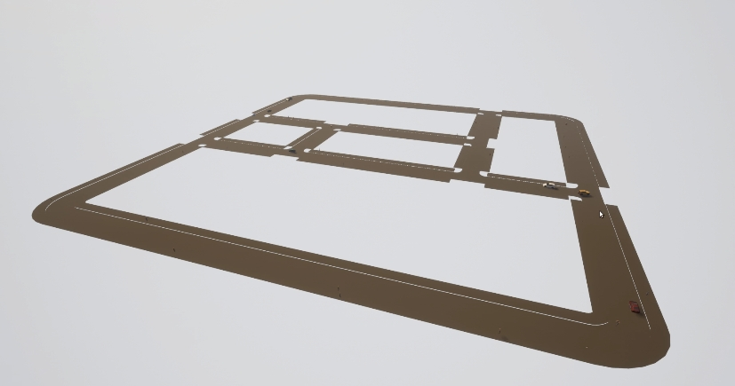
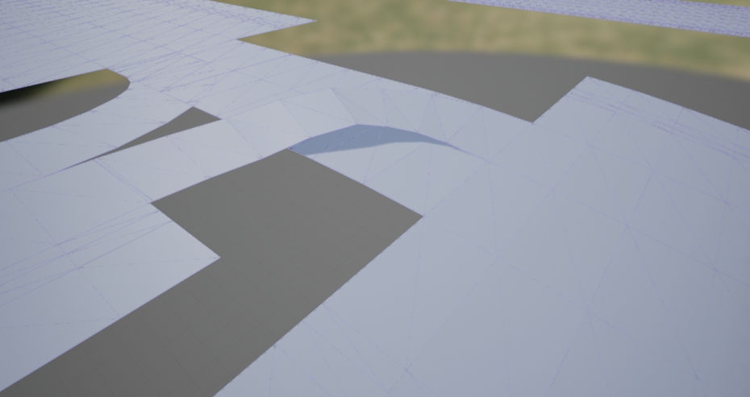

# OpenDRIVE standalone mode

This feature allows users to ingest any OpenDRIVE file as a CARLA map out-of-the-box. In order to do so, the simulator will automatically generate a road mesh for actors to navigate through.  

*   [__Overview__](#overview)  
*   [__Run a standalone map__](#run-a-standalone-map)  
*   [__Mesh generation__](#mesh-generation)  

---
## Overview

This mode runs a full simulation using only an OpenDRIVE file, without the need of any additional geometries or assets. To this end, the simulator takes an OpenDRIVE file and procedurally creates a temporal 3D mesh to run the simulation with.  

The resulting mesh describes the road definition in a minimalistic manner. All the elements will correspond with the OpenDRIVE file, but besides that, there will be only void. In order to prevent vehicles from falling off the road, two measures have been taken. 

*   Lanes are a bit wider at junctions, where the flow of vehicles is most complex.  
*   Visible walls are created at the boundaries of the road, to act as a last safety measure. 

Traffic lights, stops and yields will be generated on the fly. Pedestrians will navigate over the sidewalks and crosswalks that appear in the map. All of these elements, and every detail on the road, are based on the OpenDRIVE file. As the standalone mode uses the `.xodr` directly, any issues in it will propagate to the simulation. This could be an issue especially at junctions, where many lanes are mixed.

!!! Important
    It is especially important to double check the OpenDRIVE file. Any issues in it will propagate when running the simulation.



---
## Run a standalone map

Open an OpenDRIVE file is just a matter of calling [`client.generate_opendrive_world()`](python_api.md#carla.Client.generate_opendrive_world) through the API. This will generate the new map, and block the simulation until it is ready. The method needs for two parameters.  

*   __`opendrive`__ is the content of the OpenDRIVE file parsed as a string.  
*   __`parameters`__ is a [carla.OpendriveGenerationParameters](python_api.md#carla.OpendriveGenerationParameters) containing settings for the generation of the mesh. __This argument is optional__.  

	*   __`vertex_distance`__ *(default 2.0 meters)* — Distance between the vertices of the mesh. The bigger, the distance, the more inaccurate the mesh will be. However, if the distance is too small, the resulting mesh will be too heavy to work with.  
	*   __`max_road_length`__ *(default 50.0 meters)* — Maximum length of a portion of the mesh. The mesh is divide in portions to reduce rendering overhead. If a portion is not visible, UE will not render it. The smaller the portions, the more probably they are discarded. However, if the portions are too small, UE will have too many objects to manage, and performance will be affected too.  
	*   __`wall_height`__ *(default 1.0 meters)* — Height of the additional walls created on the boundaries of the road. These prevent vehicles from falling to the void.  
	*   __`additional_width`__ *(default 0.6 meters, 0.3 on each side)* — Small width increment applied to the junction lanes. This is a safety measure to prevent vehicles from falling.  
	*   __`smooth_junctions`__ *(default True)* — If __True__, some information of the OpenDRIVE will be reinterpreted to smooth the final mesh at junctions. This is done to prevent some inaccuracies that may occur when various lanes meet. If set to __False__, the mesh will be generated exactly as described in the OpenDRIVE.  
	*   __`enable_mesh_visibility`__ *(default True)* — If __False__, the mesh will not be rendered, which could save a lot of rendering work to the simulator.  


In order to easily test this feature, the `config.py` script in `PythonAPI/util/` has a new argument, `-x` or `--xodr-path`. This argument expects a string with the path to the `.xodr` file, such as `path/example.xodr`. If the mesh is generated with this script, the parameters used will always be the default ones. 

This feature can be tested with the new __TownBig__ provided by CARLA.  

```sh
python3 config.py -x opendrive/TownBig.xodr
```

!!! Important
    __[client.generate_opendrive_world()](python_api.md#carla.Client.generate_opendrive_world)__ uses __content of the OpenDRIVE file parsed as string__. On the contrary, __`config.py`__ script needs __the path to the `.xodr` file__. 

!!! Note
	If you experience the error	`opendrive could not be correctly parsed`, ensure that there are write permissions on the `CarlaUnreal/Content/Carla/Maps/OpenDrive/` directory. This is required by the server to parse the `xodr` file correctly.

---
## Mesh generation

The generation of the mesh is the key element of this mode. The feature can only be successful if the resulting mesh is smooth and fits its definition perfectly. For that reason, this step is constantly being improved. In the last iterations, junctions have been polished to avoid inaccuracies that occur, especially where uneven lanes joined.  


<div style="text-align: right"><i>When generating junction meshes, higher lanes tend to block the ones below them. <br>The parameter <code>smooth_junctions</code> prevents this kind of issue.</i></div>

Besides that, instead of creating the whole map as a unique mesh, different portions are created. By dividing the mesh, the simulator can avoid rendering portions that are not visible, and save up costs. Working smaller also allows to generate huge maps and contain issues that may occur on a small portion of the mesh.

Regarding the current state of the mesh generation, some considerations should be taken into account.  

*   __Junction smoothing__. The default smoothing prevents the issues at tilted junctions described above. However, it will modify the original mesh in the process. Set `smooth_junctions` to __False__ to disable the smoothing if preferred.  
*   __Lateral slope__. This feature is currently not integrated in CARLA. 
*   __Sidewalk height__. This is currently hard-coded for all the sidewalks the same. Sidewalks must be higher than the road level for collisions to be detected, but RoadRunner does not export this value to the OpenDRIVE file. The height is hard-coded to guarantee collisions. 
---

That covers all there is to know so far, regarding the OpenDRIVE standalone mode. Take the chance and use any OpenDRIVE map to test it in CARLA.  

Doubts and suggestions in the forum. 

<div class="build-buttons">
<p>
<a href="https://github.com/carla-simulator/carla/discussions/" target="_blank" class="btn btn-neutral" title="Go to the CARLA forum">
CARLA forum</a>
</p>
</div>
