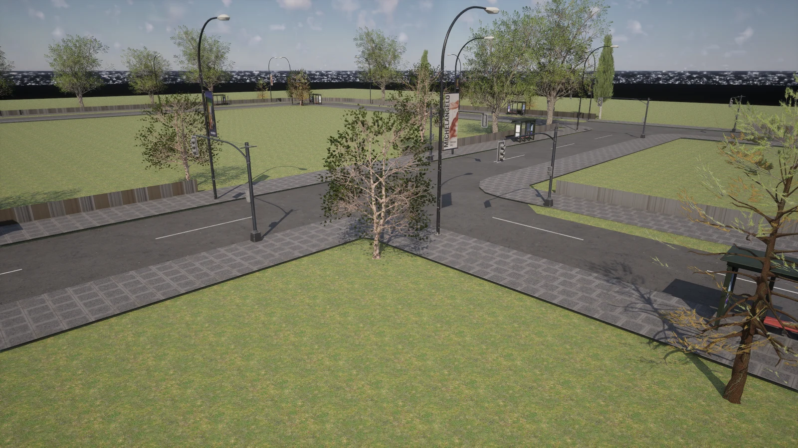

# ASAM OpenDRIVE standalone mode

CARLA can run a full simulation from an ASAM OpenDRIVE file alone, with no 3D assets of your own. The simulator parses the `.xodr`, builds a drivable world around its road definition, and populates it with the traffic lights, signs and pedestrian navigation the file describes. Any map you have as OpenDRIVE can therefore be driven in CARLA. Generation takes seconds for a small map and can grow to minutes for a large one.

- [__Load a map__](#load-a-map)
- [__Generation parameters__](#generation-parameters)
- [__What is generated__](#what-is-generated)
- [__Console controls__](#console-controls)
- [__Mesh generation__](#mesh-generation)
- [__Limitations__](#limitations)

---

## Load a map

[`Client.generate_opendrive_world()`](python_api.md#carla.Client.generate_opendrive_world) takes the __contents__ of the file, not its path, and blocks until the world is ready.

```py
with open('/path/to/map.xodr') as f:
    client.generate_opendrive_world(f.read())
```

`PythonAPI/util/config.py` does the same from a shell, and takes a __path__:

```sh
python3 config.py -x /path/to/map.xodr
```

!!! Note
    Generation writes as it goes: the road network to `Saved/OpenDrive/OpenDriveMap.xodr` and the navigation mesh to `Saved/Nav/`. The server needs write access to its `Saved/` directory, not to its content directory, which is inside the pak in a packaged build and deliberately read-only.

---

## Generation parameters

The second argument of `generate_opendrive_world()` is a [`carla.OpendriveGenerationParameters`](python_api.md#carla.OpendriveGenerationParameters). It is optional, and `config.py` always uses the defaults.

| Parameter | Default | What it does |
| --------- | ------- | ------------ |
| `vertex_distance` | 2.0 m | Spacing of the mesh vertices. Larger is coarser; too small makes the mesh heavy to work with. |
| `max_road_length` | 50.0 m | Length of each mesh chunk. The world is split so the engine can cull what is off screen; very small chunks trade culling for object count. |
| `wall_height` | 1.0 m | Height of the walls raised at the outer boundary of the road, which stop a vehicle driving off into the void. |
| `additional_width` | 0.6 m | Widening applied to each side of a driving lane inside a junction, so the default adds 1.2 m to its width, as a margin against falling off. |
| `smooth_junctions` | True | Reinterprets the OpenDRIVE where lanes meet at different heights, so a junction does not self-occlude. False builds the junction exactly as written. |
| `enable_mesh_visibility` | True | False keeps the road collidable but stops rendering it, which saves most of the rendering cost. |
| `enable_pedestrian_navigation` | True | Builds the navigation mesh so walkers can use the sidewalks and crosswalks. |

```py
params = carla.OpendriveGenerationParameters(
    vertex_distance=2.0,
    wall_height=1.0,
    smooth_junctions=True)

client.generate_opendrive_world(xodr, params)
```

---

## What is generated

Everything in the world comes from the one file. CARLA builds:

- __The road mesh__, lane by lane, following each road's elevation profile and the `shape` of its `lateralProfile`, so a crowned road is reproduced rather than flattened.
- __A ground plane__ around the road, following its elevation and skirted outwards past the road bounds, so the horizon is terrain instead of void.
- __Road markings and crosswalks__, drawn as decals from the OpenDRIVE lane markings, including markings through junctions.
- __Traffic lights, stop and yield signs__, placed from the signals in the file and wired into junction controllers.
- __Street furniture__ — lamp posts, vegetation and signage — scattered along the roadside with PCG.
- __Pedestrian navigation__, over the sidewalks and crosswalks the file defines.

Everything comes from the `.xodr`, so an error in the file becomes an error in the simulation. Junctions are the usual source, since that is where many lanes meet.


<div style="text-align: right"><i>A world generated from Town01.xodr: road mesh, ground plane, markings, signals and roadside furniture. Town01.xodr (OpenDRIVE standalone) &middot; sensor.camera.rgb &middot; Cinematic &middot; sunny afternoon</i></div>


<div style="text-align: right"><i>A junction of the generated Town01 world: traffic light, lamps, bus stop and sidewalks. Town01.xodr (OpenDRIVE standalone) &middot; sensor.camera.rgb &middot; Cinematic &middot; sunny afternoon</i></div>

---

## Console controls

Two Unreal console commands change what generation does. They are typed into the server's own console, not sent from the client: open it with the `~` key in an editor or development build, or pass `-execcmds=` on the command line. A packaged Shipping build strips that parser, as [Rendering options](adv_rendering_options.md) explains.

`carla.OpenDrive.StreetFurniture 0` generates the bare road, with no lamps, vegetation or signage. `1` is the default, and the command has to be set before the world is generated to have any effect.

`carla.MapGenQA` re-runs the generated-map checks — road support, terrain invading the road, objects left on the roadway — and logs what they find. They also run automatically after every generation, so this is for re-reading the verdict.

A client can add its own geometry to a generated world with [`World.spawn_custom_mesh()`](python_api.md#carla.World.spawn_custom_mesh), which takes vertices, triangles and a material.

---

## Mesh generation

The mesh is the whole feature: the simulation is only as good as the surface it is built on.

It is produced in chunks of `max_road_length` rather than as one object, so the engine can cull what is not visible, large maps stay manageable, and a defect in one part of the road stays in that part.

Junctions get special treatment. Where lanes meet at different heights, the raw definition makes the higher lane cut through the lower one, and a vehicle crossing the junction climbs or clips. `smooth_junctions` reinterprets those heights so the surfaces join:


<div style="text-align: right"><i>Higher lanes blocking the ones below them at a junction. <code>smooth_junctions</code> prevents this.</i></div>

Junction lanes are also widened by `additional_width`, and the outer boundary of the road is walled to `wall_height`, both to keep vehicles on the surface where the definition is least precise.

---

## Limitations

- __Sidewalk height is fixed.__ Sidewalks must stand above the road for collisions to register, and RoadRunner does not export the height, so CARLA applies one value everywhere.
- __Junction smoothing changes the geometry.__ It is on by default because it prevents the defect above, but the result is not a literal reading of the file. Turn it off when the mesh has to match the definition exactly.
- __Superelevation is ignored.__ The `superelevation` and `crossfall` entries of a `lateralProfile` are parsed and discarded; only `shape` reaches the mesh. A banked curve is built flat.
- __The file is the source of truth.__ Overlapping lanes, inconsistent elevations or malformed junctions are reproduced faithfully.
