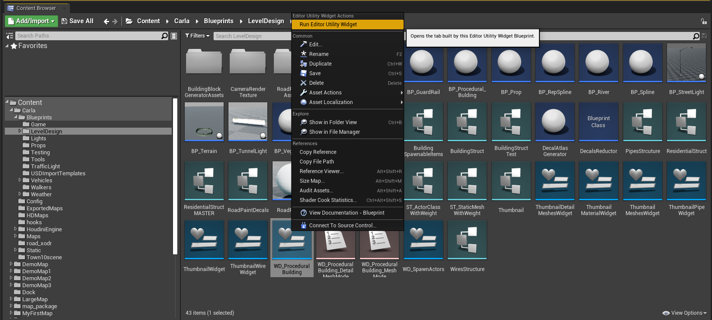
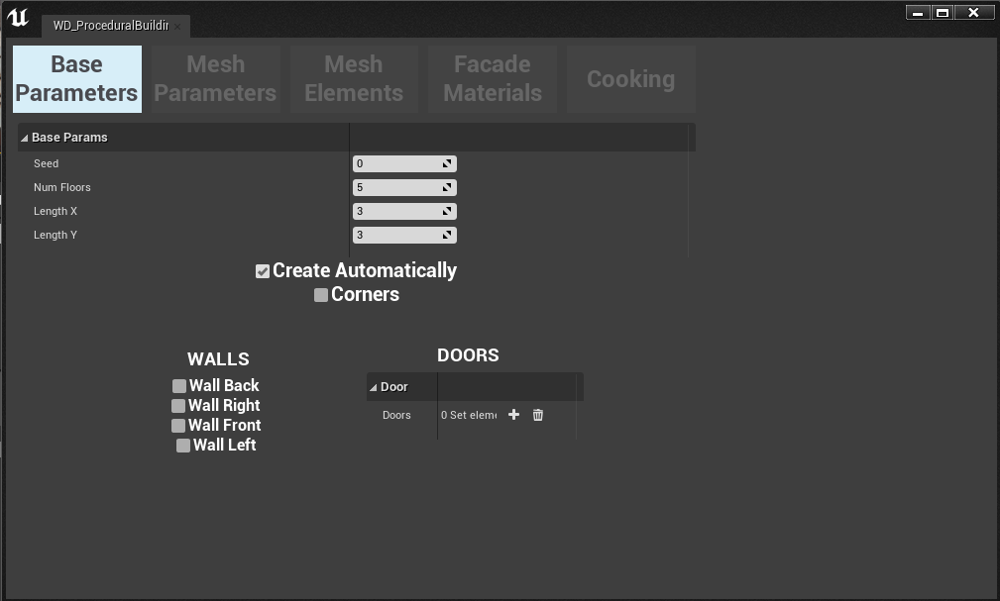
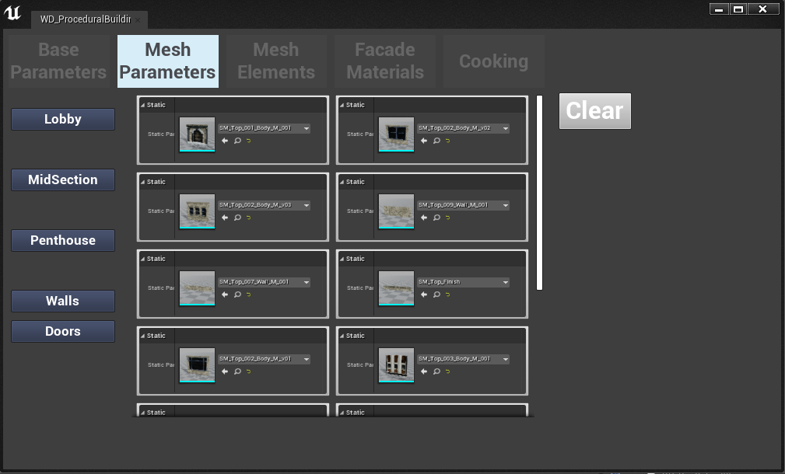
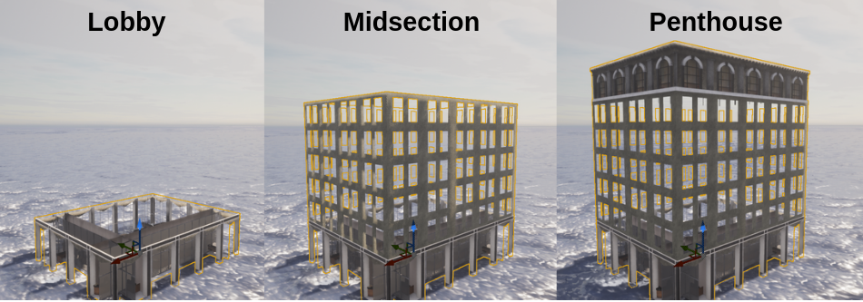
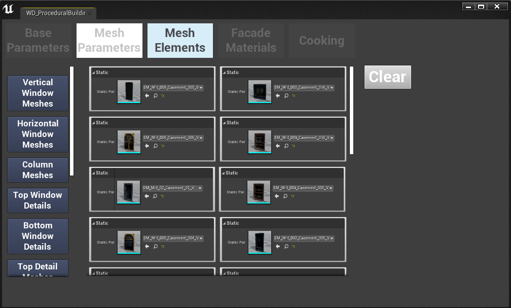
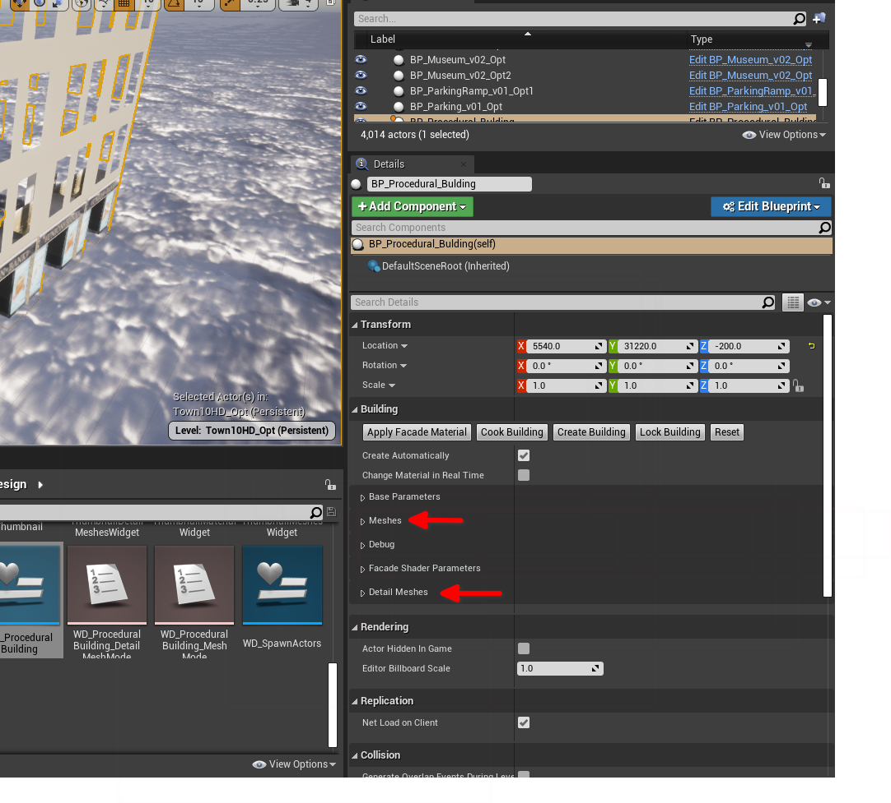
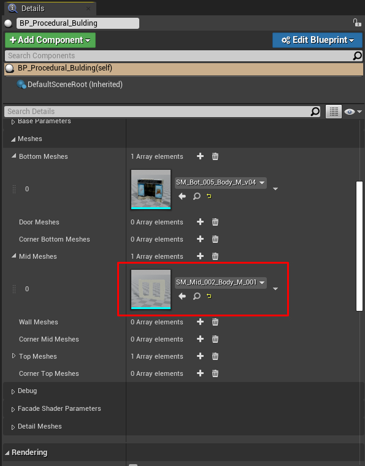
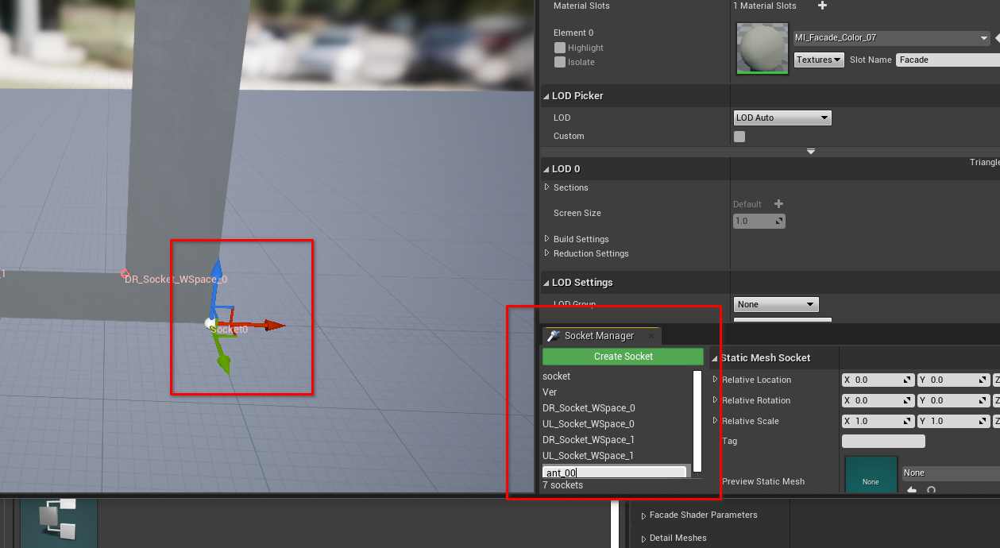
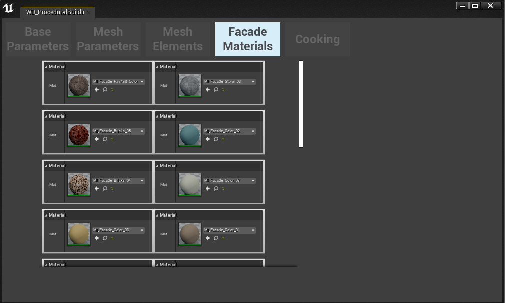
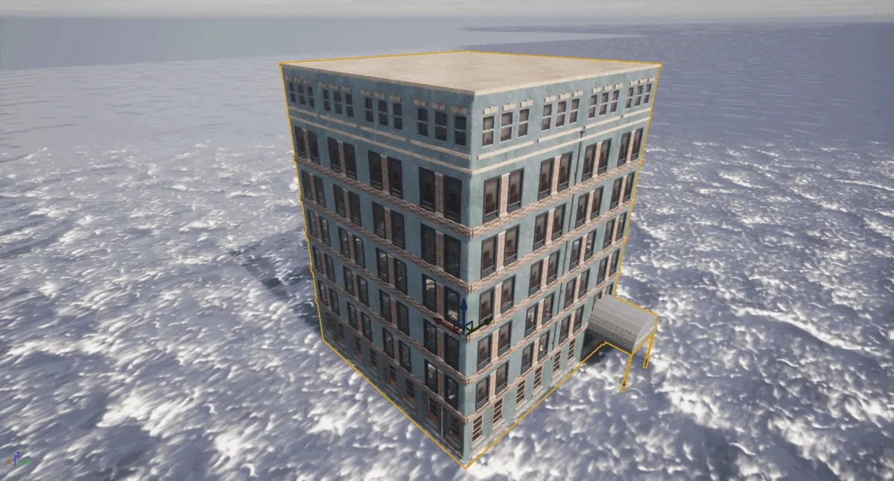

!!! note
	The __Procedural Building Tool__ is currently an __experimental feature__ and is not considered *production ready* at this stage. Hence it should only be used for experimental research projects.

# Procedural Building Tool

The __Procedural Building Tool__ facilitates the generation of virtual 3D buildings for which the dimensions and decoration styles can be modulated to create a near infinite array of variations through a simple interface. The footprint dimensions and height in stories can be chosen through the interface. Then users can select a variety of styles for the building lobby, the body and the top floor or penthouse. A variety of facia element styles can be chosen for features such as corners windows and balconies from the CARLA asset library. 

- [__Opening the tool__](#opening-the-procedural-building-tool)
- [__Base parameters__](#base-parameters)
- [__Mesh parameters__](#mesh-parameters)
- [__Mesh elements__](#mesh-elements)
	- [Sockets](#sockets)
- [__Facade materials__](#facade-materials)
- [__Cooking__](#cooking)

## Opening the Procedural Building Tool

Firstly, you need to add a procedural building actor to the scene. Navigate to `Content>Carla>Blueprints>LevelDesign` and drag the *BP_ProceduralBuilding* blueprint into your map. Move the asset to the position where you wish to visualize the building. Choose a place where you have space so you can see the result clearly. Then to open the tool, launch the Procedural Building tool by right clicking on the *WD_ProceduralBuilding* widget and selecting *Run editor utility widget* from the context menu. This will open the tool's interface. 

!!! note
	You must complete this step before opening the tool, an instance of the *BP_ProceduralBuilding* blueprint must exist in the map before the tool can function. You must also ensure that the *BP_ProceduralBuilding* entity is selected in the *World outliner* before proceeding.

## Base parameters

In the base parameters section you select the fundamental properties of your building, such as the footprint and the height in floors.

!!! note
	Until you have selected mesh pieces in the [mesh parameters](#mesh-parameters) section, you will not see any changes in the Unreal Engine viewport when you adjust the base parameters

The available parameters are as follows:

- __Seed__: sets the random seed for the procedural generation, this enables variations on the building with the same settings.
- __Num floors__: sets the number of stories or floors the building will have, and henceforth defines the height of the building.
- __Length X/Y__: defines the size of the footprint of the building in the X and Y dimensions. These are unitless, the number denotes the number repeating sections, each section is a column of windows.
- __Create automatically__: if this option is selected, the building will automatically update in the viewport so you can see the effect of your adjustments.
- __Corners__: allows corner pieces to be added to the building, you can choose these pieces in the Mesh Parameters section.
- __Walls__: replace the middle pieces of the left/right/front/back of the building with alternate pieces that can be selected using the [Mesh parameters](#mesh-parameters) menu.
- __Doors__: array allowing the placement of a door in the lobby level. The door is placed at the chosen index position.

## Mesh parameters

In the Mesh Parameters tab in the interface, we choose the mesh pieces that will be used to clad the exterior of the building. There are 5 categories of mesh pieces for different parts of the building:

- __Lobby__: mesh pieces to decorate the lobby of the building.
- __Midsection__: mesh pieces to decorate the midsection of the building, every floor between the lobby and the top floor.
- __Penthouse__: mesh pieces to decorate the penthouse level.
- __Doors__: mesh pieces to add doors to the lobby
- __Walls__: mesh pieces to decorate the walls of the building

In each category you will find numerous options for mesh pieces. Click on one or more such that they turn red, these will be added to the respective section of your building. If you choose more than one, the tool will randomly alternate between the choices. As you select the mesh pieces for each section of your building, if you have *Create automatically* selected in the base parameters section, you will see the building taking shape in the editor viewport.

## Mesh elements

In this section you can select the more detailed elements of the building such as windows, columns, plant pots, air conditioning units and antennas. Each type of decoration has slightly different properties.

There are numerous types of decoration for details of the building:

- __Vertical/Horizontal window meshes__: these mesh pieces define the style of the window frames in the building. Vertical window meshes will occupy the window spaces that are taller than their width, while horizontal window meshes will occupy the window spaces that are wider than their height. If you select multiple options, they will alternate. 

- __Column meshes__: these simulate brickwork column details that span the height of the building

- __Top/Bottom window details__: these meshes decorate the top of the windows with lintels and sunshades and the bottom of the windows with window sills and plant boxes.

- __Window columns__: brickwork columns that separate windows

- __Curtain meshes__: curtains and blinds to go inside the windows

- __Pot meshes__: plant pots that are added to window sills and plant boxes at specified socket points

- __Air conditioner meshes__: air conditioning units that are added to the windows at specified socket points

- __Pipe meshes__: pipes that descend the building vertically mimicking drainage pipes for the roof

- __Wire meshes__: wires that descend the building vertically mimicking TV aerial extensions and lightning grounding wires

- __Antenna meshes__: TV antennas that protrude from the windows

 The parameters work as follows:

 __Common parameters__:

* __Percentage__: controls the amount pieces that will be placed on the building, 100% means all available spaces will be occupied
* __Offset__: spacial offset of the piece from the body of the building

__Blinds and curtains__:

* __Min/Max size__: selects the min/max length of the blinds or curtains with random variation between the values. 1.0 is fully shut, 0.0 is fully open.

__Pipes and wires__:

* __Index__: defines the face of the building where the pipe will be placed
* __Offset side/front__: adds a spatial offset to the piece from the center of the face of the building

!!! note
	You may find in some cases that when you choose detail mesh pieces such as plant pots, antennas and air conditioning units, you don't see any change in the building. This is most likely because the pieces you are using don't have the appropriate sockets needed to add the pieces you chose. Refer to the [sockets section](#sockets) to learn how to use sockets

### Sockets

Sockets are anchor points which define where to place detail meshes on another mesh piece. To add sockets to the mesh pieces in the procedural building, with the procedural building selected, go to the *details panel*, normally on the right hand side of the UE editor interface. In there, you will find the *Meshes* and *Detail meshes* panels. Open the relevant section to open the mesh piece where you wish to place the socket.

Find the mesh on which you want to place a socket and double click the icon to open it in the editor. Click *create socket* to add a socket and name it using the following convention:

* Air conditioning unit: aa_*
* Antennas: ant_*
* Plant pots: pot_*

Replace the asterisk with an index, depending upon how many sockets you have, i.e. aa_0, aa_2, aa_3...

When you click *Create socket* the socket will be instantiated in the editor with a 3D handle. Drag the socket to the desired position on the mesh, this is where your detail piece will appear attached to the unit. 

## Facade materials

In the facade materials tab, you can browse and preview the material that you want to decorate the walls of your building.

## Cooking

In the cooking tab, you initiate the combination of all the mesh pieces and materials you've selected into a single static mesh with associated materials and textures. An LOD texture of the building will also be created for the LOD. Specify a folder name in the interface where the assets for your new building will be saved.

Once you have cooked your building, you will then be able to place instances of the building in the map just like any other CARLA assets.

