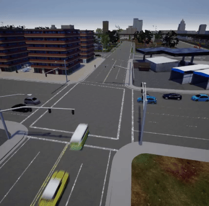
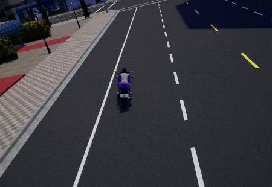

# Recorder  

This is one of the advanced CARLA features. It allows to record and reenact a simulation while providing with a complete log of the events happened and a few queries to ease the trace and study of those.  
To learn about the generated file and its specifics take a look at this [reference](ref_recorder_binary_file_format.md). 

  * [__Recording__](#recording)  
  * [__Simulation playback__](#simulation-playback):  
	* Setting a time factor
  * [__Recorded file__](#unreal-engine)
  * [__Queries__](#queries):
	* Collisions
	* Blocked actors
  * [__Sample Python scripts__](#sample-python-scripts)  

---
## Recording

All the data is written in a binary file on the server side only. However, the recorder is managed using the [carla.Client](python_api.md#carla.Client).  
To reenact the simulation, actors will be updated on every frame according to the data contained in the recorded file. Actors that appear in the simulation will be either moved or re-spawned to emulate the recording. Those that do not appear in the recording will continue their way as if nothing happened.  

!!! Important
    By the end of the playback, vehicles will be set to autopilot, but __pedestrians will stop at their current location__. 

The information registered by the recorder basically includes:  

* __Actors:__ Creation and destruction.  
* __Traffic lights:__ State changes.  
* __Vehicles and pedestrians:__ Position and orientation. 

To start recording there is only need for a file name. Using `\`, `/` or `:` characters in the file name will define it as an absolute path. If no path is detailed, the file will be saved in `CarlaUE4/Saved`.  

```py
client.start_recorder("/home/carla/recording01.log")
```

To stop the recording, the call is also straightforward:

```py
client.stop_recorder()
```

!!! Note
    As an estimate: 1h recording with 50 traffic lights and 100 vehicles takes around 200MB in size.

---
## Simulation playback

A playback can be started at any point during a simulation only specifying the file name.  

```py
client.replay_file("recording01.log")
```
Additionally, this method allows for some parameters to specify which segment of the recording is reenacted:

```py
client.replay_file("recording01.log", start, duration, camera)
```
| Parameters | Description                                           | Notes |
| ---------- | ----------------------------------------------------- | ----- |
| `start`    | Recording time in seconds to start the simulation at. | If positive, time will be considered from the beginning of the recording. <br>If negative, it will be considered from the end.  |
| `duration` | Seconds to playback. 0 is all the recording.          | By the end of the playback, vehicles will be set to autopilot and pedestrians will stop. |
| `camera`   | ID of the actor that the camera will focus on.        | By default the spectator will move freely. |  

<br>

!!! Note
    These parameters allows to recall an event and then let the simulation run free, as vehicles will be set to autopilot when the recording stops. 

#### Setting a time factor

The time factor will determine the playback speed.  

It can be changed any moment without stopping the playback, using the following API call:

```py
client.set_replayer_time_factor(2.0)
```
| Parameters    | Default | Fast motion | slow motion |
| ------------- | ------- | ----------- | ----------- |
| `time_factor` | __1.0__ | __>1.0__    | __<1.0__    |  

<br>

!!! Important
    Over 2.0 position interpolation is disabled and just updated. Pedestrians' animations are not affected by the time factor.  

For instance, with a time factor of __20x__ traffic flow is easily appreciated:



---
## Recorded file

The details of a recording can be retrieved using a simple API call. By default, it only retrieves those frames where an event was registered, but setting the parameter `show_all` would return all the information for every frame. The specifics on how the data is stored are detailed in the [recorder's reference](ref_recorder_binary_file_format.md).  
The following example only would retrieve remarkable events:

```py
client.show_recorder_file_info("recording01.log")
``` 

* __Opening information:__ map, date and time when the simulation was recorded.  

* __Frame information:__ any event that could happen (actor spawning/destruction, collisions...). The output contains the actor's ID and some additional information.

* __Closing information:__ a summary of number of frames and total time recorded.  

The output result should be similar to this one:

```
Version: 1
Map: Town05
Date: 02/21/19 10:46:20

Frame 1 at 0 seconds
 Create 2190: spectator (0) at (-260, -200, 382.001)
 Create 2191: traffic.traffic_light (3) at (4255, 10020, 0)
 Create 2192: traffic.traffic_light (3) at (4025, 7860, 0)
 ...
 Create 2258: traffic.speed_limit.90 (0) at (21651.7, -1347.59, 15)
 Create 2259: traffic.speed_limit.90 (0) at (5357, 21457.1, 15)

Frame 2 at 0.0254253 seconds
 Create 2276: vehicle.mini.cooperst (1) at (4347.63, -8409.51, 120)
  number_of_wheels = 4
  object_type =
  color = 255,241,0
  role_name = autopilot
... 
Frame 2350 at 60.2805 seconds
 Destroy 2276

Frame 2351 at 60.3057 seconds
 Destroy 2277
...

Frames: 2354
Duration: 60.3753 seconds
```
---
## Queries

#### Collisions

In order to record collisions, vehicles must have a [collision detector](ref_sensors.md#collision-detector) attached. The collisions registered by the recorder can be queried using arguments to filter the type of the actors involved in the collisions. For example, `h` identifies actors whose `role_name = hero`, usually assigned to vehicles managed by the user.  
Currently, the actor types that can be used in the query are:  

* __h__ = Hero
* __v__ = Vehicle
* __w__ = Walker
* __t__ = Traffic light
* __o__ = Other
* __a__ = Any

!!! Note
    The `manual_control.py` script automatically assigns the `role_name` of the vehicle to `hero` besides providing control over it.

The API call to query collisions requires two of the previous flags to filter the collisions. The following example would show collisions registered between vehicles and any other object:  

```py
client.show_recorder_collisions("recording01.log", "v", "a")
```

The output summarizes time of the collision and type, ID and description of the actors involved. It should be similar to this one:

```
Version: 1
Map: Town05
Date: 02/19/19 15:36:08

    Time  Types     Id Actor 1                                 Id Actor 2
      16   v v     122 vehicle.yamaha.yzf                     118 vehicle.dodge_charger.police
      27   v o     122 vehicle.yamaha.yzf                       0

Frames: 790
Duration: 46 seconds
```

!!! Important
    As it is the `hero` or `ego` vehicle who registers the collision, this will always be `Actor 1`. 


To understand how that collision happened, it could be a good idea to replay it just moments before the event: 

```py
client.replay_file("col2.log", 13, 0, 122)
```
In this case, the playback showed this: 



#### Blocked actors

This query is used to detect vehicles that where stucked during the recording. An actor is considered blocked if it does not move a minimum distance in a certain time. This definition is made by the user during the query:

```py
client.show_recorder_actors_blocked("recording01.log", min_time, min_distance)
```

| Parameters     | Description                                               | Default |
| -------------- | --------------------------------------------------------- | ----- |
| `min_time`     | Minimum seconds to move `min_distance`.                   | 30 secs. |
| `min_distance` | Minimum centimeters to move to not be considered blocked. | 10 cm. |  

<br> 

!!! Note
    Take into account that vehicles are stopped at traffic lights sometimes for longer than expected.  

For the sake of comprehension, let's make an example to look for vehicles stopped (moving less than 1 meter during 60 seconds):

```py
client.show_recorder_actors_blocked("col3.log", 60, 100)
```

The output is sorted by __duration__, which states how long it took to stop being "blocked" and move the `min_distance`:

```
Version: 1
Map: Town05
Date: 02/19/19 15:45:01

    Time     Id Actor                                 Duration
      36    173 vehicle.nissan.patrol                      336
      75    214 vehicle.chevrolet.impala                   295
     302    143 vehicle.bmw.grandtourer                     67

Frames: 6985
Duration: 374 seconds
```

In this example, the vehicle `173` was stopped for `336` seconds at time `36` seconds. To check the cause of it , it would be useful to check how it arrived to that situation by replaying a few seconds before the second `36`:

```py
client.replay_file("col3.log", 34, 0, 173)
```


---
## Sample python scripts

Some of the provided scripts in `PythonAPI/examples` facilitate the use of the recorder:

* __start_recording.py__: starts the recording. Optionally actors can be spawned at the beginning and duration of the recording set.  

| Parameters     | Description  |
| -------------- | ------------ |
| `-f`           | Filename.     |
| `-n` <small>(optional)</small>| Vehicles to spawn. Default is 10. |
| `-t` <small>(optional)</small>| Duration of the recording. |  

<br>

* __start_replaying.py__: starts the playback of a recording. Starting time, duration and actor to follow can be set.

| Parameters  | Description  |
| -------------- | ------------ |
| `-f`           | Filename.     |
| `-s` <small>(optional)</small>| Starting time. Default is 0. |
| `-d` <small>(optional)</small>| Duration. Default is all. |
| `-c` <small>(optional)</small>| ID of the actor to follow. |  

<br>

* __show_recorder_file_info.py__: shows all the information in the recording file.  
Two modes of detail: by default it only shows frames where some event is recorded. The second shows all information for all frames.

| Parameters     | Description  |
| -------------- | ------------ |
| `-f`           | Filename.     |
| `-s` <small>(optional)</small>| Flag to show all details. |  

<br>

* __show_recorder_collisions.py__: shows recorded collisions between two actors of type __A__ and __B__ defined using a series of flags: `-t = vv` would show all collisions between vehicles. 

| Parameters  | Description   |
| ----------- | ------------- |
| `-f`        | Filename.     |
| `-t`        | Flags of the actors involved: <br> `h` = hero <br> `v` = vehicle <br> `w` = walker <br> `t` = traffic light <br> `o` = other <br> `a` = any |


* __show_recorder_actors_blocked.py__: shows a register for vehicles considered blocked. Actors are considered blocked when not moving a minimum distance in a certain time.  

| Parameters      | Description  |
| --------------- | ------------ |
| `-f`            | Filename.     |
| `-t` <small>(optional)</small> | Time to move `-d` before being considered blocked. |
| `-d` <small>(optional)</small> | Distance to move to not be considered blocked. |  

<br>

---
Now it is time to experiment for a while. Use the recorder to playback a simulation, trace back events, make changes to see new outcomes. Feel free to say your word in the CARLA forum about this matter: 
<div class="build-buttons">
<!-- Latest release button -->
<p>
<a href="https://forum.carla.org/" target="_blank" class="btn btn-neutral" title="Go to the CARLA forum">
CARLA forum</a>
</p>
</div>
