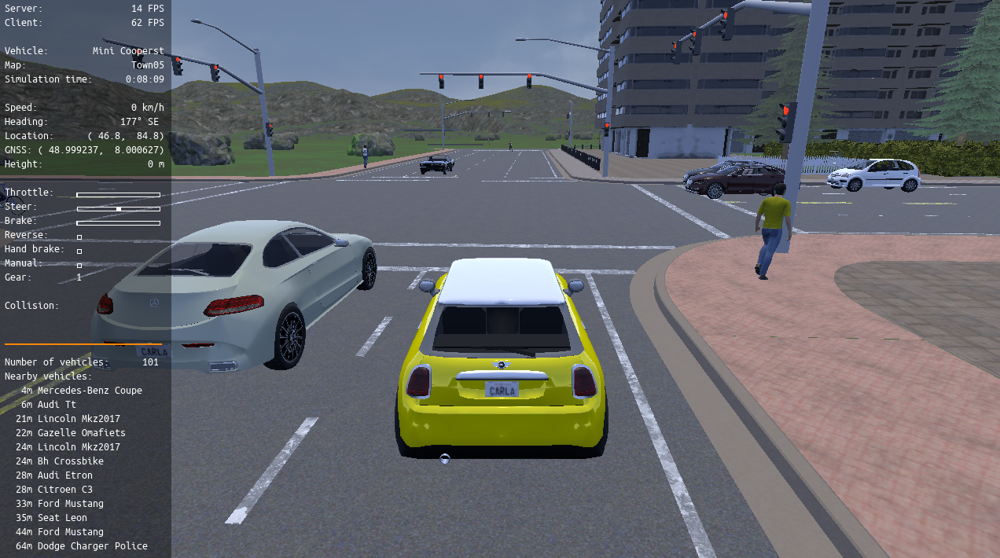

# Rendering options

Before you start running your own experiments there are few details to take into
account at the time of configuring your simulation. In this document we cover
the most important ones.

  * [__Graphics quality__](#graphics-quality):  
	* Vulkan vs OpenGL 
	* Quality levels 
  * [__No-rendering mode__](#no-rendering-mode)  
  * [__Off-screen mode__](#off-screen-mode)  
	* Off-screen Vs no-rendering
  * [__Running off-screen using a preferred GPU__](#running-off-screen-using-a-preferred-gpu): 
	* Docker: recommended approach
	* Deprecated: emulate the virtual display


!!! Important
    Some of the command options shown below are not directly equivalent when using the CARLA packaged releases. Read the [Command line options](#command-line-options) section to learn more about this. 

---
## Graphics quality

#### Vulkan vs OpenGL

Vulkan is the default graphics API used by Unreal Engine and CARLA (if installed). It consumes more memory, but performs faster and makes for a better frame rate. However, it is quite experimental, especially in Linux, and it may lead to some issues.  
For said reasons, there is the option to change to OpenGL simply by using a flag when running CARLA. The same flag works for both Linux and Windows: 

```sh
cd carla && ./CarlaUE4.sh -opengl
```
When working with the build version of CARLA it is Unreal Engine the one that needs to be set to use OpenGL. [Here][UEdoc] is a documentation regarding different command line options for Unreal Engine. 
[UEdoc]: https://docs.unrealengine.com/en-US/Programming/Basics/CommandLineArguments/index.html

#### Quality levels

CARLA also allows for two different graphic quality levels named as __Epic__, the default, and __Low__, which disables all post-processing, shadows and the drawing distance is set to 50m instead of infinite and makes the simulation run significantly faster.  
Low mode is not only used when precision is nonessential or there are technical limitations, but also to train agents under conditions with simpler data or regarding only close elements. 

The images below show how do both modes look like and how to start the CARLA packaged release with the appropiate flag in order to set a quality level. The same flag works for both Linux and Windows. There is no equivalent option when working with the build, but the UE editor has its own quality settings in _Settings>Engine Scalability Settings_ that allow for a greater customization of the desired quality. 

  |  
:-------------------------:|:-------------------------:
`./CarlaUE4.sh -quality-level=Epic`  |  `./CarlaUE4.sh -quality-level=Low`

!!! Important
    The issue that made Epic mode show an abnormal whiteness has been fixed. If the problem persists delete `GameUserSettings.ini` as it is saving the previous settings. It will be generated again in the next run. __Ubuntu path:__ `  ~/.config/Epic/CarlaUE4/Saved/Config/LinuxNoEditor/` __Windows path:__ `<Package folder>\WindowsNoEditor\CarlaUE4\Saved\Config\WindowsNoEditor\`

---
## No-rendering mode

This mode completely disables rendering in the simulator, Unreal Engine will skip everything regarding graphics. This facilitates a lot simulating traffic and road behaviours at very high frequencies without the rendering overhead. To enable or disable no-rendering mode the user can either change the world settings in a script or use the provided script in `/PythonAPI/util/config.py` that does that same thing automatically.  
Here is an example on how to enable and then disable it via script.  
```py
settings = world.get_settings()
settings.no_rendering_mode = True
world.apply_settings(settings)
...
settings.no_rendering_mode = False
world.apply_settings(settings)
```
And here is an example on how to disable and then enable rendering using the `config.py`: 
```sh
cd PythonAPI/util && ./config.py --no-rendering
```
```sh
cd PythonAPI/util && ./config.py --rendering
```

On of the example scripts in `PythonAPI/examples/no_rendering_mode.py` will enable no-rendering mode and use __Pygame__ to create an aerial view using simple graphics: 
```sh
cd PythonAPI/examples && ./no_rendering_mode.py
```

!!! Warning
    In no-rendering mode, cameras and GPU sensors will return empty data. The GPU is not used, as Unreal Engine is not drawing any scene. 

---
## Off-screen mode

Unreal Engine needs for a screen in order to run, but there is a workaround for this that makes possible to work on rendering for remote servers with no display or desktop users with a GPU not connected to any screen.  
The simulator launches but there is no available window. However, it can be connected in the usual manner and scripts run the same way. For the sake of understanding let's sake that this mode tricks Unreal Engine into running in a fake screen.


#### Off-screen vs no-rendering

These may look similar but are indeed quite different. It is important to understand the disctintion them to prevent misunderstandings. In off-screen Unreal Engine is working as usual and rendering is computed as usual. The only difference is that there is no available display. In no-rendering, it is Unreal Engine the one that is said to avoid rendering and thus, graphics are not computed. For said reasons, GPU sensors return data when off-screen and no-rendering mode can be enabled at will. 

#### Setting off-screen mode

Right now this is __only possible in Linux while using OpenGL__ instead of Vulkan. Unreal Engine crushes when Vulkan is running off-screen, and this issue is yet to be fixed by Epic. 

To force the simulator run off-screen set the environment variable `DISPLAY` to empty and run CARLA using OpenGL:

```sh
# Linux
DISPLAY= ./CarlaUE4.sh -opengl
```
Note that this method, in multi-GPU environments, does not allow to choose the GPU that the simulator will use for rendering. To do so, read the following section.

---
## Running off-screen using a preferred GPU  

#### Docker: recommended approach 

The best way to run a headless CARLA and select the GPU is to [__run CARLA in a Docker__](build_docker.md). 
This section contains an alternative tutorial, but this method is deprecated and performance is much worse. However, it is here just in case, for those who Docker is not an option. 

  <details>
    <summary><h4 style="display:inline">
    Deprecated: emulate the virtual display
    </h4></summary>

!!! Warning
    This tutorial is deprecated. To run headless CARLA, please [__run CARLA in a Docker__](build_docker.md). 

* __Requirements:__  

This tutorial only works in Linux and makes it possible for a remote server using several graphical cards to use CARLA on all GPUs. This is also translatable to a desktop user trying to use CARLA with a GPU that is not plugged to any screen. To achieve that, the steps can be summarized as:  

__1.__ Configure the server to have Nvidia working with no display.  
__2.__ Use VNC and VGL to simulate a display connected to any GPU.  
__3.__ Run CARLA.  

This tutorial was tested in Ubuntu 16.04 using NVIDIA 384.11 drivers.

  * __[Latest Nvidia drivers](http://www.nvidia.es/Download/index.aspx)__ 
  * __[OpenGL](https://www.khronos.org/opengl/wiki/Getting_Started)__: needed to use Virtual GL (VGL). OpenGL can be installed via apt:  
```sh
sudo apt-get install freeglut3-dev mesa-utils
```
  * __[VGL](https://virtualgl.org/vgldoc/2_2_1/#hd004001)__: redirects 3D rendering commands from Unix and Linux OpenGL to the hardware in a dedicated server. 

  * __[TurboVNC 2.11](https://cdn.rawgit.com/TurboVNC/turbovnc/2.1.1/doc/index.html#hd005001)__: graphical desktop-sharing system to connect remotely to the server.  

  * __Extra packages__: necessary to make Unreal work.
```sh
sudo apt install x11-xserver-utils libxrandr-dev
```
!!! Warning
    Make sure that VNC version is compatible with Unreal. The one above worked properly during the making of this tutorial. 
  

* __Configure the X__

Generate a X compatible with the Nvdia installed and able to run without display:

    sudo nvidia-xconfig -a --use-display-device=None --virtual=1280x1024  

* __Emulate the virtual display__

Run a Xorg. Here number 7 is used, but it could be labeled with any free number:

    sudo nohup Xorg :7 &

Run an auxiliary remote VNC-Xserver. This will create a virtual display "8":

    /opt/TurboVNC/bin/vncserver :8

If everything is working fine the following command will run glxinfo on Xserver 7 selecting the GPU labeled as 0:

    DISPLAY=:8 vglrun -d :7.0 glxinfo

!!! Important
    To run on other GPU, change the `7.X` pattern in the previous command. To set it to GPU 1: `DISPLAY=:8 vglrun -d :7.1 glxinfo`  

* __Extra__

To disable the need of sudo when creating the `nohup Xorg` go to `/etc/X11/Xwrapper.config` and change `allowed_users=console` to `allowed_users=anybody`. 

It may be needed to stop all Xorg servers before running `nohup Xorg`. The command for that could change depending on your system. Generally for Ubuntu 16.04 use:

    sudo service lightdm stop  

* __Running CARLA__

To run CARLA on a certain `<gpu_number>` in a certain `$CARLA_PATH` use the following command:

    DISPLAY=:8 vglrun -d :7.<gpu_number> $CARLA_PATH/CarlaUE4/Binaries/Linux/CarlaUE4

!!! Note
    The `8` and `7.X` variables in the previous command depend on which were used while emulating the virtual display.

</details>

---

That is all there is to know about the different rendering options in CARLA.  
Open CARLA and mess around for a while to make sure that everything is clear and yet, if there are any doubts, feel free to post these in the forum. 

<div class="build-buttons">
<p>
<a href="https://forum.carla.org/" target="_blank" class="btn btn-neutral" title="Go to the CARLA forum">
CARLA forum</a>
</p>
</div>
