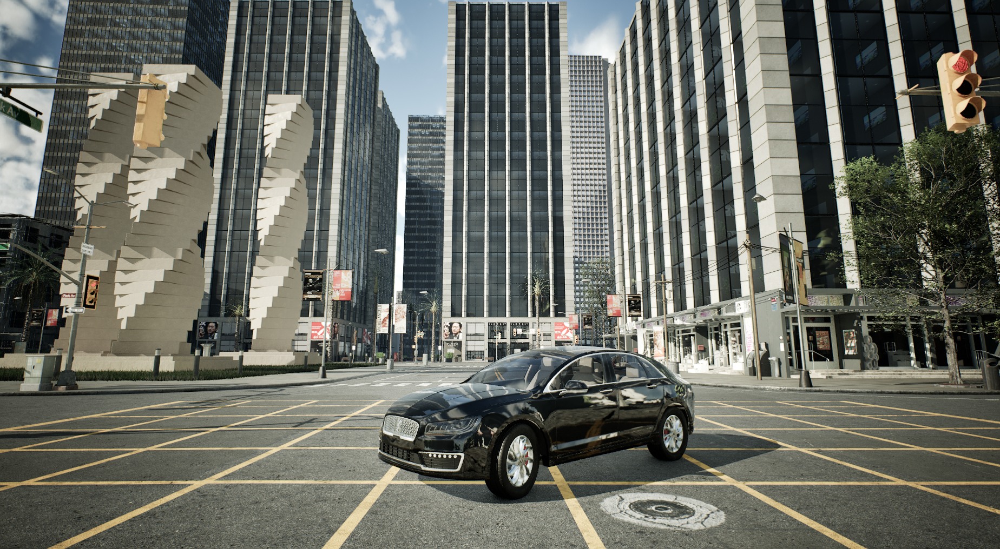
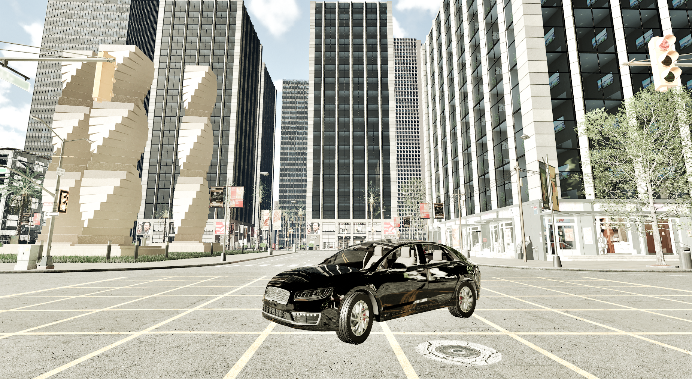

# Rendering options

This guide details the different rendering options available in CARLA, including quality levels, no-rendering mode and off-screen mode. It also explains how version 0.9.12 of CARLA differs from previous versions in these respects.

- [__Graphics quality__](#graphics-quality)  
	- [Vulkan graphics API](#vulkan-graphics-api)  
	- [Quality levels](#quality-levels)
- [__Off-screen mode__](#off-screen-mode)  
	- [Off-screen Vs no-rendering](#off-screen-vs-no-rendering)


!!! Important
    Some of the command options below are not equivalent in the CARLA packaged releases. Read the [Command line options](start_quickstart.md#command-line-options) section to learn more about this. 

---
## Graphics quality

### Quality levels

CARLA has two different levels for graphics quality. __Epic__  is the default and is the most detailed. __Low__ disables all post-processing and shadows and the drawing distance is set to 50m instead of infinite.

The simulation runs significantly faster in __Low__ mode. This is helpful in situations where there are technical limitations, where precision is nonessential or to train agents under conditions with simpler data or involving only close elements.

The images below compare both modes. The flag used is the same for Windows and Linux. There is no equivalent option when working with the build, but the UE editor has its own quality settings. Go to `Settings/Engine Scalability Settings` for a greater customization of the desired quality. 

#### Epic mode
`./CarlaUnreal.sh -quality-level=Epic`


*Epic quality mode screenshot*

#### Low mode
`./CarlaUnreal.sh -quality-level=Low`


*Low quality mode screenshot*

<br>

---

## Off-screen rendering mode

The off-screen rendering mode enables the CARLA simulator to run without the spectator. This would be the appropriate mode to use for rendering in a headless configuration, for example on a cloud virtual machine instance. Data from any cameras and other sensors in the simulation will still be rendered to disk or transmitted to other applications, but no rendering data will be passed to the screen. 

### Setting off-screen mode

To start CARLA in off-screen mode, run the following command:

```sh
./CarlaUnreal.sh -RenderOffScreen
```

---

