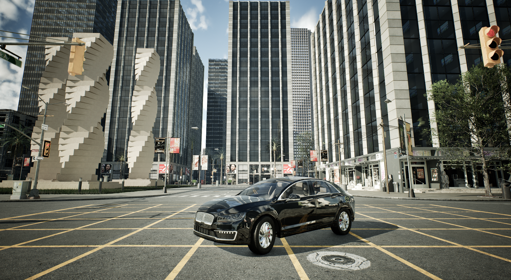
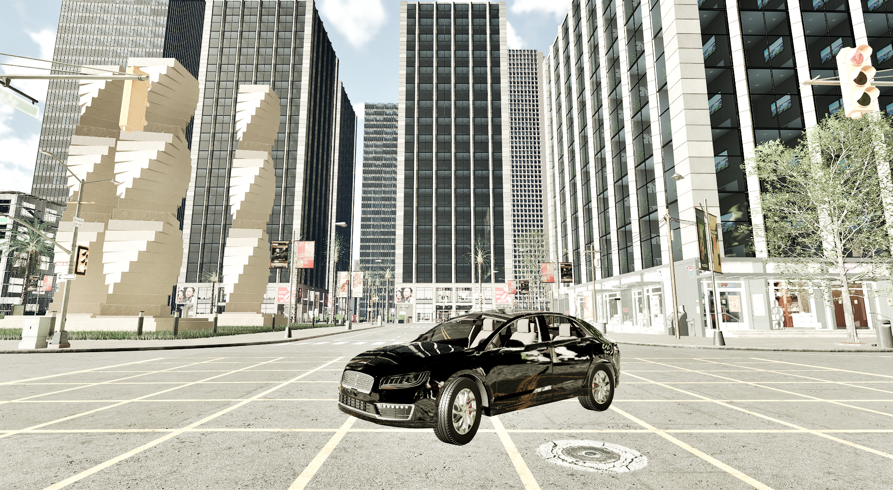

# Rendering options

This guide details the different rendering options available in CARLA, including quality levels, no-rendering mode and off-screen mode.

- [__Graphics quality__](#graphics-quality)
	- [Quality levels](#quality-levels)
	- [Tier comparison](#tier-comparison)
	- [Render features disabled across every tier](#render-features-disabled-across-every-tier)
- [__Off-screen rendering mode__](#off-screen-rendering-mode)
	- [Setting off-screen mode](#setting-off-screen-mode)


!!! Important
    Some of the command options below are not equivalent in the CARLA packaged releases. Read the [Command line options](start_quickstart.md#command-line-options) section to learn more about this.

---
## Graphics quality

### Quality levels

CARLA ships with four graphics-quality tiers selected by the `-quality-level=<Tier>` command-line flag. The tier name is case-sensitive PascalCase: `Low`, `Medium`, `High`, `Epic`. When the flag is omitted, the simulator falls back to the built-in default tier `Epic`. An unrecognised value (typo, wrong casing) falls back to the platform default without applying any Carla tier and the engine log emits a warning naming the bad value.

```sh
./CarlaUnreal.sh -quality-level=Epic
./CarlaUnreal.sh -quality-level=High
./CarlaUnreal.sh -quality-level=Medium
./CarlaUnreal.sh -quality-level=Low

# When there is not a flag, Epic is the default.
./CarlaUnreal.sh
```

Each tier sets a coherent mix of memory budgets, foliage density, scalability bucket levels, and selected render-pipeline knobs. The character of each tier, from richest to cheapest:

* __Epic__: engine "Epic" preset across every axis with no overrides. Full anisotropy, full mesh LODs, full view distance, sharper Lumen reflections (downsample 1, two bounces). Same memory budget as High.
* __High__: engine "Epic" preset everywhere, except six render axes (view distance, mesh LOD bias, anisotropy, virtual-texture anisotropy, Lumen reflection downsample, Lumen reflection max bounces) pulled down at `ECVF_SetByDeviceProfile` priority. Memory pools at the Epic ramp. "Epic minus" intended for hardware that can afford rich rendering but wants a smaller view bubble and cheaper reflections.
* __Medium__: engine "Medium" preset across every scalability axis, with a moderate memory budget. Foliage and grass at full density. Engine-typical mid-range look.
* __Low__: full-resolution rendering with sharp textures, view distance, anti-aliasing, and shading kept high. Dynamic shadows are disabled and Lumen reflections are disabled; Lumen global illumination is kept at engine "Medium" level so the shadowed side of vehicles and distant buildings still receive diffuse bounce light, avoiding crushed-dark surfaces. The scene renders flat-lit with no cast shadows but with proper indirect fill. Foliage and grass are removed (`DensityScale=0`). A `TemporalAA` sharpening preset and motion-blur-off are applied for the HD-readable feel. Compact memory footprint.

The flag is identical on Windows and Linux. Inside the UE editor, scalability is governed by the editor's own `Settings/Engine Scalability Settings` menu rather than this flag.

#### Epic mode


*Epic quality mode screenshot*

#### Low mode


*Low quality mode screenshot*

### Tier comparison

Values quoted verbatim from the per-tier CVar set in the CARLA selector module. Entries marked *default* inherit the engine default and are not modified by the tier.

| Aspect | Epic | High | Medium | Low |
|---|---|---|---|---|
| `r.Streaming.PoolSize` (MB) | 4000 | 4000 | 3000 | 3000 |
| `r.SkinCache.SceneMemoryLimitInMB` | 1024 | 1024 | 512 | 256 |
| `r.Nanite.Streaming.PoolSize` | 512 | 512 | 256 | 128 |
| `r.LumenScene.SurfaceCache.AtlasSize` | 4096 | 4096 | *default* | 2048 |
| `r.Shadow.Virtual.MaxPhysicalPages` | 8192 | 8192 | 4096 | 2048 |
| `r.Shadow.DistanceScale` | 2.0 | 2.0 | 1.5 | *default* |
| `r.ReflectionCaptureResolution` | 512 | 512 | 256 | 128 |
| `foliage.DensityScale` / `grass.DensityScale` | 1.0 | 1.0 | 1.0 | 0 |
| `Foliage.DitheredLOD` | 1 | 1 | *default* | *default* |
| `r.CustomDepth` | 3 | 3 | *default (1)* | *default (1)* |
| `r.DefaultFeature.AntiAliasing` | 1 (FXAA) | 1 (FXAA) | *default* | *default* |
| `r.Lumen.Reflections.MaxRoughnessToTrace` | 0.2 | 0.2 | *default* | *default* |
| `r.Lumen.Reflections.DownsampleFactor` | 1 | 2 | *(bucket)* | *(bucket)* |
| `r.Lumen.Reflections.MaxBounces` | 2 | 1 | *(bucket)* | *(bucket)* |
| `r.ViewDistanceScale` | 1.0 | 0.8 | *(bucket)* | *(bucket)* |
| `r.SkeletalMeshLODBias` | 0 | 1 | *(bucket)* | *(bucket)* |
| `r.MaxAnisotropy` / `r.VT.MaxAnisotropy` | *(bucket = 8)* | 4 | *(bucket)* | *(bucket)* |
| `r.DefaultFeature.MotionBlur` | *default* | *default* | *default* | 0 (off) |
| TAA sharpening preset | *default* | *default* | *default* | enabled |
| `sg.ShadowQuality` | 3 | 3 | 2 | 0 (no shadows) |
| `sg.GlobalIlluminationQuality` | 3 | 3 | 2 | 2 |
| `sg.ReflectionQuality` | 3 | 3 | 2 | 0 |
| `sg.PostProcessQuality` | 3 | 3 | 2 | 1 |
| `sg.EffectsQuality` | 3 | 3 | 2 | 1 |
| `sg.FoliageQuality` | 3 | 3 | 2 | 1 |
| `sg.TextureQuality` | 3 | 3 | 2 | 3 |
| `sg.ViewDistanceQuality` | 3 | 3 | 2 | 3 |
| `sg.AntiAliasingQuality` | 3 | 3 | 2 | 3 |
| `sg.ShadingQuality` | 3 | 3 | 2 | 3 |
| `sg.ResolutionQuality` | 100 | 100 | 100 | 100 |

Rows marked *(bucket)* take their value from the `[GroupName@N]` section in `DefaultScalability.ini` selected by the corresponding `sg.*Quality` row.

### Ray tracing defaults

The hardware ray tracing subsystem is initialized at the project level (`r.RayTracing=True`) and the path tracer is available (`r.PathTracing=True`) — this is what powers the [ray-traced lens camera](ref_sensors.md#ray-traced-lens-camera). Per-effect switches are configured as follows:

| CVar | Project default | Effect when enabled |
|---|---|---|
| `r.RayTracing` | True | Initializes the hardware ray tracing subsystem (RTX-class GPU required). Read-only after engine init. |
| `r.PathTracing` | True | Makes the path tracer available for `sensor.camera.rt_lens`. |
| `r.Lumen.HardwareRayTracing` | False | Switches the main view's Lumen GI + reflections from software SDF tracing to hardware RT cores. Kept off by default: the engine keeps a single per-scene ray-tracing command cache, and mixing hardware-RT viewport effects with streaming path-traced sensors re-caches the whole scene every frame (a large flat per-frame cost on big towns). |
| `r.RayTracing.Shadows` | False | Ray-traced direct shadows instead of Virtual Shadow Maps. Kept off by default for the same cache reason. |
| `r.RayTracing.ForceAllRayTracingEffects` | 0 | Force-enables every RT-capable effect in the project. High BVH cost. |

Sensor captures opt into hardware ray tracing individually through the `use_ray_tracing` camera attribute (default `True`), and the console variable `carla.Camera.UseRayTracing` can force it on (`1`) or off (`0`) for every camera at once (`-1` respects the per-sensor attribute).

Changing project defaults requires editing `Config/DefaultEngine.ini` and rebuilding the simulator. The packaged Shipping binary strips the engine's `-execcmds=` command-line parser, so runtime overrides via that flag are not available in distributed CARLA releases; only project-side configuration takes effect.

### NVIDIA DLSS

CARLA integrates two DLSS features (the DLSS SDK is fetched during setup, so both are present in standard builds; an NVIDIA RTX-class GPU is required at runtime):

*   __DLSS Ray Reconstruction (DLSS-RR)__ denoises the path-traced frames of `sensor.camera.rt_lens`. It is the default denoiser (`r.PathTracing.Denoiser.Name=DLSSRR` in `DefaultEngine.ini`) and is controlled per sensor with the `enable_denoiser` attribute.
*   __DLSS Super Resolution (DLSS-SR)__ upscales individual camera sensors: with `enable_dlss=true` a camera renders internally at `dlss_screen_percentage` of its output resolution and DLSS reconstructs the full-size image. It is opt-in per camera (see the [RGB camera attributes](ref_sensors.md#rgb-camera)); on non-NVIDIA hardware an enabled sensor degrades gracefully to a bilinear upscale.

The example `PythonAPI/examples/manual_control_5cam.py` spawns a five-camera 1080p rig on an autopilot vehicle and toggles DLSS-SR live (press `D`) so the frame-rate and quality impact can be compared directly.

The persisted `GameUserSettings.ini` does not need to be deleted when switching between tiers. The selector module re-applies the active tier's scalability after `UGameUserSettings::ApplyNonResolutionSettings` runs, so cross-run scalability state cannot shadow the current tier.

<br>

---

## Off-screen rendering mode

The off-screen rendering mode enables the CARLA simulator to run without the spectator. This would be the appropriate mode to use for rendering in a headless configuration, for example on a cloud virtual machine instance. Data from any cameras and other sensors in the simulation will still be rendered to disk or transmitted to other applications, but no rendering data will be passed to the screen. 

### Setting off-screen mode

To start CARLA in off-screen mode, run the following command:

```sh
./CarlaUnreal.sh -RenderOffScreen
```

---

