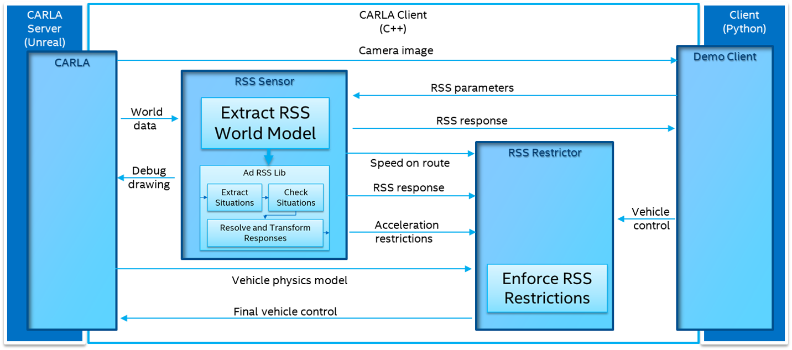
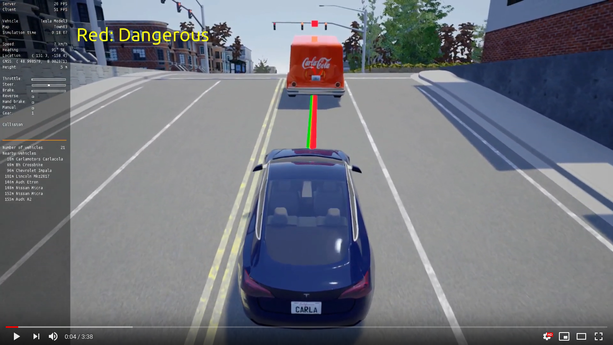

# RSS

CARLA integrates the [C++ Library for Responsibility Sensitive Safety](https://github.com/intel/ad-rss-lib) in the client library. This feature allows users to investigate behaviours of RSS without having to implement anything. CARLA will take care of providing the input, and applying the output to the AD systems on the fly.

*   [__Overview__](#overview)
*   [__Compilation__](#compilation)
	*   [Dependencies](#dependencies)
	*   [Build](#build)
*	[__Current state__](#current-state)
	*   [RssSensor](#rsssensor)
	*   [RssRestrictor](#rssrestrictor)

!!! Important
    This feature is a work in progress. Right now, it is only available for the Linux build.

---
## Overview

The RSS library implements a mathematical model for safety assurance. It receives sensor information, and provides restrictions to the controllers of a vehicle. To sum up, the RSS module uses the sensor data to define __situations__. A situation describes the state of the ego vehicle with an element of the environment. For each situation, safety checks are made, and a proper response is calculated. The overall response is the result of all of the combined. For specific information on the library, read the [documentation](https://intel.github.io/ad-rss-lib/), especially the [Background section](https://intel.github.io/ad-rss-lib/ad_rss/Overview/).

This is implemented in CARLA using two elements.

*	__RssSensor__ is in charge of the situation analysis, and response generation using the *ad-rss-lib*.
*	__RssRestrictor__ applies the response by restricting the commands of the vehicle.

The following image sketches the integration of __RSS__ into the CARLA architecture.



__1. The server.__

- Sends a camera image to the client. <small>(Only if the client needs visualization).</small>
- Provides the RssSensor with world data.
- Sends a physics model of the vehicle to the RssRestrictor. <small>(Only if the default values are overwritten).</small>

__2. The client.__

- Provides the *RssSensor* with some [parameters](https://intel.github.io/ad-rss-lib/ad_rss/Appendix-ParameterDiscussion/) to be considered.
-Sends to the *RssResrictor* an initial [carla.VehicleControl](python_api.md#carla.VehicleControl).

__3. The RssSensor.__

- Uses the *ad-rss-lib* to extract situations, do safety checks, and generate a response.
- Sends the *RssRestrictor* a response containing the proper response and aceleration restrictions to be applied.

__4. The RssRestrictor__

- If the client asks for it, applies the response to the [carla.VehicleControl](python_api.md#carla.VehicleControl), and returns the resulting one.

[](https://www.youtube.com/watch?v=UxKPXPT2T8Q)
<div style="text-align: right"><i>Visualization of the RssSensor results.</i></div>

---
## Compilation

The RSS integration has to be built aside from the rest of CARLA. The __ad-rss-lib__ comes with an LGPL-2.1 open-source license that creates conflict. It has to be linked statically into *libCarla*.

As a reminder, the feature is only available for the Linux build so far.

### Dependencies

There are additional prerequisites required for building RSS and its dependencies. Take a look at the [official documentation](https://intel.github.io/ad-rss-lib/BUILDING)) to know more about this.

Dependencies provided by Ubunutu (>= 16.04).
```sh
sudo apt-get install libgtest-dev libpython-dev libpugixml-dev libtbb-dev
```

The dependencies are built using [colcon](https://colcon.readthedocs.io/en/released/user/installation.html), so it has to be installed.
```sh
pip3 install --user -U colcon-common-extensions
```

There are some additional dependencies for the Python bindings.
```sh
sudo apt-get install castxml
pip3 install --user pygccxml pyplusplus
```

### Build

Once this is done, the full set of dependencies and RSS components can be built.

*	Compile LibCarla to work with RSS.

```sh
make LibCarla.client.rss
```

*	Compile the PythonAPI to include the RSS feature.

```sh
make PythonAPI.rss
```

*	As an alternative, a package can be built directly.
```sh
make package.rss
```

---
## Current state

### RssSensor

[__carla.RssSensor__](python_api.md#carla.RssSensor) supports [ad-rss-lib v4.2.0 feature set](https://intel.github.io/ad-rss-lib/RELEASE_NOTES_AND_DISCLAIMERS) completely, including intersections, [stay on road](https://intel.github.io/ad-rss-lib/ad_rss_map_integration/HandleRoadBoundaries/) support and [unstructured constellations (e.g. with pedestrians)](https://intel.github.io/ad-rss-lib/ad_rss/UnstructuredConstellations/).

So far, the server provides the sensor with ground truth data of the surroundings that includes the state of other traffic participants and traffic lights.

### RssRestrictor

When the client calls for it, the [__carla.RssRestrictor__](python_api.md#carla.RssRestrictor) will modify the vehicle controller to best reach the desired accelerations or decelerations by a given response.

Due to the stucture of [carla.VehicleControl](python_api.md#carla.VehicleControl) objects, the restrictions applied have certain limitations. These controllers include `throttle`, `brake` and `streering` values. However, due to car physics and the simple control options these might not be met. The restriction intervenes in lateral direction simply by counter steering towards the parallel lane direction. The brake will be activated if deceleration requested by RSS. This depends on vehicle mass and brake torques provided by the [carla.Vehicle](python_api.md#carla.Vehicle).

!!! Note
    In an automated vehicle controller it might be possible to adapt the planned trajectory to the restrictions. A fast control loop (>1KHz) can be used to ensure these are followed.

---

That sets the basics regarding the RSS sensor in CARLA. Find out more about the specific attributes and parameters in the [sensor reference](ref_sensors.md#rss-sensor).

Open CARLA and mess around for a while. If there are any doubts, feel free to post these in the forum.

<div class="build-buttons">
<p>
<a href="https://github.com/carla-simulator/carla/discussions/" target="_blank" class="btn btn-neutral" title="Go to the CARLA forum">
CARLA forum</a>
</p>
</div>
