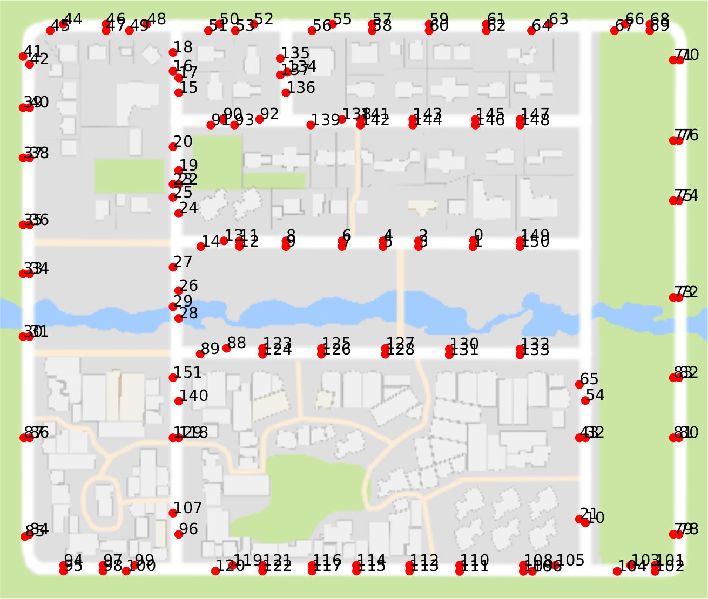
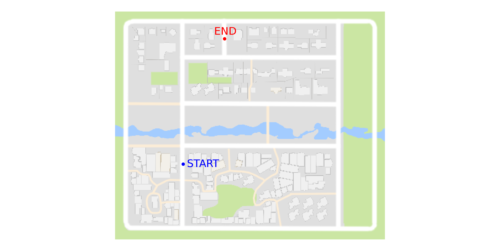
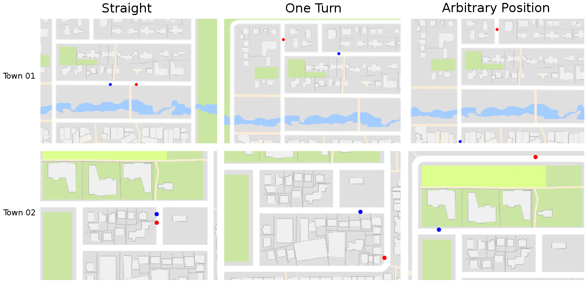

Benchmarking your Agent
---------------------------

In this tutorial we show:

 * [How to define a trivial agent with a forward going policy.](#defining-the-agent)
 * [How to define a basic experiment suite.](#defining-the-experiment-suite)

#### Introduction

The driving benchmark is associated with other two modules.
The *agent* module, that is a controller which performs in 
another module: the *experiment suite*.
Both modules are abstract classes that must be redefined by
the user.

The following code excerpt is
an example of how to apply a driving benchmark;

    # We instantiate a forward agent, a simple policy that just set
    # acceleration as 0.9 and steering as zero
    agent = ForwardAgent()

    # We instantiate an experiment suite. Basically a set of experiments
    # that are going to be evaluated on this benchmark.
    experiment_suite = BasicExperimentSuite(city_name)

    # Now actually run the driving_benchmark
    # Besides the agent and experiment suite we should send
    # the city name ( Town01, Town02) the log
    run_driving_benchmark(agent, experiment_suite, city_name,
                          log_name, continue_experiment,
                          host, port)

Following this excerpt, there are two classes to be defined.
The ForwardAgent() and the BasicExperimentSuite().
After that, the benchmark can ne run with the "run_driving_benchmark" function.
The  summary  of the execution, the [performance metrics](benchmark_metrics.md), are stored
in a json file and printed to the screen.

#### Defining the Agent

The tested agent must  inherit the base *Agent* class.
Let's start by deriving a simple forward agent:

    from carla.agent.agent import Agent
    from carla.client import VehicleControl
    
    class ForwardAgent(Agent):

To have its performance evaluated, the ForwardAgent derived class _must_ 
redefine the *run_step* function as it is done in the following excerpt:

    def run_step(self, measurements, sensor_data, directions, target):
        """
        Function to run a control step in the CARLA vehicle.
	    """
        control = VehicleControl()
        control.throttle = 0.9
        return control

This function receives the following parameters:
 
 * [Measurements](measurements.md): the entire state of the world received
 by the client from the CARLA Simulator. These measurements contains agent position, orientation,
 dynamic objects information, etc.
 * [Sensor Data](cameras_and_sensors.md): The measured data from defined sensors, 
 such as Lidars or RGB cameras.
 * Directions: Information from the high level planner. Currently the planner sends
 a high level command from the follwoing set: STRAIGHT, RIGHT, LEFT, NOTHING.
 * Target Position: The position and orientation of the target.
 
 With all this information, the *run_step* function is expected 
 to return a [vehicle control message](measurements.md), containing:
 steering value, throttle value, brake value, etc.

#### Defining the Experiment Suite

To create a Experiment Suite class you need to perform
the following steps:

* Create your custom class by inheriting the ExperimentSuite base class.
* Define the test and train weather conditions to be used.
* Build the *Experiment* objects .

##### Definition

The defined set of experiments must derive the *ExperimentSuite* class
as in the following code excerpt:

    from carla.agent_benchmark.experiment import Experiment
    from carla.sensor import Camera
    from carla.settings import CarlaSettings
    
    from .experiment_suite import ExperimentSuite
    
    
    class BasicExperimentSuite(ExperimentSuite):
    
##### Define test and train weather conditions

The user must select the weathers to be used. One should select the set
of test weathers and the set of train weathers. This is defined as a
class property as in the following example:

    @property
    def train_weathers(self):
        return [1]
    @property
    def test_weathers(self):
        return [1]
        

##### Building Experiments

The [experiments are composed by a *task* that is defined by a set of *poses*](benchmark_structure.md).
Let's start by selecting poses for one of the cities, let's take Town01, for instance.
First of all, we need to see all the possible positions, for that, with
a CARLA simulator running in a terminal, run:
    
    python view_start_positions.py
 
 
  
  
Now let's choose, for instance, 140 as start position and 134
as the end position. This two positions can be visualized by running:
    
    python view_start_positions.py --pos 140,134 --no-labels

 

Let's choose two more  poses, one for going straight, other one for one simple turn.
Also, let's also choose three poses for Town02:

 
 >Figure: The poses used on this basic *Experiment Suite* example. Poses are
 a tuple of start and end position of a goal-directed episode. Start positions are
 shown in Blue, end positions in Red. Left: Straight poses,
 where the goal is just straight away from the start position. Middle: One turn
 episode, where the goal is one turn away from the start point. Right: arbitrary position,
 the goal is far away from the start position, usually more than one turn.

We define each of these poses as a task. Plus, we also set
the number of dynamic objects for each of these tasks and repeat
the arbitrary position task to have it also defined with dynamic
objects. In the following code excerpt we show the final
defined positions and the number of dynamic objects for each task:
    
    # Define the start/end position below as tasks
    poses_task0 = [[7, 3]]
    poses_task1 = [[138, 17]]
    poses_task2 = [[140, 134]]
    poses_task3 = [[140, 134]]
    # Concatenate all the tasks
    poses_tasks = [poses_task0, poses_task1 , poses_task1 , poses_task3]
    # Add dynamic objects to tasks
    vehicles_tasks = [0, 0, 0, 20]
    pedestrians_tasks = [0, 0, 0, 50]

Finally by using the defined tasks we can build the experiments
vector as we show in the following code excerpt:

    experiments_vector = []
        # The used weathers is the union between test and train weathers
        for weather in used_weathers:
            for iteration in range(len(poses_tasks)):
                poses = poses_tasks[iteration]
                vehicles = vehicles_tasks[iteration]
                pedestrians = pedestrians_tasks[iteration]

                conditions = CarlaSettings()
                conditions.set(
                    SendNonPlayerAgentsInfo=True,
                    NumberOfVehicles=vehicles,
                    NumberOfPedestrians=pedestrians,
                    WeatherId=weather

                )
                # Add all the cameras that were set for this experiments
                conditions.add_sensor(camera)
                experiment = Experiment()
                experiment.set(
                    Conditions=conditions,
                    Poses=poses,
                    Task=iteration,
                    Repetitions=1
                )
                experiments_vector.append(experiment)

            
The full code could be found at [basic_experiment_suite.py](https://github.com/carla-simulator/carla/blob/master/PythonClient/carla/driving_benchmark/experiment_suites/basic_experiment_suite.py)

#### Expected Results

First you need a CARLA Simulator running with [fixed time-step](configuring_the_simulation/#fixed-time-step)
 , so the results you will obtain will be more or less reproducible.
For that you should run the CARLA simulator as:

    ./CarlaUE4.sh /Game/Maps/<Town_name> -windowed -world-port=2000  -benchmark -fps=10

The example presented in this tutorial can be executed  for Town01 as:

    ./driving_benchmark_example.py -c Town01
 
You should expect these results: [town01_basic_forward_results](benchmark_basic_results_town01)

For Town02:

    ./driving_benchmark_example.py -c Town02

You should expect these results: [town01_basic_forward_results](benchmark_basic_results_town02)

