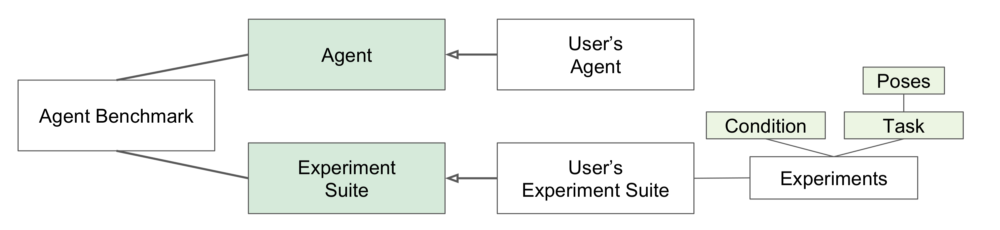

Driving Benchmark Structure
-------------------

>Figure 1: The general structure of the agent benchmark module. 

The *agent benchmark* is the module responsible for evaluating a certain
*agent* in a *experiment suite*. 
  
The user must define its own experiment suite to be tested
on an agent. 
The *experiment suite* is composed by set of *experiments*.
Each *experiment* contains to *task* that consist of a set of poses.
These *poses* are  are tuples of a start and end point of a navigation
episode.
The *experiments* also are associated with a *condition* which is
a [carla settings](carla_settings.md) object. The conditions specify
simulation parameters such as: weather, sensor suite, number of
vehicles and pedestrians, etc.

The user also should define the *agent* class. The *agent* is the active
part which will be evaluated by the agent benchmark module.
For details on how to define

CORL 2017 
----------------------

We already provide the CoRL 2017 experiment suite used to benchmark the
agents for the CoRL 2017 paper.
The CoRL 2017 is composed of 24 experiments for each town. Each experiment
contains 25 poses to be completed. This gives a total of 600 episodes
for each town.
 

