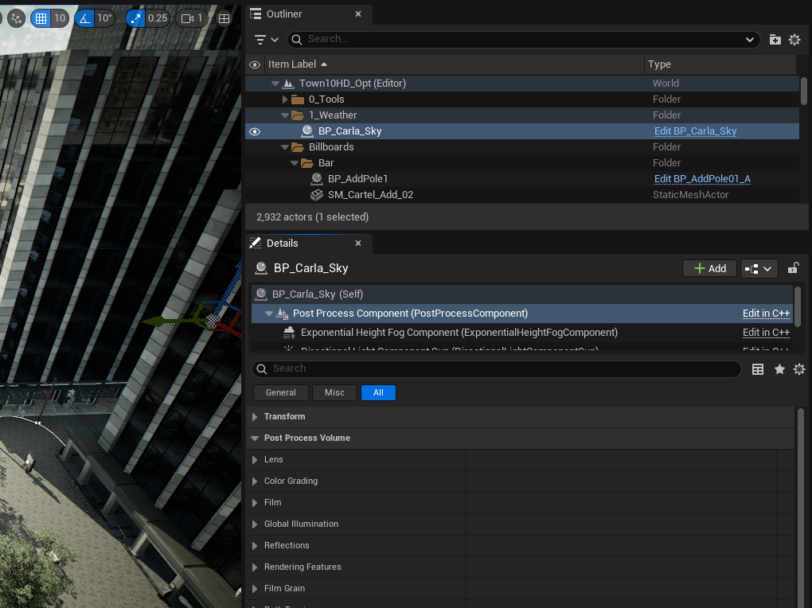
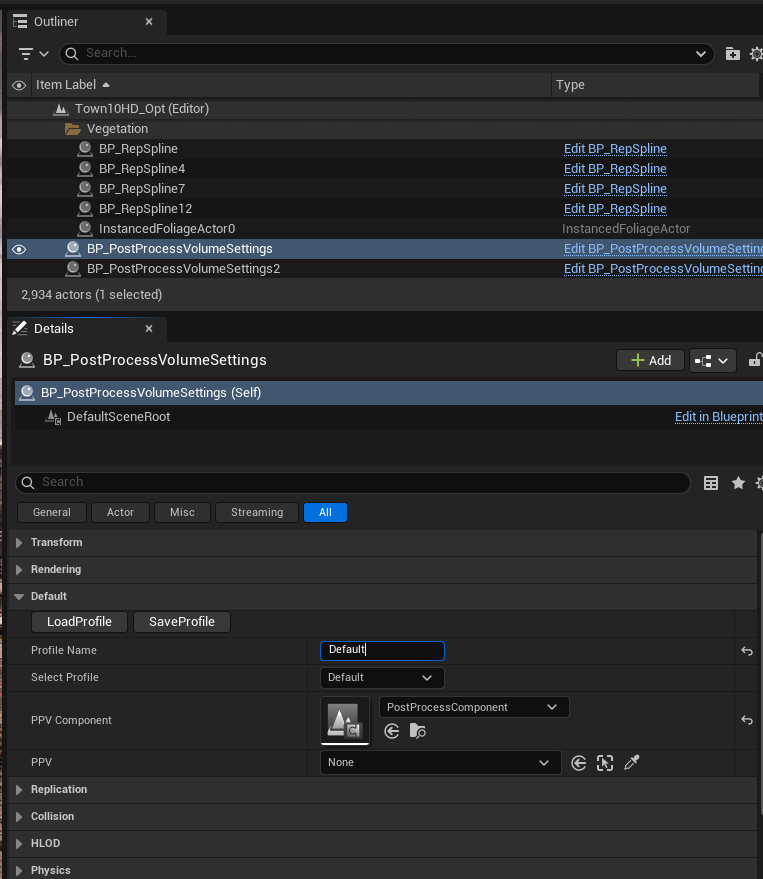

# Camera post-process presets

## Creating, loading and saving presets

The look of the scene through the camera can be adjusted using the post-process settings of the `BP_CarlaSky` blueprint. To adjust post-process settings, select the `BP_CarlaSky` blueprint in the *Outliner* panel of the Unreal Editor interface. Then in the *Details* section, select the *Post Process Component* and expand the *Post Process Volume* section. Here you will find parameters for lens effects like bloom and lens flares, color temperature, exposure, film grain and others. Experiment with the parameters to see the effect each one has on the scene in the spectator. You can find more details about these parameters in the [Unreal Engine documentation](https://dev.epicgames.com/documentation/en-us/unreal-engine/API/Runtime/Engine/Engine/FPostProcessSettings).



Post-process parameter presets can be saved and loaded through the `BP_PostProcessVolumeSettings` blueprint. In the content browser navigate to `Carla/Blueprints/CameraProfiles` or search for the blueprint in the search field. Drag the blueprint into the scene and make sure it is selected in the *Outliner*, you may want to place it out of the way in the sky so it doesn't get in the way of other scene elements. In the details panel, expand the *Default* section.



To save your current post process settings, choose an appropriate name and enter it in the *Profile Name* field, then press *SaveProfile*. The profile will be saved as a JSON file in the `${CARLA_ROOT}/Unreal/CarlaUnreal/Content/Carla/Config/PostProcess` directory, where you will also find other presets. If you want to load an existing preset from this directory, enter the name of the preset (the name of the JSON file minus the `.json` suffix) in the *Profile Name* field and then press *LoadProfile*.

You can also create new post-process presets directly in the JSON files found in the *PostProcess* directory. Create new profiles by copying an existing JSON preset and editing specific parameters. Make sure you follow the expected JSON schema, some options may change the schema. If in doubt, save the preset from the editor interface instead.

---

## Using post-process presets for the RGB camera sensor

Saved post-process presets can be loaded to modify the RGB camera sensor. When spawning a camera in the simulation through the CARLA Python API, set the `post_process_profile` attribute of the camera blueprint to the name of the post-process preset you wish to use (the name of the JSON file minus the `.json` suffix):

```py
camera_bp = bp_lib.find('sensor.camera.rgb')
camera_bp.set_attribute('post_process_profile', 'GoPro')
camera = world.spawn_actor(camera_bp, carla.Transform(carla.location(0,0,1.5), carla.Rotation()))
```


---

## Presets shipped with CARLA

RGB cameras spawned without `post_process_profile` (or with `Default`) load the sensor default, `AutomotiveHDR`
(console variable `carla.PostProcess.Profile`). The spectator / editor viewport renders with its own profile,
`Cinematic` (console variable `carla.PostProcess.ViewportProfile`), so its look does not change when the sensor
default does; set it to `AutomotiveHDR` to see in the viewport what the sensors see.

Each automotive preset reproduces the look of the camera of a public driving dataset, tuned on Town10 against frames
of that dataset (exposure and contrast percentiles, saturation, white balance, sharpness, noise per brightness). The
consumer presets are graded by eye.

| Preset | Imitates | Look |
| --- | --- | --- |
| `AutomotiveHDR` (sensor default) | nuScenes front camera (Basler acA1600-60gc) | Flat machine-vision camera: neutral, low saturation, fast auto exposure capped at 20 ms (gain and noise rise in the dark), star-shaped lens flare and bloom on lights, sensor noise, slight optical softness. |
| `AutomotiveHDRClean` | same camera, better sensor and optics | Same tone mapping and exposure as `AutomotiveHDR`, with little noise and a weak flare. For datasets that should not carry sensor artefacts. |
| `WideHDR8MP` | 8 MP 120° ADAS front camera (Zenseact ZOD; Mobileye / Tesla HW4 class, 120&ndash;140 dB sensors) | Flat multi-exposure HDR: no clipped highlights, lifted blacks, crisp lamps without star flare, strong noise reduction (soft, smeared detail), edge fringing. |
| `LegacyCCD` | KITTI (Point Grey Flea2 CCD, 2011) | Low dynamic range: hard clipped skies, deep contrasty shadows, saturated colour, sharp, little bloom. |
| `LogHDR` | Cityscapes (onsemi AR0331, 16-bit HDR log-compressed to 8 bit) | No clipped highlights, dark mid-tones, green-yellow cast, moderate saturation. |
| `Smartphone` | comma.ai road camera (Sony IMX298, phone ISP, HEVC) | Dark mid-tones, saturated and cool, soft codec detail. |
| `Cinematic` (viewport) | photo / film camera | Neutral grading with a filmic curve, histogram auto exposure with a brightness-dependent exposure bias curve (shade, dusk and night stay darker as on a real camera), light vignette. |
| `GoPro` | action camera | Vivid colour, strong local tone compression, crisp detail, light vignette and edge fringing, fast auto exposure. |
| `Dashcam` | consumer dashcam | Low dynamic range (bright skies clip), contrasty, over-sharpened, strong vignette and fringing, sensor grain, slightly cool and overexposed. |

The presets only change the image processing. Resolution, field of view and lens are attributes of the camera
blueprint; to match the imitated camera use:

| Preset | `image_size_x` &times; `image_size_y` | `fov` |
| --- | --- | --- |
| `AutomotiveHDR`, `AutomotiveHDRClean` | 1600 &times; 900 | 70 |
| `WideHDR8MP` | 3840 &times; 2160 (or 1920 &times; 1080) | 120 |
| `LegacyCCD` | 1242 &times; 375 | 82 |
| `LogHDR` | 2048 &times; 1024 | 50 |
| `Smartphone` | 1164 &times; 874 | 65 |
| `Cinematic` | any | 90 |
| `GoPro`, `Dashcam` | 1920 &times; 1080 | 110&ndash;120 |

```py
camera_bp = bp_lib.find('sensor.camera.rgb')
camera_bp.set_attribute('post_process_profile', 'LegacyCCD')
camera_bp.set_attribute('image_size_x', '1242')
camera_bp.set_attribute('image_size_y', '375')
camera_bp.set_attribute('fov', '82')
```

### Sensor effects

The automotive presets add camera artefacts on top of the grading:

- __Sensor noise and optical softness.__ A post-process material, `M_SensorNoise` (in
  `Content/Carla/Blueprints/CameraProfiles`), blurs the image slightly (lens, demosaicing and ISP) and adds photon and
  read noise in linear light. The gain follows the camera's own auto exposure: once the exposure time reaches its cap
  the gain rises, so noise grows in the dark as on a real camera. Each preset references a material instance,
  `MI_SensorNoise_<Preset>`, with its own parameters (`Strength`, `BlurSigma`, `NoiseCell`, `ChromaScale`,
  `FullWell`, `ReadNoise`, `MaxExposureMs`); `AutomotiveHDR` uses the parent material's defaults. Remove the
  material from *Weighted Blendables* to turn both off.
- __Lens flare.__ `AutomotiveHDR` and `AutomotiveHDRClean` use the convolution (FFT) bloom with a lens kernel,
  `Kernels/T_LensPSF_Star`, modelled on the nuScenes night frames: a soft halo and faint star spikes around bright
  lights. The other presets use the standard bloom.
- __Exposure-linked motion blur.__ Applies to every preset: see [RGB camera &mdash; exposure-linked motion
  blur](ref_sensors.md#exposure-linked-motion-blur).
