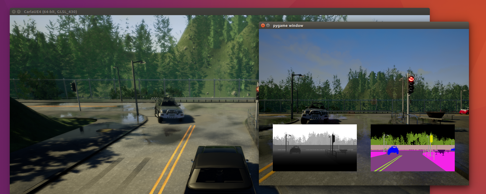

<h1>Cameras and sensors</h1>



Sensors are a special type of actor able to measure and stream data. All the
sensors have a [`listen`](python_api.md#carla.Sensor.listen) method that registers the
callback function that will be called each time the sensor produces a new measurement.
Sensors are typically attached to vehicles and produce data either each simulation update,
or when a certain event is registered.

The following Python excerpt shows how you would typically attach a sensor to a
vehicle, in this case we are adding a dashboard HD camera to a vehicle.

```py
# Find the blueprint of the sensor.
blueprint = world.get_blueprint_library().find('sensor.camera.rgb')
# Modify the attributes of the blueprint to set image resolution and field of view.
blueprint.set_attribute('image_size_x', '1920')
blueprint.set_attribute('image_size_y', '1080')
blueprint.set_attribute('fov', '110')
# Set the time in seconds between sensor captures
blueprint.set_attribute('sensor_tick', '1.0')
# Provide the position of the sensor relative to the vehicle.
transform = carla.Transform(carla.Location(x=0.8, z=1.7))
# Tell the world to spawn the sensor, don't forget to attach it to your vehicle actor.
sensor = world.spawn_actor(blueprint, transform, attach_to=my_vehicle)
# Subscribe to the sensor stream by providing a callback function, this function is
# called each time a new image is generated by the sensor.
sensor.listen(lambda data: do_something(data))
```

Note that each sensor has a different set of attributes and produces different
type of data. However, the data produced by a sensor comes always tagged with:

| Sensor data attribute | Type   | Description |
| --------------------- | ------ | ----------- |
| `frame`               | int    | Frame number when the measurement took place |
| `timestamp`           | double | Timestamp of the measurement in simulation seconds since the beginning of the episode |
| `transform`           | carla.Transform | Transform in world coordinates of the sensor at the time of the measurement |

Most sensor data objects, like images and lidar measurements, have a function
for saving the measurements to disk.

This is the list of sensors currently available

  * [sensor.camera.rgb](#sensorcamerargb)
  * [sensor.camera.depth](#sensorcameradepth)
  * [sensor.camera.semantic_segmentation](#sensorcamerasemantic_segmentation)
  * [sensor.lidar.ray_cast](#sensorlidarray_cast)
  * [sensor.other.collision](#sensorothercollision)
  * [sensor.other.lane_invasion](#sensorotherlane_invasion)
  * [sensor.other.obstacle](#sensorotherobstacle)

Camera sensors use [`carla.colorConverter`](python_api.md#carla.ColorConverter) in order to
convert the pixels of the original image.

sensor.camera.rgb
-----------------


The "RGB" camera acts as a regular camera capturing images from the scene.

<h4>Basic camera attributes</h4>

| Blueprint attribute | Type | Default | Description |
|---------------------|------|---------|-------------|
| `sensor_tick` | float | 0.0 | Seconds between sensor captures (ticks) |
| `image_size_x` | int | 800 | Image width in pixels |
| `image_size_y` | int | 600 | Image height in pixels |
| `gamma` | float | 2.2 | Target gamma value of the camera |
| `fov` | float | 90.0 | Horizontal field of view in degrees |
| `shutter_speed` | float | 60.0 | The camera shutter speed in seconds (1.0 / s) |
| `iso` | float | 1200.0 | The camera sensor sensitivity |
| `fstop` | float | 1.4 | Defines the opening of the camera lens. Aperture is `1 / fstop` with typical lens going down to f / 1.2 (larger opening). Larger numbers will reduce the Depth of Field effect |

<h4>Camera lens distortion attributes</h4>

| Blueprint attribute | Type | Default | Description |
|---------------------|------|---------|-------------|
| `lens_circle_falloff` | float | 5.0 | Range: [0.0, 10.0] |
| `lens_circle_multiplier` | float | 0.0 | Range: [0.0, 10.0] |
| `lens_k` | float | -1.0 | Range: [-inf, inf] |
| `lens_kcube` | float | 0.0 | Range: [-inf, inf] |
| `lens_x_size` | float | 0.08 | Range: [0.0, 1.0] |
| `lens_y_size` | float | 0.08 | Range: [0.0, 1.0] |

<h4>Advanced camera attributes</h4>

Since these effects are provided from Unreal Engine 4, please make sure to check their documentation on how they work and the relation between them:

  * [Automatic Exposure][AutomaticExposure.Docs]
  * [Cinematic Depth of Field Method][CinematicDOFMethod.Docs]
  * [Color Grading and Filmic Tonemapper][ColorGrading.Docs]

[AutomaticExposure.Docs]: https://docs.unrealengine.com/en-US/Engine/Rendering/PostProcessEffects/AutomaticExposure/index.html
[CinematicDOFMethod.Docs]: https://docs.unrealengine.com/en-US/Engine/Rendering/PostProcessEffects/DepthOfField/CinematicDOFMethods/index.html
[ColorGrading.Docs]: https://docs.unrealengine.com/en-US/Engine/Rendering/PostProcessEffects/ColorGrading/index.html

| Blueprint attribute | Type | Default | Description |
|---------------------|------|---------|-------------|
| `min_fstop` | float | 1.2 | Maximum Aperture |
| `blade_count` | int | 5 | The number of blades that make up the diaphragm mechanism |
| `exposure_mode` | str | `"manual"` | Can be `"manual"` or `"histogram"`. More info in [UE4 official docs][AutomaticExposure.gamesetting] |
| `exposure_compensation` | float | 3.0 | Logarithmic adjustment for the exposure. 0: no adjustment, -1:2x darker, -2:4 darker, 1:2x brighter, 2:4x brighter |
| `exposure_min_bright` | float | 0.1 | Used when `exposure_mode`:`"histogram"`  The minimum brightness for auto exposure that limits the lower brightness the eye can adapt within. Values must be greater than 0 and should be less than or equal to `exposure_max_bright` |
| `exposure_max_bright` | float | 2.0 | Used when `exposure_mode`:`"histogram"`  The maximum brightness for auto exposure that limits the upper brightness the eye can adapt within. Values must be greater 0 and should be greater than or equal to `exposure_min_bright` |
| `exposure_speed_up` | float | 3.0 | Used when `exposure_mode`:`"histogram"` The speed at which the adaptation occurs from a dark environment to a bright environment |
| `exposure_speed_down` | float | 1.0 | Used when `exposure_mode`:`"histogram"` The speed at which the adaptation occurs from a bright environment to a dark environment |
| `calibration_constant` | float | 16.0 | Calibration constant for 18% Albedo |
| `focal_distance` | float | 1000.0 | The distance in which the depth of field effect should be sharp. This value is measured in Unreal Units (cm) |
| `blur_amount` | float | 1.0 | Strength/intensity of motion blur |
| `blur_radius` | float | 0.0 | Radius in pixels at 1080p resolution to apply according to distance from camera to emulate atmospheric scattering |
| `motion_blur_intensity` | float | 0.45 | Strength of motion blur. 1 is max and 0 is off |
| `motion_blur_max_distortion` | float | 0.35 | Max distortion caused by motion blur, in percent of the screen width, 0 is off |
| `motion_blur_min_object_screen_size` | float | 0.1 | Percentage of screen width objects must have for motion blur, lower value means less draw calls
| `slope` | float | 0.88 | This will adjust the steepness of the S-curve used for the tonemapper, where larger values will make the slope steeper (darker) and lower values will make the slope less steep (lighter). Range: [0.0, 1.0] |
| `toe` | float | 0.55 | This will adjust the dark color in the tonemapper. Range: [0.0, 1.0] |
| `shoulder` | float | 0.26 | This will adjust the bright color in the tonemapper. Range: [0.0, 1.0] |
| `black_clip` | float | 0.0 | This will set where the crossover happens when black tones start to cut off their value. In general, this value should NOT be adjusted. Range: [0.0, 1.0] |
| `white_clip` | float | 0.04 | This will set where the crossover happens when white tones start to cut off their value. This will appear as a subtle change in most cases. Range: [0.0, 1.0] |
| `temp` | float | 6500.0 | This will adjust the white balance in relation to the temperature of the light in the scene. When the light temperature and this one match, the light will appear white. When a value is used that is higher than the light in the scene it will yield a "warm" or yellow color, and, conversely, if the value is lower, it would yield a "cool" or blue color |
| `tint` | float | 0.0 | This will adjust the white balance temperature tint for the scene by adjusting the cyan and magenta color ranges. Ideally, this setting should be used once you've adjusted the white balance Temp property to get accurate colors. Under some light temperatures, the colors may appear to be more yellow or blue. This can be used to balance the resulting color to look more natural |
| `chromatic_aberration_intensity` | float | 0.0 | Scaling factor that controls how much color shifting occurs, more noticable on the screen borders |
| `chromatic_aberration_offset` | float | 0.0 | Normalized distance to the center of the image where the effect takes place |
| `enable_postprocess_effects` | bool | True | Whether the post-process effect in the scene affects the image |

[AutomaticExposure.gamesetting]: https://docs.unrealengine.com/en-US/Engine/Rendering/PostProcessEffects/AutomaticExposure/index.html#gamesetting

The `sensor_tick` tells how fast we want the sensor to capture the data.
A value of 1.5 means that we want the sensor to capture data each second and a half.
By default a value of 0.0 means as fast as possible.

<!-- This is commented as a reminder to improve documentation about post process effects -->
<!-- If `enable_postprocess_effects` is enabled, a set of post-process effects is
applied to the image to create a more realistic feel

  * **Vignette** Darkens the border of the screen.
  * **Grain jitter** Adds a bit of noise to the render.
  * **Bloom** Intense lights burn the area around them.
  * **Auto exposure** Modifies the image gamma to simulate the eye adaptation to
    darker or brighter areas.
  * **Lens flares** Simulates the reflection of bright objects on the lens.
  * **Depth of field** Blurs objects near or very far away of the camera. -->

<h4>Output attributes</h4>

This sensor produces [`carla.Image`](python_api.md#carla.Image)
objects.

| Sensor data attribute | Type | Description |
| --------------------- | ---- | ----------- |
| `frame`               | int    | Frame number when the measurement took place |
| `timestamp`           | double | Timestamp of the measurement in simulation seconds since the beginning of the episode |
| `transform`           | carla.Transform | Transform in world coordinates of the sensor at the time of the measurement |
| `width`               | int  | Image width in pixels |
| `height`              | int  | Image height in pixels |
| `fov`                 | float | Horizontal field of view in degrees |
| `raw_data`            | bytes | Array of BGRA 32-bit pixels |

sensor.camera.depth
-------------------


The "Depth" camera provides a view over the scene codifying the distance of each
pixel to the camera (also known as **depth buffer** or **z-buffer**).

<h4>Basic camera attributes</h4>

| Blueprint attribute | Type  | Default | Description |
| ------------------- | ----  | ------- | ----------- |
| `image_size_x`      | int   | 800     | Image width in pixels |
| `image_size_y`      | int   | 600     | Image height in pixels  |
| `fov`               | float | 90.0    | Horizontal field of view in degrees |
| `sensor_tick`       | float | 0.0     | Seconds between sensor captures (ticks) |

<h4>Camera lens distortion attributes</h4>

| Blueprint attribute | Type | Default | Description |
|---------------------|------|---------|-------------|
| `lens_circle_falloff` | float | 5.0 | Range: [0.0, 10.0] |
| `lens_circle_multiplier` | float | 0.0 | Range: [0.0, 10.0] |
| `lens_k` | float | -1.0 | Range: [-inf, inf] |
| `lens_kcube` | float | 0.0 | Range: [-inf, inf] |
| `lens_x_size` | float | 0.08 | Range: [0.0, 1.0] |
| `lens_y_size` | float | 0.08 | Range: [0.0, 1.0] |

<h4>Output attributes</h4>

This sensor produces [`carla.Image`](python_api.md#carla.Image)
objects.

| Sensor data attribute | Type | Description |
| --------------------- | ---- | ----------- |
| `frame`        | int    | Frame number when the measurement took place |
| `timestamp`           | double | Timestamp of the measurement in simulation seconds since the beginning of the episode |
| `transform`           | carla.Transform | Transform in world coordinates of the sensor at the time of the measurement |
| `width`               | int  | Image width in pixels |
| `height`              | int  | Image height in pixels |
| `fov`                 | float | Horizontal field of view in degrees |
| `raw_data`            | bytes | Array of BGRA 32-bit pixels |


The image codifies the depth in 3 channels of the RGB color space, from less to
more significant bytes: R -> G -> B. The actual distance in meters can be
decoded with

```
normalized = (R + G * 256 + B * 256 * 256) / (256 * 256 * 256 - 1)
in_meters = 1000 * normalized
```

sensor.camera.semantic_segmentation
-----------------------------------


The "Semantic Segmentation" camera classifies every object in the view by
displaying it in a different color according to the object class. E.g.,
pedestrians appear in a different color than vehicles.

<h4>Basic camera attributes</h4>

| Blueprint attribute | Type  | Default | Description |
| ------------------- | ----  | ------- | ----------- |
| `image_size_x`      | int   | 800     | Image width in pixels |
| `image_size_y`      | int   | 600     | Image height in pixels  |
| `fov`               | float | 90.0    | Horizontal field of view in degrees |
| `sensor_tick`       | float | 0.0     | Seconds between sensor captures (ticks) |

<h4>Camera lens distortion attributes</h4>

| Blueprint attribute | Type | Default | Description |
|---------------------|------|---------|-------------|
| `lens_circle_falloff` | float | 5.0 | Range: [0.0, 10.0] |
| `lens_circle_multiplier` | float | 0.0 | Range: [0.0, 10.0] |
| `lens_k` | float | -1.0 | Range: [-inf, inf] |
| `lens_kcube` | float | 0.0 | Range: [-inf, inf] |
| `lens_x_size` | float | 0.08 | Range: [0.0, 1.0] |
| `lens_y_size` | float | 0.08 | Range: [0.0, 1.0] |

<h4>Output attributes</h4>

This sensor produces [`carla.Image`](python_api.md#carla.Image)
objects.

| Sensor data attribute | Type | Description |
| --------------------- | ---- | ----------- |
| `frame`               | int    | Frame number when the measurement took place |
| `timestamp`           | double | Timestamp of the measurement in simulation seconds since the beginning of the episode |
| `transform`           | carla.Transform | Transform in world coordinates of the sensor at the time of the measurement |
| `width`               | int  | Image width in pixels |
| `height`              | int  | Image height in pixels |
| `fov`                 | float | Horizontal field of view in degrees |
| `raw_data`            | bytes | Array of BGRA 32-bit pixels |

The server provides an image with the tag information **encoded in the red
channel**. A pixel with a red value of x displays an object with tag x. The
following tags are currently available


| Value | Tag          | Converted color |
| -----:|:------------ | --------------- |
|    0  | Unlabeled    | (  0,   0,   0) |
|    1  | Building     | ( 70,  70,  70) |
|    2  | Fence        | (190, 153, 153) |
|    3  | Other        | (250, 170, 160) |
|    4  | Pedestrian   | (220,  20,  60) |
|    5  | Pole         | (153, 153, 153) |
|    6  | Road line    | (157, 234,  50) |
|    7  | Road         | (128,  64, 128) |
|    8  | Sidewalk     | (244,  35, 232) |
|    9  | Vegetation   | (107, 142,  35) |
|   10  | Car          | (  0,   0, 142) |
|   11  | Wall         | (102, 102, 156) |
|   12  | Traffic sign | (220, 220,   0) |

This is implemented by tagging every object in the scene before hand (either at
begin play or on spawn). The objects are classified by their relative file path
in the project. E.g., every mesh stored in the
_"Unreal/CarlaUE4/Content/Static/Pedestrians"_ folder it's tagged as pedestrian.

!!! note
    **Adding new tags**:
    At the moment adding new tags is not very flexible and requires to modify
    the C++ code. Add a new label to the `ECityObjectLabel` enum in "Tagger.h",
    and its corresponding filepath check inside `GetLabelByFolderName()`
    function in "Tagger.cpp".

sensor.lidar.ray_cast
---------------------


This sensor simulates a rotating Lidar implemented using ray-casting. The points
are computed by adding a laser for each channel distributed in the vertical FOV,
then the rotation is simulated computing the horizontal angle that the Lidar
rotated this frame, and doing a ray-cast for each point that each laser was
supposed to generate this frame; `points_per_second / (FPS * channels)`.

<h4>Lidar attributes</h4>

| Blueprint attribute  | Type  | Default | Description |
| -------------------- | ----  | ------- | ----------- |
| `channels`           | int   | 32      | Number of lasers |
| `range`              | float | 10.0    | Maximum measurement distance in meters _(<=0.9.6: is in centimeters)_ |
| `points_per_second`  | int   | 56000   | Points generated by all lasers per second |
| `rotation_frequency` | float | 10.0    | Lidar rotation frequency |
| `upper_fov`          | float | 10.0    | Angle in degrees of the upper most laser |
| `lower_fov`          | float | -30.0   | Angle in degrees of the lower most laser |
| `sensor_tick`        | float | 0.0     | Seconds between sensor captures (ticks) |

<h4>Output attributes</h4>

This sensor produces
[`carla.LidarMeasurement`](python_api.md#carla.LidarMeasurement)
objects.

| Sensor data attribute      | Type       | Description |
| -------------------------- | ---------- | ----------- |
| `frame`                    | int        | Frame number when the measurement took place |
| `timestamp`                | double     | Timestamp of the measurement in simulation seconds since the beginning of the episode |
| `transform`                | carla.Transform | Transform in world coordinates of the sensor at the time of the measurement |
| `horizontal_angle`         | float      | Angle in XY plane of the lidar this frame (in radians) |
| `channels`                 | int        | Number of channels (lasers) of the lidar |
| `get_point_count(channel)` | int        | Number of points per channel captured this frame |
| `raw_data`                 | bytes      | Array of 32-bits floats (XYZ of each point) |

The object also acts as a Python list of [`carla.Location`](python_api.md#carla.Location)

```py
for location in lidar_measurement:
    print(location)
```

A Lidar measurement contains a packet with all the points generated during a
`1/FPS` interval. During this interval the physics is not updated so all the
points in a measurement reflect the same "static picture" of the scene.

!!! tip
    Running the simulator at
    [fixed time-step](configuring_the_simulation.md#fixed-time-step) it is
    possible to tune the horizontal angle of each measurement. By adjusting the
    frame rate and the rotation frequency is possible, for instance, to get a
    360 view each measurement.

sensor.other.collision
----------------------

This sensor, when attached to an actor, it registers an event each time the
actor collisions against something in the world. This sensor does not have any
configurable attribute.

!!! note
    This sensor creates "fake" actors when it collides with something that is not an actor,
    this is so we can retrieve the semantic tags of the object we hit.

<h4>Output attributes</h4>

This sensor produces a
[`carla.CollisionEvent`](python_api.md#carla.CollisionEvent)
object for each collision registered

| Sensor data attribute  | Type        | Description |
| ---------------------- | ----------- | ----------- |
| `frame`                | int         | Frame number when the measurement took place |
| `timestamp`            | double      | Timestamp of the measurement in simulation seconds since the beginning of the episode |
| `transform`            | carla.Transform | Transform in world coordinates of the sensor at the time of the measurement |
| `actor`                | carla.Actor | Actor that measured the collision ("self" actor) |
| `other_actor`          | carla.Actor | Actor against whom we collide |
| `normal_impulse`       | carla.Vector3D | Normal impulse result of the collision |

Note that several collision events might be registered during a single
simulation update.

sensor.other.lane_invasion
--------------------------

> _This sensor is a work in progress, currently very limited._

This sensor, when attached to an actor, it registers an event each time the
actor crosses a lane marking. This sensor is somehow special as it works fully
on the client-side. The lane invasion uses the road data of the active map to
determine whether a vehicle is invading another lane. This information is based
on the OpenDrive file provided by the map, therefore it is subject to the
fidelity of the OpenDrive description. In some places there might be
discrepancies between the lanes visible by the cameras and the lanes registered
by this sensor.

This sensor does not have any configurable attribute.

<h4>Output attributes</h4>

This sensor produces a
[`carla.LaneInvasionEvent`](python_api.md#carla.LaneInvasionEvent)
object for each lane marking crossed by the actor

| Sensor data attribute   | Type        | Description |
| ----------------------- | ----------- | ----------- |
| `frame`                 | int         | Frame number when the measurement took place |
| `timestamp`             | double      | Timestamp of the measurement in simulation seconds since the beginning of the episode |
| `transform`             | carla.Transform | Transform in world coordinates of the sensor at the time of the measurement |
| `actor`                 | carla.Actor | Actor that invaded another lane ("self" actor) |
| `crossed_lane_markings` | carla.LaneMarking list | List of lane markings that have been crossed |

sensor.other.gnss
-----------------

This sensor, when attached to an actor, reports its current gnss position.
The gnss position is internally calculated by adding the metric position to
an initial geo reference location defined within the OpenDRIVE map definition.

<h4>Output attributes</h4>

This sensor produces
[`carla.GnssMeasurement`](python_api.md#carla.GnssMeasurement)
objects.

| Sensor data attribute  | Type        | Description |
| ---------------------- | ----------- | ----------- |
| `frame`                | int         | Frame number when the measurement took place |
| `timestamp`            | double      | Timestamp of the measurement in simulation seconds since the beginning of the episode |
| `transform`            | carla.Transform | Transform in world coordinates of the sensor at the time of the measurement |
| `latitude`             | double | Latitude position of the actor |
| `longitude`            | double | Longitude position of the actor |
| `altitude`             | double | Altitude of the actor |

sensor.other.obstacle
---------------------

This sensor, when attached to an actor, reports if there is obstacles ahead.

!!! note
    This sensor creates "fake" actors when it detects obstacles with something that is not an actor,
    this is so we can retrieve the semantic tags of the object we hit.

| Blueprint attribute  | Type  | Default | Description |
| -------------------- | ----  | ------- | ----------- |
| `distance`           | float | 5       | Distance to throw the trace to |
| `hit_radius`         | float | 0.5     | Radius of the trace |
| `only_dynamics`      | bool  | false   | If true, the trace will only look for dynamic objects |
| `debug_linetrace`    | bool  | false   | If true, the trace will be visible |
| `sensor_tick`        | float | 0.0     | Seconds between sensor captures (ticks) |

<h4>Output attributes</h4>

This sensor produces
[`carla.ObstacleDetectionEvent`](python_api.md#carla.ObstacleDetectionEvent)
objects.

| Sensor data attribute  | Type        | Description |
| ---------------------- | ----------- | ----------- |
| `frame`                | int         | Frame number when the measurement took place |
| `timestamp`            | double      | Timestamp of the measurement in simulation seconds since the beginning of the episode |
| `transform`            | carla.Transform | Transform in world |
| `actor`                | carla.Actor | Actor that detected the obstacle ("self" actor) |
| `other_actor`          | carla.Actor | Actor detected as obstacle |
| `distance`             | float       | Distance from actor to other_actor |

sensor.other.imu
----------------

This sensor, when attached to an actor, the user can access to it's accelerometer, gyroscope and compass.

<h4>Output attributes</h4>

This sensor produces
[`carla.IMUMeasurement`](python_api.md#carla.IMUMeasurement)
objects.

| Sensor data attribute | Type            | Description |
| --------------------- | --------------- | ----------- |
| `frame`               | int             | Frame number when the measurement took place |
| `timestamp`           | double          | Timestamp of the measurement in simulation seconds since the beginning of the episode |
| `transform`           | carla.Transform | Transform in world |
| `accelerometer`       | carla.Vector3D  | Measures linear acceleration in `m/s^2` |
| `gyroscope`           | carla.Vector3D  | Measures angular velocity in `rad/sec` |
| `compass`             | float           | Orientation with respect to the North (`(0.0, -1.0, 0.0)` in Unreal) in radians |
