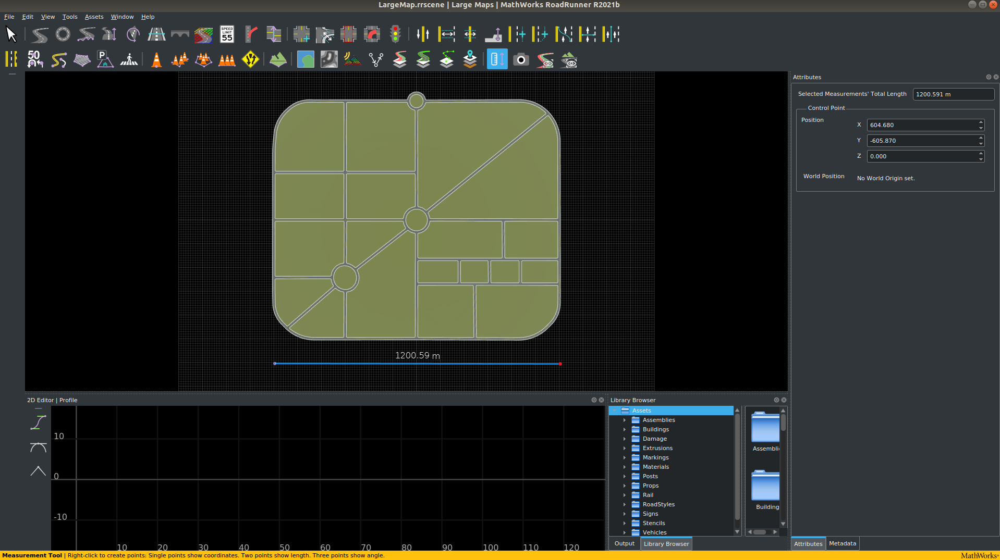
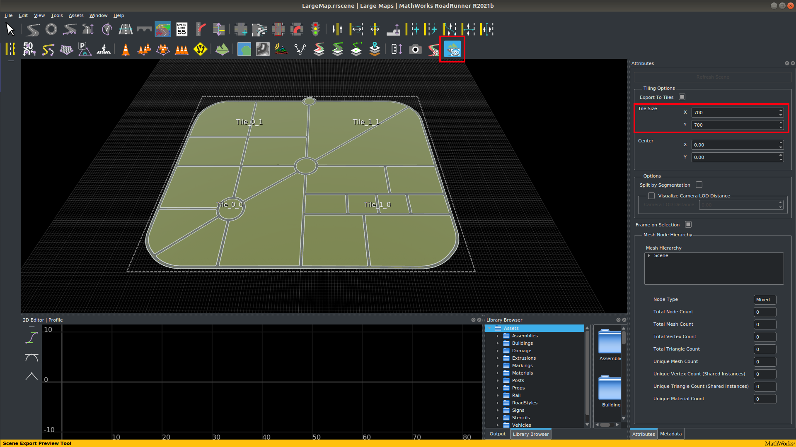
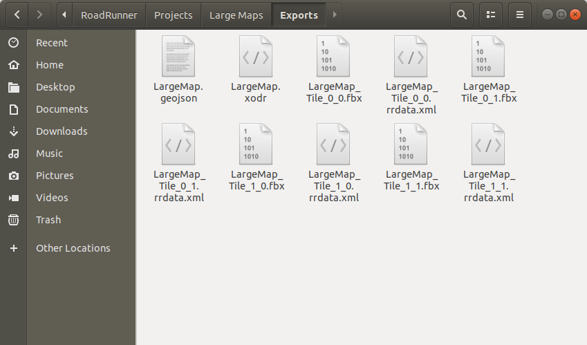
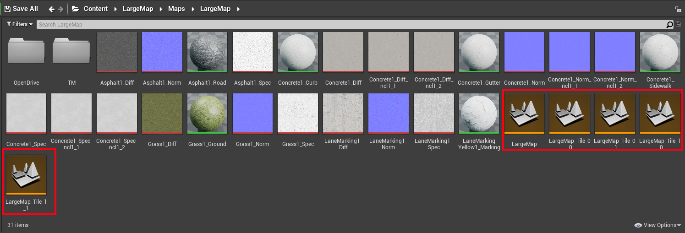

# Creating Large Maps for CARLA

Large Maps (like Towns 11 and 12) operate in a different way to standard maps (like Town 10) in CARLA. The map is divided up into tiles, which are subdivisions of the map, that are normally set to be about 1 to 2 km in size. The tiles divide up the map such that only the parts of the map that are needed are loaded into graphics memory for efficient rendering. The unneeded tiles remain dormant and ready to be loaded when they are required. Normally the tiles next to the tile in the location of the ego vehicle are loaded, but more tiles can be loaded if necessary. This behavior can be modified in the settings when CARLA is launched.

# Create a Large Map in RoadRunner

RoadRunner is the recommended software to create Large Maps to be imported into CARLA. This guide outlines how to use RoadRunner for creating Large Maps and how to import and handle the Large Map in the Unreal Engine editor.

- [__Build a Large Map in RoadRunner__](#build-a-large-map-in-roadrunner)
- [__Export a Large Map in RoadRunner__](#export-a-large-map-in-roadrunner)
- [__Import a Large Map into CARLA__](#import-a-large-map-into-carla)
    - [Files and folders](#files-and-folders)
    - [Create the JSON description (Optional)](#create-the-json-description-optional)
    - [Making the import](#making-the-import)
- [__Handling a Large Map in the Unreal Editor__](#handling-a-large-map-in-the-unreal-editor)
- [__Package a Large Map__](#package-a-large-map)
---

## Build a Large Map in RoadRunner

The specifics of how to build a complex map in RoadRunner go beyond the scope of this guide, however, there are video tutorials available in the [RoadRunner documentation][rr_tutorials]. On the face of it, building a Large Map in RoadRunner is largely the same as building a standard map, just bigger in scale. The differences are largely in how the map is exported.



Here we have created a Large Map of about 1.2 km in size. This will be broken up into tiles when we export it, we will choose a tile size of 700m, so the map should split up into around 4 tiles. 

If you are building a Large Map with elevation, the recommended largest size of the map is 20x20 km<sup>2</sup>. Maps larger than this may cause RoadRunner to crash on export.

[rr_tutorials]: https://www.mathworks.com/support/search.html?fq=asset_type_name:video%20category:roadrunner/index&page=1&s_tid=CRUX_topnav

---

## Export a Large Map in RoadRunner

Below is a basic guideline to export your custom Large Map from RoadRunner.

[exportlink]: https://www.mathworks.com/help/roadrunner/ug/Exporting-to-CARLA.html

Make sure the full map is selected for export by clicking on the [_World settings tool_](https://www.mathworks.com/help/roadrunner/ref/worldsettingstool.html) and dragging the edges of the blue boundary box to encompass the full area you would like to export. when it's ready, click on _Apply World Changes_.


It is helpful to use the scene export preview tool to understand how your map will be divided up into tiles for export. Adjust the *Tile Size* parameters in the *Tiling Options* menu to find a suitable tile size for your map, press *Refresh Scene* to see the impact of your adjustments.



!!! Note
    __Tile size__: The size of the tiles you use is a judgement call needed to ensure that the map will work efficiently when used in CARLA. If your map will be dense in 3D assets like buildings and vegetation, you may benefit from a smaller tile size to prevent the loading of unnecessary assets. This may, however, increase the complexity of the work needed to build your map. The maximum tile size supported by the CARLA engine is 2 km, we recommend tiles of around 1 km in size. 

When you are ready to export:

__1.__ Export the `.fbx` geometry files:

  - In the main toolbar, select `File` -> `Export` -> `Firebox (.fbx)`

__2.__ In the window that pops up:

>- Check the following options:
    - _Split by Segmentation_: Divides the mesh by semantic segmentation and improves pedestrian navigation.
    - _Power of Two Texture Dimensions_: Improves performance.
    - _Embed Textures_: Ensures textures are embedded in the mesh.
    - _Export to Tiles_: Choose the size of the tiles. The maximum size that can be used by CARLA is 2000 x 2000.
    - _Export Individual Tiles_: Generates the individual tiles needed for streaming Large Maps in CARLA.

>>>>>>

__3.__ Export the `.xodr` OpenDrive map file:

  - In the main toolbar, select `File` -> `Export` -> `OpendDRIVE (.xodr)`

In the folder you chose for export, you will now have several new files, one `.xodr` file and several `.fbx` files:




!!! Warning
    Make sure that the `.xodr` and the `.fbx` files have the same name root.

Now you've created your Large Map in Roadrunner, you are ready to import it into CARLA. The files that RoadRunner has created should be shifted to the `Import` directory inside the root of the directory you are using to build CARLA. 

---

# Import a Large Map into CARLA

Large Maps generated in RoadRunner can be imported into the source build of CARLA and packaged for distribution and usage in a CARLA standalone package. The process is very similar to that of standard maps with the addition of specific nomenclature for tiles and batch importing.

## Files and folders

All files to be imported should be placed in the `Import` folder of the root CARLA directory. These files should include:

- The mesh of the map in multiple `.fbx` files representing different tiles of the map.
- The OpenDRIVE definition in a single `.xodr` file.

!!! Warning
    You cannot import Large Maps and standard maps at the same time.

The naming convention of map tiles is very important. Each map tile should be named according to the following convention:

```
<mapName>_Tile_<x-coordinate>_<y-coordinate>.fbx
``` 

RoadRunner should conform to this naming convention by default, but it's worth double checking before you prepare to import into CARLA, because problems caused at this stage can be tedious to fix later on. The tiles in the final map will be arranged like in the following diagram:

>>>>>>

A resulting `Import` folder with a package containing a Large Map made of four tiles should have a structure similar to the one below:

```sh
Import
│
└── Package01
  ├── Package01.json
  ├── LargeMap_Tile_0_0.fbx
  ├── LargeMap_Tile_0_1.fbx
  ├── LargeMap_Tile_1_0.fbx
  ├── LargeMap_Tile_1_1.fbx
  └── LargeMap.xodr

```

!!! Note
    The `package.json` file is not strictly necessary. If there is no `package.json` file created, the automated import process will create one. Find out more about to structure your own `package.json` in the next section.

---

## Create the JSON description (Optional)

The `.json` description is created automatically during the import process, but there is also the option to create one manually. An existing `.json` description will override any values passed as arguments in the import process.

The `.json` file should be created in the root folder of the package. The file name will be the package distribution name. The content of the file describes a JSON array of __maps__ and __props__ with basic information for each one.

__Maps__ need the following parameters:

- __name:__ Name of the map. This must be the same as the `.fbx` and `.xodr` files.
- __xodr:__ Path to the `.xodr` file.
- __use_carla_materials:__ If __True__, the map will use CARLA materials. Otherwise, it will use RoadRunner materials.
- __tile_size:__ The size of the tiles. Default value is 2000 (2kmx2km).
- __tiles:__ A list of the `.fbx` tile files that make up the entire map.

__Props__ are not part of this tutorial. Please see [this](tuto_A_add_props.md) tutorial for how to add new props.

The resulting `.json` file should resemble the following:

```json
{
  "maps": [
      {
        "name": "LargeMap",
        "xodr": "./LargeMap.xodr",
        "use_carla_materials": true,
        "tile_size": 700,
        "tiles": [ 
        "./LargeMap_Tile_0_0.fbx",
        "./LargeMap_Tile_0_1.fbx",
        "./LargeMap_Tile_1_0.fbx",
        "./LargeMap_Tile_1_1.fbx"
        ]
      }
  ],
  "props": []
}
```
</details>
<br>

---

## Making the import

When all files have been placed in the `Import` folder, run the following command in the root CARLA folder:

```sh
make import
```

Depending on your system, Unreal Engine may consume too much memory to be able to import all files at once. You can choose to import the files in batches of MB by running the command:

```sh
make import ARGS="--batch-size=200"
```

Two more flags exist for the `make import` command:

- `--package=<package_name>` specifies the name of the package. By default, this is set to `map_package`. Two packages cannot have the same name, so using the default value will lead to errors on a subsequent ingestion. __It is highly recommended to change the name of the package__. Use this flag by running the command:

```sh
make import  ARGS="--package=<package_name>"
```

- `--no-carla-materials` specifies that you do not want to use the default CARLA materials (road textures etc). You will use the RoadRunner materials instead. This flag is __only required if you are not__ providing your own [`.json` file](tuto_M_manual_map_package.md). Any value in the `.json` file will override this flag. Use this flag by running the command:

```sh
make import  ARGS="--no-carla-materials"
```

All files will be imported and prepared to be used in the Unreal Editor. The map package will be created in `Unreal/CarlaUnreal/Content`. A base map tile, `<mapName>`, will be created as a streaming level for all the tiles. The base tile will contain the sky, weather, and Large Map actors and will be ready for use in a simulation.

!!! Note
    It is currently not recommended to use the customization tools provided for standard maps in the Unreal Editor, e.g., road painter, procedural buildings, etc.

---


## Handling a Large Map in the Unreal Editor

Now that you have imported your new map, you will find the map in the content browser inside a folder that will be named `map_package` by default. The folder will have an alternative name if you used the `"--package=<package_name>"` argument with the import command. Inside this folder, open the `Maps` folder and open the folder inside this one. Inside you will find several *level* files that are coloured orange. 



There will be one level file one for the whole map and one level file for each tile you exported from RoadRunner. To add assets to the map like buildings and vegetation, double click on the level file for the tile that you want to work on (e.g. in this example `LargeMap_Tile_0_0`) in order to load it in the editor. The tiles don't have any lighting settings by default, so you may need to change the view mode from `Lit` to `Unlit` to be able to see your tile once you have loaded it. Now you can follow the [same procedure as for standard maps](tuto_content_authoring_maps.md#importing-assets-and-adding-them-to-the-map) to add details to your map, make sure to save the modifications you make to the tile you are working on, then load the next tile and repeat the procedure. You cannot work on the entire map in one go, so loading (by double clicking) the level file for the entire map (the file that is not followed by the suffix `_Tile_X_Y`) will not be useful for decorating the map.


---

## Loading the whole map and running the simulation

If you would like to load the map and start the simulation for experimentation you should load the level file for the whole map. Double click on the level file with the root map name (the file that is not followed by the suffix `_Tile_X_Y`) and wait for it to load. Loading can sometimes take a few seconds or even minutes for very large maps. Once it has loaded click on the *play* option in the Unreal Editor toolbar. The simulation will now start with your new Large Map.

!!! note
    If you are running the simulation from the Unreal Engine editor for the first time it is recommended to first load each of the tiles (by double clicking on them) one by one until you have loaded all of them, prior to starting the simulation. This performs certain operations *in the background* like baking the Mesh Distance Fields and shaders for the tile. If you don't load the tiles one by one at first, these operations may be performed at runtime and this could lead to hangs or crashes in Unreal Engine.

## Package a Large Map

To package your Large Map so it can be used in the CARLA standalone package follow the same procedure as for standard maps - run the following command:

```sh
make package ARGS="--packages=<mapPackage>"
```

This will create a standalone package compressed in a `.tar.gz` file. The files will be saved in the `Dist` folder on Linux, and `/Build/UE4Carla/` on Windows. They can then be distributed and packaged to use in standalone CARLA packages.

---

If you have any questions about the Large Map import and packaging process, then you can ask in the [forum](https://github.com/carla-simulator/carla/discussions).

<div class="build-buttons">
<p>
<a href="https://github.com/carla-simulator/carla/discussions" target="_blank" class="btn btn-neutral" title="Go to the CARLA forum">
CARLA forum</a>
</p>
</div>


