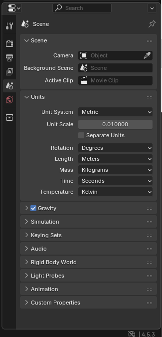
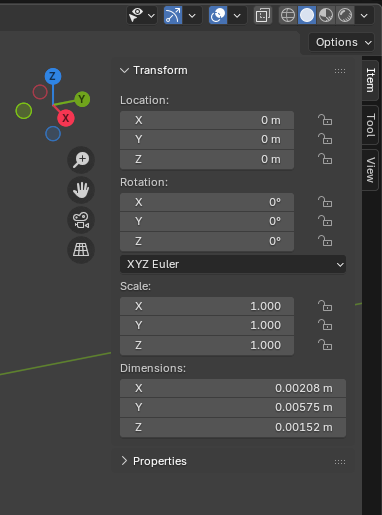
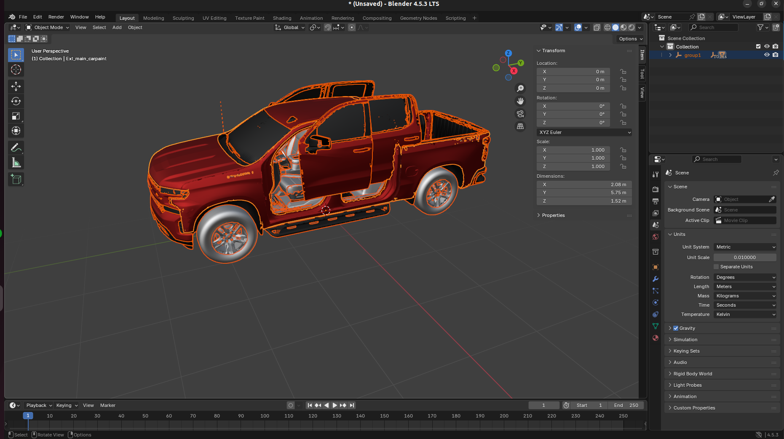
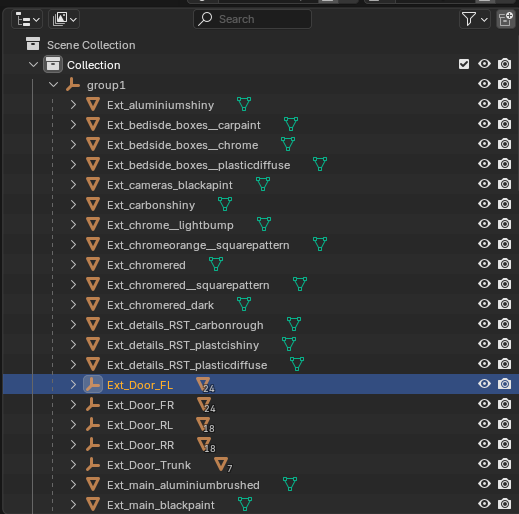

# Content authoring - vehicles

CARLA provides a comprehensive set of vehicles out of the box in the blueprint library. CARLA also allows the user to expand upon this with custom vehicles for maximum extensibility. To create new vehicle models in CARLA you need to [build CARLA from source](build_carla.md) and launch the Unreal Editor. 

3D modelling of detailed vehicles is highly complex and requires a significant degree of skill. We therefore refer the reader to alternative sources of documentation on 3D modelling, since this is beyond the scope of this guide. There are, however, numerous sources of vehicle models in both free and proprietary online repositories such as [TurboSquid](https://www.turbosquid.com/) and [Sketchfab](https://sketchfab.com). Hence the user has many options to turn to for creating custom vehicles for use in CARLA.

For the purpose of this guide we have chosen a freely downloadable [model of a Chevrolet Silverado](https://skfb.ly/p88BA) pickup truck available through the creative commons license on Sketchfab. You may download the model (FBX format is recommended) to follow this guide.

## Preparing the model in Blender

3D models of vehicles tend to be organized in different ways, therefore the model needs to be prepared in Blender to ensure that it is ready for import into CARLA. If you have modelled the vehicle elsewhere or downloaded it, import it into Blender using the relevant import tool (first ensure the Blender scene by deleting all existing objects). 

In the scene properties panel (normally on the right hand side) set the *Unit Scale* to *0.01* to match Unreal Engine's centimeter dimensions. 

Select all parts of the vehicle and engage object mode then select `Object > Apply > All transforms`. This ensures that we are seeing the final result and the vehicle will not be flipped onto some axis upon import into CARLA. 

Examine the transform properties in the transform panel:

In this model, we can see that the dimensions are not appropriate for a standard pickup at 5cm x 2cm x 1.8cm. The normal length of a vehicle should be between 3.5-6m for personal vehicles and 6-15m for goods and public transport vehicles. Therefore we need to scale the model by a factor of a 1000. Press S, followed by 1000 and Enter to scale the model. You may need to zoom out with the mouse wheel to see the newly scaled model. 

This vehicle's rear-front axis is aligned with the Y-axis. However, CARLA vehicles are X-forward by convention. Therefore we should rotate the vehicle to point along the X-axis, with the front of the vehicle pointing in the positive X direction. Press R, then type 90 and Enter to rotate the vehicle by 90 degrees.

For some reason, in this model, the doors are not aligned with the body of the vehicle. Find the group of objects associated with each door in the outliner panel and select a door. Press G to engage the translation tool to align the door with the bodywork. You may benefit from locking the motion to different axes by pressing X, Y or Z while moving each door. 

